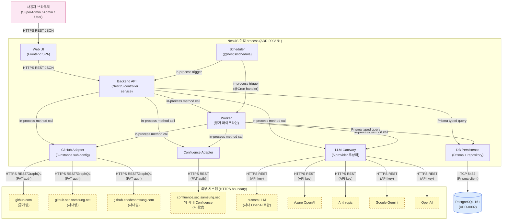

# Component view

> **본 문서는 P1 T-A3 의 산출물이다. [T-0016](../tasks/T-0016-t-a3-component-view.md) 가 component 분해도 + mermaid 다이어그램 + 8 component table + contract 표 + GitHub Adapter 3-instance 묶음 결정을 박제했다.**

## 개요

본 문서는 Assessment-Agent 의 **component view** — 시스템을 component 단위로 분해하고, 각 component 의 책임 / 입출력 contract / 외부 시스템과의 경계를 정의한다. [deployment.md](deployment.md) 와 [ADR-0003](../decisions/ADR-0003-deployment.md) 가 **운영 토폴로지** (단일 NestJS process / PostgreSQL / @nestjs/config / @nestjs/schedule / direct egress) 를 박제했으므로, 본 문서는 그 process 안에 어떤 component 가 들어가는지의 **논리적 분해도** 다.

본 문서는 [docs/architecture/INDEX.md](INDEX.md) 의 **MVA 원칙** 에 따라 작성됐다 — component 분해 + 각 component 의 **책임 한 문단 + 입출력 contract** 까지만 박제하며, 구체 NestJS module class / service 메서드 시그니처 / API endpoint URL / DB schema 컬럼은 본 문서의 범위 밖이다. 그 구체화는 다음 task 들의 책임:

- **T-A4 (modules.md)** — 본 component 분해를 NestJS module class (AssessmentModule / UserModule / GithubModule / ConfluenceModule / LlmModule / AuthModule / SchedulerModule / WebModule) 로 mapping + 의존성 acyclic 검증.
- **P2 Use case decomposition** — 각 use case 가 본 문서의 어느 component 를 거치는지 sequence diagram / 텍스트로 표현.
- **P3 Persistence layer** — DB Persistence component 의 책임 범위 (Prisma schema + repository pattern) 가 본 문서의 component 정의에 기반.
- **P4 External integrations** — GitHub Adapter / Confluence Adapter / LLM Gateway component 의 구체 service class 가 본 문서의 contract 정의에 기반.

## Deployment 컨텍스트

본 문서의 **모든 8 component 는 동일 NestJS process 안에서 동작**한다 — [ADR-0003 §1 — Monolithic NestJS process](../decisions/ADR-0003-deployment.md) 가 박제한 결정이다. component 간 경계는 **논리적 분해** 이지 process 경계가 아니다. 각 component 간 호출은 NestJS DI container 안의 service 메서드 호출 (sync, in-process) 이 default 이며, 외부 시스템 (GitHub / Confluence / LLM provider / DB) 만 HTTPS 또는 DB protocol 경계를 넘어간다.

[ADR-0002 (PostgreSQL + Prisma)](../decisions/ADR-0002-db.md) 는 DB Persistence component 의 기술 선택을 박제했고, [ADR-0001 (NestJS / TypeScript / pnpm / Jest / GHA)](../decisions/ADR-0001-stack.md) 가 모든 component 의 구현 기반 stack 을 박제했다.

## Component diagram



다이어그램 표기:

- **노란 점선 박스 (`external`)** — 외부 시스템. HTTPS 경계 너머. 점선 stroke 으로 시각 구분.
- **process subgraph** — NestJS 단일 process 안의 in-process component 8 개. 화살표 label 의 "in-process method call" 은 NestJS DI container 안의 service 메서드 호출.
- **PostgreSQL** — DB Persistence component 가 TCP 5432 로 접근하는 외부 process. ADR-0002 의 결정에 따라 동일 host 또는 managed service.
- **사용자 브라우저** — 분홍 박스. SuperAdmin / Admin / User 3 등급 ([README.md](../../README.md) L19–22, REQ-044) 의 entry point.

## Component table

| component | 책임 | 입력/출력 contract | 관련 REQ | 관련 ADR / 문서 |
| --- | --- | --- | --- | --- |
| **Web UI** | 사용자 브라우저에서 동작하는 frontend SPA (React + Vite, 별도 `web/` 패키지). 로그인 / 대시보드 조회 (sort / filter / 시계열) / 인원 CRUD UI / Admin 설정 UI 진입점. shipped 컴포넌트는 `AppShell` (전역 레이아웃 + 무라우터 view 전환 + R-78 `EvaluationGuardBanner` 슬롯) · `AuthGate` (로그인 / `SuperAdminSetupForm`) · `DashboardView` · `AdminView` (`GroupMemberList` 조회 · `DifficultyModelSelector` · export/import · RBAC gating). Backend API 와 HTTPS REST JSON 으로만 통신. 일부 잔여 표면 (ReEval/Schedule 마운트 · auto-polling 등) 은 backend 계약 확정 후 배선 — [modules.md](modules.md) 의 defer 서술 참조. | 입력: 사용자 클릭 / form submit. 출력: Backend API 로의 HTTPS REST JSON request. | REQ-038 (조회/sort/filter/시계열), REQ-026 (인원 CRUD UI), REQ-044 (로그인 UI / 3 등급) | [ADR-0040](../decisions/ADR-0040-frontend-stack.md) (React+Vite 별도 `web/` 패키지, ACCEPTED) / [ADR-0041](../decisions/ADR-0041-frontend-composition-wiring.md) (composition-wiring, ACCEPTED) / P6 Web UI (shipped, T-0353~T-0394 composition-wiring chain) |
| **Backend API** | NestJS controller + service layer. HTTP API entry point. Auth / RBAC / 인원 / Group / 평가 조회 endpoint 의 진입점. 평가 trigger 시 Worker 를 호출. 외부 시스템 호출은 직접 하지 않고 adapter component 경유. | 입력: HTTPS REST JSON (Web UI 또는 Admin UI 로부터). 출력: HTTPS REST JSON response / Worker / Adapter / DB Persistence 로의 in-process method call. | REQ-026 / REQ-038 / REQ-044 / REQ-049 / REQ-043 (ID/Password 보호) | ADR-0001 (NestJS) / ADR-0003 §1 (monolithic) |
| **Worker** (평가 파이프라인) | commit / 문서 / Confluence page 평가 파이프라인. 난이도·기여도·양·LLM 정성 평가문 생성. monolithic 결정에 따라 Backend 와 **동일 process 내 service layer** 로 표현되지만, 논리적 책임 (평가 orchestration) 으로 분리. Scheduler 또는 Backend API 가 trigger. | 입력: Scheduler 의 cron trigger / Backend API 의 manual trigger. 출력: GitHub Adapter / Confluence Adapter / LLM Gateway 로의 in-process call + DB Persistence 로의 결과 저장. | REQ-005~007 (3 GitHub), REQ-015 (Confluence), REQ-049 (LLM 모델 지정), REQ-031 (재수집 중복 방지), REQ-032 (raw 저장 금지) | ADR-0003 §1 (monolithic process 안 service) / P5 Evaluation pipeline phase |
| **DB Persistence** | PostgreSQL 16+ 인스턴스 + Prisma client + repository layer. 모든 component 의 영속 저장소. ADR-0002 결정에 따라 schema-as-code (`schema.prisma`). raw text 컬럼 미정의 (REQ-032 schema-level 강제). | 입력: Backend API / Worker 로부터의 Prisma typed query (in-process). 출력: query 결과 row / TCP 5432 의 PostgreSQL 외부 process 와 통신. | REQ-029 (non-volatile 저장), REQ-031 (재수집 중복 방지 unique constraint), REQ-032 (raw 저장 금지), REQ-033 (commit/문서 단위) | ADR-0002 (PostgreSQL + Prisma) / ADR-0003 §1 (단일 DB 인스턴스) |
| **LLM Gateway** | 5 provider (custom / Azure OpenAI / Anthropic / Google Gemini / OpenAI) 의 단일 추상화 service. Admin 이 지정한 provider 별 model 식별자 라우팅. 평가 파이프라인은 본 gateway 만 호출 — 구체 provider API 차이 은닉. | 입력: Backend API / Worker 로부터의 in-process method call (`generate(prompt, modelId)`). 출력: 각 provider 의 외부 HTTPS REST API 로의 outbound + 응답 텍스트 반환. | REQ-049 (Admin LLM 모델 지정), REQ-051~055 (5 provider) | ADR-0003 §4 (direct egress) / P4 LLM gateway task |
| **GitHub Adapter** | 3 GitHub instance (github.com / github.sec.samsung.net / github.ecodesamsung.com) 의 통합 adapter. 단일 service + instance sub-config (URL / PAT / org) — 자세히는 아래 "GitHub Adapter — 3 instance 묶음 결정" sub-section. | 입력: Backend API / Worker 로부터의 in-process method call (`fetchCommits(instanceKey, repo, range)` 등). 출력: 각 GitHub instance 의 외부 HTTPS REST/GraphQL API 로의 outbound + 응답 데이터 반환. 4xx 응답 시 PermissionDeniedEvent emit. | REQ-005 / REQ-006 / REQ-007 (3 GitHub instance), REQ-008 (권한 부족 통지), REQ-014 (Issue 평가) | ADR-0003 §4 (direct egress) / P4 GitHub adapter task |
| **Confluence Adapter** | Confluence (confluence.sec.samsung.net 외 사내 Confluence) 의 adapter. 지정 SPACE 의 page list / page 본문 / version history 조회. 4xx 응답 catch → PermissionDeniedEvent emit. | 입력: Backend API / Worker 로부터의 in-process method call (`listPages(spaceKey)`, `fetchPageVersion(pageId, version)` 등). 출력: Confluence REST API 로의 outbound + 응답 데이터 반환. | REQ-015 (Confluence 지정 SPACE 평가), REQ-016 (권한 부족 통지), REQ-017 (crawling vs hierarchy 정책) | ADR-0003 §4 (direct egress) / P4 Confluence adapter task |
| **Scheduler** | `@nestjs/schedule` 기반 in-process cron + manual trigger 단일 진입점. cron 표현식은 DB 에 저장되어 process restart 후에도 복원. Admin UI 의 cron 갱신은 SchedulerRegistry 의 dynamic 등록. manual trigger 는 Backend API endpoint 가 동일 service 메서드 호출 — duplication 0. | 입력: 시간 trigger (cron) 또는 Backend API endpoint 의 manual trigger. 출력: Worker 또는 Backend API service 메서드의 in-process invocation (`@Cron` decorator handler). | REQ-039 (Admin cron 주기 지정), REQ-040 (Admin manual trigger) | ADR-0003 §3 (@nestjs/schedule in-process) / P7 Scheduling & ops task |

## GitHub Adapter — 3 instance 묶음 vs 분리 결정

본 task (T-0016) 의 architect 가 결정 — **단일 component (multi-tenant adapter)** 채택.

**채택: (a) 단일 component `GithubAdapter` + instance sub-config**.

- 구조: `GithubAdapter` 1 service 가 instance key (예: `'com'` / `'sec'` / `'ecode'`) 를 인자로 받고, 내부에서 instance 별 sub-config (base URL / PAT / org / proxy 설정) 를 lookup 하여 적절한 HTTP client 로 라우팅.
- config schema 예시 (실제 구현은 P4 task — 본 결정의 박제만 목적):
  ```
  github:
    instances:
      com:    { baseUrl: "https://api.github.com",        token: env, org: "..." }
      sec:    { baseUrl: "https://github.sec.samsung.net/api/v3",        token: env, org: "..." }
      ecode:  { baseUrl: "https://github.ecodesamsung.com/api/v3",       token: env, org: "..." }
  ```

**근거** (5 줄):

1. **3 instance 의 API surface 가 동일 GitHub API spec** (REST v3 / GraphQL v4) — 코드 중복 회피 / DRY 원칙. 3 sub-component 로 분리 시 동일 fetch/parse 로직이 3 copy 가 되어 변경 비용 3 배.
2. **instance 별 차이는 base URL / PAT / org 만** — config 분리로 해결 가능. 동적 차이는 (현재 시점에) 알려진 게 없음.
3. **새 GitHub-like service 추가 시 sub-config 추가만으로 가능** — open-closed 원칙 충족. 예: 향후 `github.private-corp.com` 추가 시 `instances.private` 1 항목만 추가.
4. **ADR-0003 §4 의 TLS / proxy 처리 응집** — `NODE_EXTRA_CA_CERTS` + `HTTPS_PROXY` 환경변수가 단일 HTTP client 에 자연 적용. 3 sub-component 분리 시 동일 설정을 3 번 반복.
5. **NestJS DI 친화성** — `GithubAdapter` 1 provider + instance config map 으로 controller / worker 가 `githubAdapter.fetchCommits('com', ...)` 패턴 사용. 3 sub-provider 분리 시 controller 가 instance 별 dispatch 로직을 가져야 함.

**Alternatives 검토 — (b) 3 sub-component 분리** (`GithubComAdapter` / `GithubSecAdapter` / `GithubEcodeAdapter`):

- 장점: 각 instance 의 SLA / rate limit / 에러 유형이 다르게 진화하면 service 별 격리가 명확. 별도 module 로 분리 시 의존성 그래프가 명시적.
- 단점: 본 결정 시점에 instance 별 API 차이가 사실상 0 (동일 GitHub API spec). 코드 중복 비용이 격리의 이점을 초과.
- **미채택**. 다만 향후 instance 별 API 가 의미 있게 분기하기 시작하면 (예: 사내 GitHub 가 별도 enterprise endpoint 도입) 본 결정을 **SUPERSEDE 하는 ADR-0004** 신설하여 (b) 로 전환. 본 task 의 Follow-ups 에 그 가능성 명시.

**ADR 신설 불필요** — 본 결정은 component 분해 수준에 그치고, 외부 dependency / 운영 토폴로지 / 데이터 모델에 영향 없음. component view 본문에 인라인 박제로 충분. 향후 (b) 전환 시 ADR-0004 신설.

## Contracts

다이어그램의 각 화살표를 sync/async + message format 으로 정리.

| from | to | sync/async | message format | 비고 |
| --- | --- | --- | --- | --- |
| 사용자 브라우저 | Web UI | sync | HTTPS REST JSON (또는 SPA hydration) | 사용자 entry point. REQ-038. |
| Web UI | Backend API | sync | HTTPS REST JSON (over TLS) | 인증 토큰 (JWT 또는 session cookie) 동반 — 구체는 P3 Auth task. REQ-043. |
| Backend API | DB Persistence | sync | Prisma typed query (in-process) | ADR-0002. NestJS DI container 의 PrismaService singleton 경유. |
| Backend API | LLM Gateway | sync | TypeScript method call (in-process) | ADR-0003 §1 monolithic — 동일 process 내 method call. provider 추상화 layer. |
| Backend API | GitHub Adapter | sync | TypeScript method call (in-process) | 동일 process. 본 contract 가 외부 GitHub 호출의 단일 진입점. |
| Backend API | Confluence Adapter | sync | TypeScript method call (in-process) | 동일 process. |
| Backend API | Worker | sync (또는 fire-and-forget) | TypeScript method call (in-process) | manual trigger flow. fire-and-forget 시 Worker 내부에서 background task. 구체는 P5. |
| Scheduler | Worker | sync (handler 실행 자체) | NestJS `@Cron` decorator handler | ADR-0003 §3 in-process scheduler. cron 시각 도달 시 handler 직접 호출. |
| Scheduler | Backend API | sync | NestJS `@Cron` handler 가 controller/service 호출 | manual trigger 와 동일 service 메서드 호출 — duplication 0 (ADR-0003 §3). |
| Worker | GitHub Adapter | sync | TypeScript method call (in-process) | 평가 파이프라인의 commit/Issue fetch path. |
| Worker | Confluence Adapter | sync | TypeScript method call (in-process) | 평가 파이프라인의 page fetch path. |
| Worker | LLM Gateway | sync (await) | TypeScript method call (in-process) | 평가문 생성 / 난이도 분류 호출. provider 별 latency 가 다양하므로 concurrency limit 동반 (ADR-0003 §1). |
| Worker | DB Persistence | sync | Prisma typed query (in-process) | 평가 결과 저장. raw 저장 금지 (REQ-032) — schema 가 raw column 미정의. |
| DB Persistence | PostgreSQL | sync | Prisma client (TCP 5432, libpq protocol) | ADR-0002. connection pool singleton. |
| GitHub Adapter | github.com / sec / ecode | async (외부 HTTPS) | HTTPS REST v3 / GraphQL v4, PAT auth (`Authorization: token ...`) | ADR-0003 §4 direct egress. 4xx 응답 catch → PermissionDeniedEvent (REQ-008). |
| Confluence Adapter | confluence.sec.samsung.net 외 | async (외부 HTTPS) | HTTPS REST, PAT auth | ADR-0003 §4. 4xx 응답 catch → PermissionDeniedEvent (REQ-016). |
| LLM Gateway | 외부 LLM provider 5 종 | async (외부 HTTPS) | HTTPS REST, API key auth (provider 별 header 다름) | ADR-0003 §4. provider 별 endpoint 차이 / model 식별자 / timeout / retry 정책은 P4 LLM gateway task. |

**sync / async 의미**: 본 표의 "sync" 는 호출자 thread 가 응답까지 await 한다는 의미 (in-process 또는 외부 HTTPS 둘 다 포함). "async" 는 외부 HTTPS 경계를 넘는 호출이라 latency / failure 모드가 사실상 비동기 특성을 가진다는 의미 — 코드 레벨로는 `await` 사용 (TypeScript Promise) 이지만 본 표에서는 외부 경계 분류 목적으로 사용.

## References

- [ADR-0001 — Backend / language / package manager / test / CI 스택](../decisions/ADR-0001-stack.md) — NestJS / TypeScript / pnpm / Jest / GitHub Actions. 모든 component 의 stack.
- [ADR-0002 — Persistence DB / ORM 선택](../decisions/ADR-0002-db.md) — PostgreSQL + Prisma. DB Persistence component 의 기반.
- [ADR-0003 — Deployment 토폴로지 4 결정](../decisions/ADR-0003-deployment.md) — monolithic / secret (env) / scheduler (in-process) / network (direct egress). 모든 component 의 운영 토폴로지.
- [docs/requirements.md](../requirements.md) — REQ-NNN source of truth. 본 문서의 모든 REQ 인용 출처.
- [docs/architecture/deployment.md](deployment.md) — T-A2 산출물. 본 문서의 운영 토폴로지 cross-reference.
- [docs/architecture/INDEX.md](INDEX.md) — architecture document 인덱스 + MVA 원칙.
- [README.md](../../README.md) — 7–18 (REQ-005~007 GitHub) / 19–22 (REQ-044 권한) / 33–41 (REQ-015 Confluence) / 45–51 (REQ-026 인원) / 68–71 (REQ-038 UI) / 96–103 (REQ-049 / REQ-051~055 LLM).

Refs: T-0016, REQ-005, REQ-006, REQ-007, REQ-015, REQ-026, REQ-038, REQ-044, REQ-049, REQ-051, REQ-052, REQ-053, REQ-054, REQ-055
