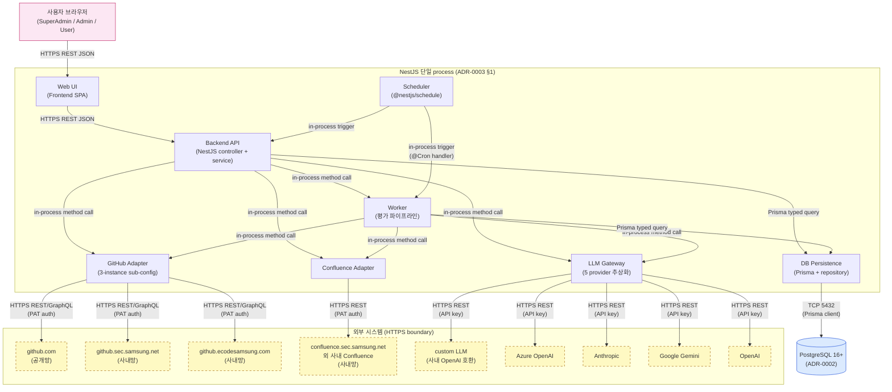

# Component view

> **본 문서는 P1 T-A3 의 산출물이다. [T-0016](../tasks/T-0016-t-a3-component-view.md) 가 component 분해도 + mermaid 다이어그램 + 8 component table + contract 표 + GitHub Adapter 3-instance 묶음 결정을 박제했다.**

## 개요

본 문서는 Assessment-Agent 의 **component view** — 시스템을 component 단위로 분해하고, 각 component 의 책임 / 입출력 contract / 외부 시스템과의 경계를 정의한다. [deployment.md](deployment.md) 와 [ADR-0003](../decisions/ADR-0003-deployment.md) 가 **운영 토폴로지** (단일 NestJS process / PostgreSQL / @nestjs/config / @nestjs/schedule / direct egress) 를 박제했으므로, 본 문서는 그 process 안에 어떤 component 가 들어가는지의 **논리적 분해도** 다.

본 문서는 [docs/architecture/INDEX.md](INDEX.md) 의 **MVA 원칙** 에 따라 작성됐다 — component 분해 + 각 component 의 **책임 한 문단 + 입출력 contract** 까지만 박제하며, 구체 NestJS module class / service 메서드 시그니처 / API endpoint URL / DB schema 컬럼은 본 문서의 범위 밖이다. 그 구체화는 다음 task 들의 책임:

- **T-A4 (modules.md)** — 본 component 분해를 NestJS module class (AssessmentModule / UserModule / GithubModule / ConfluenceModule / LlmModule / AuthModule / SchedulerModule / WebModule) 로 mapping + 의존성 acyclic 검증.
- **P2 Use case decomposition** — 각 use case 가 본 문서의 어느 component 를 거치는지 sequence diagram / 텍스트로 표현.
- **P3 Persistence layer** — DB Persistence component 의 책임 범위 (Prisma schema + repository pattern) 가 본 문서의 component 정의에 기반.
- **P4 External integrations** — GitHub Adapter / Confluence Adapter / LLM Gateway component 의 구체 service class 가 본 문서의 contract 정의에 기반.

> **`## 개요` (5 ~ 14 행) ↔ 실 module 인벤토리 · dependency · 참조 문서 대조 (T-1445 실측 각주)** — 7 행이 열거한 **운영 토폴로지 5 요소는 요소별로 갈린다**: `단일 NestJS process` · `@nestjs/schedule` · `direct egress` 는 [ADR-0003](../decisions/ADR-0003-deployment.md) 의 `### Decision §1` · `§3` · `§4` 와 `package.json` **31** 행 (`"@nestjs/schedule": "^4.1.2"`) 로 **참** 이지만, **`@nestjs/config` 는 ADR-0003 `§2` 가 결정만 하고 아직 미도입** 이며 (`package.json` grep **0 hit**, `src/main.ts` 2 행이 "외부 의존성(`@nestjs/config` 등)은 의도적으로 도입하지 않음" 을 명시 — 문서만의 창작이 아니라 **결정 ↔ 구현 gap**), `PostgreSQL` 은 ADR-0003 의 4 결정에 없고 [ADR-0002](../decisions/ADR-0002-db.md) 소관이라 **귀속이 부분참** 이다.
> **11 행이 열거한 module class 8 명 중 실 class 이름과 일치하는 것은 6 명뿐이다** — 실 `src/**/*.module.ts` 는 **15** 개이고 `UserModule` · `GithubModule` · `ConfluenceModule` · `LlmModule` · `AuthModule` · `WebModule` 은 **실재**, `SchedulerModule` 은 실 class 가 `SchedulingModule` 이라 **이름 상이**, `AssessmentModule` 은 **부재** 이며 그 책임은 `AssessmentCollectionModule` · `AssessmentEvaluationModule` 2 개로 분화됐다. 문서에 없는 module 은 **9** 개 (`AppModule` · `AssessmentCollectionModule` · `AssessmentEvaluationModule` · `SchedulingModule` · `PersistenceModule` · `ExportModule` · `ImportModule` · `PermissionDeniedRecordModule` · `UserInstanceAccessModule`) 이고, 정본 [modules.md](modules.md) 는 이 shipped 현황을 이미 정합해 두었다.
> **같은 행의 pointer 와 "의존성 acyclic 검증" claim 은 참이다** — [modules.md](modules.md) 는 실재하고 3 행이 "P1 T-A4 의 산출물" 로 자기선언하며 **139** 행 `cycle 0 (아래 acyclic 검증 참조)` 로 그 검증을 실제로 수행했다. 다만 본문이 `T-A4` 를 **task ID 없이** 부르고 링크도 두지 않아 pointer 로서는 불완전하다 (대상은 `T-0017`). 9 행의 [INDEX.md](INDEX.md) `MVA 원칙` pointer 는 그 문서 **54** 행에 절이 실재해 **참** 이다.
> **11 ~ 14 행의 "다음 task 들의 책임" 미래형 화법은 낡았다** — T-A4 (modules.md) · P2 · P3 · P4 의 대상이 모두 완료돼 현 phase 표기는 `P4-complete / P5-in-progress` 다. 또 셋째 bullet 의 `P3 Persistence layer` 는 `docs/PLAN.md` **47** 행의 실 명칭이 `Phase P3 — Domain core` 라 **명칭이 상이** 하다 (P2 · P4 명칭은 1:1 일치). 9 행의 "구체 NestJS module class 는 본 문서의 범위 밖" 이라는 자기규정과 11 행이 class 이름 8 개를 실제로 열거하는 **자체 긴장** 이, 위 이름 drift 가 blueprint 에 남게 된 구조적 원인이다.
> `§ 12.15` append-only 방침상 module class 이름 · 시점 서술은 in-place 치환 없이 원문 보존 + 본 각주 병기로 처리했고, 1 ~ 4 행 blockquote 와 16 행 이후 전 구간 (`## Component table` 8 row 포함) 은 무편집이다 — 검증 가능 **22 row** 전 판정 근거는 [REQ-COVERAGE-AUDIT § 12.43](../use-cases/REQ-COVERAGE-AUDIT.md).

## Deployment 컨텍스트

본 문서의 **모든 8 component 는 동일 NestJS process 안에서 동작**한다 — [ADR-0003 §1 — Monolithic NestJS process](../decisions/ADR-0003-deployment.md) 가 박제한 결정이다. component 간 경계는 **논리적 분해** 이지 process 경계가 아니다. 각 component 간 호출은 NestJS DI container 안의 service 메서드 호출 (sync, in-process) 이 default 이며, 외부 시스템 (GitHub / Confluence / LLM provider / DB) 만 HTTPS 또는 DB protocol 경계를 넘어간다.

[ADR-0002 (PostgreSQL + Prisma)](../decisions/ADR-0002-db.md) 는 DB Persistence component 의 기술 선택을 박제했고, [ADR-0001 (NestJS / TypeScript / pnpm / Jest / GHA)](../decisions/ADR-0001-stack.md) 가 모든 component 의 구현 기반 stack 을 박제했다.

## Component diagram


```mermaid
graph TB
    %% External actors / systems
    subgraph external["외부 시스템 (HTTPS boundary)"]
        direction LR
        gh_com["github.com<br/>(공개망)"]
        gh_sec["github.sec.samsung.net<br/>(사내망)"]
        gh_ecode["github.ecodesamsung.com<br/>(사내망)"]
        conf["confluence.sec.samsung.net<br/>외 사내 Confluence<br/>(사내망)"]
        llm_custom["custom LLM<br/>(사내 OpenAI 호환)"]
        llm_azure["Azure OpenAI"]
        llm_anthropic["Anthropic"]
        llm_google["Google Gemini"]
        llm_openai["OpenAI"]
    end

    user_browser["사용자 브라우저<br/>(SuperAdmin / Admin / User)"]

    %% In-process components (monolithic NestJS)
    subgraph process["NestJS 단일 process (ADR-0003 §1)"]
        direction TB
        web_ui["Web UI<br/>(Frontend SPA)"]
        backend_api["Backend API<br/>(NestJS controller + service)"]
        worker["Worker<br/>(평가 파이프라인)"]
        scheduler["Scheduler<br/>(@nestjs/schedule)"]
        llm_gateway["LLM Gateway<br/>(5 provider 추상화)"]
        github_adapter["GitHub Adapter<br/>(3-instance sub-config)"]
        confluence_adapter["Confluence Adapter"]
        db_persistence["DB Persistence<br/>(Prisma + repository)"]
    end

    %% External DB (process 외부, 동일 host 또는 managed)
    postgres[("PostgreSQL 16+<br/>(ADR-0002)")]

    %% User-facing flow
    user_browser -- "HTTPS REST JSON" --> web_ui
    web_ui -- "HTTPS REST JSON" --> backend_api

    %% Backend orchestration
    backend_api -- "Prisma typed query" --> db_persistence
    backend_api -- "in-process method call" --> llm_gateway
    backend_api -- "in-process method call" --> github_adapter
    backend_api -- "in-process method call" --> confluence_adapter
    backend_api -- "in-process method call" --> worker

    %% Scheduler triggers
    scheduler -- "in-process trigger<br/>(@Cron handler)" --> worker
    scheduler -- "in-process trigger" --> backend_api

    %% Worker pipeline
    worker -- "in-process method call" --> github_adapter
    worker -- "in-process method call" --> confluence_adapter
    worker -- "in-process method call" --> llm_gateway
    worker -- "Prisma typed query" --> db_persistence

    %% DB persistence boundary
    db_persistence -- "TCP 5432<br/>(Prisma client)" --> postgres

    %% External egress (HTTPS, ADR-0003 §4)
    github_adapter -- "HTTPS REST/GraphQL<br/>(PAT auth)" --> gh_com
    github_adapter -- "HTTPS REST/GraphQL<br/>(PAT auth)" --> gh_sec
    github_adapter -- "HTTPS REST/GraphQL<br/>(PAT auth)" --> gh_ecode
    confluence_adapter -- "HTTPS REST<br/>(PAT auth)" --> conf
    llm_gateway -- "HTTPS REST<br/>(API key)" --> llm_custom
    llm_gateway -- "HTTPS REST<br/>(API key)" --> llm_azure
    llm_gateway -- "HTTPS REST<br/>(API key)" --> llm_anthropic
    llm_gateway -- "HTTPS REST<br/>(API key)" --> llm_google
    llm_gateway -- "HTTPS REST<br/>(API key)" --> llm_openai

    %% Styling for external boundary
    classDef ext fill:#fef9c3,stroke:#a16207,stroke-dasharray: 5 5
    classDef db fill:#dbeafe,stroke:#1d4ed8
    classDef user fill:#fce7f3,stroke:#be185d
    class gh_com,gh_sec,gh_ecode,conf,llm_custom,llm_azure,llm_anthropic,llm_google,llm_openai ext
    class postgres db
    class user_browser user
```

다이어그램 표기:

- **노란 점선 박스 (`external`)** — 외부 시스템. HTTPS 경계 너머. 점선 stroke 으로 시각 구분.
- **process subgraph** — NestJS 단일 process 안의 in-process component 8 개. 화살표 label 의 "in-process method call" 은 NestJS DI container 안의 service 메서드 호출.
- **PostgreSQL** — DB Persistence component 가 TCP 5432 로 접근하는 외부 process. ADR-0002 의 결정에 따라 동일 host 또는 managed service.
- **사용자 브라우저** — 분홍 박스. SuperAdmin / Admin / User 3 등급 ([README.md](../../README.md) L19–22, REQ-044) 의 entry point.

## Component table

| component | 책임 | 입력/출력 contract | 관련 REQ | 관련 ADR / 문서 |
| --- | --- | --- | --- | --- |
| **Web UI** | 사용자 브라우저에서 동작하는 frontend SPA (React + Vite, 별도 `web/` 패키지). 로그인 / 대시보드 조회 (sort / filter / 시계열) / 인원 CRUD UI / Admin 설정 UI 진입점. shipped 컴포넌트는 `AppShell` (전역 레이아웃 + 무라우터 view 전환 + R-78 `EvaluationGuardBanner` 슬롯) · `AuthGate` (로그인 / `SuperAdminSetupForm`) · `DashboardView` · `AdminView` (`GroupMemberList` 조회 · `DifficultyModelSelector` · export/import · RBAC gating · `SchedulePanel` 마운트 ([T-0885](../tasks/T-0885-wire-schedule-panel-adminview.md)) · `ReEvaluationTriggerPanel` 마운트 ([T-0886](../tasks/T-0886-wire-reevaluation-trigger-panel-adminview.md)) · `PersonList` · `GroupList` · `PartList` · `UserList` · `LlmProviderConfigList` 마운트 + 인원 / 그룹 / 파트 / 사용자 CRUD · 멤버 add/remove · provider CRUD mutation 러너 배선 — 구별 패널 **10 종** · mutation 러너 **26 개** 실측, 근거는 [PLAN.md](../PLAN.md) 122 행 · [T-1350](../tasks/T-1350-plan-admin-panel-marker-rejudge.md)). Backend API 와 HTTPS REST JSON 으로만 통신. 남은 잔여 표면은 `EvaluationGuardBanner` 자동 polling 1 항목뿐이며 backend status 계약 확정 후 배선한다 — [modules.md](modules.md) 의 defer 서술 참조. | 입력: 사용자 클릭 / form submit. 출력: Backend API 로의 HTTPS REST JSON request. | REQ-038 (조회/sort/filter/시계열), REQ-026 (인원 CRUD UI), REQ-044 (로그인 UI / 3 등급) | [ADR-0040](../decisions/ADR-0040-frontend-stack.md) (React+Vite 별도 `web/` 패키지, ACCEPTED) / [ADR-0041](../decisions/ADR-0041-frontend-composition-wiring.md) (composition-wiring, ACCEPTED) / P6 Web UI (shipped, T-0353~T-0394 composition-wiring chain) |
| **Backend API** | NestJS controller + service layer. HTTP API entry point. Auth / RBAC / 인원 / Group / 평가 조회 endpoint 의 진입점. 평가 trigger 시 Worker 를 호출. 외부 시스템 호출은 직접 하지 않고 adapter component 경유. | 입력: HTTPS REST JSON (Web UI 또는 Admin UI 로부터). 출력: HTTPS REST JSON response / Worker / Adapter / DB Persistence 로의 in-process method call. | REQ-026 / REQ-038 / REQ-044 / REQ-049 / REQ-043 (ID/Password 보호) | ADR-0001 (NestJS) / ADR-0003 §1 (monolithic) |
| **Worker** (평가 파이프라인) | commit / 문서 / Confluence page 평가 파이프라인. 난이도·기여도·양·LLM 정성 평가문 생성. monolithic 결정에 따라 Backend 와 **동일 process 내 service layer** 로 표현되지만, 논리적 책임 (평가 orchestration) 으로 분리. Scheduler 또는 Backend API 가 trigger. | 입력: Scheduler 의 cron trigger / Backend API 의 manual trigger. 출력: GitHub Adapter / Confluence Adapter / LLM Gateway 로의 in-process call + DB Persistence 로의 결과 저장. | REQ-005~007 (3 GitHub), REQ-015 (Confluence), REQ-049 (LLM 모델 지정), REQ-031 (재수집 중복 방지), REQ-032 (raw 저장 금지) | ADR-0003 §1 (monolithic process 안 service) / P5 Evaluation pipeline phase |
| **DB Persistence** | PostgreSQL 16+ 인스턴스 + Prisma client + repository layer. 모든 component 의 영속 저장소. ADR-0002 결정에 따라 schema-as-code (`schema.prisma`). raw text 컬럼 미정의 (REQ-032 schema-level 강제). | 입력: Backend API / Worker 로부터의 Prisma typed query (in-process). 출력: query 결과 row / TCP 5432 의 PostgreSQL 외부 process 와 통신. | REQ-029 (non-volatile 저장), REQ-031 (재수집 중복 방지 unique constraint), REQ-032 (raw 저장 금지), REQ-033 (commit/문서 단위) | ADR-0002 (PostgreSQL + Prisma) / ADR-0003 §1 (단일 DB 인스턴스) |
| **LLM Gateway** | 5 provider (custom / Azure OpenAI / Anthropic / Google Gemini / OpenAI) 의 단일 추상화 service. Admin 이 지정한 provider 별 model 식별자 라우팅. 평가 파이프라인은 본 gateway 만 호출 — 구체 provider API 차이 은닉. | 입력: Backend API / Worker 로부터의 in-process method call (`generate(prompt, modelId)`). 출력: 각 provider 의 외부 HTTPS REST API 로의 outbound + 응답 텍스트 반환. | REQ-049 (Admin LLM 모델 지정), REQ-051~055 (5 provider) | ADR-0003 §4 (direct egress) / P4 LLM gateway task |
| **GitHub Adapter** | 3 GitHub instance (github.com / github.sec.samsung.net / github.ecodesamsung.com) 의 통합 adapter. 단일 service + instance sub-config (URL / PAT / org) — 자세히는 아래 "GitHub Adapter — 3 instance 묶음 결정" sub-section. | 입력: Backend API / Worker 로부터의 in-process method call (`fetchCommits(instanceKey, repo, range)` 등). 출력: 각 GitHub instance 의 외부 HTTPS REST/GraphQL API 로의 outbound + 응답 데이터 반환. 4xx 응답 시 PermissionDeniedEvent emit. | REQ-005 / REQ-006 / REQ-007 (3 GitHub instance), REQ-008 (권한 부족 통지), REQ-014 (Issue 평가) | ADR-0003 §4 (direct egress) / P4 GitHub adapter task |
| **Confluence Adapter** | Confluence (confluence.sec.samsung.net 외 사내 Confluence) 의 adapter. 지정 SPACE 의 page list / page 본문 / version history 조회. 4xx 응답 catch → PermissionDeniedEvent emit. | 입력: Backend API / Worker 로부터의 in-process method call (`listPages(spaceKey)`, `fetchPageVersion(pageId, version)` 등). 출력: Confluence REST API 로의 outbound + 응답 데이터 반환. | REQ-015 (Confluence 지정 SPACE 평가), REQ-016 (권한 부족 통지), REQ-017 (crawling vs hierarchy 정책) | ADR-0003 §4 (direct egress) / P4 Confluence adapter task |
| **Scheduler** | `@nestjs/schedule` 기반 in-process cron + manual trigger 단일 진입점. cron 표현식은 DB 에 저장되어 process restart 후에도 복원. Admin UI 의 cron 갱신은 SchedulerRegistry 의 dynamic 등록. manual trigger 는 Backend API endpoint 가 동일 service 메서드 호출 — duplication 0. | 입력: 시간 trigger (cron) 또는 Backend API endpoint 의 manual trigger. 출력: Worker 또는 Backend API service 메서드의 in-process invocation (`@Cron` decorator handler). | REQ-039 (Admin cron 주기 지정), REQ-040 (Admin manual trigger) | ADR-0003 §3 (@nestjs/schedule in-process) / P7 Scheduling & ops task |

> **표 뒤 각주 읽는 법 (T-1453 구조 판정)** — 아래 blockquote **7 블록** 은 위 표의 각 row 를 실 코드와 대조한 **실측 각주** 이며, 표 본문 (117 ~ 126 행) 은 P1 T-A3 시점 blueprint 그대로 보존돼 있다 (`§ 12.15` append-only 방침).
> **row → 각주 블록 → audit 절 매핑** — `Web UI` (119 행) → 1 블록 → `§ 12.44` · `Backend API` · `Worker` (120 ~ 121 행) → 2 블록 → `§ 12.45` · `DB Persistence` (122 행) → 3 블록 → `§ 12.46` · `LLM Gateway` (123 행) → 4 블록 → `§ 12.47` · `GitHub Adapter` (124 행) → 5 블록 → `§ 12.48` · `Confluence Adapter` (125 행) → 6 블록 → `§ 12.49` · `Scheduler` (126 행) → 7 블록 → `§ 12.50`.
> **좌표 표기 주의** — 각주 본문의 행 번호는 **박제 시점 좌표** 라 뒤에 각주가 덧붙으면 그보다 뒤쪽을 가리키던 좌표가 밀린다 (T-1450 각주가 박제한 `## GitHub Adapter …` heading 좌표 **1 지점** 이 실제로 stale 이었고 본 slice 가 숫자만 정정했다). 반면 row 좌표 (119 ~ 126 행) 는 표가 각주보다 앞이라 안정적이다.
> 본 안내 blockquote 의 신설 근거 · 구조 판정 전문은 [REQ-COVERAGE-AUDIT § 12.51](../use-cases/REQ-COVERAGE-AUDIT.md).

> **`## Component table` 의 `Web UI` row (119 행) ↔ 실 `web/src/**` 컴포넌트 인벤토리 · PLAN · ADR / task pointer 대조 (T-1446 실측 각주)** — **본 각주는 `Web UI` row 한정** 이며 나머지 7 row (`Backend API` · `Worker` · `DB Persistence` · `LLM Gateway` · `GitHub Adapter` · `Confluence Adapter` · `Scheduler`) 는 **미판정** 이다. row 가 열거한 컴포넌트 **15 이름은 전부 실재** 한다 — `web/src` 하위 `*.tsx` 의 `export default` **26** 개 중 15 개가 1:1 대응하고 (`AppShell` · `AuthGate` 는 `web/src/` 직하, `DashboardView` · `AdminView` 는 `web/src/views/`, 나머지 11 개는 `web/src/components/`), 문서에 이름이 없는 실 컴포넌트가 **11** 개 더 있다 (`DataImportExportPanel` · `LoginForm` 등 — row 가 "export/import" · "로그인" 처럼 기능으로만 언급한 것들).
> 다만 **`AuthGate` 의 책임 서술은 부분참** 이다 — `AuthGate.tsx` 가 마운트하는 것은 `LoginForm` 뿐이고 `SuperAdminSetupForm` 은 미인증 단계의 **형제 분기로 `AppShell` 이 마운트** 한다 (`AppShell.tsx` **51** · **116** 행). 같은 행의 `AppShell` 책임 3 요소 (전역 레이아웃 · 무라우터 view 전환 · R-78 `EvaluationGuardBanner` 슬롯) 는 `AppShell.tsx` **24** · **111 ~ 112** 행으로 **참** 이고, `AdminView` 마운트 목록 (10 종) 도 실 JSX 와 일치해 **참** 이다.
> **수치 2 건은 출처 일치까지가 확인된 사실이다** — "구별 패널 **10 종**" 은 `AdminView.tsx` 의 실 마운트 컴포넌트 종수와도 일치하나, "mutation 러너 **26 개**" 는 naive `run[A-Z]` grep 이 **31** 식별자 (읽기 · 다운로드 계열 포함) 를 세어 **정확 재측정을 하지 못했다**. 두 수치 모두 근거로 지목된 [PLAN.md](../PLAN.md) **122** 행에 같은 문자열이 실재한다.
> **pointer 축은 전수 참** — [ADR-0040](../decisions/ADR-0040-frontend-stack.md) · [ADR-0041](../decisions/ADR-0041-frontend-composition-wiring.md) 은 실재하고 `status: ACCEPTED` 라 본문 병기와 일치하며, `T-0885` · `T-0886` · `T-1350` · `T-0353` · `T-0394` task 파일과 REQ-026 · REQ-038 · REQ-044 row 도 전부 실재한다. "남은 잔여 표면 = `EvaluationGuardBanner` 자동 polling 1 항목" 역시 PLAN **123** 행 R-78 bullet 과 [modules.md](modules.md) **242** 행 defer 서술로 **참** 이다.
> `§ 12.15` append-only 방침상 원문은 무편집으로 두고 본 각주만 병기했다 — 판정 근거 전문은 [REQ-COVERAGE-AUDIT § 12.44](../use-cases/REQ-COVERAGE-AUDIT.md).

> **`## Component table` 의 `Backend API` row (120 행) · `Worker` row (121 행) ↔ 실 `src/**` controller · service 인벤토리 · `ADR-0001` / `ADR-0003 §1` · REQ 대조 (T-1447 실측 각주)** — **본 각주는 `Backend API` · `Worker` 2 row 한정** 이며 잔여 5 row (`DB Persistence` · `LLM Gateway` · `GitHub Adapter` · `Confluence Adapter` · `Scheduler`) 는 **미판정** 이다. 실 인벤토리는 spec 제외 `*.controller.ts` **20** 개 · `*.service.ts` 의 `export class …Service` **43** 개다.
> **`Backend API` 의 endpoint 열거는 부분참** — `Auth` (`AuthController`, `api/auth`) · `인원` (`PersonController`, `api/persons`) · `Group` (`GroupController`, `api/groups`) · `평가 조회` (`AssessmentController` · `SummaryController` · `ContributionController`) 4 표면은 실재하나 **`RBAC` 전용 controller 는 없다** — RBAC 는 `src/auth/roles.guard.ts` · `roles.decorator.ts` 의 guard layer 이고 등급 변경 endpoint 는 `UserController` **120** 행 `@Patch(":id/role")` 다 (이름 상이). 또 5 표면이 이름으로 덮지 못하는 controller 가 **14** 개 더 있어 (`AssessmentCollectionController` · `LlmProviderConfigController` · `CronScheduleController` 등) 이 열거만 읽으면 backend 표면을 실제보다 좁게 보게 된다.
> "평가 trigger 시 Worker 를 호출" 은 **참** (`AssessmentCollectionController` 의 `POST /api/assessment-collection/collect` → `CollectionTriggerService.triggerCollection`), "외부 시스템 호출은 adapter 경유" 도 **참 (근사)** — `await fetch(` 직접 호출 production 파일은 `src/github` · `src/confluence` · `src/llm` 의 adapter / gateway 계열 **5** 개뿐이다 (grep 근사이며 전수 증명은 아니다).
> **`Worker` 의 평가 4 요소 (난이도 · 기여도 · 양 · LLM 정성 평가문) 는 전부 shipped** — `src/assessment-evaluation/evaluation-scoring.service.ts` **6** 행의 `EvaluationResult` 5 필드 (`unitId` / `narrative` / `difficulty` / `contribution` / `volume`) 와 **35** 행 `calculateEvaluationVolume` import 로 실증된다. 다만 **`Worker` 라는 실 class 는 없다** (`class .*Worker` grep **0 hit**) — row 자신이 "논리적 책임으로 분리" 라 밝힌 대로 실체는 `src/assessment-collection` · `src/assessment-evaluation` 2 디렉토리의 service 군이다.
> **trigger 축은 부분참** — `Backend API` 의 manual trigger 는 위 경로로 실재하나 **`Scheduler` 의 자동 trigger 는 미결선** 이다: 정적 `@Cron` job 정의가 **0** 이고 (`src/app.module.ts` **51** 행 주석), `src/scheduling/scheduling.module.ts` **41** 행의 `CRON_TICK_HANDLER` 기본 provider 가 `cron tick 발화 — 실 평가 pipeline 미결선(stub, Out of Scope)` 만 남기는 no-op stub 이다.
> **pointer · REQ 축은 전수 참** — `ADR-0001` = [ADR-0001-stack.md](../decisions/ADR-0001-stack.md) (`status: ACCEPTED`, NestJS 확정), `ADR-0003 §1` = [ADR-0003-deployment.md](../decisions/ADR-0003-deployment.md) **32** 행 `### Decision §1 — Monolithic NestJS process` (§ 번호 drift 0 이고 **34** 행이 "HTTP API / scheduler / 평가 파이프라인 / LLM gateway / adapter 가 동일 process" 를 명시), `P5 Evaluation pipeline phase` 는 [PLAN.md](../PLAN.md) **94** 행이며, 두 row 의 REQ **11 개** (REQ-005 ~ 007 · 015 · 026 · 031 · 032 · 038 · 043 · 044 · 049) 는 전부 [requirements.md](../requirements.md) 에 실재하고 괄호 병기 문구도 실 제목과 부합한다.
> `§ 12.15` append-only 방침상 원문은 무편집으로 두고 본 각주만 병기했다 — 판정 근거 전문은 [REQ-COVERAGE-AUDIT § 12.45](../use-cases/REQ-COVERAGE-AUDIT.md).

> **`## Component table` 의 `DB Persistence` row (122 행) ↔ 실 `prisma/schema.prisma` 인벤토리 · `ADR-0002` / `ADR-0003 §1` · REQ 대조 (T-1448 실측 각주)** — **본 각주는 `DB Persistence` row 한정** 이며 잔여 4 row (`LLM Gateway` · `GitHub Adapter` · `Confluence Adapter` · `Scheduler`) 는 **미판정** 이다. 실 정본은 `prisma/schema.prisma` **666** 행 · `model` **15** 개이고, **44** 행 `provider = "postgresql"` · **48 ~ 50** 행 `generator client` (`prisma-client-js`) 로 "PostgreSQL 인스턴스" · "Prisma client" · "schema-as-code" 3 구가 **참** 이며, "repository layer" 도 spec 제외 `*.repository.ts` **13** 개 (`assessment` · `contribution` · `summary` 등) 가 `PrismaService` 를 in-process 로 주입받아 **참** 이다.
> **다만 `16+` major version 은 schema 로 검증되지 않는다 (부분참)** — `datasource db` block 은 `provider` 한 줄뿐이라 version · url 정보가 **0** 이고 (`5432` 도 schema 안 **0 hit**), 유일한 근거는 배포 자산인 `docker-compose.yml` **14** 행 `image: postgres:16-alpine` 인데 이는 **16 고정 pin** 이라 "이상 (`+`)" 을 뒷받침하는 정본이 없다. 같은 이유로 contract 셀의 "TCP 5432" 도 **참이되 출처가 schema 가 아니라 배포 자산** 이다 (`docker-compose.yml` **22** 행 · [deployment.md](deployment.md) **30** 행).
> **"raw text 컬럼 미정의" 는 schema 전체 15 model 기준으로도 참** — raw 본문 후보 grep (`body|content|diff|raw|payload|text`) 의 실 컬럼 hit 은 `difficulty String` **3** 건 (`diff` 부분일치일 뿐 enum-as-String literal) 과 `narrative String` **2** 건 (LLM 생성 평가문 = 평가 결과) 뿐이고 commit diff · PR/issue body · 문서 원문 컬럼은 **0** 이다. [requirements.md](../requirements.md) REQ-032 row 의 근거가 `Assessment` · `Contribution` · `Summary` **3 model** 범위인 것과 달리 본 판정은 **15 model 전수** 라 범위가 더 넓다 — 다만 "schema-level 강제" 의 실효는 컬럼 부재 + [ADR-0002](../decisions/ADR-0002-db.md) **48** 행 policy 에 의존하고 reviewer 자동 점검은 여전히 **0 hit** 이다.
> **pointer 축은 1 참 · 1 부분참** — [ADR-0002](../decisions/ADR-0002-db.md) 는 `status: ACCEPTED` 이고 **43** 행이 "Persistence DB 는 PostgreSQL, ORM 은 Prisma" 를 결정해 병기와 일치하나, **`ADR-0003 §1 (단일 DB 인스턴스)` 는 부분참** 이다 — [ADR-0003-deployment.md](../decisions/ADR-0003-deployment.md) **32** 행 `### Decision §1` 의 주제는 `Monolithic NestJS process (in-process queue OK)` 로 process 토폴로지이고, "DB 1 개" 서술은 `### Decision §1` ~ `§4` 어디에도 없이 `## Consequences` 의 **96** 행 (`process 1 개 + DB 1 개 (ADR-0002)`) 에만 있으며 그 행 자신이 정본을 ADR-0002 로 지목한다.
> **REQ 축은 전수 참** — REQ-029 (**48** 행) · REQ-031 (**50** 행) · REQ-032 (**51** 행) · REQ-033 (**52** 행) 4 ID 가 [requirements.md](../requirements.md) 에 실재하고 괄호 병기 문구 (`non-volatile 저장` · `재수집 중복 방지` · `raw 저장 금지` · `commit/문서 단위`) 도 실 제목과 부합하며, REQ-031 의 `unique constraint` 병기는 schema 의 `@@unique` **7** 개 (특히 **348** 행 `@@unique([assessmentId, sourceRef])`) 로 뒷받침된다.
> `§ 12.15` append-only 방침 + row 의 시점 marker **0 hit** 상 원문은 무편집으로 두고 본 각주만 병기했다 — 판정 근거 전문은 [REQ-COVERAGE-AUDIT § 12.46](../use-cases/REQ-COVERAGE-AUDIT.md).

> **`## Component table` 의 `LLM Gateway` row (123 행) ↔ 실 `src/llm/**` 인벤토리 · `ADR-0003 §4` · REQ 대조 (T-1449 실측 각주)** — **본 각주는 `LLM Gateway` row 한정** 이며 잔여 3 row (`GitHub Adapter` · `Confluence Adapter` · `Scheduler`) 는 **미판정** 이다. **"5 provider" 는 참** — `llm-gateway.interface.ts` **20 ~ 26** 행 `enum LlmProvider` 가 `custom` · `azure_openai` · `anthropic` · `google_gemini` · `openai` **5 멤버** 를 정의하고 **33** 행 `LLM_PROVIDERS` 가 그 전량을 노출한다. 다만 **provider 종수 ≠ adapter 파일 수** 다 — spec 제외 `src/llm/providers/*.adapter.ts` 는 **4** 개 (`anthropic` · `azure-openai` · `google-gemini` · `openai-compatible`) 이고 `custom` 과 `openai` 는 `llm-http-gateway.service.ts` **180** 행 `else` 분기에서 `openai-compatible` adapter 를 **공유** 한다 ([PLAN.md](../PLAN.md) **85** 행도 같은 4 adapter 를 열거).
> **`단일 추상화 service` · `평가 파이프라인은 본 gateway 만 호출` 은 참** — spec 제외 `src/llm` 하위 `*.ts` **21** 개 중 `class …Gateway` 는 `llm-http-gateway.service.ts` **74** 행 `export class LlmHttpGateway implements LlmGateway` **1 개뿐** 이고, `src/assessment-evaluation` · `src/assessment-collection` 의 `llm/providers` import 는 **0 hit** 이다 (평가 측은 `assessment-evaluation.module.ts` **36 ~ 37** 행의 `LLM_GATEWAY` token → `LlmHttpGateway` `useExisting` 바인딩만 사용 — grep 근사다). `Admin 이 지정한 provider 별 model 식별자 라우팅` 도 **참** — `llm-provider-config-resolver.service.ts` **28** 행 `LlmProviderConfigResolver` 가 Admin 이 저장한 `LlmProviderConfig` row 의 `modelId` 를 해석하고 gateway **155 ~ 180** 행이 `config.provider` 로 adapter 를 분기한다.
> **contract 축은 1 부분참 · 1 참** — `generate(prompt, modelId)` 는 **부분참** 이다: 실 시그니처가 `generate(prompt: string, options: LlmGenerateOptions): Promise<LlmGenerateResult>` (interface **74 ~ 77** 행) 라 둘째 인자는 `modelId` 가 아니라 **`modelId` (필수) + `difficulty` (선택) 2 필드의 options 객체** 다 (**47 ~ 55** 행). `외부 HTTPS REST API 로의 outbound` 는 **참이되 호출 지점이 adapter 가 아니라 gateway** 다 — `src/llm` 안 `await fetch(` 는 **0 hit** 이고 실 outbound 는 gateway **191** 행 `await this.fetchFn(request.url, …)` **단일 지점** 이며 4 adapter 는 요청 조립 · 응답 파싱 순수 함수다.
> **pointer · REQ 축은 전수 참** — `ADR-0003 §4` = [ADR-0003-deployment.md](../decisions/ADR-0003-deployment.md) **78** 행 `### Decision §4 — 외부 네트워크 boundary = direct outbound from app process` 로 § 번호 · 주제가 부합하고 (**80** 행이 내부 LLM proxy · Azure / Anthropic / Google / OpenAI 공개 API 를 같은 process 에서 직접 호출한다고 명시 — `§ 12.46` 이 잡은 `§1` 좌표 drift 와 달리 본 row 는 drift **0**), `P4 LLM gateway task` 는 [PLAN.md](../PLAN.md) **79** 행 `## Phase P4 — External integrations` + **85** 행 `LLM provider 추상화` bullet (`[x]` 완료) 이다. REQ **6 개** (REQ-049 · REQ-051 ~ 055) 는 [requirements.md](../requirements.md) **68 · 70 ~ 74** 행에 실재하고 병기 문구 (`Admin LLM 모델 지정` · `5 provider`) 도 실 제목과 부합한다.
> `§ 12.15` append-only 방침 + row 의 시점 marker **0 hit** 상 원문은 무편집으로 두고 본 각주만 병기했다 — 판정 근거 전문은 [REQ-COVERAGE-AUDIT § 12.47](../use-cases/REQ-COVERAGE-AUDIT.md).

> **`## Component table` 의 `GitHub Adapter` row (124 행) ↔ 실 `src/github/**` 인벤토리 · `ADR-0003 §4` · REQ 대조 (T-1450 실측 각주)** — **본 각주는 `GitHub Adapter` row 한정** 이며 잔여 2 row (`Confluence Adapter` · `Scheduler`) 는 **미판정** 이다. 실 인벤토리는 spec 제외 `src/github/*.ts` **7** 개이고 `export class` 는 **4** 개 (`GithubAdapter` **237** 행 · `GithubInstanceClient` **47** 행 · `GithubDomainError` 에러 타입 · `GithubModule`) 라 **"단일 service" 는 참 (근사)** 다 — 외부 호출 본체는 `GithubAdapter` 1 개이고 `GithubInstanceClient` 는 instance key 로 config 를 풀어 넘기는 얇은 wrapper 다. 다만 **"3 GitHub instance" 는 부분참** 이다: 세 host 문자열이 production 코드에 나열된 곳은 `github-live-test-gating.ts` **55 ~ 72** 행 `GITHUB_LIVE_HOST_SPECS` (live-test gating 사양) 뿐이고, 실 config 는 `GITHUB_INSTANCES` env key list 기반이라 **개수가 3 으로 고정되어 있지 않다** ([PLAN.md](../PLAN.md) **81** 행이 3 host 를 운영 목표로 명시).
> **sub-config 이름과 sub-section pointer 는 둘 다 부분참** — 실 env suffix 는 `github-instance-config.ts` **25 ~ 27** 행의 `_HOST` / `_ORG` / `_TOKEN_ENC` 라 row 의 `URL / PAT / org` 와 순서 · 이름이 어긋나고, 특히 token 은 평문 PAT 이 아니라 **암호화 ciphertext (`_TOKEN_ENC`, JIT decrypt)** 다 (변수명까지만 적는다 — CLAUDE.md §9). sub-section pointer 도 인용구가 `GitHub Adapter — 3 instance 묶음 결정` 인데 실 heading 은 **233** 행 `## GitHub Adapter — 3 instance 묶음 vs 분리 결정` 으로 **`vs 분리` 2 어절이 빠져** 문자 단위로 불일치한다 (sub-section 본문은 본 각주의 판정 대상이 아니다).
> **계약 시그니처는 거짓** — `fetchCommits` 는 `src` 전체에서 **0 hit** 이라 `fetchCommits(instanceKey, repo, range)` 는 예시로도 실재하지 않는다. 실 public 표면은 `github-adapter.service.ts` **263** 행 `request(input: GithubRequestInput)` · **287** 행 `requestAllPages(input)` 와 `github-instance-client.service.ts` **64** 행 `requestForInstance` · **76** 행 `requestAllPagesForInstance` 로, endpoint 별 전용 메서드가 아니라 **범용 request 표면** 이다.
> **프로토콜은 부분참 · outbound 는 참 (호출 지점 주의)** — `src/github` 에서 `graphql` 은 **0 hit** 이라 `REST/GraphQL` 중 GraphQL 근거가 없고, REST 근거는 `github-request.builder.ts` **88** 행 `resolveGithubApiBaseUrl` (public → `https://api.github.com`, Enterprise → `https://<host>/api/v3`) 이다. `await fetch(` 도 **0 hit** 이며 실 outbound 는 주입된 `fetchFn` 단일 지점 (**246** 행 기본값 `globalThis.fetch` · **370** 행 호출) 이다. **`4xx 응답 시 emit` 역시 부분참** — `mapNon2xx` (**406 ~ 411** 행) 은 **401 / 403 만** `permission-denied` 로 분류해 `PermissionDeniedEvent` 를 emit 하고, 404 → `not-found` · 429 → `rate-limited` · 그 외 5xx → `upstream-error` 는 emit 없이 `GithubDomainError` 로만 던진다.
> **pointer · REQ 축은 전수 참** — `ADR-0003 §4` 는 `§ 12.47` 의 **참 · drift 0 판정을 승계** 하며 재측정도 [ADR-0003-deployment.md](../decisions/ADR-0003-deployment.md) **78** 행 `### Decision §4 — 외부 네트워크 boundary = direct outbound from app process` 로 동일하고, `P4 GitHub adapter task` 는 [PLAN.md](../PLAN.md) **79** 행 `## Phase P4 — External integrations` + **81** 행 `GitHub 통합` bullet (`[x]` 완료) 이다. REQ **5 개** (REQ-005 ~ 008 · REQ-014) 는 [requirements.md](../requirements.md) **24 ~ 27 · 33** 행에 실재하고 병기 문구 (`3 GitHub instance` · `권한 부족 통지` · `Issue 평가`) 도 실 제목과 부합한다.
> `§ 12.15` append-only 방침 + row 의 시점 marker **0 hit** 상 원문은 무편집으로 두고 본 각주만 병기했다 — 판정 근거 전문은 [REQ-COVERAGE-AUDIT § 12.48](../use-cases/REQ-COVERAGE-AUDIT.md).

> **`## Component table` 의 `Confluence Adapter` row (125 행) ↔ 실 `src/confluence/**` 인벤토리 · `ADR-0003 §4` 재승계 · REQ 대조 (T-1451 실측 각주)** — **본 각주는 `Confluence Adapter` row 한정** 이며 잔여 1 row (`Scheduler`) 는 **미판정** 이다. 실 인벤토리는 spec 제외 confluence 계열 `*.ts` **10** 개 (`src/confluence/` **7** · `src/assessment-collection/` **2** · `src/permission-denied/` **1**) 이고 `src/confluence/*.ts` 의 `export class` 는 **4** 개 (`ConfluenceAdapter` **293** 행 · `ConfluenceSpaceTraversalService` **82** 행 · `ConfluenceDomainError` 에러 타입 · `ConfluenceModule`) 라 **"Confluence 의 adapter" 가 단일 dispatch 본체라는 서술은 참 (근사)** 다 — 외부 호출 본체는 `ConfluenceAdapter` 1 개이고 traversal service 는 그 위에서 SPACE allowlist 를 순회하는 보조다.
> **호스트 표기는 부분참** — `confluence.sec.samsung.net` 은 production 코드에서 **0 hit** 이고, baseUrl 은 `confluence-instance-config.ts` **29** 행 `CONFLUENCE_INSTANCES_ENV` key list + **34 ~ 35** 행 `_BASE_URL` / `_AUTH_USER` suffix 조립으로 **env 주입** 된다 (`_TOKEN_ENC` 는 변수명까지만 적는다 — CLAUDE.md §9). 특정 host 를 고정하는 정본은 코드에 없다.
> **"page list / page 본문 / version history 3 종 조회" 는 부분참 (3 축 중 1 축만 근거)** — page list 는 `confluence-space-traversal.service.ts` **65** 행 `CONFLUENCE_CONTENT_PATH = "/content"` + **117 ~ 123** 행 `{ spaceKey }` query 로 **참** 이나, page 본문은 `expand` · `body.storage` 가 **0 hit** 이고 같은 파일 **72** 행이 "body raw 는 본 service 가 저장/노출하지 않"음을 명시하며 (ADR-0013 §2 raw 미저장 정합), version history 는 전용 호출 경로가 **0** 이라 `version` 문자열이 `confluence-adapter.service.ts` **190** 행 status 주석에만 남는다.
> **계약 시그니처는 거짓 · 4xx 범위는 부분참** — `listPages` · `fetchPageVersion` 은 `src` 전체 **0 hit** 이라 예시로도 실재하지 않고, 실 public 표면은 **326** 행 `request(input: ConfluenceRequestInput)` · **353** 행 `requestAllPages(input)` 범용 **2** 개다. `mapNon2xx` (**491** 행) 은 **401 / 403 만** `permission-denied` 로 분류해 `PermissionDeniedEvent` 를 emit 하고, 404 → `not-found` · 429 → `rate-limited` · 그 외는 emit 없이 `ConfluenceDomainError` 로만 던진다. outbound 는 **참이되 호출 지점 주의** — `await fetch(` 는 **0 hit** 이고 실 REST outbound 는 **455** 행 주입 `fetchFn` 단일 지점이다.
> **pointer · REQ 축은 전수 참** — `ADR-0003 §4` 는 `§ 12.47` → `§ 12.48` 의 참 · drift 0 판정을 **재승계** 하며 재측정도 [ADR-0003-deployment.md](../decisions/ADR-0003-deployment.md) **78** 행 `### Decision §4 — 외부 네트워크 boundary = direct outbound from app process` 로 동일하고 (동명 heading 이 **147** 행 Alternatives 표에도 있으나 Decision 정본은 78 행), `P4 Confluence adapter task` 는 [PLAN.md](../PLAN.md) **79** 행 `## Phase P4 — External integrations` + **83** 행 `Confluence 통합` bullet (`[x]` 완료) 이다. REQ **3 개** (REQ-015 ~ 017) 는 [requirements.md](../requirements.md) **34 ~ 36** 행에 실재하고 괄호 병기 문구도 실 제목과 부합한다. `§ 12.15` append-only 방침 + row 시점 marker **0 hit** 상 원문은 무편집으로 두고 본 각주만 병기했다 — 판정 근거 전문은 [REQ-COVERAGE-AUDIT § 12.49](../use-cases/REQ-COVERAGE-AUDIT.md).

> **`## Component table` 의 `Scheduler` row (126 행) ↔ 실 `src/scheduling/**` 인벤토리 · `ADR-0003 §3` 재측정 · REQ 대조 (T-1452 실측 각주)** — **본 각주는 `Scheduler` row 한정** 이며, **이로써 `## Component table` 7 row 대조가 완결** 된다 (각 row 를 닫은 절은 `§ 12.44` ~ `§ 12.50`). 실 인벤토리는 spec 제외 `src/scheduling/*.ts` **14** 개이고 `export class` 는 **8** 개 (controller **3** · service / runner **4** · `SchedulingModule`) 라 **"단일 진입점" 은 부분참** 이다 — cron 진입점 본체는 `cron-schedule.service.ts` **44** 행 `CronScheduleService` 와 `cron-schedule.controller.ts` **70** 행 `@Controller("api/schedules")` 1 쌍이고, `BackfillController` · `RecentDeletionController` 와 그 runner 2 개는 backfill · 재수집용 **별도 REST 진입점** 이다.
> **"cron 표현식은 DB 에 저장되어 process restart 후에도 복원" 은 거짓 (미구현)** — `prisma/schema.prisma` 에 cron / schedule 계열 `model` **0 hit** 이고 `src/scheduling/*.ts` 에 `onModuleInit` · `restore` · `rehydrate` 도 **0 hit** 이며, `cronExpression` 은 `cron-schedule.controller.ts` **110** 행 · `cron-schedule.service.ts` **52** 행의 in-memory registry 경로에만 등장한다. 이 서술은 [ADR-0003-deployment.md](../decisions/ADR-0003-deployment.md) **68** 행이 근거로 적은 설계 의도 ("DB 의 schedule 설정 row 갱신") 이자 **1 ~ 4 행 blockquote 가 선언한 P1 T-A3 blueprint** 이고, shipped 현황은 `cron-schedule.service.ts` **6** 행의 "빈 registry 초기 계약" 이다.
> **dynamic 등록은 참 · `@Cron` decorator handler 는 거짓** — 등록 경로는 service **17 ~ 18** 행 `SchedulerRegistry` · `CronJob` / `CronTime` import 위의 **50** 행 `registerOrReplace` (controller **103** 행 `@Put()` = `PUT /api/schedules`) 라 참이나, `@Cron(` 은 `src` 전체 **0 hit** 이고 `src/app.module.ts` **51** 행이 "정적 `@Cron` job 정의 0 (후속 ③ scheduler service 책임)" 을 명시한다.
> **manual trigger 는 부분참 (duplication 0 은 참, 경로 서술이 상이)** — controller **140 ~ 145** 행 `@Post("trigger")` (202 Accepted) 는 `CronScheduleService` 를 **거치지 않고** 주입된 `CRON_TICK_HANDLER` (**68** 행 token) 를 직접 호출해 cron tick callback 과 **동일한 handler 추상** 을 공유한다 (**129 ~ 131** 행 주석). 중복 구동 로직이 없다는 결론은 참이지만 "동일 service 메서드 호출" 이라는 경로 표기는 실제와 다르다.
> **출력 축은 미결선 (거짓)** — `scheduling.module.ts` **32 ~ 45** 행 `defaultCronTickHandlerProvider` 가 "cron tick 발화 — 실 평가 pipeline 미결선(stub, Out of Scope)" 만 로깅하는 no-op 이라 `§ 12.45` 의 "`Scheduler` 자동 trigger 미결선" 판정이 재확인된다 (`CollectionTriggerService` 결선은 `backfill-runner.service.ts` **18 · 61** 행 · `recent-deletion-runner.service.ts` **23** 행의 backfill · 재수집 경로뿐이다).
> **pointer · REQ 축은 전수 참 — 단 `§4` 승계 불가라 직접 재측정** — [ADR-0003-deployment.md](../decisions/ADR-0003-deployment.md) **62** 행 `### Decision §3 — Scheduler 위치 = @nestjs/schedule (in-process)` 가 괄호 병기와 1:1 이고 (**138** 행 동명 heading 은 Alternatives 절), `P7 Scheduling & ops task` 는 [PLAN.md](../PLAN.md) **131** 행 `## Phase P7 — Scheduling & operations` (축약 표기) · **133** 행 오너 승인이다. REQ **2 개** 는 [requirements.md](../requirements.md) **58 ~ 59** 행에 실재하고 병기 문구 (`Admin cron 주기 지정` · `Admin manual trigger`) 도 실 제목과 부합한다. `§ 12.15` append-only 방침 + row 시점 marker **0 hit** 상 원문은 무편집으로 두고 본 각주만 병기했다 — 판정 근거 전문은 [REQ-COVERAGE-AUDIT § 12.50](../use-cases/REQ-COVERAGE-AUDIT.md).

> **`## Deployment 컨텍스트` (**24** 행) 의 `모든 8 component` claim ↔ 표 data row 카운트 · `ADR-0003 §1` 승계 여부 대조 (T-1454 실측 각주)** — **본 각주는 카운트 축 한정** 이며 표 row 본문 · 각주 7 블록의 판정 내용은 재판정 대상이 아니다. **claim 은 참** — `grep -c '^| \*\*' docs/architecture/components.md` → **8** 이고 표 본체 **117 ~ 126** 행 **10** 행 − header 1 − separator 1 = **data row 8** (`119 Web UI` ~ `126 Scheduler`) 이라 24 행의 `8` 은 표와 1:1 이다.
> **다만 `8` 은 ADR 승계값이 아니라 본 문서 자체 카운트다** — [ADR-0003](../decisions/ADR-0003-deployment.md) 의 `### Decision §1 — Monolithic NestJS process` (**32 ~ 45** 행) 은 `단일 NestJS process` 와 그 안에서 동작하는 책임 **5 범주** (HTTP API / scheduler / 평가 파이프라인 / LLM gateway / GitHub & Confluence adapter — **34** 행) 만 박제할 뿐 **component 개수를 명시하지 않는다**. 24 행이 ADR §1 을 근거로 든 것은 `동일 process 동작` 결정에 한해 참이며, 개수 **8** 의 유일한 검증처는 위 표다.
> **문서 안 카운트 표기는 전수 정합 — 어긋난 쪽은 audit 이다** — 카운트 claim 4 지점 (**3** 행 `8 component table` · **20** 행 `` `## Component table` 8 row `` · **24** 행 `모든 8 component` · **128** 행 각주 `7 블록`) 이 실측 (data row **8** · 각주 블록 **7**) 과 어긋남 **0** 인 반면, [REQ-COVERAGE-AUDIT](../use-cases/REQ-COVERAGE-AUDIT.md) `§ 12.50` 의 `표 **7 row**` 는 **각주 블록 수 7 을 row 수로 옮겨 적은 오기** 다. `§ 12.15` append-only 방침상 그 절은 무편집 존속하고 확정 판정은 본 각주와 `§ 12.52` 가 가리킨다 — 판정 근거 전문은 [REQ-COVERAGE-AUDIT § 12.52](../use-cases/REQ-COVERAGE-AUDIT.md).

> **`## Component diagram` mermaid node ↔ 표 8 row · 실 module 대조 (T-1455 실측 각주)** — **본 각주는 node 집합 · 이름 · 카운트 · 소속 축 한정** 이며 edge 결선 · 계약 시그니처 · row 본문은 재판정 대상이 아니다. `process` subgraph (**49 ~ 59** 행) 의 node 는 **8 개** (`web_ui` · `backend_api` · `worker` · `scheduler` · `llm_gateway` · `github_adapter` · `confluence_adapter` · `db_persistence`) 로 표 data row **8** (**119 ~ 126** 행) 과 **이름까지 1:1** 이고 (node 에만 / row 에만 있는 것 각 **0**), 문서 전체 node **19** = external **9** + `user_browser` **1** + process **8** + `postgres` **1** 이라 **111** 행 `in-process component 8 개` 의 **개수는 참** 이다.
> **다만 `Web UI` node 의 process 소속 표기는 부분참** — 표 **119** 행이 `별도 web/ 패키지` 를, [ADR-0040](../decisions/ADR-0040-frontend-stack.md) 이 브라우저에서 도는 React+Vite SPA 를 명시하므로 `NestJS 단일 process` subgraph 안의 in-process 실체는 SPA 자체가 아니라 serve-static 진입점 `WebModule` (`src/web/`) 이다. **다이어그램 구조 변경 (node 이동 · 라벨 수정) 은 본 doc-audit stream 의 scope 밖** 이라 판정만 병기한다.
> **node ↔ 실 module 은 8 중 7 이 단일 디렉토리 대응** — `worker` = `src/assessment-evaluation/` (+ `src/assessment-collection/`) · `scheduler` = `src/scheduling/` · `llm_gateway` = `src/llm/` · `github_adapter` = `src/github/` · `confluence_adapter` = `src/confluence/` · `db_persistence` = `src/persistence/` · `web_ui` = `web/src/` (+ `src/web/`) 이고 **`Backend API` 만 단일 디렉토리 대응이 없다** (controller 군이 `auth` · `user` · `export` · `import` 등으로 분산 — [modules.md](modules.md) **200** 행이 **1:N** 으로 박제). subgraph 라벨의 `ADR-0003 §1` 은 [ADR-0003](../decisions/ADR-0003-deployment.md) **34** 행 `동일 process 안에서 동작` 결정을 **승계 참** 이며, 개수 **8** 은 `§ 12.52` 대로 여전히 **미승계** 다.
> **128 행 `7 블록` 은 stale 이 아니라 범위가 모호해진 것** — 본 각주 삽입 후 표 뒤 blockquote 는 **9 블록** 이나 `위 표의 각 row 를 대조한 실측 각주` 는 여전히 **7 블록** (**133 · 139 · 147 · 154 · 160 · 167 · 173** 행) 이라, 숫자를 치환하면 도리어 거짓이 되므로 치환 대신 본 각주가 범위를 명시한다 — 판정 근거 전문은 [REQ-COVERAGE-AUDIT § 12.53](../use-cases/REQ-COVERAGE-AUDIT.md).

> **`## Component diagram` mermaid `%% Scheduler triggers` edge 2 개 (**76 ~ 77** 행) ↔ 실 `src/scheduling/` 호출 그래프 대조 (T-1456 실측 각주)** — **본 각주는 scheduler edge 2 개 한정** 이며 나머지 edge 그룹 · node 축 · 표 row 본문은 재판정 대상이 아니다. 문서 전체 edge 는 **23** 개 = user-facing **2** (**65 ~ 66**) + orchestration **5** (**69 ~ 73**) + **scheduler 2** (**76 ~ 77**) + worker pipeline **4** (**80 ~ 83**) + db boundary **1** (**86**) + external egress **9** (**89 ~ 97**) 이다.
> **`scheduler --> worker` (76 행) 는 부분참** — 결선 자체는 실재한다 (`backfill-runner.service.ts` **18 · 108** 행이 `CollectionTriggerService.triggerCollection` 을 in-process 호출). 다만 그 진입은 `backfill.controller.ts` **50** 행 REST runner 경로이고 **cron 발화 경로는 여전히 미결선** 이다 — `scheduling.module.ts` **36 ~ 45** 행 `CRON_TICK_HANDLER` 기본 provider 가 `실 평가 pipeline 미결선(stub, Out of Scope)` 만 로깅하는 no-op 이라 **175** 행 각주 판정이 재확인된다.
> **label 의 `@Cron handler` 는 거짓 · `scheduler --> backend_api` (77 행) 도 거짓** — `@Cron(` 은 `src` 전체 **0 hit** 이고, `CronScheduleService` 를 주입하는 지점은 `cron-schedule.controller.ts` **80** 행뿐인데 그 controller 도 `src/scheduling/` 소속이라 **scheduler node 내부 결선** 이며 방향도 controller → service (HTTP → scheduler) 로 edge 표기와 반대다. 반면 label 의 `in-process trigger` 어구는 [ADR-0003](../decisions/ADR-0003-deployment.md) **62 · 70** 행 `Decision §3` (in-process scheduler, trigger → handler 한 hop) 을 **승계 참** 이다 — 결선 실재 여부와 별개 축이다.
> **같은 `@Cron` claim 은 문서 안 6 지점 중복** — **76** (다이어그램 label) · **126** (표 `Scheduler` row) · **143** · **175** (각주 2) · **278 · 279** (`## Contracts` 표 2 row) 다. `## Contracts` 표 자체의 참 / 거짓 판정은 본 각주 소관이 아니다 (파생 영향 (3)) — 판정 근거 전문은 [REQ-COVERAGE-AUDIT § 12.54](../use-cases/REQ-COVERAGE-AUDIT.md).

> **`## Component diagram` mermaid `%% Backend orchestration` edge 5 개 (**69 ~ 73** 행) ↔ 실 `src/` 호출 그래프 대조 (T-1457 실측 각주)** — **본 각주는 orchestration edge 5 개 한정** 이며 나머지 edge 그룹 · node 축 · 표 row 본문 · `## Contracts` 표는 재판정 대상이 아니다. 판정 기준인 `backend_api` node 외연은 `@Controller(` **20** 개 중 자기 node 를 갖는 디렉토리 (`src/scheduling/` **3** = `scheduler` · `src/assessment-collection|evaluation/` **2** = `worker` · `src/llm/` **2** = `llm_gateway`) 를 뺀 **13** 개 (`src/` · `auth` · `user` · `user-instance-access` · `permission-denied` · `export` · `import`) 로 정의하며, 아래 판정은 이 외연 위에서만 유효하다.
> **`backend_api --> db_persistence` (69 행) 는 참** — backend_api 디렉토리군 **26** 개 파일이 `PrismaService` 를 쓰고 그 import 는 전부 `../persistence/prisma.service` 경유라 우회 **0** 이다.
> **`--> llm_gateway` (70) · `--> github_adapter` (71) · `--> confluence_adapter` (72) 는 셋 다 거짓** — backend_api 디렉토리군의 hit 이 각각 **0** 이고 실 소비자는 `src/assessment-evaluation/` (LLM) · `src/assessment-collection/` (GitHub · Confluence) 즉 `worker` node 뿐이다.
> **`--> worker` (73 행) 도 거짓** — backend_api 디렉토리군 → worker 호출은 **0** (`person.service.ts` **101** 행은 주석 1 구) 이고 실 REST 진입은 worker 자신의 controller 와 `src/scheduling/` runner 이며 역방향 import 가 오히려 **22** 지점이다. 반면 label `in-process method call` 은 **111** 행 표기 규약과 [ADR-0003](../decisions/ADR-0003-deployment.md) **34** 행 `Decision §1` 을 **승계 참** 이다 — 결선 실재와 별개 축이며, 대응 `## Contracts` row **5** 개 (**273 ~ 277** 행) 의 판정은 파생 영향 (3) 소관이다. 판정 근거 전문은 [REQ-COVERAGE-AUDIT § 12.55](../use-cases/REQ-COVERAGE-AUDIT.md).

> **`## Component diagram` mermaid `%% Worker pipeline` edge 4 개 (**80 ~ 83** 행) ↔ 실 `src/` 호출 그래프 · `worker` node 외연 대조 (T-1458 실측 각주)** — **본 각주는 worker pipeline edge 4 개 한정** 이며 나머지 edge 그룹 · node 축 · 표 row 본문 · `## Contracts` 표는 재판정 대상이 아니다. 판정 기준인 `worker` node 외연은 `§ 12.55` 의 backend_api 외연 (**13**) 여집합 쪽 디렉토리 **2** 개 (`src/assessment-collection/` 수집 + `src/assessment-evaluation/` 평가, [modules.md](modules.md) **201** 행 1:2 매핑과 일치) 로 정의하며, 아래 판정은 이 외연 위에서만 유효하다.
> **`worker --> github_adapter` (80) · `--> confluence_adapter` (81) · `--> llm_gateway` (82) 는 셋 다 참** — 주석 제외 실 코드 hit 이 각각 **4** (`github-collection.service.ts` **29 · 71** 행 · `github-org-repo-enumerate.service.ts` **20 · 28** 행) · **2** (`confluence-collection.service.ts` **37 · 54** 행) · **8** (`assessment-evaluation.module.ts` **36 · 37 · 149 · 150** 행 외) 이고 전부 worker 외연 안에서 생성자 주입된다. 다만 주입 대상은 adapter 본체가 아니라 같은 디렉토리의 wrapper (`GithubInstanceClient` · `ConfluenceSpaceTraversalService`) 이며 LLM 은 `LLM_GATEWAY` token 이다.
> **`--> db_persistence` (83 행) 는 부분참** — `src/assessment-evaluation/` 만 `PrismaService` 를 직접 주입하고 (**4** code line, import 는 전부 `../persistence/prisma.service` 경유라 우회 **0** · `new PrismaClient` **0** · `@prisma/client` **10** hit 은 전부 `import type`), `src/assessment-collection/` 은 Prisma 의존 **0** (`assessment-collection.module.ts` **34** 행이 명시) 이라 영속을 `src/user/contribution.service.ts` 의 `ContributionService` 에 위임한다 — 수집 절반은 backend_api 디렉토리군을 경유하는 간접 경로다.
> **label 축은 승계 참 · 근거 승계는 부분** — 80 ~ 82 행이 공유하는 `in-process method call` 은 **111** 행 표기 규약과 [ADR-0003](../decisions/ADR-0003-deployment.md) **34** 행 `Decision §1` 을 승계해 참이고 (결선 실재와 별개 축), **83** 행 `Prisma typed query` 는 **69** 행과 동일 문자열이나 `§ 12.55` 가 69 행에 세운 "디렉토리군 전수 `../persistence` 경유" 근거는 evaluation 계열에만 승계된다.
> 대응 `## Contracts` row **4** 개 (**280 ~ 283** 행) 는 edge 4 개와 1:1 대응하나 그 판정은 파생 영향 (3) 소관이다 — 판정 근거 전문은 [REQ-COVERAGE-AUDIT § 12.56](../use-cases/REQ-COVERAGE-AUDIT.md).

> **`## Component diagram` mermaid `%% External egress` adapter 계열 edge 4 개 (**89 ~ 92** 행) ↔ 실 `src/github` · `src/confluence` outbound 지점 · auth 헤더 대조 (T-1459 실측 각주)** — **본 각주는 adapter 계열 edge 4 개 한정** 이며 `llm_gateway` 계열 **5** 개 (93 ~ 97 행) · 나머지 edge 그룹 · node 축 · 표 row 본문 · `## Contracts` 표는 재판정 대상이 아니다. 판정 기준인 **outbound 지점** 은 `§ 12.48` · `§ 12.49` 가 확정한 **주입 `fetchFn` 단일 지점** (`github-adapter.service.ts` **370** 행 · `confluence-adapter.service.ts` **455** 행, 기본값 `globalThis.fetch`) 정의를 그대로 승계하며, 아래 판정은 이 정의 위에서만 유효하다.
> **`github_adapter --> gh_com` (89 행) 은 참 · `--> gh_sec` (90) · `--> gh_ecode` (91) 은 부분참** — public host 만 `github-request.builder.ts` **29** 행 `GITHUB_PUBLIC_API_BASE` 리터럴로 실재하고, 두 Enterprise host 는 production 코드에서 `github-live-test-gating.ts` **64 · 69** 행 (live-test gating 사양) 에만 나열될 뿐 실 라우팅은 **88** 행 `resolveGithubApiBaseUrl` 의 `https://<host>/api/v3` 임의-host 분기다.
> **edge 3 개는 같은 1 지점의 3 중 표기다** — 실 outbound 지점 **1** (adapter **370** 행) · host 분기 **2** (public vs Enterprise) · 다이어그램 edge **3** 으로 1 : 2 : 3 이 어긋나며, instance 수도 `GITHUB_INSTANCES` env key list 로 정해져 **3 으로 고정돼 있지 않다** (`§ 12.48` 실측 승계).
> **`confluence_adapter --> conf` (92 행) 은 참** — outbound 은 `confluence-adapter.service.ts` **455** 행 주입 `fetchFn` 단일 지점이고 도착 instance 는 config 의 풀 REST base URL (`baseUrl`) 로 결정돼 다이어그램의 단일 host 표기는 예시다 (`§ 12.49` 의 host 문자열 **0 hit** 실측과 정합).
> **label 2 종은 둘 다 부분참** — 89 ~ 91 행이 공유하는 `HTTPS REST/GraphQL<br/>(PAT auth)` 중 REST 는 참 (`/api/v3`), **GraphQL 은 거짓** (`grep -rni graphql src/github` **0 hit**), PAT 는 참이되 헤더 형식이 `Authorization: Bearer` (builder **133** 행) 다. **92** 행 `HTTPS REST<br/>(PAT auth)` 도 자격은 PAT 이나 실 scheme 이 Cloud `Basic` / Server `Bearer` **2 분기** (`confluence-request.builder.ts` **119 ~ 143** 행) 라 단일 표기가 분기를 은닉한다.
> **88 행 주석의 `ADR-0003 §4` pointer 는 참** (결선 실재와 별개 축) — [ADR-0003-deployment.md](../decisions/ADR-0003-deployment.md) **78** 행 `### Decision §4 — 외부 네트워크 boundary = direct outbound from app process` 로 drift **0** 이다. 대응 `## Contracts` row **2** 개 (**285 · 286** 행) 는 github edge 3 을 1 row 로 **3 : 1 축약** 하나 그 판정은 파생 영향 (3) 소관이다 — 판정 근거 전문은 [REQ-COVERAGE-AUDIT § 12.57](../use-cases/REQ-COVERAGE-AUDIT.md).

> **`## Component diagram` mermaid `%% External egress` llm_gateway 계열 edge 5 개 (**93 ~ 97** 행) ↔ 실 `src/llm` outbound 지점 · API key 헤더 대조 (T-1460 실측 각주)** — **본 각주는 llm_gateway 계열 edge 5 개 한정** 이며 adapter 계열 4 개 (89 ~ 92 행, `§ 12.57` 소관) · 나머지 edge 그룹 · node 축 · 표 row 본문 · `## Contracts` 표는 재판정 대상이 아니다. **outbound 지점** 정의는 `§ 12.57` 이 확정한 **주입 `fetchFn` 단일 지점** 을 승계하되 LLM 계열의 실 HTTP seam 은 **provider adapter 층이 아니라 gateway 층** 이다 — `llm-http-gateway.service.ts` **90** 행 `fetchFn: FetchLike = globalThis.fetch` 기본값 · **191** 행 호출 **1 지점** 이고 `src/llm/providers` 안 fetch 계열 hit 은 **0** 이다. 아래 판정은 이 정의 위에서만 유효하다.
> **edge 5 개는 전부 부분참** — 도착 node 5 종에 대응하는 실 adapter 는 spec 제외 `src/llm/providers/*.adapter.ts` **4** 개 (`anthropic` · `azure-openai` · `google-gemini` · `openai-compatible`) 뿐이라 `llm_custom` (**93** 행) 과 `llm_openai` (**97** 행) 이 gateway **180** 행 `else` 분기에서 `openai-compatible.adapter.ts` 를 **공유** 하고 (같은 파일 **13** 행이 "custom/openai 두 provider 가 본 wire 포맷 공유" 를 자기선언), `llm_azure` (**94**) · `llm_anthropic` (**95**) · `llm_google` (**96**) 은 전용 adapter 가 1:1 로 실재하나 outbound 지점 자체는 5 edge 가 함께 쓴다.
> **edge 5 개는 같은 1 지점의 5 중 표기다** — 다이어그램 edge **5** · 실 outbound 지점 **1** (gateway **191** 행) · request 조립 adapter **4** 로 **5 : 1 : 4** 가 어긋나며 (`§ 12.57` 의 `1 : 2 : 3` 과 동형 사고), 도착 host 는 production 코드에 리터럴이 **0** 이고 전부 Admin 이 저장한 `LlmProviderConfig.endpointUrl` 을 base 로 조립하므로 (`anthropic.adapter.ts` **88** · `azure-openai.adapter.ts` **73** 행 trailing slash 정규화 후 path append) 5 node 는 **예시 표기** 다.
> **label `HTTPS REST<br/>(API key)` 는 부분참** — REST 는 참이되 (`<base>/v1/messages` · `<base>/openai/deployments/<modelId>/chat/completions` · `<base>/v1beta/models/<modelId>:generateContent` · OpenAI 호환 `chat/completions`), **`API key` 단일 표기가 헤더 4 종을 은닉** 한다: `Authorization: Bearer` (`openai-compatible.adapter.ts` **86** 행 — custom · openai 공유) · `api-key` (`azure-openai.adapter.ts` **79**) · `x-api-key` (`anthropic.adapter.ts` **94**) · `x-goog-api-key` (`google-gemini.adapter.ts` **93**). 헤더 이름과 변수명까지만 적는다 (CLAUDE.md §9).
> **도착 node 5 ↔ 코드 provider 식별자 5 는 개수 1:1 · 이름 2 지점 불일치** — `llm-gateway.interface.ts` **20 ~ 26** 행 `enum LlmProvider` 의 `custom` · `azure_openai` · `anthropic` · `google_gemini` · `openai` 와 node `llm_custom` · `llm_azure` · `llm_anthropic` · `llm_google` · `llm_openai` 는 node 에만 / enum 에만 있는 것 각 **0** 이나, `llm_azure` ↔ `azure_openai` · `llm_google` ↔ `google_gemini` 는 접미사가 잘려 문자 단위로 어긋난다 (`§ 12.53` 이 닫은 node 집합 축의 재판정이 아니라 코드 식별자와의 대응 축이다).
> **88 행 주석의 `ADR-0003 §4` pointer 는 `§ 12.57` 의 참 판정을 승계** 한다 (재판정 없음 — [ADR-0003-deployment.md](../decisions/ADR-0003-deployment.md) **78** 행). 대응 `## Contracts` row 는 **1** 개 (**287** 행) 로 edge 5 를 **5 : 1 축약** 하며 그 row 의 `provider 별 header 다름` 어구가 label 은닉의 반증 단서이나 판정은 파생 영향 (3) 소관이다 — 판정 근거 전문은 [REQ-COVERAGE-AUDIT § 12.58](../use-cases/REQ-COVERAGE-AUDIT.md).

> **`## Component diagram` mermaid `%% User-facing flow` edge 2 개 (**65 ~ 66** 행) ↔ 실 `web/src` 브라우저 outbound seam · SPA 서빙 경계 대조 (T-1461 실측 각주)** — **본 각주는 user-facing edge 2 개 한정** 이며 나머지 edge 그룹 · node 축 · 표 row 본문 · `## Contracts` 표는 재판정 대상이 아니다. **브라우저 outbound seam** 정의는 `§ 12.57` · `§ 12.58` 이 승계해 온 server-side **주입 `fetchFn` 단일 지점** (**212** 행) 을 그대로 쓸 수 없어 **본 각주가 신설** 한다 — `web/src` 의 `fetch(` hit **20** 중 실행 코드는 **2** 행뿐이고 (`api/apiClient.ts` **61** · **76**) 나머지 **18** 은 전부 주석이라 seam = **`apiClient.ts` 단일 래퍼** 다. 아래 판정은 이 정의 위에서만 유효하다.
> **`user_browser --> web_ui` (65 행) 는 부분참** — 결선은 실재하나 브라우저가 처음 받는 것은 REST JSON 이 아니라 `web/dist` 정적 asset 이고 서빙 주체도 SPA 자신이 아니라 같은 NestJS process 의 `WebModule` (`src/web/web.module.ts` **20** 행 `WEB_DIST_PATH` · **30** 행 `resolveServeStaticOptions` · **49 ~ 50** 행 `ServeStaticModule.forRoot`) 이며, dist 부재 시 등록 **0** 인 **조건부 결선** 이다.
> **`web_ui --> backend_api` (66 행) 는 참** — `apiClient.ts` **61** 행 `fetch(path, { credentials: 'same-origin' })` 가 상대 path `/api/…` 로 브라우저 outbound 를 내고 **76** 행이 `REFRESH_PATH` 재요청을 내며, 그 2 행 밖 브라우저 outbound 는 **0** 이다 (옵션명 · path 문자열까지만 적는다 — CLAUDE.md §9).
> **label `HTTPS REST JSON` 은 부분참** — REST 는 참이나 `JSON` 단일 표기가 응답 **2 종** 을 뭉뚱그리고 (`apiClient.ts` **39** 행 자기선언 · **42 ~ 43** 행 `application/json → response.json()` · **45** 행 `else → response.text()`, backend 도 `export.controller.ts` **435** 행 `Content-Disposition` 다운로드 응답을 낸다), `HTTPS` 는 코드 사실이 **아니다** — scheme 리터럴 · `setGlobalPrefix` · `enableCors` 가 모두 **0 hit** 이고 dev 는 `web/vite.config.mts` **15** 행 `'/api': 'http://localhost:3000'` 평문 http 라 HTTPS 는 prod 배포 층 (TLS termination) 의 사실이다.
> **`web_ui` node 의 2 층 외연 ↔ edge 2 개가 가리키는 층은 어긋난다 (거짓)** — **185 ~ 186** 행 각주가 이미 `web_ui = web/src/ (+ src/web/)` 2 층을 박제했는데 edge 65 의 도착 층은 서빙 측 `src/web/` 이고 edge 66 의 출발 층은 브라우저 실행 측 `web/src/` 라 한 node 를 두 층으로 쓴다. 다중 표기 수치는 edge **2** : prod 실 network hop **1** (동일 origin 단일 NestJS process) : 브라우저 outbound seam **1** = **2 : 1 : 1** 로 `§ 12.57` 의 `1 : 2 : 3` · `§ 12.58` 의 `5 : 1 : 4` 와 동형 사고다.
> **label 이 인증 동반과 dev / prod 2 모드를 은닉** — `apiClient.ts` **63** · **78** 행 `credentials: 'same-origin'` 와 **20** 행 `REFRESH_PATH` (401 → refresh → retry) 가 label 에 없고, dev 는 vite proxy 경유 (5173 → 3000, hop **2**) · prod 는 동일 origin ServeStatic (hop **1**) 인데 단일 edge 로 뭉뚱그려진다. 대응 `## Contracts` row 는 **271 · 272** 행 **2** 개로 edge 2 와 **1:1** 이며 그 row 의 `또는 SPA hydration` · `인증 토큰 (JWT 또는 session cookie) 동반` 어구가 은닉의 반증 단서이나 판정은 파생 영향 (3) 소관이다 — 판정 근거 전문은 [REQ-COVERAGE-AUDIT § 12.59](../use-cases/REQ-COVERAGE-AUDIT.md).

> **`## Component diagram` mermaid `%% DB persistence boundary` edge 1 개 (**86** 행) ↔ 실 `src/persistence` DB connection seam 대조 (T-1462 실측 각주)** — **본 각주는 db boundary edge 1 개 한정** 이며 나머지 edge 그룹 · node 축 · 표 row 본문 · `## Contracts` 표는 재판정 대상이 아니다. 본 각주로 edge **23 중 23** 판정 완료 · **6 그룹 전부 마감 = edge 축 종료** 다. **DB connection seam** 정의는 `§ 12.57` · `§ 12.58` 의 server-side 주입 `fetchFn` 단일 지점 (**212** 행) 도 `§ 12.59` 가 신설한 브라우저 outbound seam (**219** 행) 도 HTTP 축이라 TCP/libpq 결선에 적용 불가라 **본 각주가 신설** 한다 — `new PrismaClient` **0 hit** 이고 `PrismaService` 를 쓰는 **41** 파일 중 실 wire 를 여는 곳은 `prisma.service.ts` **단일 파일** 로 수렴한다. 아래 판정은 이 정의 위에서만 유효하다.
> **`db_persistence --> postgres` (86 행) 결선 자체는 참** — `prisma.service.ts` **25** 행 `new PrismaPg({ connectionString: process.env.DATABASE_URL … })` · **34** 행 `super({ adapter: … })` · **41** 행 `await this.$connect()` 가 process 경계를 넘는 유일한 non-HTTP wire 이고, `persistence.module.ts` **12 · 14 ~ 15** 행 `@Global()` provider 라 pool 은 **singleton 1** 개다.
> **label `TCP 5432` 와 `(Prisma client)` 는 둘 다 부분참** — `5432` 는 `src/**` 에서 **0 hit** 이고 근거가 `docker-compose.yml` **22** 행 포트 매핑 · CI service 정의뿐이라 **배포 · 로컬 환경 층의 사실** 이며 (`§ 12.59` 가 `HTTPS` 를 배포 층 사실로 뒤집은 것과 동형), 실 socket 주체도 Prisma client 가 아니라 `@prisma/adapter-pg` 의 `PrismaPg` → pg Pool 이다 (`prisma.service.ts` **18** 행 import · `prisma/schema.prisma` **8 ~ 10** 행 자기선언).
> **`db_persistence` node 의 `Prisma + repository` 외연 · `postgres` node 의 `PostgreSQL 16+` 도 둘 다 부분참** — `*.repository.ts` **13** 개로 repository 층은 실재하나 `PrismaService` 를 **직접** 주입하는 비-repository 파일이 **16** 개 (`src/export` **4** · `src/import` **5** · `src/assessment-evaluation` **6** · `src/user/person.service.ts` **1**) 라 우회 경로가 있고, image tag 는 `docker-compose.yml` **14** 행 · `.github/workflows/ci.yml` **51 · 310** 행 모두 `postgres:16-alpine` **고정 pin** 이라 `+` (이상) 를 뒷받침하는 정본이 **0** 이다 (**148** 행 각주 재확인).
> **edge 1 개는 같은 pool 의 29 지점 축약이고 label 이 pool · migration 채널을 은닉한다** — edge **1** : 실 connection **1** (`@Global()` singleton pg Pool) : 주입 소비 파일 **29** (repository **13** + 비-repository **16**) 로 **1 : 1 : 29** 이며 (`§ 12.57` 의 `1 : 2 : 3` · `§ 12.58` 의 `5 : 1 : 4` · `§ 12.59` 의 `2 : 1 : 1` 과 동형 사고), `prisma migrate deploy` (`.github/workflows/ci.yml` **209 · 216** 행) 라는 **앱 process 밖 두 번째 결선** 은 다이어그램에 **0** 이다. `sslmode` · `connection_limit` 는 코드에 **0 hit** 이라 TLS 축은 정본 자체가 없다.
> 대응 `## Contracts` row 는 **284** 행 **1** 개로 edge 1 과 **1:1** 이고 `Prisma client (TCP 5432, libpq protocol)` · `connection pool singleton` 어구가 위 판정의 반증 · 방증 단서이나 판정은 파생 영향 (1) 소관이다 — 판정 근거 전문은 [REQ-COVERAGE-AUDIT § 12.60](../use-cases/REQ-COVERAGE-AUDIT.md).

## GitHub Adapter — 3 instance 묶음 vs 분리 결정

본 task (T-0016) 의 architect 가 결정 — **단일 component (multi-tenant adapter)** 채택.

**채택: (a) 단일 component `GithubAdapter` + instance sub-config**.

- 구조: `GithubAdapter` 1 service 가 instance key (예: `'com'` / `'sec'` / `'ecode'`) 를 인자로 받고, 내부에서 instance 별 sub-config (base URL / PAT / org / proxy 설정) 를 lookup 하여 적절한 HTTP client 로 라우팅.
- config schema 예시 (실제 구현은 P4 task — 본 결정의 박제만 목적):
  ```
  github:
    instances:
      com:    { baseUrl: "https://api.github.com",        token: env, org: "..." }
      sec:    { baseUrl: "https://github.sec.samsung.net/api/v3",        token: env, org: "..." }
      ecode:  { baseUrl: "https://github.ecodesamsung.com/api/v3",       token: env, org: "..." }
  ```

**근거** (5 줄):

1. **3 instance 의 API surface 가 동일 GitHub API spec** (REST v3 / GraphQL v4) — 코드 중복 회피 / DRY 원칙. 3 sub-component 로 분리 시 동일 fetch/parse 로직이 3 copy 가 되어 변경 비용 3 배.
2. **instance 별 차이는 base URL / PAT / org 만** — config 분리로 해결 가능. 동적 차이는 (현재 시점에) 알려진 게 없음.
3. **새 GitHub-like service 추가 시 sub-config 추가만으로 가능** — open-closed 원칙 충족. 예: 향후 `github.private-corp.com` 추가 시 `instances.private` 1 항목만 추가.
4. **ADR-0003 §4 의 TLS / proxy 처리 응집** — `NODE_EXTRA_CA_CERTS` + `HTTPS_PROXY` 환경변수가 단일 HTTP client 에 자연 적용. 3 sub-component 분리 시 동일 설정을 3 번 반복.
5. **NestJS DI 친화성** — `GithubAdapter` 1 provider + instance config map 으로 controller / worker 가 `githubAdapter.fetchCommits('com', ...)` 패턴 사용. 3 sub-provider 분리 시 controller 가 instance 별 dispatch 로직을 가져야 함.

**Alternatives 검토 — (b) 3 sub-component 분리** (`GithubComAdapter` / `GithubSecAdapter` / `GithubEcodeAdapter`):

- 장점: 각 instance 의 SLA / rate limit / 에러 유형이 다르게 진화하면 service 별 격리가 명확. 별도 module 로 분리 시 의존성 그래프가 명시적.
- 단점: 본 결정 시점에 instance 별 API 차이가 사실상 0 (동일 GitHub API spec). 코드 중복 비용이 격리의 이점을 초과.
- **미채택**. 다만 향후 instance 별 API 가 의미 있게 분기하기 시작하면 (예: 사내 GitHub 가 별도 enterprise endpoint 도입) 본 결정을 **SUPERSEDE 하는 ADR-0004** 신설하여 (b) 로 전환. 본 task 의 Follow-ups 에 그 가능성 명시.

**ADR 신설 불필요** — 본 결정은 component 분해 수준에 그치고, 외부 dependency / 운영 토폴로지 / 데이터 모델에 영향 없음. component view 본문에 인라인 박제로 충분. 향후 (b) 전환 시 ADR-0004 신설.

## Contracts

다이어그램의 각 화살표를 sync/async + message format 으로 정리.

| from | to | sync/async | message format | 비고 |
| --- | --- | --- | --- | --- |
| 사용자 브라우저 | Web UI | sync | HTTPS REST JSON (또는 SPA hydration) | 사용자 entry point. REQ-038. |
| Web UI | Backend API | sync | HTTPS REST JSON (over TLS) | 인증 토큰 (JWT 또는 session cookie) 동반 — 구체는 P3 Auth task. REQ-043. |
| Backend API | DB Persistence | sync | Prisma typed query (in-process) | ADR-0002. NestJS DI container 의 PrismaService singleton 경유. |
| Backend API | LLM Gateway | sync | TypeScript method call (in-process) | ADR-0003 §1 monolithic — 동일 process 내 method call. provider 추상화 layer. |
| Backend API | GitHub Adapter | sync | TypeScript method call (in-process) | 동일 process. 본 contract 가 외부 GitHub 호출의 단일 진입점. |
| Backend API | Confluence Adapter | sync | TypeScript method call (in-process) | 동일 process. |
| Backend API | Worker | sync (또는 fire-and-forget) | TypeScript method call (in-process) | manual trigger flow. fire-and-forget 시 Worker 내부에서 background task. 구체는 P5. |
| Scheduler | Worker | sync (handler 실행 자체) | NestJS `@Cron` decorator handler | ADR-0003 §3 in-process scheduler. cron 시각 도달 시 handler 직접 호출. |
| Scheduler | Backend API | sync | NestJS `@Cron` handler 가 controller/service 호출 | manual trigger 와 동일 service 메서드 호출 — duplication 0 (ADR-0003 §3). |
| Worker | GitHub Adapter | sync | TypeScript method call (in-process) | 평가 파이프라인의 commit/Issue fetch path. |
| Worker | Confluence Adapter | sync | TypeScript method call (in-process) | 평가 파이프라인의 page fetch path. |
| Worker | LLM Gateway | sync (await) | TypeScript method call (in-process) | 평가문 생성 / 난이도 분류 호출. provider 별 latency 가 다양하므로 concurrency limit 동반 (ADR-0003 §1). |
| Worker | DB Persistence | sync | Prisma typed query (in-process) | 평가 결과 저장. raw 저장 금지 (REQ-032) — schema 가 raw column 미정의. |
| DB Persistence | PostgreSQL | sync | Prisma client (TCP 5432, libpq protocol) | ADR-0002. connection pool singleton. |
| GitHub Adapter | github.com / sec / ecode | async (외부 HTTPS) | HTTPS REST v3 / GraphQL v4, PAT auth (`Authorization: token ...`) | ADR-0003 §4 direct egress. 4xx 응답 catch → PermissionDeniedEvent (REQ-008). |
| Confluence Adapter | confluence.sec.samsung.net 외 | async (외부 HTTPS) | HTTPS REST, PAT auth | ADR-0003 §4. 4xx 응답 catch → PermissionDeniedEvent (REQ-016). |
| LLM Gateway | 외부 LLM provider 5 종 | async (외부 HTTPS) | HTTPS REST, API key auth (provider 별 header 다름) | ADR-0003 §4. provider 별 endpoint 차이 / model 식별자 / timeout / retry 정책은 P4 LLM gateway task. |

**sync / async 의미**: 본 표의 "sync" 는 호출자 thread 가 응답까지 await 한다는 의미 (in-process 또는 외부 HTTPS 둘 다 포함). "async" 는 외부 HTTPS 경계를 넘는 호출이라 latency / failure 모드가 사실상 비동기 특성을 가진다는 의미 — 코드 레벨로는 `await` 사용 (TypeScript Promise) 이지만 본 표에서는 외부 경계 분류 목적으로 사용.

> **`## Contracts` 표 축 개시 — 표 census (data row **17** ↔ mermaid edge **23**) + user-facing **2** row (**271 · 272** 행) ↔ 실 `web/src` 브라우저 outbound seam 대조 (T-1463 실측 각주)** — **본 각주는 census 와 row 271 · 272 한정** 이며 잔여 **15** row (**273 ~ 287** 행) · edge 축 (`§ 12.54` ~ `§ 12.60` 이 23/23 마감) · node 축 · `## Component table` row 는 재판정 대상이 아니다. 본 각주로 표 **17 중 2** 판정 완료 · 잔여 **15** 다. **브라우저 outbound seam** 정의는 `§ 12.59` 가 신설한 **`apiClient.ts` 단일 래퍼** (**219** 행 각주) 를 **그대로 승계** 한다 (판정 대상 row 2 개가 전부 브라우저 outbound 축이라 신설이 불요하다 — 재검증 결과 `apiClient.ts` **61** · **76** 행 2 행 밖 브라우저 outbound 는 여전히 **0**). 아래 판정은 이 정의 위에서만 유효하다.
> **서문 (**267** 행) 의 `다이어그램의 각 화살표를` 전수 claim 은 부분참** — row 를 갖지 않는 edge 는 **0** 이나 개별 행으로 정리된 edge 는 **23 중 17** 이고, `github_adapter` egress **3** edge (**89 ~ 91** 행) 가 row **285** 로 · `llm_gateway` egress **5** edge (**93 ~ 97** 행) 가 row **287** 로 묶여 **6** edge 가 fan-out 축약된다 (그룹별 edge : row = user-facing 2:2 · orchestration 5:5 · scheduler 2:2 · worker 4:4 · db boundary 1:1 · external egress **9:3**).
> **row 271 의 `또는 SPA hydration` 은 거짓** — `web/src` 에서 `hydrateRoot` 는 **0 hit** 이고 `main.tsx` **2 · 7** 행이 `createRoot` (CSR) 이며, `web/` 전체 (node_modules 제외) 에서 `renderToString` · `renderToPipeableStream` · `ssr` 도 **0 hit** 이라 SSR hydration 정본이 어디에도 없다.
> **row 271 의 `HTTPS REST JSON` 은 첫 hop 을 오기한다 (부분참)** — 브라우저가 처음 받는 것은 REST JSON 이 아니라 `web/dist` 정적 asset 이고 서빙 주체도 같은 NestJS process 의 `WebModule` (`src/web/web.module.ts` **20** 행 `WEB_DIST_PATH` · **49 ~ 50** 행 `ServeStaticModule.forRoot`) 이라는 `§ 12.59` 판정 (**220** 행 각주) 을 **인용 승계** 한다 — edge 재판정이 아니라 row 셀 문구 축이다.
> **row 271 · 272 공통의 `HTTPS` · `(over TLS)` 는 배포 층의 사실이다 (부분참)** — `src/main.ts` 에서 `https://` · `enableCors` · `setGlobalPrefix` 가 모두 **0 hit** 이라 코드 층 정본이 없고, `§ 12.59` 가 확정한 dev 평문 http (`web/vite.config.mts` **15** 행) 와 함께 prod TLS termination 층에서만 참이다 (`§ 12.60` 이 `TCP 5432` 를 배포 층 사실로 뒤집은 것과 동형).
> **row 272 비고의 `JWT 또는 session cookie` 이중 표기는 부분참 · `구체는 P3 Auth task` 미래 시제는 거짓** — 실 구현은 `auth.controller.ts` **83 · 84** 행 `ACCESS_TOKEN_COOKIE` / `REFRESH_TOKEN_COOKIE` 상수 · **90** 행 `httpOnly` 옵션 · **173 ~ 174** 행 `res.cookie` 로 **JWT 2 종을 cookie 에 싣는 단일 결합 방식** 이고 `session` · `express-session` · `connect.sid` 는 spec 제외 실 hit **0** (유일 hit 1 건도 `export-access-denial-message.ts` **14** 행 주석) 이라 `또는` 은 미결정 시제의 잔재이며, 그 구현이 이미 존재하므로 `P3 Auth task` 미래형은 낡았다 (상수 · 옵션 이름까지만 적는다 — CLAUDE.md §9).
> **`sync/async` 컬럼은 정의가 존재하나 (**289** 행) 두 row 를 가르지 못하고, REQ pointer 는 1 참 · 1 부분참** — 정의의 `async = 외부 HTTPS 경계를 넘는 호출` 은 브라우저 → 자기 backend 를 '외부' 로 볼지 규정하지 않는데 row 272 는 실제로 HTTP 경계를 넘으면서 `sync` 이고, `apiClient.ts` **40 · 53 · 110 · 124** 행 `async` 함수와 **76** 행 `REFRESH_PATH` (401 → refresh → retry) 재요청이 단일 셀에 은닉된다. pointer 는 `REQ-038` = **DONE** ([requirements.md](../requirements.md) **57** 행) 로 정합이나 `REQ-043` 은 **IN_PROGRESS** (**62** 행) 라 row 가 건 claim 이 아직 미완이다. 다중 표기 수치는 row **2** : prod 실 network hop **1** : 브라우저 outbound seam **1** = **2 : 1 : 1** 로 `§ 12.59` 의 edge 축과 동수다 — 판정 근거 전문은 [REQ-COVERAGE-AUDIT § 12.61](../use-cases/REQ-COVERAGE-AUDIT.md).

> **`## Contracts` 표 `Backend API` 발신 **5** row (**273 ~ 277** 행) ↔ 실 `src/` 호출 그래프 · in-process seam 대조 (T-1464 실측 각주)** — **본 각주는 orchestration 5 row 한정** 이며 잔여 **10** row (**278 ~ 287** 행) · edge 축 (`§ 12.54` ~ `§ 12.60` 이 23/23 마감) · node 축 · `## Component table` row 는 재판정 대상이 아니다 (**271 · 272** 는 `§ 12.61` 이 닫았다). 본 각주로 표 **17 중 7** 판정 완료 · 잔여 **10** 이다. `backend_api` node 외연은 `§ 12.55` (**194** 행) 의 **13** 개를 **그대로 승계** 하며 재검증도 `@Controller(` **20** 파일 (선언 **22** 행) − 자기 node 를 갖는 디렉토리 **7** (`scheduling` **3** · `assessment-collection|evaluation` **2** · `llm` **2**) = **13** 로 동일하다. 아래 판정은 이 외연 위에서만 유효하다.
> **row 273 은 전 축 참** — 결선은 `§ 12.55` 가 닫은 참 (**195** 행) 이고 재검증도 backend_api 디렉토리군의 `PrismaService` 사용 **26** 파일이 유지되며 (import 기준 **17** · 전량 `../persistence/prisma.service` 경유라 우회 **0** · `new PrismaClient` **0** hit), `singleton 경유` 도 `prisma.service.ts` **28** 행 `@Injectable()` (scope 인자 없음 = default singleton) + `persistence.module.ts` **12** 행 `@Global()` · **14 ~ 15** 행 `providers` / `exports` 로 참이다 (`Scope.REQUEST` · `Scope.TRANSIENT` 는 `src` 전체 **0** hit).
> **row 274 · 276 의 결선은 둘 다 거짓 (비고의 `동일 process` 어구만 승계 참)** — `§ 12.55` 가 edge 70 · 72 를 거짓으로 닫은 판정 (**196** 행) 을 **인용 승계** 하며 (edge 재판정이 아니라 row 셀 문구 축이다), 재검증도 `LlmGateway` · `LLM_GATEWAY` 소비가 `assessment-evaluation` **3** · `llm` **5** · `app.module.ts` **1** (DI 배선) 이고 `ConfluenceAdapterService` · `ConfluenceSpaceTraversalService` 주입이 `assessment-collection` **3** · `confluence` **4** 라 backend_api 외연 hit **0** 이다 (외연 안 `Confluence` 문자열 **7** hit 은 전부 주석 · DTO 설명 · emitter 이름). `ADR-0003 §1` 은 [ADR-0003](../decisions/ADR-0003-deployment.md) **32** 행 heading · **34** 행 본문으로 drift **0** 이다.
> **row 275 는 두 축이 갈린다 (부분참)** — (가) **발신 주체는 거짓** 이다: `§ 12.55` 의 edge 71 거짓 판정을 승계하며 재검증도 `GithubInstanceClient` · `GithubCollection` 소비가 `assessment-collection` **6** · `github` **2** · `confluence` **1** · `app.module.ts` **1** 로 backend_api 외연 hit **0** 이다. (나) **단일성 자체는 참** 이다: `api.github.com` · `Octokit` · `@octokit` hit 파일이 `src/github/` **3** 개 (`github-adapter.service.ts` · `github-request.builder.ts` · `github-live-test-gating.ts`) 뿐이라 adapter 밖 직접 호출이 **0** 인데, 그 단일 진입점의 주체는 본 contract 가 아니라 `github_adapter` 자신이다.
> **row 277 은 결선 · fire-and-forget 이 거짓이나 `구체는 P5` 미래 시제는 참이다 (부분참)** — backend_api 외연 → worker 참조가 **0** hit 이고 역방향이 **40** 지점 / **9** 파일 (`assessment-collection` **3** · `assessment-evaluation` **3** · `llm` **1** · `scheduling` **1** · `app.module.ts` **1**) 이라 `§ 12.55` 의 edge 73 거짓 (**197** 행) 이 재확인되며, `fire-and-forget` 실 구현은 `src/permission-denied/` emitter **2** 개 (`void this.recordService`) 와 `cron-schedule.controller.ts` 주석뿐이라 본 경로 근거는 **0** 이고 `manual trigger flow` 도 실제로는 `CRON_TICK_HANDLER` no-op stub 경로다 (`§ 12.50` 승계 — **176 ~ 177** 행). 반면 `구체는 P5` 는 phase 가 `P4-complete / P5-in-progress` 인데 그 결선이 여전히 미이행이라 **낡지 않았다** — row 272 의 `구체는 P3 Auth task` 가 거짓이던 것과 결론이 갈린다.
> **`sync / async` 정의문 (**289** 행) 은 in-process 5 row 를 가르지 못한다 (부분참)** — 정의의 `sync` = "호출자 thread 가 응답까지 await (in-process 또는 외부 HTTPS 둘 다 포함)" 는 5 row 전부를 같은 값으로 수렴시켜 판별력이 **0** 이고, **277** 행에만 붙은 `(또는 fire-and-forget)` 는 await 하지 않는 in-process 호출을 정의가 **분류 항목으로 두지 않아** 설명되지 않는다 (`§ 12.61` 축 ⑦ 의 경계 미규정 결론을 승계하되 본 축은 외부 HTTP 쪽이 아니라 **in-process 쪽** 면이다).
> **pointer 축은 부분참 · REQ pointer **0** 은 규약상 결손이 아니다** — [ADR-0002](../decisions/ADR-0002-db.md) 는 실재하고 (**127** 행 · `Prisma` **20** hit) `Prisma typed query` 를 뒷받침하나 `DI` · `singleton` · `Injectable` 이 **0** hit 이라 273 행 DI 문구의 정본은 ADR 이 아니라 코드이며, `## Contracts` header (**269** 행) 는 `from | to | sync/async | message format | 비고` **5** 컬럼이라 **REQ 컬럼 자체가 없어** (`## Component table` header **117** 행은 `관련 REQ` 컬럼 보유) 결손이 아니다 — 다만 17 row 중 **5** (**271 · 272 · 283 · 285 · 286** 행) 만 비고 셀에 REQ 를 인라인 병기해 관행이 불균일하다. 다중 표기 수치는 row **5** : 실 결선 **1** : 실 발신 node **2** = **5 : 1 : 2** 다 — 판정 근거 전문은 [REQ-COVERAGE-AUDIT § 12.62](../use-cases/REQ-COVERAGE-AUDIT.md).

> **`## Contracts` 표 `Scheduler` 발신 **2** row (**278 · 279** 행) ↔ 실 `src/scheduling/` 호출 그래프 대조 (T-1465 실측 각주)** — **본 각주는 scheduler 2 row 한정** 이며 잔여 **8** row (**280 ~ 287** 행) · edge 축 (`§ 12.54` ~ `§ 12.60` 이 23/23 마감) · node 축 · `## Component table` row 는 재판정 대상이 아니다. 본 각주로 표 **17 중 9** 판정 완료 · 잔여 **8** 이며 **scheduler 그룹 2/2 마감** 이다. `scheduler` node 외연 (= `src/scheduling/`) 은 `§ 12.53` · `§ 12.54` 를 **그대로 승계** 하며, 재검증도 spec 제외 `*.ts` **14** 개 (top-level **12** + `dto/` **2**) · `@Controller(` **3** 파일로 T-1456 이후 증감 **0** 이라 승계 정의가 판정에 미치는 영향도 **0** 이다.
> **row 278 의 결선은 부분참 · `NestJS @Cron decorator handler` 는 거짓** — 결선 자체는 실재하나 (`backfill-runner.service.ts` **108** 행이 `CollectionTriggerService.triggerCollection` 을 in-process 호출) 그 진입이 `backfill.controller.ts` REST 경로이고 **cron 발화 경로는 미결선** 이라는 `§ 12.54` edge 76 판정을 **인용 승계** 한다 (edge 재판정이 아니라 row 셀 문구 축이다). message format 은 `@Cron(` 이 `src` 전체 **0 hit** 이고 실 등록이 `cron-schedule.service.ts` **17 ~ 18** 행 `SchedulerRegistry` · `CronJob` / `CronTime` 위의 **50** 행 `registerOrReplace` **dynamic 등록** 이라 거짓인데, edge label (`@Cron handler`) 보다 `decorator` 한 단어가 더해져 **정적 decorator 방식** 을 명시하는 만큼 오기의 강도가 더 크다.
> **row 278 비고의 `cron 시각 도달 시 handler 직접 호출` 은 부분참** — 기계적 hop 은 참이다 (`cron-schedule.controller.ts` **82** 행 주입 handler 를 **108** 행 `registerOrReplace` callback 으로 그대로 전달 — 중간 layer **0** 이고 [ADR-0003](../decisions/ADR-0003-deployment.md) **70** 행 `trigger → handler 가 한 hop` 과 정합). 다만 그 handler 가 `scheduling.module.ts` **36 ~ 45** 행 `CRON_TICK_HANDLER` 기본 provider 의 `실 평가 pipeline 미결선(stub, Out of Scope)` no-op 이라 **`Scheduler → Worker` contract 로서는 미이행** 이다 (`§ 12.45` · `§ 12.50` · `§ 12.54` 판정 재확인).
> **row 279 는 결선 · 방향 모두 거짓** — `CronScheduleService` 주입 지점은 `cron-schedule.controller.ts` · `cron-schedule.service.ts` · `scheduling.module.ts` · `dto/upsert-cron-schedule.dto.ts` 로 전부 `src/scheduling/` **내부** 이고 밖은 `app.module.ts` **1** (DI 배선) 뿐이며, `src/scheduling` 밖에서 `scheduling/` 을 import 하는 파일도 `app.module.ts` **1** 개다. 관측되는 유일한 결선은 controller → service 라 **node 내부** 이고 방향도 HTTP → scheduler 로 표기와 **반대** 다 (`§ 12.54` edge 77 거짓 판정 승계).
> **row 279 비고는 사실 축과 설계 의도 축이 갈린다 (부분참)** — (가) `duplication 0` 은 **사실 참** 이다: manual trigger (**140** 행 `@Post("trigger")`) 와 cron tick callback (**108** 행) 이 같은 `CRON_TICK_HANDLER` (**68** 행 token) **단일 추상** 을 공유해 중복 구동 로직이 없다. (나) `동일 service 메서드 호출` 이라는 **경로 표기는 거짓** 이다 — trigger 는 `CronScheduleService` 를 거치지 않고 주입 handler 를 직접 호출한다 (`§ 12.50` 승계 — **176** 행). (다) 축 ④ 대로 `Scheduler → Backend API` 발신 자체가 부재라 본 비고는 현 구현의 사실이 아니라 **미이행 설계 의도** 다.
> **278 행의 `(handler 실행 자체)` 괄호 한정은 289 행 정의문으로 설명되지 않는다 (부분참) · pointer 도 부분참** — 정의문의 `sync` 가 in-process 와 외부 HTTPS 를 모두 포함해 **판별력 0** 이라는 `§ 12.62` 축 ⑥ 결론을 **인용 승계** 하되, 본 축은 279 행이 맨 `sync` 인데 278 행만 한정을 다는 **비대칭** 면이다 — 정의문에 "호출자 thread 점유 범위" 를 가르는 분류 항목이 없어 그 한정이 무엇을 제외하는지 규정되지 않는다. pointer 는 `ADR-0003 §3` 이 [ADR-0003](../decisions/ADR-0003-deployment.md) **62** 행 heading · **70** 행 본문으로 **실재** 하나, 278 행이 그 pointer 로 뒷받침한다고 건 `@Cron decorator` 의 정본은 ADR 이 아니라 코드이고 그 코드 hit 이 **0** 이다. REQ pointer **0** 은 `## Contracts` 에 REQ 컬럼이 없어 결손이 아니라는 `§ 12.62` 축 ⑦ 을 **승계** 한다 (재판정 아님).
> **`@Cron` claim 6 지점 좌표는 stale 0 · 다중 표기는 2 : 1 : 1** — `grep -n '@Cron' docs/architecture/components.md` 은 **76 · 126 · 143 · 175 · 278 · 279** (+ 각주 자신의 판정 문장 **191 · 192**) 이라 **192** 행이 박제한 6 지점이 전부 유효하다 — `§ 12.54` 당시 좌표 (**234 · 235**) 는 T-1461 이 이미 in-place 정정했고 audit `§ 12.54` 원문은 append-only 라 그대로 둔다. 다중 표기 수치는 row **2** : 실 결선 **1** : 실 발신 node **1** = **2 : 1 : 1** 로 278 의 결선 1 개만 실재하며 그 발화 진입도 REST 이고 279 의 실 발신 node 는 **부재** 다 — 판정 근거 전문은 [REQ-COVERAGE-AUDIT § 12.63](../use-cases/REQ-COVERAGE-AUDIT.md).

> **`## Contracts` 표 `Worker` 발신 **4** row (**280 ~ 283** 행) ↔ 실 `src/assessment-*` 호출 그래프 대조 (T-1466 실측 각주)** — **본 각주는 worker 4 row 한정** 이며 잔여 **4** row (**284 ~ 287** 행) · edge 축 (`§ 12.54` ~ `§ 12.60` 이 23/23 마감) · node 축 · `## Component table` row 는 재판정 대상이 아니다. 본 각주로 표 **17 중 13** 판정 완료 · 잔여 **4** 이며 **worker 그룹 4/4 마감** 이다. `worker` node 외연 (= `src/assessment-collection/` + `src/assessment-evaluation/`) 은 **199** 행의 `§ 12.55` · `§ 12.56` 정의를 **그대로 승계** 하며, 재검증도 spec 제외 `*.ts` **97** 개 · `@Controller(` **2** 파일이라 승계 정의가 판정에 미치는 영향은 **0** 이다. 본 각주는 **203** 행이 파생 영향 (3) 으로 명시 이월한 row 판정의 **회수** 이기도 하다.
> **row 280 의 결선은 승계 참 · 비고 `commit/Issue fetch path` 는 부분참** — 주입 hit **4** (`github-collection.service.ts` **29 · 71** 행 · `github-org-repo-enumerate.service.ts` **20 · 28** 행) 는 여전히 유효하나 주입 대상이 adapter 본체가 아니라 wrapper 라 `GithubAdapterService` 직접 hit 은 **0** 이고, 실 fetch 표면은 `commits | pulls | issues` **3** endpoint (`github-collection.service.ts` **37 · 45 ~ 47** 행) + org repo enumerate (`github-org-repo-enumerate.service.ts` **43** 행) 로 **4** 종인데 비고는 **2** 종만 적어 `pulls` 와 enumerate 를 누락한다.
> **row 281 은 결선 · 비고 모두 참** — 주입 hit **2** (`confluence-collection.service.ts` **37 · 54** 행) 승계가 유효하고 `page fetch path` 는 누락 종류 **0** 이다 (**71** 행이 traversal 결과의 `pages` 를 순회하고 **41** 행 `page-dedup` 이 page 단위 dedup 을 수행). 다만 실 호출 단위는 SPACE traversal (`traverseInstance`) 이고 page 는 그 산출 항목이다.
> **row 282 비고의 `concurrency limit 동반` 은 거짓 · `난이도 분류 호출` 도 거짓** — `p-limit|pLimit|Semaphore|maxConcurrent|CONCURRENCY` 는 `src` 전수 **0 hit** (`chunk` hit 은 전부 무관한 `src/export/` streaming 문맥) 이고 [package.json](../../package.json) 에도 `p-limit` · `bottleneck` · `async-sema` 가 **0** 이며, 코드는 반대로 **직렬 순회를 명시 강제** 한다 (`summary-batch-run.ts` **30 · 62 · 124** 행 `Promise.all 금지` · `evaluation-orchestrator.service.ts` **163 ~ 164** 행 for-of await) — 무제한 fan-out 도 **0** 이고 실효 동시성은 **1** 이다. `난이도` 는 LLM 호출이 아니라 `evaluation-prompt.ts` **5 ~ 8** 행 `classifyNarrative` 순수 함수가 narrative 를 결정적으로 환원한 값이고 `gateway.generate` 는 **정확히 1 회** 다 (`evaluation-scoring.service.ts` **64 · 99** 행). 결선 자체는 참이다 (hit **12** — `§ 12.56` 의 **8** 에서 증가하나 판정 불변).
> **row 283 은 부분참** — `PrismaService` 직접 주입은 `src/assessment-evaluation/` 만 **4** code line (`evaluation-result-persist.service.ts` **29 · 90** 행 · `summary-persist.service.ts` **31 · 82** 행) 이고 `src/assessment-collection/` 은 **0** (`assessment-collection.module.ts` **34 ~ 35** 행이 Prisma 의존 0 을 명시) 이라 `Worker` 외연의 **절반만** 참이다 (`§ 12.56` edge 83 판정의 인용 승계이며 edge 재판정이 아니다).
> **row 283 비고의 `raw 저장 금지 (REQ-032)` 는 내용은 참이나 자리가 부분참** — claim 자체는 **149** 행 각주 (schema **15** model 전수 · raw 본문 컬럼 **0**) 를 **1 구 인용 승계** 해 참이나 (`prisma/schema.prisma` 재측정 없음), 이는 sync/async · message format 같은 **계약 표기가 아니라 schema 정책** 이고 `## Component table` **122** 행이 이미 같은 claim 을 보유해 **중복 표기 2 지점** 이다.
> **282 행의 `(await)` 괄호 한정은 289 행 정의문의 동어반복이다 (부분참) · pointer 도 부분참** — 정의문이 이미 `sync` 를 "호출자 thread 가 응답까지 await" 로 규정해 그 한정이 제외하는 것은 **0** 이며, 280 · 281 · 283 이 맨 `sync` 인데 282 만 한정을 다는 **비대칭** 은 `§ 12.62` (in-process 판별력 0) · `§ 12.63` (괄호 한정) 에 이은 **3 회째 증상** 이다. pointer 는 4 중 **2** (282 = `ADR-0003 §1` · 283 = `REQ-032`) 만 보유하는 불균일이고 대상 실재는 **2/2** 참이나 ([ADR-0003](../decisions/ADR-0003-deployment.md) **34** 행 · [requirements.md](../requirements.md) **51** 행), ADR-0003 §1 은 단일 process 를 정할 뿐 `concurrency limit` 을 뒷받침하지 않는다. REQ pointer 컬럼 부재가 결손이 아니라는 판정은 `§ 12.62` · `§ 12.63` 축 ⑦ **승계** 다.
> **message format 셀은 발신 · 수신 쌍 판별력이 0 · 다중 표기는 4 : 4 : 1** — `TypeScript method call (in-process)` 는 **7** row (**274 ~ 277 · 280 ~ 282**) 가, `Prisma typed query (in-process)` 는 **273 · 283** 2 row (+ **122** 행 표 셀) 가 공유해 셀만으로는 어느 쌍의 계약인지 갈리지 않는다 (`§ 12.62` 축 ⑥ 의 `sync` 판별력 0 과 **같은 병리의 다른 컬럼**). 다중 표기 수치는 row **4** : 실 결선 **4** (283 은 절반) : 실 발신 node **1** 이고, 그 1 node 안에서 collection (280 · 281) 과 evaluation (282 · 283) 이 교차 hit **0** 으로 완전 분담한다 — 판정 근거 전문은 [REQ-COVERAGE-AUDIT § 12.64](../use-cases/REQ-COVERAGE-AUDIT.md).

> **`## Contracts` 표 `DB Persistence → PostgreSQL` **1** row (**284** 행) ↔ 실 `src/persistence` wire 표면 대조 (T-1467 실측 각주)** — **본 각주는 db 그룹 1 row 한정** 이며 edge 축 (`§ 12.54` ~ `§ 12.60` 이 23/23 마감) · node 축 · `## Component table` row 본문 · `## Contracts` 잔여 **3** row (**285 ~ 287** 행) 는 재판정 대상이 아니다. 본 각주로 표 **17 중 14** 판정 완료 · 잔여 **3** (egress) 이며 **db 그룹 1/1 마감** 이다. **DB connection seam** 정의는 본 각주 신설이 아니라 **226** 행 `§ 12.60` 승계 + 유효성 재검증 (`new PrismaClient` **0 hit** · `PrismaService` **41** 파일 불변) 이고, **231** 행이 "판정은 파생 영향 (1) 소관" 으로 명시 이월한 row 판정의 **회수** 다.
> **row 284 결선 자체는 참 · message format 의 `Prisma client` 는 부분참** — `prisma.service.ts` **25** 행 `new PrismaPg({ connectionString: process.env.DATABASE_URL … })` · **34** 행 `super({ adapter: … })` · **41** 행 `await this.$connect()` 이 process 경계를 넘는 유일한 non-HTTP wire 라 `§ 12.60` edge 86 참 판정의 **인용 승계** 가 유효하나 (edge 재판정 아님), 실 socket 주체는 `PrismaClient` 가 아니라 [package.json](../../package.json) **33** 행 `@prisma/adapter-pg` 가 노출하는 `PrismaPg` → **41** 행 `pg` Pool 이다.
> **`TCP 5432` 는 배포 층 사실이라 부분참** — `5432` 는 `src` · `prisma` 전수 **0 hit** 이고 근거가 `docker-compose.yml` **22** 행 포트 매핑 (`"5432:5432"`) 뿐이라 앱 코드가 아니라 배포 · 로컬 환경 층의 사실이다 (`§ 12.60` label 판정 승계이며, `datasource db` block 에 version · url · `5432` 가 **0** 이라는 **148** 행 각주 관측과 같은 결이다). 실 접속 정본은 `DATABASE_URL` 환경변수이며 그 **값** 은 문서에 옮기지 않는다.
> **`libpq protocol` 은 거짓** — `pg-native` · `libpq` 는 `src` · `prisma` · [package.json](../../package.json) 전수 **0 hit** 이라 libpq 바인딩이 실재하지 않는다. 실 경로는 `@prisma/adapter-pg` (**33** 행) → `pg` (**41** 행 `^8.21.0`) 이고 node-postgres 는 PostgreSQL wire protocol 을 **순수 JS 로 구현** 하므로 정확한 표기는 `PostgreSQL frontend/backend wire protocol` 이다 — 다만 본 각주는 **제안까지만** 이다 (셀 수정은 표 편집 batch 소관이고 `pg-native` 도입은 새 dependency 라 [CLAUDE.md](../../CLAUDE.md) §5 게이트다).
> **`connection pool singleton` 은 부분참** — `persistence.module.ts` **12 · 14 ~ 15** 행 `@Global()` provider 라 pool **singleton 1** 개는 참이나 (`§ 12.60` 승계), pool 구성 정본이 **0** 이다 — `connection_limit` · `pool_timeout` · `PoolConfig` 가 `src` · `prisma` 전수 **0 hit** 이고 유일한 `max:` hit 은 `since-derivation.service.ts` **40** 행 `reduce((max, current) …)` 라는 무관한 false-positive 다. 즉 **pool 은 실재하되 구성은 driver 기본값** 이다.
> **`ADR-0002` pointer 는 부분참 · `sync` 값은 289 행 정의문이 분류하지 못한다 (부분참)** — [ADR-0002](../decisions/ADR-0002-db.md) 는 `status: ACCEPTED` (**4** 행) 이고 `## Decision` (**41** 행) 이 "Persistence DB 는 PostgreSQL, ORM 은 Prisma 를 채택한다" 라 대상 실재는 참이나, `connection pool` 어구는 Context 의 REQ-048 근거 (**33** 행) 일 뿐 결정문이 아니라 pointer 가 row 의 2 claim 중 **1** 만 지지하고 `§` 세분도 **0** 이다 (`§ 12.62` pointer 축 판정의 인용 승계). **289** 행 정의문은 `async` 를 "외부 HTTPS 경계를 넘는 호출" 로 · `sync` 를 "in-process 또는 외부 HTTPS 둘 다 포함" 으로 열거하는데 **284** 는 **HTTPS 가 아닌 외부 process 경계** 라 어느 열거 항에도 들지 않는다 — `§ 12.61` ~ `§ 12.64` 에 이은 **4 회째 증상이자 성격이 다른 첫 사례** 다.
> **message format 셀은 `§ 12.64` 축 ⑧ (판별력 0) 의 제한적 반례 · migration 채널은 row 축에서도 미표기 · 다중 표기는 1 : 1 : 29** — `Prisma client (TCP 5432` 는 파일 전체 **2** hit (**231** 각주 · **284** 행) 으로 표 안 **1** row 단독이라 **273 · 283** 의 `Prisma typed query (in-process)` 와 갈리지만 (같은 컬럼이 in-process ↔ wire 층위는 가른다), 판별력이 생긴 이유가 wire row 가 표에서 유일해서이지 컬럼 설계가 발신 · 수신 쌍을 식별해서가 아니라 **부분참** 이다. `prisma migrate deploy` (`.github/workflows/ci.yml` **216** 행) 라는 앱 process 밖 두 번째 결선은 다이어그램에 이어 **표에도 0** 이고 (`§ 12.60` FU25 의 row 축 재확인이며 edge 재판정 아님), 다중 표기는 row **1** : 실 결선 **1** : 실 소비 지점 **29** 다 — 판정 근거 전문은 [REQ-COVERAGE-AUDIT § 12.65](../use-cases/REQ-COVERAGE-AUDIT.md).

> **`## Contracts` 표 외부 egress **3** row (**285 ~ 287** 행) ↔ 실 `src` outbound · auth 헤더 · 4xx 처리 대조 (T-1468 실측 각주)** — **본 각주는 egress 3 row 한정** 이며 edge 축 (`§ 12.54` ~ `§ 12.60` 이 23/23 마감) · node 축 · `## Component table` row · `## Contracts` **271 ~ 284** row 는 재판정 대상이 아니다. 본 각주로 표 **17 중 17 판정 완료 · 잔여 0** 이며 **egress 그룹 3/3 마감 = `## Contracts` 표 축 종료** 다. protocol · auth 축은 신설이 아니라 **205** · **212** 행 각주 (`§ 12.57` · `§ 12.58`) 의 승계 + 유효성 재검증이다.
> **결선 3 은 실재 · fan-out 축약은 `to` 셀에 부분 표기된다** — 실 outbound 은 주입 `fetchFn` **3 지점** (`github-adapter.service.ts` **370** · `confluence-adapter.service.ts` **455** · `llm-http-gateway.service.ts` **191** 행) 이고 `axios` · `Octokit` 은 `src` 전수 **0 hit** 이라 **row 3 : 실 결선 9 : 실 호출 지점 3** 이다. 축약 **6** 은 표에서 완전히 은닉되지 않는다 — **285** 의 `github.com / sec / ecode` 가 3 을 · **287** 의 `5 종` 이 5 를 셀 안에 남기고 **286** 만 `외` 로 개수가 불명이다.
> **protocol 은 부분참이며 row 가 갈린다** — **285** 의 `GraphQL v4` 는 **거짓** (`graphql` `src` 전수 **0 hit** 이고 `GraphQL` **1 hit** 은 `src/auth/current-user.decorator.ts` **64** 행 주석이라 GitHub 무관), `v3` 는 Enterprise base (`github-request.builder.ts` **103** 행 `/api/v3`) 만 참이고 public base (**29** 행 `https://api.github.com`) 에는 없어 3 instance 중 2 한정이다. **286 · 287** 의 `HTTPS REST` 는 참이다.
> **auth 는 row 3 이 전부 갈린다** — **285** 의 `Authorization: token ...` 는 **거짓** (실 헤더는 builder **133** 행 `Bearer`), **286** 의 `PAT auth` 는 **부분참** (Cloud `Basic <base64>` / Server `Bearer` **2 분기** — `confluence-request.builder.ts` **127 ~ 144** 행), **287** 의 `API key auth (provider 별 header 다름)` 는 **참** 이다 (`x-api-key` + `anthropic-version` · `api-key` · `x-goog-api-key` · `Authorization: Bearer` **4** 종을 정확히 서술 — edge label 을 부분참으로 판정한 `§ 12.58` 대비 **row 셀이 더 정밀한 역전 사례**). 헤더 **이름** 까지만 적고 값은 옮기지 않는다 ([CLAUDE.md](../../CLAUDE.md) §9).
> **`4xx 응답 catch` 는 부분참 · **287** 의 비대칭은 참** — `PermissionDeniedEvent` 심볼은 `src` 비-spec **32** hit · **7** 파일로 실재하나 실 emit 조건은 `status === 401 || status === 403` **2 지점뿐** (`github-adapter.service.ts` **416** · `confluence-adapter.service.ts` **497** 행) 이라 `4xx` 표기가 404 · 429 를 과대 포함한다. `llm-http-gateway.service.ts` 는 매칭 **0** 으로 **199 ~ 200** 행 generic error throw 만 해, **287** 이 이벤트를 걸지 않은 비대칭은 실제와 맞다.
> **`async (외부 HTTPS)` 값과 `ADR-0003 §4` pointer 는 둘 다 참** — 본 3 row 는 **289** 행 정의문의 `async` 열거 항 ("외부 HTTPS 경계를 넘는 호출") 에 정확히 부합하는 유일한 그룹이라, `§ 12.61` ~ `§ 12.65` 가 5 회 보고한 정의 결손은 **sync 열거 항 쪽에 국한** 된다. pointer 는 [ADR-0003-deployment.md](../decisions/ADR-0003-deployment.md) **78** 행에 `§` 세분이 실재하고 **80** 행 결정문이 direct outbound 를 규정해 정합이다.
> **수 claim 은 참 · 미래 시제는 거짓** — `외부 LLM provider 5 종` 은 `llm-http-gateway.service.ts` **129 ~ 134** 행이 enum 5 값을 검사해 참이나 request 조립 adapter 는 **4** 라 `§ 12.58` 의 **5 : 4** 비대칭이 row 축에서도 유지되고, `구체는 P4 LLM gateway task` 는 [STATE.json](../STATE.json) `phase` 가 **P4-complete** 이라 거짓이다 (`timeout` · `retry` 는 gateway 전수 **0 hit** 로 미이행이나 그 잔여를 P4 로 귀속시킬 수 없다).
> **message format 컬럼의 판별력은 층이 갈린다** — 본 그룹 3 row 셀은 전부 상이하나 갈리게 하는 것은 protocol 이 아니라 auth 어구라 `HTTPS REST` 만 떼면 **286 · 287** 은 다시 구별 불가다 (`§ 12.64` FU31 · `§ 12.65` 축 ⑧ 승계) — 판정 근거 전문은 [REQ-COVERAGE-AUDIT § 12.66](../use-cases/REQ-COVERAGE-AUDIT.md).

## References

- [ADR-0001 — Backend / language / package manager / test / CI 스택](../decisions/ADR-0001-stack.md) — NestJS / TypeScript / pnpm / Jest / GitHub Actions. 모든 component 의 stack.
- [ADR-0002 — Persistence DB / ORM 선택](../decisions/ADR-0002-db.md) — PostgreSQL + Prisma. DB Persistence component 의 기반.
- [ADR-0003 — Deployment 토폴로지 4 결정](../decisions/ADR-0003-deployment.md) — monolithic / secret (env) / scheduler (in-process) / network (direct egress). 모든 component 의 운영 토폴로지.
- [docs/requirements.md](../requirements.md) — REQ-NNN source of truth. 본 문서의 모든 REQ 인용 출처.
- [docs/architecture/deployment.md](deployment.md) — T-A2 산출물. 본 문서의 운영 토폴로지 cross-reference.
- [docs/architecture/INDEX.md](INDEX.md) — architecture document 인덱스 + MVA 원칙.
- [README.md](../../README.md) — 7–18 (REQ-005~007 GitHub) / 19–22 (REQ-044 권한) / 33–41 (REQ-015 Confluence) / 45–51 (REQ-026 인원) / 68–71 (REQ-038 UI) / 96–103 (REQ-049 / REQ-051~055 LLM).

Refs: T-0016, REQ-005, REQ-006, REQ-007, REQ-015, REQ-026, REQ-038, REQ-044, REQ-049, REQ-051, REQ-052, REQ-053, REQ-054, REQ-055
