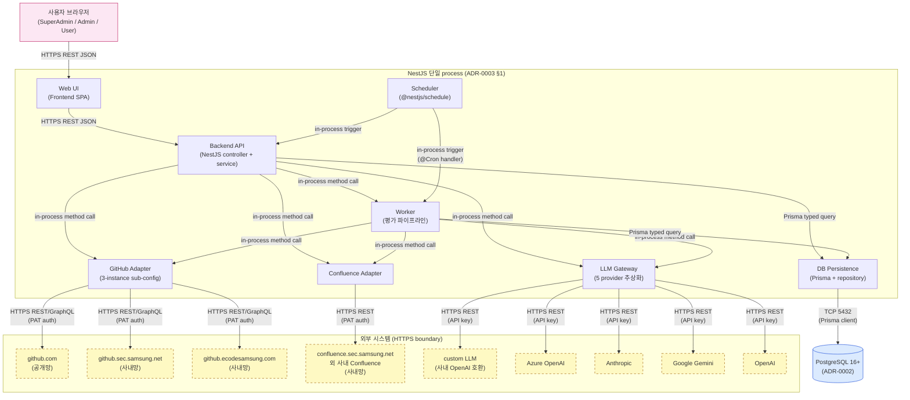

# Component view

> **본 문서는 P1 T-A3 의 산출물이다. [T-0016](../tasks/T-0016-t-a3-component-view.md) 가 component 분해도 + mermaid 다이어그램 + 8 component table + contract 표 + GitHub Adapter 3-instance 묶음 결정을 박제했다.**

## 개요

본 문서는 Assessment-Agent 의 **component view** — 시스템을 component 단위로 분해하고, 각 component 의 책임 / 입출력 contract / 외부 시스템과의 경계를 정의한다. [deployment.md](deployment.md) 와 [ADR-0003](../decisions/ADR-0003-deployment.md) 가 **운영 토폴로지** (단일 NestJS process / PostgreSQL / @nestjs/config / @nestjs/schedule / direct egress) 를 박제했으므로, 본 문서는 그 process 안에 어떤 component 가 들어가는지의 **논리적 분해도** 다.

본 문서는 [docs/architecture/INDEX.md](INDEX.md) 의 **MVA 원칙** 에 따라 작성됐다 — component 분해 + 각 component 의 **책임 한 문단 + 입출력 contract** 까지만 박제하며, 구체 NestJS module class / service 메서드 시그니처 / API endpoint URL / DB schema 컬럼은 본 문서의 범위 밖이다. 그 구체화는 다음 task 들의 책임:

- **T-A4 (modules.md)** — 본 component 분해를 NestJS module class (AssessmentModule / UserModule / GithubModule / ConfluenceModule / LlmModule / AuthModule / SchedulerModule / WebModule) 로 mapping + 의존성 acyclic 검증.
- **P2 Use case decomposition** — 각 use case 가 본 문서의 어느 component 를 거치는지 sequence diagram / 텍스트로 표현.
- **P3 Persistence layer** — DB Persistence component 의 책임 범위 (Prisma schema + repository pattern) 가 본 문서의 component 정의에 기반.
- **P4 External integrations** — GitHub Adapter / Confluence Adapter / LLM Gateway component 의 구체 service class 가 본 문서의 contract 정의에 기반.

> **`## 개요` (5 ~ 14 행) ↔ 실 module 인벤토리 · dependency · 참조 문서 대조 (T-1445 실측 각주)** — 7 행이 열거한 **운영 토폴로지 5 요소는 요소별로 갈린다**: `단일 NestJS process` · `@nestjs/schedule` · `direct egress` 는 [ADR-0003](../decisions/ADR-0003-deployment.md) 의 `### Decision §1` · `§3` · `§4` 와 `package.json` **31** 행 (`"@nestjs/schedule": "^4.1.2"`) 로 **참** 이지만, **`@nestjs/config` 는 ADR-0003 `§2` 가 결정만 하고 아직 미도입** 이며 (`package.json` grep **0 hit**, `src/main.ts` 2 행이 "외부 의존성(`@nestjs/config` 등)은 의도적으로 도입하지 않음" 을 명시 — 문서만의 창작이 아니라 **결정 ↔ 구현 gap**), `PostgreSQL` 은 ADR-0003 의 4 결정에 없고 [ADR-0002](../decisions/ADR-0002-db.md) 소관이라 **귀속이 부분참** 이다.
> **11 행이 열거한 module class 8 명 중 실 class 이름과 일치하는 것은 6 명뿐이다** — 실 `src/**/*.module.ts` 는 **15** 개이고 `UserModule` · `GithubModule` · `ConfluenceModule` · `LlmModule` · `AuthModule` · `WebModule` 은 **실재**, `SchedulerModule` 은 실 class 가 `SchedulingModule` 이라 **이름 상이**, `AssessmentModule` 은 **부재** 이며 그 책임은 `AssessmentCollectionModule` · `AssessmentEvaluationModule` 2 개로 분화됐다. 문서에 없는 module 은 **9** 개 (`AppModule` · `AssessmentCollectionModule` · `AssessmentEvaluationModule` · `SchedulingModule` · `PersistenceModule` · `ExportModule` · `ImportModule` · `PermissionDeniedRecordModule` · `UserInstanceAccessModule`) 이고, 정본 [modules.md](modules.md) 는 이 shipped 현황을 이미 정합해 두었다.
> **같은 행의 pointer 와 "의존성 acyclic 검증" claim 은 참이다** — [modules.md](modules.md) 는 실재하고 3 행이 "P1 T-A4 의 산출물" 로 자기선언하며 **139** 행 `cycle 0 (아래 acyclic 검증 참조)` 로 그 검증을 실제로 수행했다. 다만 본문이 `T-A4` 를 **task ID 없이** 부르고 링크도 두지 않아 pointer 로서는 불완전하다 (대상은 `T-0017`). 9 행의 [INDEX.md](INDEX.md) `MVA 원칙` pointer 는 그 문서 **54** 행에 절이 실재해 **참** 이다.
> **11 ~ 14 행의 "다음 task 들의 책임" 미래형 화법은 낡았다** — T-A4 (modules.md) · P2 · P3 · P4 의 대상이 모두 완료돼 현 phase 표기는 `P4-complete / P5-in-progress` 다. 또 셋째 bullet 의 `P3 Persistence layer` 는 `docs/PLAN.md` **47** 행의 실 명칭이 `Phase P3 — Domain core` 라 **명칭이 상이** 하다 (P2 · P4 명칭은 1:1 일치). 9 행의 "구체 NestJS module class 는 본 문서의 범위 밖" 이라는 자기규정과 11 행이 class 이름 8 개를 실제로 열거하는 **자체 긴장** 이, 위 이름 drift 가 blueprint 에 남게 된 구조적 원인이다.
> `§ 12.15` append-only 방침상 module class 이름 · 시점 서술은 in-place 치환 없이 원문 보존 + 본 각주 병기로 처리했고, 1 ~ 4 행 blockquote 와 16 행 이후 전 구간 (`## Component table` 8 row 포함) 은 무편집이다 — 검증 가능 **22 row** 전 판정 근거는 [REQ-COVERAGE-AUDIT § 12.43](../use-cases/REQ-COVERAGE-AUDIT.md).

## Deployment 컨텍스트

본 문서의 **모든 8 component 는 동일 NestJS process 안에서 동작**한다 — [ADR-0003 §1 — Monolithic NestJS process](../decisions/ADR-0003-deployment.md) 가 박제한 결정이다. component 간 경계는 **논리적 분해** 이지 process 경계가 아니다. 각 component 간 호출은 NestJS DI container 안의 service 메서드 호출 (sync, in-process) 이 default 이며, 외부 시스템 (GitHub / Confluence / LLM provider / DB) 만 HTTPS 또는 DB protocol 경계를 넘어간다.

[ADR-0002 (PostgreSQL + Prisma)](../decisions/ADR-0002-db.md) 는 DB Persistence component 의 기술 선택을 박제했고, [ADR-0001 (NestJS / TypeScript / pnpm / Jest / GHA)](../decisions/ADR-0001-stack.md) 가 모든 component 의 구현 기반 stack 을 박제했다.

## Component diagram


```mermaid
graph TB
    %% External actors / systems
    subgraph external["외부 시스템 (HTTPS boundary)"]
        direction LR
        gh_com["github.com<br/>(공개망)"]
        gh_sec["github.sec.samsung.net<br/>(사내망)"]
        gh_ecode["github.ecodesamsung.com<br/>(사내망)"]
        conf["confluence.sec.samsung.net<br/>외 사내 Confluence<br/>(사내망)"]
        llm_custom["custom LLM<br/>(사내 OpenAI 호환)"]
        llm_azure["Azure OpenAI"]
        llm_anthropic["Anthropic"]
        llm_google["Google Gemini"]
        llm_openai["OpenAI"]
    end

    user_browser["사용자 브라우저<br/>(SuperAdmin / Admin / User)"]

    %% In-process components (monolithic NestJS)
    subgraph process["NestJS 단일 process (ADR-0003 §1)"]
        direction TB
        web_ui["Web UI<br/>(Frontend SPA)"]
        backend_api["Backend API<br/>(NestJS controller + service)"]
        worker["Worker<br/>(평가 파이프라인)"]
        scheduler["Scheduler<br/>(@nestjs/schedule)"]
        llm_gateway["LLM Gateway<br/>(5 provider 추상화)"]
        github_adapter["GitHub Adapter<br/>(3-instance sub-config)"]
        confluence_adapter["Confluence Adapter"]
        db_persistence["DB Persistence<br/>(Prisma + repository)"]
    end

    %% External DB (process 외부, 동일 host 또는 managed)
    postgres[("PostgreSQL 16+<br/>(ADR-0002)")]

    %% User-facing flow
    user_browser -- "HTTPS REST JSON" --> web_ui
    web_ui -- "HTTPS REST JSON" --> backend_api

    %% Backend orchestration
    backend_api -- "Prisma typed query" --> db_persistence
    backend_api -- "in-process method call" --> llm_gateway
    backend_api -- "in-process method call" --> github_adapter
    backend_api -- "in-process method call" --> confluence_adapter
    backend_api -- "in-process method call" --> worker

    %% Scheduler triggers
    scheduler -- "in-process trigger<br/>(@Cron handler)" --> worker
    scheduler -- "in-process trigger" --> backend_api

    %% Worker pipeline
    worker -- "in-process method call" --> github_adapter
    worker -- "in-process method call" --> confluence_adapter
    worker -- "in-process method call" --> llm_gateway
    worker -- "Prisma typed query" --> db_persistence

    %% DB persistence boundary
    db_persistence -- "TCP 5432<br/>(Prisma client)" --> postgres

    %% External egress (HTTPS, ADR-0003 §4)
    github_adapter -- "HTTPS REST/GraphQL<br/>(PAT auth)" --> gh_com
    github_adapter -- "HTTPS REST/GraphQL<br/>(PAT auth)" --> gh_sec
    github_adapter -- "HTTPS REST/GraphQL<br/>(PAT auth)" --> gh_ecode
    confluence_adapter -- "HTTPS REST<br/>(PAT auth)" --> conf
    llm_gateway -- "HTTPS REST<br/>(API key)" --> llm_custom
    llm_gateway -- "HTTPS REST<br/>(API key)" --> llm_azure
    llm_gateway -- "HTTPS REST<br/>(API key)" --> llm_anthropic
    llm_gateway -- "HTTPS REST<br/>(API key)" --> llm_google
    llm_gateway -- "HTTPS REST<br/>(API key)" --> llm_openai

    %% Styling for external boundary
    classDef ext fill:#fef9c3,stroke:#a16207,stroke-dasharray: 5 5
    classDef db fill:#dbeafe,stroke:#1d4ed8
    classDef user fill:#fce7f3,stroke:#be185d
    class gh_com,gh_sec,gh_ecode,conf,llm_custom,llm_azure,llm_anthropic,llm_google,llm_openai ext
    class postgres db
    class user_browser user
```

다이어그램 표기:

- **노란 점선 박스 (`external`)** — 외부 시스템. HTTPS 경계 너머. 점선 stroke 으로 시각 구분.
- **process subgraph** — NestJS 단일 process 안의 in-process component 8 개. 화살표 label 의 "in-process method call" 은 NestJS DI container 안의 service 메서드 호출.
- **PostgreSQL** — DB Persistence component 가 TCP 5432 로 접근하는 외부 process. ADR-0002 의 결정에 따라 동일 host 또는 managed service.
- **사용자 브라우저** — 분홍 박스. SuperAdmin / Admin / User 3 등급 ([README.md](../../README.md) L19–22, REQ-044) 의 entry point.

## Component table

| component | 책임 | 입력/출력 contract | 관련 REQ | 관련 ADR / 문서 |
| --- | --- | --- | --- | --- |
| **Web UI** | 사용자 브라우저에서 동작하는 frontend SPA (React + Vite, 별도 `web/` 패키지). 로그인 / 대시보드 조회 (sort / filter / 시계열) / 인원 CRUD UI / Admin 설정 UI 진입점. shipped 컴포넌트는 `AppShell` (전역 레이아웃 + 무라우터 view 전환 + R-78 `EvaluationGuardBanner` 슬롯) · `AuthGate` (로그인 / `SuperAdminSetupForm`) · `DashboardView` · `AdminView` (`GroupMemberList` 조회 · `DifficultyModelSelector` · export/import · RBAC gating · `SchedulePanel` 마운트 ([T-0885](../tasks/T-0885-wire-schedule-panel-adminview.md)) · `ReEvaluationTriggerPanel` 마운트 ([T-0886](../tasks/T-0886-wire-reevaluation-trigger-panel-adminview.md)) · `PersonList` · `GroupList` · `PartList` · `UserList` · `LlmProviderConfigList` 마운트 + 인원 / 그룹 / 파트 / 사용자 CRUD · 멤버 add/remove · provider CRUD mutation 러너 배선 — 구별 패널 **10 종** · mutation 러너 **26 개** 실측, 근거는 [PLAN.md](../PLAN.md) 122 행 · [T-1350](../tasks/T-1350-plan-admin-panel-marker-rejudge.md)). Backend API 와 HTTPS REST JSON 으로만 통신. 남은 잔여 표면은 `EvaluationGuardBanner` 자동 polling 1 항목뿐이며 backend status 계약 확정 후 배선한다 — [modules.md](modules.md) 의 defer 서술 참조. | 입력: 사용자 클릭 / form submit. 출력: Backend API 로의 HTTPS REST JSON request. | REQ-038 (조회/sort/filter/시계열), REQ-026 (인원 CRUD UI), REQ-044 (로그인 UI / 3 등급) | [ADR-0040](../decisions/ADR-0040-frontend-stack.md) (React+Vite 별도 `web/` 패키지, ACCEPTED) / [ADR-0041](../decisions/ADR-0041-frontend-composition-wiring.md) (composition-wiring, ACCEPTED) / P6 Web UI (shipped, T-0353~T-0394 composition-wiring chain) |
| **Backend API** | NestJS controller + service layer. HTTP API entry point. Auth / RBAC / 인원 / Group / 평가 조회 endpoint 의 진입점. 평가 trigger 시 Worker 를 호출. 외부 시스템 호출은 직접 하지 않고 adapter component 경유. | 입력: HTTPS REST JSON (Web UI 또는 Admin UI 로부터). 출력: HTTPS REST JSON response / Worker / Adapter / DB Persistence 로의 in-process method call. | REQ-026 / REQ-038 / REQ-044 / REQ-049 / REQ-043 (ID/Password 보호) | ADR-0001 (NestJS) / ADR-0003 §1 (monolithic) |
| **Worker** (평가 파이프라인) | commit / 문서 / Confluence page 평가 파이프라인. 난이도·기여도·양·LLM 정성 평가문 생성. monolithic 결정에 따라 Backend 와 **동일 process 내 service layer** 로 표현되지만, 논리적 책임 (평가 orchestration) 으로 분리. Scheduler 또는 Backend API 가 trigger. | 입력: Scheduler 의 cron trigger / Backend API 의 manual trigger. 출력: GitHub Adapter / Confluence Adapter / LLM Gateway 로의 in-process call + DB Persistence 로의 결과 저장. | REQ-005~007 (3 GitHub), REQ-015 (Confluence), REQ-049 (LLM 모델 지정), REQ-031 (재수집 중복 방지), REQ-032 (raw 저장 금지) | ADR-0003 §1 (monolithic process 안 service) / P5 Evaluation pipeline phase |
| **DB Persistence** | PostgreSQL 16+ 인스턴스 + Prisma client + repository layer. 모든 component 의 영속 저장소. ADR-0002 결정에 따라 schema-as-code (`schema.prisma`). raw text 컬럼 미정의 (REQ-032 schema-level 강제). | 입력: Backend API / Worker 로부터의 Prisma typed query (in-process). 출력: query 결과 row / TCP 5432 의 PostgreSQL 외부 process 와 통신. | REQ-029 (non-volatile 저장), REQ-031 (재수집 중복 방지 unique constraint), REQ-032 (raw 저장 금지), REQ-033 (commit/문서 단위) | ADR-0002 (PostgreSQL + Prisma) / ADR-0003 §1 (단일 DB 인스턴스) |
| **LLM Gateway** | 5 provider (custom / Azure OpenAI / Anthropic / Google Gemini / OpenAI) 의 단일 추상화 service. Admin 이 지정한 provider 별 model 식별자 라우팅. 평가 파이프라인은 본 gateway 만 호출 — 구체 provider API 차이 은닉. | 입력: Backend API / Worker 로부터의 in-process method call (`generate(prompt, modelId)`). 출력: 각 provider 의 외부 HTTPS REST API 로의 outbound + 응답 텍스트 반환. | REQ-049 (Admin LLM 모델 지정), REQ-051~055 (5 provider) | ADR-0003 §4 (direct egress) / P4 LLM gateway task |
| **GitHub Adapter** | 3 GitHub instance (github.com / github.sec.samsung.net / github.ecodesamsung.com) 의 통합 adapter. 단일 service + instance sub-config (URL / PAT / org) — 자세히는 아래 "GitHub Adapter — 3 instance 묶음 결정" sub-section. | 입력: Backend API / Worker 로부터의 in-process method call (`fetchCommits(instanceKey, repo, range)` 등). 출력: 각 GitHub instance 의 외부 HTTPS REST/GraphQL API 로의 outbound + 응답 데이터 반환. 4xx 응답 시 PermissionDeniedEvent emit. | REQ-005 / REQ-006 / REQ-007 (3 GitHub instance), REQ-008 (권한 부족 통지), REQ-014 (Issue 평가) | ADR-0003 §4 (direct egress) / P4 GitHub adapter task |
| **Confluence Adapter** | Confluence (confluence.sec.samsung.net 외 사내 Confluence) 의 adapter. 지정 SPACE 의 page list / page 본문 / version history 조회. 4xx 응답 catch → PermissionDeniedEvent emit. | 입력: Backend API / Worker 로부터의 in-process method call (`listPages(spaceKey)`, `fetchPageVersion(pageId, version)` 등). 출력: Confluence REST API 로의 outbound + 응답 데이터 반환. | REQ-015 (Confluence 지정 SPACE 평가), REQ-016 (권한 부족 통지), REQ-017 (crawling vs hierarchy 정책) | ADR-0003 §4 (direct egress) / P4 Confluence adapter task |
| **Scheduler** | `@nestjs/schedule` 기반 in-process cron + manual trigger 단일 진입점. cron 표현식은 DB 에 저장되어 process restart 후에도 복원. Admin UI 의 cron 갱신은 SchedulerRegistry 의 dynamic 등록. manual trigger 는 Backend API endpoint 가 동일 service 메서드 호출 — duplication 0. | 입력: 시간 trigger (cron) 또는 Backend API endpoint 의 manual trigger. 출력: Worker 또는 Backend API service 메서드의 in-process invocation (`@Cron` decorator handler). | REQ-039 (Admin cron 주기 지정), REQ-040 (Admin manual trigger) | ADR-0003 §3 (@nestjs/schedule in-process) / P7 Scheduling & ops task |

> **`## Component table` 의 `Web UI` row (119 행) ↔ 실 `web/src/**` 컴포넌트 인벤토리 · PLAN · ADR / task pointer 대조 (T-1446 실측 각주)** — **본 각주는 `Web UI` row 한정** 이며 나머지 7 row (`Backend API` · `Worker` · `DB Persistence` · `LLM Gateway` · `GitHub Adapter` · `Confluence Adapter` · `Scheduler`) 는 **미판정** 이다. row 가 열거한 컴포넌트 **15 이름은 전부 실재** 한다 — `web/src` 하위 `*.tsx` 의 `export default` **26** 개 중 15 개가 1:1 대응하고 (`AppShell` · `AuthGate` 는 `web/src/` 직하, `DashboardView` · `AdminView` 는 `web/src/views/`, 나머지 11 개는 `web/src/components/`), 문서에 이름이 없는 실 컴포넌트가 **11** 개 더 있다 (`DataImportExportPanel` · `LoginForm` 등 — row 가 "export/import" · "로그인" 처럼 기능으로만 언급한 것들).
> 다만 **`AuthGate` 의 책임 서술은 부분참** 이다 — `AuthGate.tsx` 가 마운트하는 것은 `LoginForm` 뿐이고 `SuperAdminSetupForm` 은 미인증 단계의 **형제 분기로 `AppShell` 이 마운트** 한다 (`AppShell.tsx` **51** · **116** 행). 같은 행의 `AppShell` 책임 3 요소 (전역 레이아웃 · 무라우터 view 전환 · R-78 `EvaluationGuardBanner` 슬롯) 는 `AppShell.tsx` **24** · **111 ~ 112** 행으로 **참** 이고, `AdminView` 마운트 목록 (10 종) 도 실 JSX 와 일치해 **참** 이다.
> **수치 2 건은 출처 일치까지가 확인된 사실이다** — "구별 패널 **10 종**" 은 `AdminView.tsx` 의 실 마운트 컴포넌트 종수와도 일치하나, "mutation 러너 **26 개**" 는 naive `run[A-Z]` grep 이 **31** 식별자 (읽기 · 다운로드 계열 포함) 를 세어 **정확 재측정을 하지 못했다**. 두 수치 모두 근거로 지목된 [PLAN.md](../PLAN.md) **122** 행에 같은 문자열이 실재한다.
> **pointer 축은 전수 참** — [ADR-0040](../decisions/ADR-0040-frontend-stack.md) · [ADR-0041](../decisions/ADR-0041-frontend-composition-wiring.md) 은 실재하고 `status: ACCEPTED` 라 본문 병기와 일치하며, `T-0885` · `T-0886` · `T-1350` · `T-0353` · `T-0394` task 파일과 REQ-026 · REQ-038 · REQ-044 row 도 전부 실재한다. "남은 잔여 표면 = `EvaluationGuardBanner` 자동 polling 1 항목" 역시 PLAN **123** 행 R-78 bullet 과 [modules.md](modules.md) **242** 행 defer 서술로 **참** 이다.
> `§ 12.15` append-only 방침상 원문은 무편집으로 두고 본 각주만 병기했다 — 판정 근거 전문은 [REQ-COVERAGE-AUDIT § 12.44](../use-cases/REQ-COVERAGE-AUDIT.md).

> **`## Component table` 의 `Backend API` row (120 행) · `Worker` row (121 행) ↔ 실 `src/**` controller · service 인벤토리 · `ADR-0001` / `ADR-0003 §1` · REQ 대조 (T-1447 실측 각주)** — **본 각주는 `Backend API` · `Worker` 2 row 한정** 이며 잔여 5 row (`DB Persistence` · `LLM Gateway` · `GitHub Adapter` · `Confluence Adapter` · `Scheduler`) 는 **미판정** 이다. 실 인벤토리는 spec 제외 `*.controller.ts` **20** 개 · `*.service.ts` 의 `export class …Service` **43** 개다.
> **`Backend API` 의 endpoint 열거는 부분참** — `Auth` (`AuthController`, `api/auth`) · `인원` (`PersonController`, `api/persons`) · `Group` (`GroupController`, `api/groups`) · `평가 조회` (`AssessmentController` · `SummaryController` · `ContributionController`) 4 표면은 실재하나 **`RBAC` 전용 controller 는 없다** — RBAC 는 `src/auth/roles.guard.ts` · `roles.decorator.ts` 의 guard layer 이고 등급 변경 endpoint 는 `UserController` **120** 행 `@Patch(":id/role")` 다 (이름 상이). 또 5 표면이 이름으로 덮지 못하는 controller 가 **14** 개 더 있어 (`AssessmentCollectionController` · `LlmProviderConfigController` · `CronScheduleController` 등) 이 열거만 읽으면 backend 표면을 실제보다 좁게 보게 된다.
> "평가 trigger 시 Worker 를 호출" 은 **참** (`AssessmentCollectionController` 의 `POST /api/assessment-collection/collect` → `CollectionTriggerService.triggerCollection`), "외부 시스템 호출은 adapter 경유" 도 **참 (근사)** — `await fetch(` 직접 호출 production 파일은 `src/github` · `src/confluence` · `src/llm` 의 adapter / gateway 계열 **5** 개뿐이다 (grep 근사이며 전수 증명은 아니다).
> **`Worker` 의 평가 4 요소 (난이도 · 기여도 · 양 · LLM 정성 평가문) 는 전부 shipped** — `src/assessment-evaluation/evaluation-scoring.service.ts` **6** 행의 `EvaluationResult` 5 필드 (`unitId` / `narrative` / `difficulty` / `contribution` / `volume`) 와 **35** 행 `calculateEvaluationVolume` import 로 실증된다. 다만 **`Worker` 라는 실 class 는 없다** (`class .*Worker` grep **0 hit**) — row 자신이 "논리적 책임으로 분리" 라 밝힌 대로 실체는 `src/assessment-collection` · `src/assessment-evaluation` 2 디렉토리의 service 군이다.
> **trigger 축은 부분참** — `Backend API` 의 manual trigger 는 위 경로로 실재하나 **`Scheduler` 의 자동 trigger 는 미결선** 이다: 정적 `@Cron` job 정의가 **0** 이고 (`src/app.module.ts` **51** 행 주석), `src/scheduling/scheduling.module.ts` **41** 행의 `CRON_TICK_HANDLER` 기본 provider 가 `cron tick 발화 — 실 평가 pipeline 미결선(stub, Out of Scope)` 만 남기는 no-op stub 이다.
> **pointer · REQ 축은 전수 참** — `ADR-0001` = [ADR-0001-stack.md](../decisions/ADR-0001-stack.md) (`status: ACCEPTED`, NestJS 확정), `ADR-0003 §1` = [ADR-0003-deployment.md](../decisions/ADR-0003-deployment.md) **32** 행 `### Decision §1 — Monolithic NestJS process` (§ 번호 drift 0 이고 **34** 행이 "HTTP API / scheduler / 평가 파이프라인 / LLM gateway / adapter 가 동일 process" 를 명시), `P5 Evaluation pipeline phase` 는 [PLAN.md](../PLAN.md) **94** 행이며, 두 row 의 REQ **11 개** (REQ-005 ~ 007 · 015 · 026 · 031 · 032 · 038 · 043 · 044 · 049) 는 전부 [requirements.md](../requirements.md) 에 실재하고 괄호 병기 문구도 실 제목과 부합한다.
> `§ 12.15` append-only 방침상 원문은 무편집으로 두고 본 각주만 병기했다 — 판정 근거 전문은 [REQ-COVERAGE-AUDIT § 12.45](../use-cases/REQ-COVERAGE-AUDIT.md).

> **`## Component table` 의 `DB Persistence` row (122 행) ↔ 실 `prisma/schema.prisma` 인벤토리 · `ADR-0002` / `ADR-0003 §1` · REQ 대조 (T-1448 실측 각주)** — **본 각주는 `DB Persistence` row 한정** 이며 잔여 4 row (`LLM Gateway` · `GitHub Adapter` · `Confluence Adapter` · `Scheduler`) 는 **미판정** 이다. 실 정본은 `prisma/schema.prisma` **666** 행 · `model` **15** 개이고, **44** 행 `provider = "postgresql"` · **48 ~ 50** 행 `generator client` (`prisma-client-js`) 로 "PostgreSQL 인스턴스" · "Prisma client" · "schema-as-code" 3 구가 **참** 이며, "repository layer" 도 spec 제외 `*.repository.ts` **13** 개 (`assessment` · `contribution` · `summary` 등) 가 `PrismaService` 를 in-process 로 주입받아 **참** 이다.
> **다만 `16+` major version 은 schema 로 검증되지 않는다 (부분참)** — `datasource db` block 은 `provider` 한 줄뿐이라 version · url 정보가 **0** 이고 (`5432` 도 schema 안 **0 hit**), 유일한 근거는 배포 자산인 `docker-compose.yml` **14** 행 `image: postgres:16-alpine` 인데 이는 **16 고정 pin** 이라 "이상 (`+`)" 을 뒷받침하는 정본이 없다. 같은 이유로 contract 셀의 "TCP 5432" 도 **참이되 출처가 schema 가 아니라 배포 자산** 이다 (`docker-compose.yml` **22** 행 · [deployment.md](deployment.md) **30** 행).
> **"raw text 컬럼 미정의" 는 schema 전체 15 model 기준으로도 참** — raw 본문 후보 grep (`body|content|diff|raw|payload|text`) 의 실 컬럼 hit 은 `difficulty String` **3** 건 (`diff` 부분일치일 뿐 enum-as-String literal) 과 `narrative String` **2** 건 (LLM 생성 평가문 = 평가 결과) 뿐이고 commit diff · PR/issue body · 문서 원문 컬럼은 **0** 이다. [requirements.md](../requirements.md) REQ-032 row 의 근거가 `Assessment` · `Contribution` · `Summary` **3 model** 범위인 것과 달리 본 판정은 **15 model 전수** 라 범위가 더 넓다 — 다만 "schema-level 강제" 의 실효는 컬럼 부재 + [ADR-0002](../decisions/ADR-0002-db.md) **48** 행 policy 에 의존하고 reviewer 자동 점검은 여전히 **0 hit** 이다.
> **pointer 축은 1 참 · 1 부분참** — [ADR-0002](../decisions/ADR-0002-db.md) 는 `status: ACCEPTED` 이고 **43** 행이 "Persistence DB 는 PostgreSQL, ORM 은 Prisma" 를 결정해 병기와 일치하나, **`ADR-0003 §1 (단일 DB 인스턴스)` 는 부분참** 이다 — [ADR-0003-deployment.md](../decisions/ADR-0003-deployment.md) **32** 행 `### Decision §1` 의 주제는 `Monolithic NestJS process (in-process queue OK)` 로 process 토폴로지이고, "DB 1 개" 서술은 `### Decision §1` ~ `§4` 어디에도 없이 `## Consequences` 의 **96** 행 (`process 1 개 + DB 1 개 (ADR-0002)`) 에만 있으며 그 행 자신이 정본을 ADR-0002 로 지목한다.
> **REQ 축은 전수 참** — REQ-029 (**48** 행) · REQ-031 (**50** 행) · REQ-032 (**51** 행) · REQ-033 (**52** 행) 4 ID 가 [requirements.md](../requirements.md) 에 실재하고 괄호 병기 문구 (`non-volatile 저장` · `재수집 중복 방지` · `raw 저장 금지` · `commit/문서 단위`) 도 실 제목과 부합하며, REQ-031 의 `unique constraint` 병기는 schema 의 `@@unique` **7** 개 (특히 **348** 행 `@@unique([assessmentId, sourceRef])`) 로 뒷받침된다.
> `§ 12.15` append-only 방침 + row 의 시점 marker **0 hit** 상 원문은 무편집으로 두고 본 각주만 병기했다 — 판정 근거 전문은 [REQ-COVERAGE-AUDIT § 12.46](../use-cases/REQ-COVERAGE-AUDIT.md).

> **`## Component table` 의 `LLM Gateway` row (123 행) ↔ 실 `src/llm/**` 인벤토리 · `ADR-0003 §4` · REQ 대조 (T-1449 실측 각주)** — **본 각주는 `LLM Gateway` row 한정** 이며 잔여 3 row (`GitHub Adapter` · `Confluence Adapter` · `Scheduler`) 는 **미판정** 이다. **"5 provider" 는 참** — `llm-gateway.interface.ts` **20 ~ 26** 행 `enum LlmProvider` 가 `custom` · `azure_openai` · `anthropic` · `google_gemini` · `openai` **5 멤버** 를 정의하고 **33** 행 `LLM_PROVIDERS` 가 그 전량을 노출한다. 다만 **provider 종수 ≠ adapter 파일 수** 다 — spec 제외 `src/llm/providers/*.adapter.ts` 는 **4** 개 (`anthropic` · `azure-openai` · `google-gemini` · `openai-compatible`) 이고 `custom` 과 `openai` 는 `llm-http-gateway.service.ts` **180** 행 `else` 분기에서 `openai-compatible` adapter 를 **공유** 한다 ([PLAN.md](../PLAN.md) **85** 행도 같은 4 adapter 를 열거).
> **`단일 추상화 service` · `평가 파이프라인은 본 gateway 만 호출` 은 참** — spec 제외 `src/llm` 하위 `*.ts` **21** 개 중 `class …Gateway` 는 `llm-http-gateway.service.ts` **74** 행 `export class LlmHttpGateway implements LlmGateway` **1 개뿐** 이고, `src/assessment-evaluation` · `src/assessment-collection` 의 `llm/providers` import 는 **0 hit** 이다 (평가 측은 `assessment-evaluation.module.ts` **36 ~ 37** 행의 `LLM_GATEWAY` token → `LlmHttpGateway` `useExisting` 바인딩만 사용 — grep 근사다). `Admin 이 지정한 provider 별 model 식별자 라우팅` 도 **참** — `llm-provider-config-resolver.service.ts` **28** 행 `LlmProviderConfigResolver` 가 Admin 이 저장한 `LlmProviderConfig` row 의 `modelId` 를 해석하고 gateway **155 ~ 180** 행이 `config.provider` 로 adapter 를 분기한다.
> **contract 축은 1 부분참 · 1 참** — `generate(prompt, modelId)` 는 **부분참** 이다: 실 시그니처가 `generate(prompt: string, options: LlmGenerateOptions): Promise<LlmGenerateResult>` (interface **74 ~ 77** 행) 라 둘째 인자는 `modelId` 가 아니라 **`modelId` (필수) + `difficulty` (선택) 2 필드의 options 객체** 다 (**47 ~ 55** 행). `외부 HTTPS REST API 로의 outbound` 는 **참이되 호출 지점이 adapter 가 아니라 gateway** 다 — `src/llm` 안 `await fetch(` 는 **0 hit** 이고 실 outbound 는 gateway **191** 행 `await this.fetchFn(request.url, …)` **단일 지점** 이며 4 adapter 는 요청 조립 · 응답 파싱 순수 함수다.
> **pointer · REQ 축은 전수 참** — `ADR-0003 §4` = [ADR-0003-deployment.md](../decisions/ADR-0003-deployment.md) **78** 행 `### Decision §4 — 외부 네트워크 boundary = direct outbound from app process` 로 § 번호 · 주제가 부합하고 (**80** 행이 내부 LLM proxy · Azure / Anthropic / Google / OpenAI 공개 API 를 같은 process 에서 직접 호출한다고 명시 — `§ 12.46` 이 잡은 `§1` 좌표 drift 와 달리 본 row 는 drift **0**), `P4 LLM gateway task` 는 [PLAN.md](../PLAN.md) **79** 행 `## Phase P4 — External integrations` + **85** 행 `LLM provider 추상화` bullet (`[x]` 완료) 이다. REQ **6 개** (REQ-049 · REQ-051 ~ 055) 는 [requirements.md](../requirements.md) **68 · 70 ~ 74** 행에 실재하고 병기 문구 (`Admin LLM 모델 지정` · `5 provider`) 도 실 제목과 부합한다.
> `§ 12.15` append-only 방침 + row 의 시점 marker **0 hit** 상 원문은 무편집으로 두고 본 각주만 병기했다 — 판정 근거 전문은 [REQ-COVERAGE-AUDIT § 12.47](../use-cases/REQ-COVERAGE-AUDIT.md).

> **`## Component table` 의 `GitHub Adapter` row (124 행) ↔ 실 `src/github/**` 인벤토리 · `ADR-0003 §4` · REQ 대조 (T-1450 실측 각주)** — **본 각주는 `GitHub Adapter` row 한정** 이며 잔여 2 row (`Confluence Adapter` · `Scheduler`) 는 **미판정** 이다. 실 인벤토리는 spec 제외 `src/github/*.ts` **7** 개이고 `export class` 는 **4** 개 (`GithubAdapter` **237** 행 · `GithubInstanceClient` **47** 행 · `GithubDomainError` 에러 타입 · `GithubModule`) 라 **"단일 service" 는 참 (근사)** 다 — 외부 호출 본체는 `GithubAdapter` 1 개이고 `GithubInstanceClient` 는 instance key 로 config 를 풀어 넘기는 얇은 wrapper 다. 다만 **"3 GitHub instance" 는 부분참** 이다: 세 host 문자열이 production 코드에 나열된 곳은 `github-live-test-gating.ts` **55 ~ 72** 행 `GITHUB_LIVE_HOST_SPECS` (live-test gating 사양) 뿐이고, 실 config 는 `GITHUB_INSTANCES` env key list 기반이라 **개수가 3 으로 고정되어 있지 않다** ([PLAN.md](../PLAN.md) **81** 행이 3 host 를 운영 목표로 명시).
> **sub-config 이름과 sub-section pointer 는 둘 다 부분참** — 실 env suffix 는 `github-instance-config.ts` **25 ~ 27** 행의 `_HOST` / `_ORG` / `_TOKEN_ENC` 라 row 의 `URL / PAT / org` 와 순서 · 이름이 어긋나고, 특히 token 은 평문 PAT 이 아니라 **암호화 ciphertext (`_TOKEN_ENC`, JIT decrypt)** 다 (변수명까지만 적는다 — CLAUDE.md §9). sub-section pointer 도 인용구가 `GitHub Adapter — 3 instance 묶음 결정` 인데 실 heading 은 **155** 행 `## GitHub Adapter — 3 instance 묶음 vs 분리 결정` 으로 **`vs 분리` 2 어절이 빠져** 문자 단위로 불일치한다 (sub-section 본문은 본 각주의 판정 대상이 아니다).
> **계약 시그니처는 거짓** — `fetchCommits` 는 `src` 전체에서 **0 hit** 이라 `fetchCommits(instanceKey, repo, range)` 는 예시로도 실재하지 않는다. 실 public 표면은 `github-adapter.service.ts` **263** 행 `request(input: GithubRequestInput)` · **287** 행 `requestAllPages(input)` 와 `github-instance-client.service.ts` **64** 행 `requestForInstance` · **76** 행 `requestAllPagesForInstance` 로, endpoint 별 전용 메서드가 아니라 **범용 request 표면** 이다.
> **프로토콜은 부분참 · outbound 는 참 (호출 지점 주의)** — `src/github` 에서 `graphql` 은 **0 hit** 이라 `REST/GraphQL` 중 GraphQL 근거가 없고, REST 근거는 `github-request.builder.ts` **88** 행 `resolveGithubApiBaseUrl` (public → `https://api.github.com`, Enterprise → `https://<host>/api/v3`) 이다. `await fetch(` 도 **0 hit** 이며 실 outbound 는 주입된 `fetchFn` 단일 지점 (**246** 행 기본값 `globalThis.fetch` · **370** 행 호출) 이다. **`4xx 응답 시 emit` 역시 부분참** — `mapNon2xx` (**406 ~ 411** 행) 은 **401 / 403 만** `permission-denied` 로 분류해 `PermissionDeniedEvent` 를 emit 하고, 404 → `not-found` · 429 → `rate-limited` · 그 외 5xx → `upstream-error` 는 emit 없이 `GithubDomainError` 로만 던진다.
> **pointer · REQ 축은 전수 참** — `ADR-0003 §4` 는 `§ 12.47` 의 **참 · drift 0 판정을 승계** 하며 재측정도 [ADR-0003-deployment.md](../decisions/ADR-0003-deployment.md) **78** 행 `### Decision §4 — 외부 네트워크 boundary = direct outbound from app process` 로 동일하고, `P4 GitHub adapter task` 는 [PLAN.md](../PLAN.md) **79** 행 `## Phase P4 — External integrations` + **81** 행 `GitHub 통합` bullet (`[x]` 완료) 이다. REQ **5 개** (REQ-005 ~ 008 · REQ-014) 는 [requirements.md](../requirements.md) **24 ~ 27 · 33** 행에 실재하고 병기 문구 (`3 GitHub instance` · `권한 부족 통지` · `Issue 평가`) 도 실 제목과 부합한다.
> `§ 12.15` append-only 방침 + row 의 시점 marker **0 hit** 상 원문은 무편집으로 두고 본 각주만 병기했다 — 판정 근거 전문은 [REQ-COVERAGE-AUDIT § 12.48](../use-cases/REQ-COVERAGE-AUDIT.md).

> **`## Component table` 의 `Confluence Adapter` row (125 행) ↔ 실 `src/confluence/**` 인벤토리 · `ADR-0003 §4` 재승계 · REQ 대조 (T-1451 실측 각주)** — **본 각주는 `Confluence Adapter` row 한정** 이며 잔여 1 row (`Scheduler`) 는 **미판정** 이다. 실 인벤토리는 spec 제외 confluence 계열 `*.ts` **10** 개 (`src/confluence/` **7** · `src/assessment-collection/` **2** · `src/permission-denied/` **1**) 이고 `src/confluence/*.ts` 의 `export class` 는 **4** 개 (`ConfluenceAdapter` **293** 행 · `ConfluenceSpaceTraversalService` **82** 행 · `ConfluenceDomainError` 에러 타입 · `ConfluenceModule`) 라 **"Confluence 의 adapter" 가 단일 dispatch 본체라는 서술은 참 (근사)** 다 — 외부 호출 본체는 `ConfluenceAdapter` 1 개이고 traversal service 는 그 위에서 SPACE allowlist 를 순회하는 보조다.
> **호스트 표기는 부분참** — `confluence.sec.samsung.net` 은 production 코드에서 **0 hit** 이고, baseUrl 은 `confluence-instance-config.ts` **29** 행 `CONFLUENCE_INSTANCES_ENV` key list + **34 ~ 35** 행 `_BASE_URL` / `_AUTH_USER` suffix 조립으로 **env 주입** 된다 (`_TOKEN_ENC` 는 변수명까지만 적는다 — CLAUDE.md §9). 특정 host 를 고정하는 정본은 코드에 없다.
> **"page list / page 본문 / version history 3 종 조회" 는 부분참 (3 축 중 1 축만 근거)** — page list 는 `confluence-space-traversal.service.ts` **65** 행 `CONFLUENCE_CONTENT_PATH = "/content"` + **117 ~ 123** 행 `{ spaceKey }` query 로 **참** 이나, page 본문은 `expand` · `body.storage` 가 **0 hit** 이고 같은 파일 **72** 행이 "body raw 는 본 service 가 저장/노출하지 않"음을 명시하며 (ADR-0013 §2 raw 미저장 정합), version history 는 전용 호출 경로가 **0** 이라 `version` 문자열이 `confluence-adapter.service.ts` **190** 행 status 주석에만 남는다.
> **계약 시그니처는 거짓 · 4xx 범위는 부분참** — `listPages` · `fetchPageVersion` 은 `src` 전체 **0 hit** 이라 예시로도 실재하지 않고, 실 public 표면은 **326** 행 `request(input: ConfluenceRequestInput)` · **353** 행 `requestAllPages(input)` 범용 **2** 개다. `mapNon2xx` (**491** 행) 은 **401 / 403 만** `permission-denied` 로 분류해 `PermissionDeniedEvent` 를 emit 하고, 404 → `not-found` · 429 → `rate-limited` · 그 외는 emit 없이 `ConfluenceDomainError` 로만 던진다. outbound 는 **참이되 호출 지점 주의** — `await fetch(` 는 **0 hit** 이고 실 REST outbound 는 **455** 행 주입 `fetchFn` 단일 지점이다.
> **pointer · REQ 축은 전수 참** — `ADR-0003 §4` 는 `§ 12.47` → `§ 12.48` 의 참 · drift 0 판정을 **재승계** 하며 재측정도 [ADR-0003-deployment.md](../decisions/ADR-0003-deployment.md) **78** 행 `### Decision §4 — 외부 네트워크 boundary = direct outbound from app process` 로 동일하고 (동명 heading 이 **147** 행 Alternatives 표에도 있으나 Decision 정본은 78 행), `P4 Confluence adapter task` 는 [PLAN.md](../PLAN.md) **79** 행 `## Phase P4 — External integrations` + **83** 행 `Confluence 통합` bullet (`[x]` 완료) 이다. REQ **3 개** (REQ-015 ~ 017) 는 [requirements.md](../requirements.md) **34 ~ 36** 행에 실재하고 괄호 병기 문구도 실 제목과 부합한다. `§ 12.15` append-only 방침 + row 시점 marker **0 hit** 상 원문은 무편집으로 두고 본 각주만 병기했다 — 판정 근거 전문은 [REQ-COVERAGE-AUDIT § 12.49](../use-cases/REQ-COVERAGE-AUDIT.md).

> **`## Component table` 의 `Scheduler` row (126 행) ↔ 실 `src/scheduling/**` 인벤토리 · `ADR-0003 §3` 재측정 · REQ 대조 (T-1452 실측 각주)** — **본 각주는 `Scheduler` row 한정** 이며, **이로써 `## Component table` 7 row 대조가 완결** 된다 (각 row 를 닫은 절은 `§ 12.44` ~ `§ 12.50`). 실 인벤토리는 spec 제외 `src/scheduling/*.ts` **14** 개이고 `export class` 는 **8** 개 (controller **3** · service / runner **4** · `SchedulingModule`) 라 **"단일 진입점" 은 부분참** 이다 — cron 진입점 본체는 `cron-schedule.service.ts` **44** 행 `CronScheduleService` 와 `cron-schedule.controller.ts` **70** 행 `@Controller("api/schedules")` 1 쌍이고, `BackfillController` · `RecentDeletionController` 와 그 runner 2 개는 backfill · 재수집용 **별도 REST 진입점** 이다.
> **"cron 표현식은 DB 에 저장되어 process restart 후에도 복원" 은 거짓 (미구현)** — `prisma/schema.prisma` 에 cron / schedule 계열 `model` **0 hit** 이고 `src/scheduling/*.ts` 에 `onModuleInit` · `restore` · `rehydrate` 도 **0 hit** 이며, `cronExpression` 은 `cron-schedule.controller.ts` **110** 행 · `cron-schedule.service.ts` **52** 행의 in-memory registry 경로에만 등장한다. 이 서술은 [ADR-0003-deployment.md](../decisions/ADR-0003-deployment.md) **68** 행이 근거로 적은 설계 의도 ("DB 의 schedule 설정 row 갱신") 이자 **1 ~ 4 행 blockquote 가 선언한 P1 T-A3 blueprint** 이고, shipped 현황은 `cron-schedule.service.ts` **6** 행의 "빈 registry 초기 계약" 이다.
> **dynamic 등록은 참 · `@Cron` decorator handler 는 거짓** — 등록 경로는 service **17 ~ 18** 행 `SchedulerRegistry` · `CronJob` / `CronTime` import 위의 **50** 행 `registerOrReplace` (controller **103** 행 `@Put()` = `PUT /api/schedules`) 라 참이나, `@Cron(` 은 `src` 전체 **0 hit** 이고 `src/app.module.ts` **51** 행이 "정적 `@Cron` job 정의 0 (후속 ③ scheduler service 책임)" 을 명시한다.
> **manual trigger 는 부분참 (duplication 0 은 참, 경로 서술이 상이)** — controller **140 ~ 145** 행 `@Post("trigger")` (202 Accepted) 는 `CronScheduleService` 를 **거치지 않고** 주입된 `CRON_TICK_HANDLER` (**68** 행 token) 를 직접 호출해 cron tick callback 과 **동일한 handler 추상** 을 공유한다 (**129 ~ 131** 행 주석). 중복 구동 로직이 없다는 결론은 참이지만 "동일 service 메서드 호출" 이라는 경로 표기는 실제와 다르다.
> **출력 축은 미결선 (거짓)** — `scheduling.module.ts` **32 ~ 45** 행 `defaultCronTickHandlerProvider` 가 "cron tick 발화 — 실 평가 pipeline 미결선(stub, Out of Scope)" 만 로깅하는 no-op 이라 `§ 12.45` 의 "`Scheduler` 자동 trigger 미결선" 판정이 재확인된다 (`CollectionTriggerService` 결선은 `backfill-runner.service.ts` **18 · 61** 행 · `recent-deletion-runner.service.ts` **23** 행의 backfill · 재수집 경로뿐이다).
> **pointer · REQ 축은 전수 참 — 단 `§4` 승계 불가라 직접 재측정** — [ADR-0003-deployment.md](../decisions/ADR-0003-deployment.md) **62** 행 `### Decision §3 — Scheduler 위치 = @nestjs/schedule (in-process)` 가 괄호 병기와 1:1 이고 (**138** 행 동명 heading 은 Alternatives 절), `P7 Scheduling & ops task` 는 [PLAN.md](../PLAN.md) **131** 행 `## Phase P7 — Scheduling & operations` (축약 표기) · **133** 행 오너 승인이다. REQ **2 개** 는 [requirements.md](../requirements.md) **58 ~ 59** 행에 실재하고 병기 문구 (`Admin cron 주기 지정` · `Admin manual trigger`) 도 실 제목과 부합한다. `§ 12.15` append-only 방침 + row 시점 marker **0 hit** 상 원문은 무편집으로 두고 본 각주만 병기했다 — 판정 근거 전문은 [REQ-COVERAGE-AUDIT § 12.50](../use-cases/REQ-COVERAGE-AUDIT.md).

## GitHub Adapter — 3 instance 묶음 vs 분리 결정

본 task (T-0016) 의 architect 가 결정 — **단일 component (multi-tenant adapter)** 채택.

**채택: (a) 단일 component `GithubAdapter` + instance sub-config**.

- 구조: `GithubAdapter` 1 service 가 instance key (예: `'com'` / `'sec'` / `'ecode'`) 를 인자로 받고, 내부에서 instance 별 sub-config (base URL / PAT / org / proxy 설정) 를 lookup 하여 적절한 HTTP client 로 라우팅.
- config schema 예시 (실제 구현은 P4 task — 본 결정의 박제만 목적):
  ```
  github:
    instances:
      com:    { baseUrl: "https://api.github.com",        token: env, org: "..." }
      sec:    { baseUrl: "https://github.sec.samsung.net/api/v3",        token: env, org: "..." }
      ecode:  { baseUrl: "https://github.ecodesamsung.com/api/v3",       token: env, org: "..." }
  ```

**근거** (5 줄):

1. **3 instance 의 API surface 가 동일 GitHub API spec** (REST v3 / GraphQL v4) — 코드 중복 회피 / DRY 원칙. 3 sub-component 로 분리 시 동일 fetch/parse 로직이 3 copy 가 되어 변경 비용 3 배.
2. **instance 별 차이는 base URL / PAT / org 만** — config 분리로 해결 가능. 동적 차이는 (현재 시점에) 알려진 게 없음.
3. **새 GitHub-like service 추가 시 sub-config 추가만으로 가능** — open-closed 원칙 충족. 예: 향후 `github.private-corp.com` 추가 시 `instances.private` 1 항목만 추가.
4. **ADR-0003 §4 의 TLS / proxy 처리 응집** — `NODE_EXTRA_CA_CERTS` + `HTTPS_PROXY` 환경변수가 단일 HTTP client 에 자연 적용. 3 sub-component 분리 시 동일 설정을 3 번 반복.
5. **NestJS DI 친화성** — `GithubAdapter` 1 provider + instance config map 으로 controller / worker 가 `githubAdapter.fetchCommits('com', ...)` 패턴 사용. 3 sub-provider 분리 시 controller 가 instance 별 dispatch 로직을 가져야 함.

**Alternatives 검토 — (b) 3 sub-component 분리** (`GithubComAdapter` / `GithubSecAdapter` / `GithubEcodeAdapter`):

- 장점: 각 instance 의 SLA / rate limit / 에러 유형이 다르게 진화하면 service 별 격리가 명확. 별도 module 로 분리 시 의존성 그래프가 명시적.
- 단점: 본 결정 시점에 instance 별 API 차이가 사실상 0 (동일 GitHub API spec). 코드 중복 비용이 격리의 이점을 초과.
- **미채택**. 다만 향후 instance 별 API 가 의미 있게 분기하기 시작하면 (예: 사내 GitHub 가 별도 enterprise endpoint 도입) 본 결정을 **SUPERSEDE 하는 ADR-0004** 신설하여 (b) 로 전환. 본 task 의 Follow-ups 에 그 가능성 명시.

**ADR 신설 불필요** — 본 결정은 component 분해 수준에 그치고, 외부 dependency / 운영 토폴로지 / 데이터 모델에 영향 없음. component view 본문에 인라인 박제로 충분. 향후 (b) 전환 시 ADR-0004 신설.

## Contracts

다이어그램의 각 화살표를 sync/async + message format 으로 정리.

| from | to | sync/async | message format | 비고 |
| --- | --- | --- | --- | --- |
| 사용자 브라우저 | Web UI | sync | HTTPS REST JSON (또는 SPA hydration) | 사용자 entry point. REQ-038. |
| Web UI | Backend API | sync | HTTPS REST JSON (over TLS) | 인증 토큰 (JWT 또는 session cookie) 동반 — 구체는 P3 Auth task. REQ-043. |
| Backend API | DB Persistence | sync | Prisma typed query (in-process) | ADR-0002. NestJS DI container 의 PrismaService singleton 경유. |
| Backend API | LLM Gateway | sync | TypeScript method call (in-process) | ADR-0003 §1 monolithic — 동일 process 내 method call. provider 추상화 layer. |
| Backend API | GitHub Adapter | sync | TypeScript method call (in-process) | 동일 process. 본 contract 가 외부 GitHub 호출의 단일 진입점. |
| Backend API | Confluence Adapter | sync | TypeScript method call (in-process) | 동일 process. |
| Backend API | Worker | sync (또는 fire-and-forget) | TypeScript method call (in-process) | manual trigger flow. fire-and-forget 시 Worker 내부에서 background task. 구체는 P5. |
| Scheduler | Worker | sync (handler 실행 자체) | NestJS `@Cron` decorator handler | ADR-0003 §3 in-process scheduler. cron 시각 도달 시 handler 직접 호출. |
| Scheduler | Backend API | sync | NestJS `@Cron` handler 가 controller/service 호출 | manual trigger 와 동일 service 메서드 호출 — duplication 0 (ADR-0003 §3). |
| Worker | GitHub Adapter | sync | TypeScript method call (in-process) | 평가 파이프라인의 commit/Issue fetch path. |
| Worker | Confluence Adapter | sync | TypeScript method call (in-process) | 평가 파이프라인의 page fetch path. |
| Worker | LLM Gateway | sync (await) | TypeScript method call (in-process) | 평가문 생성 / 난이도 분류 호출. provider 별 latency 가 다양하므로 concurrency limit 동반 (ADR-0003 §1). |
| Worker | DB Persistence | sync | Prisma typed query (in-process) | 평가 결과 저장. raw 저장 금지 (REQ-032) — schema 가 raw column 미정의. |
| DB Persistence | PostgreSQL | sync | Prisma client (TCP 5432, libpq protocol) | ADR-0002. connection pool singleton. |
| GitHub Adapter | github.com / sec / ecode | async (외부 HTTPS) | HTTPS REST v3 / GraphQL v4, PAT auth (`Authorization: token ...`) | ADR-0003 §4 direct egress. 4xx 응답 catch → PermissionDeniedEvent (REQ-008). |
| Confluence Adapter | confluence.sec.samsung.net 외 | async (외부 HTTPS) | HTTPS REST, PAT auth | ADR-0003 §4. 4xx 응답 catch → PermissionDeniedEvent (REQ-016). |
| LLM Gateway | 외부 LLM provider 5 종 | async (외부 HTTPS) | HTTPS REST, API key auth (provider 별 header 다름) | ADR-0003 §4. provider 별 endpoint 차이 / model 식별자 / timeout / retry 정책은 P4 LLM gateway task. |

**sync / async 의미**: 본 표의 "sync" 는 호출자 thread 가 응답까지 await 한다는 의미 (in-process 또는 외부 HTTPS 둘 다 포함). "async" 는 외부 HTTPS 경계를 넘는 호출이라 latency / failure 모드가 사실상 비동기 특성을 가진다는 의미 — 코드 레벨로는 `await` 사용 (TypeScript Promise) 이지만 본 표에서는 외부 경계 분류 목적으로 사용.

## References

- [ADR-0001 — Backend / language / package manager / test / CI 스택](../decisions/ADR-0001-stack.md) — NestJS / TypeScript / pnpm / Jest / GitHub Actions. 모든 component 의 stack.
- [ADR-0002 — Persistence DB / ORM 선택](../decisions/ADR-0002-db.md) — PostgreSQL + Prisma. DB Persistence component 의 기반.
- [ADR-0003 — Deployment 토폴로지 4 결정](../decisions/ADR-0003-deployment.md) — monolithic / secret (env) / scheduler (in-process) / network (direct egress). 모든 component 의 운영 토폴로지.
- [docs/requirements.md](../requirements.md) — REQ-NNN source of truth. 본 문서의 모든 REQ 인용 출처.
- [docs/architecture/deployment.md](deployment.md) — T-A2 산출물. 본 문서의 운영 토폴로지 cross-reference.
- [docs/architecture/INDEX.md](INDEX.md) — architecture document 인덱스 + MVA 원칙.
- [README.md](../../README.md) — 7–18 (REQ-005~007 GitHub) / 19–22 (REQ-044 권한) / 33–41 (REQ-015 Confluence) / 45–51 (REQ-026 인원) / 68–71 (REQ-038 UI) / 96–103 (REQ-049 / REQ-051~055 LLM).

Refs: T-0016, REQ-005, REQ-006, REQ-007, REQ-015, REQ-026, REQ-038, REQ-044, REQ-049, REQ-051, REQ-052, REQ-053, REQ-054, REQ-055
