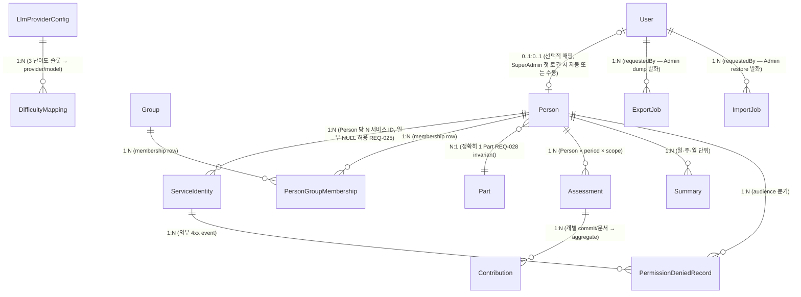

# Conceptual data model

> **본 문서는 P2 의 다섯째이자 마지막 entry artifact ([T-0031](../tasks/T-0031-p2-data-model.md)) 의 산출물이다.** [docs/PLAN.md](../PLAN.md) Phase P2 의 "데이터 모델 초안" bullet (L38) 을 cover. 8 UC ([UC-01](../use-cases/UC-01-evaluation-execution.md) ~ [UC-08](../use-cases/UC-08-permission-denied.md)) 의 §5 sequence diagram + §6 데이터 단락에서 호명된 **entity (개념적 데이터 단위) + 관계 (cardinality) + 핵심 invariant (REQ-032 raw 미저장)** 를 단일 문서로 박제하여 P3+ Persistence 구현 task 의 contract source 로 사용한다. **본 문서는 living document** — entity 가 새로 식별되거나 기존 관계가 분리·통합되면 architect agent 가 본 표를 갱신한다. 본 task 머지 시 **Phase P2 fully complete**.

## 1. 개요

본 문서의 범위는 [docs/architecture/INDEX.md](INDEX.md) 의 **MVA (Minimum Viable Architecture)** 원칙에 따라 **conceptual model only** 로 한정한다 — entity 이름 / 책임 / source UC / 관련 REQ / 책임 module 5-컬럼 표 + 관계 (mermaid ER diagram) + raw 미저장 invariant + cross-cutting field conceptual mention + REQ → entity coverage 까지만 박제. **구체 컬럼 type (CHAR(50) / TEXT / TIMESTAMPTZ / JSONB) · index · unique constraint · cascade policy · Prisma schema 코드 · migration SQL 은 본 문서의 범위 밖** 이며 [§ 7](#7-out-of-scope) 에 명시. 그 구체화는 P3 의 `prisma/schema.prisma` + repository 구현 task 의 책임이다.

본 문서의 기반:

- [ADR-0002 — Persistence DB / ORM 선택](../decisions/ADR-0002-db.md) — **PostgreSQL 16+ + Prisma**. 관계형 DB 의 schema-as-code (`schema.prisma`) 가 본 conceptual model 의 실 구현 form.
- [ADR-0003 — Deployment 토폴로지](../decisions/ADR-0003-deployment.md) §1 — monolithic NestJS process + **단일 DB 인스턴스**. 본 문서의 모든 entity 가 동일 DB 안에 거주, multi-DB 분리 없음.
- [components.md](components.md) "DB Persistence" component — 본 문서의 entity 들이 거주하는 component 의 책임 정의 (raw text 컬럼 미정의 — REQ-032 schema-level 강제).
- [modules.md](modules.md) — 8 NestJS module 의 책임 분배. 본 문서의 각 entity 가 어느 module 의 책임인지 매핑 (§ 2 표 "책임 module" 컬럼).

## 2. Entity 목록

본 시스템은 다음 **13 entity (+ 1 conceptual mention)** 로 분해된다. 각 entity 의 책임은 1~2 줄로 한정하며, 구체 컬럼 / type / index 는 P3 의 범위.

| entity | 책임 | source UC | 관련 REQ | 책임 module ([modules.md](modules.md)) |
| --- | --- | --- | --- | --- |
| **Person** | 평가 대상 인원 (사람). 이름 / 이메일 / active flag (휴직 시 false = 명단에서 숨김). 로그인 계정 User 와 분리된 개념. | [UC-03](../use-cases/UC-03-person-crud.md), UC-01, UC-02 | REQ-023, REQ-026, REQ-028 | UserModule |
| **ServiceIdentity** | Person ↔ 외부 서비스별 ID 매핑 (github.com / github.sec.samsung.net / github.ecodesamsung.com / confluence.sec.samsung.net 외). 일부 NULL 허용 (REQ-025). 하나가 primary key 역할 (REQ-024). | UC-03, UC-01 | REQ-023, REQ-024, REQ-025 | UserModule |
| **Group** | 임의 그룹. 1 Person 이 N Group 에 다중 소속 가능 (REQ-028). | UC-03 | REQ-028 | UserModule |
| **Part** | 조직도 파트. 1 Person 이 **정확히 1 Part** 에 소속 (REQ-028 invariant). | UC-03 | REQ-028 | UserModule |
| **PersonGroupMembership** | Person ↔ Group 다대다 관계의 join entity (REQ-028). `@@unique([personId, groupId])` 로 중복 membership 방지. | UC-03 | REQ-028 | UserModule |
| **User** | 로그인 계정 (서비스 사용자). 등급 SuperAdmin / Admin / User. Person 과 conceptual 분리 — User 는 시스템 인증 식별자, Person 은 평가 대상자. | [UC-04](../use-cases/UC-04-account-auth.md) | REQ-043, REQ-044, REQ-045, REQ-046 | AuthModule |
| **Assessment** | 평가 결과의 unit. Person × period (일·주·월) × scope (commit / document / aggregate) 의 cross product. **raw commit 본문 / 문서 본문 미저장** — 평가 결과 (난이도 / 기여도 / 양 / LLM 평가문) 만 보유. | [UC-01](../use-cases/UC-01-evaluation-execution.md), [UC-02](../use-cases/UC-02-evaluation-query.md), [UC-06](../use-cases/UC-06-evaluation-delete-reeval.md) | REQ-029, REQ-032, REQ-033, REQ-037, REQ-038, REQ-041, REQ-063 | AssessmentModule |
| **Contribution** | 개별 기여 단위 (단일 commit / 단일 PR / 단일 문서 변경). Assessment 의 component — N Contribution 이 1 Assessment 로 aggregate. raw 본문 미저장 (REQ-032), 평가 결과만 보유. | UC-01, UC-02 | REQ-029, REQ-032, REQ-033 | AssessmentModule |
| **Summary** | 일·주·월 단위 요약 평가문. Person 단위 (default) 또는 Group/Part 단위 aggregate. LLM 정성 평가문 + Metric 수치 (REQ-036). 본 시점 결정: **Person 단위 default**, Group/Part aggregate 는 view-time 계산 (별도 entity 아님). | [UC-02](../use-cases/UC-02-evaluation-query.md) | REQ-034, REQ-035, REQ-036, REQ-038 | AssessmentModule |
| **LlmProviderConfig** | 5 provider (custom / Azure OpenAI / Anthropic / Google Gemini / OpenAI) 별 설정 1 row — endpoint URL / API key (encrypted at rest, 별도 ADR) / model 식별자. **다중 row 모델** (각 provider 별 1+ row, custom 은 3 model 슬롯 모두 차지 가능 — REQ-051). | [UC-05](../use-cases/UC-05-llm-config.md) | REQ-049, REQ-051, REQ-052, REQ-053, REQ-054, REQ-055 | LlmModule |
| **DifficultyMapping** | 3 난이도 (easy / medium / hard) ↔ LlmProviderConfig.modelId 매핑. **3 row 고정** (난이도 슬롯 3 개) 또는 sub-relation. | UC-05 | REQ-049, REQ-050 | LlmModule |
| **PermissionDeniedRecord** | 외부 4xx (GitHub / Confluence) 를 GithubAdapter / ConfluenceAdapter 가 catch → System emit event 의 영속화. ServiceIdentity 또는 Person 에 N:1. user / admin audience 분리. | [UC-08](../use-cases/UC-08-permission-denied.md) | REQ-008, REQ-016 | AssessmentModule |
| **ExportJob** | Export operation (DB → file artifact dump) 의 비동기 진행 추적·감사 record. `status` (PENDING/RUNNING/SUCCEEDED/FAILED) / `scope` (full/range/partial) / `requestedBy` (User 참조) / `artifactRef` (raw 미포함 pointer) / `error`. read-only operation 이라 DB 무변화. ([ADR-0044](../decisions/ADR-0044-export-import-job-persistence.md)) | [UC-07](../use-cases/UC-07-export-import.md) | REQ-030, REQ-032, REQ-045 | AssessmentModule |
| **ImportJob** | Import / Restore operation (file artifact → DB 복원) 의 비동기 진행 추적·재시도·감사 record. `mode` (replace/merge) / `status` / `requestedBy` / `artifactRef` / `restoredRowCount` / `error`. 기존 row 삭제 + snapshot 재구성이 단일 `$transaction` all-or-nothing (ADR-0033 동형). ([ADR-0044](../decisions/ADR-0044-export-import-job-persistence.md)) | [UC-07](../use-cases/UC-07-export-import.md) | REQ-030, REQ-032, REQ-045 | AssessmentModule |
| *(conceptual mention)* **AuditLog** | User mutation event (등급 변경 / 평가 삭제 / Import-Export 등) 의 감사 로그. **본 task scope 외** — conceptual mention 만, 구체 schema 는 별도 보안 ADR 책임. | (전 UC cross-cutting) | (cross-cutting) | AuthModule (또는 별도) |

**합계**: 13 entity (+ 1 conceptual mention) / 4 module (UserModule / AuthModule / AssessmentModule / LlmModule) / 8 UC cover. 본 합계는 [T-0039](../tasks/T-0039-group-part-entity-and-repository.md) (mergeCommit c25a5de) 가 PersonGroupMembership join entity 를 schema-level 박제한 결과 10 → 11 로, 그리고 [ADR-0044](../decisions/ADR-0044-export-import-job-persistence.md) (T-0484, Q-0040 옵션1 승인) 가 ExportJob/ImportJob 영속 entity 를 박제한 결과 11 → 13 으로 shift. ExportJob/ImportJob 의 구체 Prisma schema 코드·migration 은 후속 task (§7 / ADR-0044 §Out of scope). 향후 entity 추가는 본 표 갱신 PR 의 reviewer 점검 대상.

**module 명 정합성**: 본 문서의 "책임 module" 컬럼은 [modules.md](modules.md) 의 8 NestJS module 명만 사용 — 신규 module 신설 0. PermissionDeniedRecord 의 책임 module 은 AssessmentModule (event 수신·DB 저장 — [components.md](components.md) "AssessmentModule 이 event 를 받아 DB 에 권한 부족 기록을 남기고").

## 3. Entity 간 관계 (ER diagram)

**관계 박제 요지**:

1. **Person ↔ ServiceIdentity (1:N)** — REQ-023. 1 Person 이 N 서비스 ID 보유, ServiceIdentity 중 하나가 `isPrimary = true` (REQ-024). 일부 서비스 ID 는 NULL 가능 — 해당 서비스에 계정이 없으면 row 자체 없음 (NULL 컬럼이 아니라 absent row 로 표현).
2. **Person ↔ Group (N:M via PersonGroupMembership)** — REQ-028 "다중 임의 group 소속 가능". **PersonGroupMembership join entity 가 [T-0039](../tasks/T-0039-group-part-entity-and-repository.md) (mergeCommit c25a5de) 시점에 박제 완료. [prisma/schema.prisma](../../prisma/schema.prisma) 참조** — `@@unique([personId, groupId])` 로 중복 membership schema-level 차단.
3. **Person ↔ Part (N:1, mandatory)** — REQ-028 "조직도 파트는 정확히 1 개". Person row 가 Part 없이 존재 불가 (invariant). Part 삭제 시 소속 Person 0 일 때만 허용.
4. **Person ↔ Assessment (1:N)** — 평가 결과는 Person 단위. 한 Person 이 시간 흐름에 따라 N 개 Assessment 누적.
5. **Assessment ↔ Contribution (1:N)** — Contribution (개별 commit/문서) 이 모여 Assessment (일·주·월 또는 commit/document scope) 를 구성. raw 본문 미저장 (REQ-032) invariant 가 양 entity 에 적용 (§ 4). **평가 결과 영속화 reality ([ADR-0033](../decisions/ADR-0033-evaluation-result-persistence.md), T-0298~T-0301 shipped)**:
   - **schema-level idempotency**: `Contribution` 에 `@@unique([assessmentId, sourceRef])` 가 박제됨 ([T-0298](../tasks/T-0298-contribution-source-ref-unique-migration.md) — 한 Assessment 안에서 동일 `sourceRef`(= `EvaluationResult.unitId`) Contribution 중복을 schema 차원 차단). Assessment-level idempotency key 인 `@@unique([personId, period, scope, periodStart])` 의 Contribution-level mirror.
   - **재평가 = Assessment 단위 reset-and-recreate**: 같은 idempotency key `(personId, period, scope, periodStart)` 로 재평가가 들어오면 기존 Assessment row 를 `delete` (component Contribution 은 `onDelete: Cascade` 동반 삭제) → 새 Assessment+Contribution 를 `create`. 이 delete→create 는 단일 `prisma.$transaction` 으로 묶어 atomicity 보장 (ADR-0033 §3). in-place update 아님 — Assessment 는 immutable (ADR-0006).
   - **fill / reeval 두 모드**: `fill` = 같은 key 존재 시 no-op (기존 보존, 재실행 idempotent), `reeval` = 존재 시 reset-and-recreate. partial-reset 은 key prefix (`personId`+`period`) 부분 일치 delete 로 다른 period/scope 를 보존 (REQ-037 정합).
   - **idempotency key 재사용**: Assessment-level 식별 축은 새 key 발명 없이 기존 `Assessment.@@unique([personId, period, scope, periodStart])` 를 그대로 재사용 (ADR-0033 §3, ADR-0006 정합).
6. **Person ↔ Summary (1:N)** — 일·주·월 요약은 Person 단위 default. Group/Part aggregate Summary 는 view-time 계산 (별도 entity 아님, § 7 GroupSummary note 와 정합). **aggregate 평가 영속화 reality ([ADR-0035](../decisions/ADR-0035-aggregate-summary-evaluation.md), T-0305~T-0310 shipped)**:
   - **schema-level idempotency**: `Summary` 에 `@@unique([personId, period, periodStart])` 가 박제됨 ([T-0305](../tasks/T-0305-summary-unique-migration.md) — 한 person 의 한 granularity·구간 (`period` ∈ `["day","week","month"]`) 요약은 정확히 1 row, 같은 좌표 Summary 중복을 schema 차원 차단). Assessment idempotency key `@@unique([personId, period, scope, periodStart])` 의 Summary-level mirror (`scope` 없음 — 요약은 period 단위 rollup 이라 3-tuple).
   - **재집계 = Summary 단위 reset-and-recreate**: 같은 idempotency key `(personId, period, periodStart)` 로 재집계가 들어오면 기존 `Summary` row 를 `delete` → 새 `Summary` 를 `create`. 이 delete→create 는 단일 `prisma.$transaction` 으로 묶어 atomicity 보장 (`SummaryPersistService`, T-0309). in-place update 아님 — Summary 는 immutable (ADR-0006). `fill` (존재 시 no-op) / `reeval` (존재 시 reset-and-recreate) 두 모드 + partial-reset (`personId`+`period` prefix delete `resetByPeriod`) 는 ADR-0033 단위 영속화 패턴 mirror (ADR-0035 §Decision 4).
   - **집계 규칙 = field-level 분리**: deterministic `metricScore` (LLM 무관 결정적 순수 함수 `aggregateMetricScore`, T-0306) + LLM 정성 `narrative` (한 (person, period, periodStart) 좌표의 단위 묶음 1 = batch prompt 1 호출, `SummaryNarrativeService`, T-0307) 의 두 축 분리. 두 축을 결합해 한 Summary row 로 write (`SummaryPersistService`, T-0309), 시점 게이트 (`isPeriodEvaluable`, T-0306) → persist 위임은 `SummaryAggregateOrchestratorService` (T-0310) 가 compose. README L63 "LLM 정성 평가 + Metric 수치 함께 보유" 의 schema-level 표현 (ADR-0035 §Decision 1).
7. **User ↔ Person (0..1:0..1)** — 선택적 매핑. SuperAdmin / Admin 등급 User 가 본인 Person 을 가지지 않는 경우도 가능 (외부 관리자). User 등급 User 가 본인 Person 과 매핑되어 본인 평가 결과 조회 (UC-08 user audience). **자동 매핑 정책** (예: 첫 로긴 시 동명 Person 자동 link) 은 P3 AuthModule 책임 — 본 문서는 관계만 박제.
8. **LlmProviderConfig ↔ DifficultyMapping (1:N)** — 3 난이도 슬롯 (easy / medium / hard) 이 각각 어느 provider 의 어느 model 을 사용할지 매핑. DifficultyMapping row 3 개 고정.
9. **ServiceIdentity ↔ PermissionDeniedRecord (1:N)** — 외부 4xx 가 발생한 ServiceIdentity 단위 (예: 특정 GitHub instance + 특정 user ID 의 권한 부족). audience 분기 (UC-08 user / admin) 는 record 의 `audience` 필드로.
10. **Person ↔ PermissionDeniedRecord (1:N)** — ServiceIdentity 의 owner Person 으로 reverse traversal. user audience GET `/api/me/permission-denied` 가 본 관계를 사용 (REQ-008).
11. **User ↔ ExportJob (1:N)** / **User ↔ ImportJob (1:N)** — [UC-07](../use-cases/UC-07-export-import.md) 의 dump / restore 를 발화한 Admin User 가 `requestedBy` FK 로 참조됨 ([ADR-0044](../decisions/ADR-0044-export-import-job-persistence.md) Decision §1, REQ-045). ExportJob 은 read-only operation 의 진행 추적·감사, ImportJob 은 destructive restore 의 진행 추적·재시도·감사 record. 두 job 의 raw 미저장 (§4) + Import atomic transaction (`$transaction` all-or-nothing, ADR-0033 동형) invariant 는 ADR-0044 Decision §2·§3 박제. job 진행 추적 (ExportJob/ImportJob) 과 감사 event-stream (AuditLog conceptual mention) 의 책임 경계는 ADR-0044 Decision §5 (중복 신설 회피). 구체 Prisma schema·migration 은 후속 task (§7 / ADR-0044 §Out of scope).

**cardinality 정확도** (1:1 / 1:N / N:M / optional) 의 P3 schema 단계 검증은 별도 — 본 문서는 MVA 수준 conceptual 만 박제.

## 4. Raw 미저장 invariant (REQ-032)

본 시스템의 **핵심 architectural invariant** — [README.md](../../README.md) L59 ("🔥 Raw data 저장 금지") + [REQ-032](../requirements.md) 가 박제.

**적용 범위**:

- **Assessment** entity 는 raw commit body / 문서 본문 / Confluence page 본문을 컬럼으로 보유하지 **않는다**. 평가 결과 (난이도 / 기여도 / 양 / LLM 평가문 텍스트) 만 보유.
- **Contribution** entity 동일 — 개별 commit/문서 단위에서도 raw 본문 미저장. 외부 GitHub/Confluence URL + commit SHA / page version ID 등 **참조 식별자** 만 보유 (필요 시 재수집 가능 — REQ-031).
- **Summary** entity 의 LLM 평가문 텍스트는 **LLM 이 생성한 결과물** — raw 가 아니므로 본 invariant 적용 외. 단, 평가문 안에 raw 본문이 quote 형태로 포함되지 않도록 prompt 설계 책임은 P5 의 LLM gateway / evaluation pipeline.

**schema-level 강제**:

- [components.md](components.md) "DB Persistence" component 의 책임 단락 — "raw text 컬럼 미정의 (REQ-032 schema-level 강제)" — P3 의 `schema.prisma` 가 본 invariant 를 schema 차원에서 보장 (즉 raw body column 자체를 만들지 않음).
- 본 invariant 위반은 **ADR 신설 필수** — 별도 ADR 없이 raw column 추가 금지 (CLAUDE.md §5 — 기존 ADR 충돌은 BLOCKED).
- **평가 결과 영속화 path 재확인 ([ADR-0033](../decisions/ADR-0033-evaluation-result-persistence.md) §2)**: in-memory `EvaluationResult` → `Assessment`/`Contribution` 매핑은 평가-파생 데이터 (난이도·기여도 수치·양·LLM narrative·참조 식별자 `sourceRef`) 만 저장하고 새 컬럼을 추가하지 않으므로 raw 가 끼어들 표면을 만들지 않는다 — 본 invariant 의 새 위반 0.

**Export 시 처리**: UC-07 의 Export 산출물도 raw 미포함 (REQ-030, REQ-032) — `/api/admin/export` 의 응답 schema 가 본 invariant 를 준수.

## 5. Cross-cutting field (conceptual)

본 시스템의 모든 entity 는 다음 cross-cutting 필드를 **conceptual level 에서 보유**한다. 구체 컬럼명·type·default·timezone 정책은 P3 의 `schema.prisma` 책임.

| 필드 | 의미 | 비고 |
| --- | --- | --- |
| `createdAt` | row 최초 생성 시각 | 모든 entity 공통. timezone 정책 (UTC / KST) 은 P3. |
| `updatedAt` | 최근 갱신 시각 | mutable entity (Person / User / Group / Part / LlmProviderConfig / DifficultyMapping) 에 적용. immutable entity (Assessment / Contribution / PermissionDeniedRecord) 는 불필요 — P3 결정. |
| `deletedAt` | soft delete tombstone | **entity 별 결정** — Person 은 soft (Deactivate flag = `active: false` + 평가 데이터 보존, [UC-03](../use-cases/UC-03-person-crud.md) §5 step "Deactivate"). Assessment / Contribution 은 hard delete (REQ-041 Admin manual delete). 본 task 는 entity 별 채택 여부 박제 안 함 — P3. |
| `createdBy` | mutation 발화 User | mutable entity 의 감사 추적. User entity 참조. AuditLog entity (§ 2 conceptual mention) 와 별도 — `createdBy` 는 row 자체에, AuditLog 는 event-stream 형태. |

**soft delete vs hard delete 의 entity 별 결정** 은 P3 schema 작성 task 에서 박제 — 본 문서는 두 정책의 존재만 conceptual 명시.

## 6. REQ → entity coverage cross-reference

본 task 의 [frontmatter](../tasks/T-0031-p2-data-model.md) `coversReq` 의 20 REQ 가 어느 entity 로 cover 되는지 1:1 매핑. uncovered 0 검산.

| REQ | 요약 | cover 하는 entity |
| --- | --- | --- |
| REQ-023 | 서비스별 ID 매핑 (1:N) | Person, ServiceIdentity |
| REQ-024 | Primary key 역할 ID 1 개 | ServiceIdentity (isPrimary flag) |
| REQ-025 | 일부 서비스 ID NULL 허용 | ServiceIdentity (absent row 표현) |
| REQ-026 | 인원 CRUD + Deactivate/Activate | Person (active flag) |
| REQ-027 | 신규 인원 1 년치 평가 1 회 | Person + Assessment (lifecycle 정책은 P7) |
| REQ-028 | Group (다중) + Part (정확히 1) | Group, Part, **PersonGroupMembership** |
| REQ-032 | 🔥 raw data 저장 금지 | Assessment, Contribution (§ 4) |
| REQ-037 | 평가 없는 부분 일괄 평가 + Reset & Reeval | Assessment (delete + 재수집 lifecycle) |
| REQ-041 | 최근 N일 결과 delete→재수집 | Assessment (delete lifecycle) + 비영속 cron trigger (전용 entity 없음, [ADR-0042](../decisions/ADR-0042-nestjs-schedule-adoption.md) in-memory 결정 — § 7 참조) |
| REQ-038 | UI 조회 / sort / filter / 시계열 | Assessment, Summary |
| REQ-043 | ID/Password 보호 | User (credential) |
| REQ-044 | 3 등급 + SuperAdmin / 승급 | User (role 필드) |
| REQ-045 | Admin 권한 | User (role = Admin) |
| REQ-049 | Admin 이 LLM 모델 지정 | LlmProviderConfig, DifficultyMapping |
| REQ-050 | 3 난이도 모델 매핑 | DifficultyMapping |
| REQ-051 | custom LLM (3 model 슬롯) | LlmProviderConfig |
| REQ-052 | Azure OpenAI | LlmProviderConfig |
| REQ-053 | Anthropic | LlmProviderConfig |
| REQ-054 | Google Gemini | LlmProviderConfig |
| REQ-055 | OpenAI | LlmProviderConfig |
| REQ-063 | 상대 비교 가능 데이터 구조 | Assessment (Person × metric 의 cross product 가능 형태) |

**uncovered 0** — frontmatter coversReq 의 20 REQ 모두 1+ entity 로 cover. (위 표의 REQ-041 은 frontmatter coversReq 외 추가 cover 항목으로, 전용 entity 없이 Assessment delete lifecycle + 비영속 cron trigger 로만 cover 됨 — § 7 Out of scope 의 cron schedule 비영속 결정과 정합.)

**추가 cover** (frontmatter 외 — 관련 REQ 자동 cover):

- REQ-008 / REQ-016 (권한 부족 통지) — PermissionDeniedRecord (§ 2).
- REQ-029 (non-volatile 저장) — 모든 entity 가 PostgreSQL row 로 영속 (ADR-0002).
- REQ-031 (재수집 중복 방지) — Contribution / Assessment / Summary 의 unique constraint. **shipped — [ADR-0033](../decisions/ADR-0033-evaluation-result-persistence.md) / [T-0298](../tasks/T-0298-contribution-source-ref-unique-migration.md) + [ADR-0035](../decisions/ADR-0035-aggregate-summary-evaluation.md) / [T-0305](../tasks/T-0305-summary-unique-migration.md)**: `Assessment.@@unique([personId, period, scope, periodStart])` (ADR-0006) + `Contribution.@@unique([assessmentId, sourceRef])` (ADR-0033 §4) + `Summary.@@unique([personId, period, periodStart])` (ADR-0035 §Decision 4) 로 schema-level idempotency 박제 완료.
- REQ-033 (commit/문서 단위) — Contribution entity.
- REQ-034 / REQ-035 (일·주·월 요약) — Summary entity. **aggregate 평가로 영속화 shipped** ([ADR-0035](../decisions/ADR-0035-aggregate-summary-evaluation.md), T-0306~T-0310 — deterministic `metricScore` + LLM 정성 `narrative` 를 `(personId, period, periodStart)` 좌표 1 row 로 reset-and-recreate write, § 3 관계 6 참조).
- REQ-036 (상대 비교 + LLM + Metric) — Assessment, Summary. Summary 의 "LLM 정성 + Metric 수치 함께 보유" (README L63) 가 ADR-0035 의 `narrative` + `metricScore` field-level 분리로 충족.

## 7. Out of scope

본 문서는 **하지 않는다** — 다음 항목은 후속 phase / 별도 ADR 의 책임:

- **구체 컬럼 type** (예: `CHAR(50)` / `TEXT` / `TIMESTAMPTZ` / `JSONB` / `DECIMAL(10,2)` 등 specific type) — P3 의 `prisma/schema.prisma`.
- **Index specifics** (예: `@@index([personId, createdAt])`) — P3. (단 평가 영속화 unique constraint 는 더 이상 out-of-scope 아님 — `Assessment.@@unique([personId, period, scope, periodStart])` + `Contribution.@@unique([assessmentId, sourceRef])` 가 [ADR-0033](../decisions/ADR-0033-evaluation-result-persistence.md) / T-0298 로 shipped, § 3 관계 5 / § 6 REQ-031 참조.)
- **Cascade policy** (ON DELETE CASCADE / RESTRICT / SET NULL — 예: Person 삭제 시 Assessment cascade vs Part 삭제 차단) — P3 결정. 본 문서는 관계 자체만 박제.
- **Prisma schema 코드 작성** — P3 책임. 본 문서의 entity / 관계는 그 source 만 제공.
- **Migration SQL / migration 정책** (`prisma migrate dev` 흐름 등) — P3.
- **Audit log entity 의 구체 schema** — § 2 conceptual mention 만, 별도 보안 ADR (예: ADR-0004 audit-log) 필요.
- **LLM API key 의 encryption-at-rest 구체 mechanism** — 별도 보안 ADR (예: ADR-0005 secret-encryption) 책임. 본 문서는 "encrypted at rest" 박제만.
- **Soft delete vs hard delete 의 entity 별 specific 결정** — § 5 conceptual 박제, entity 별 적용은 P3.
- **GroupSummary / PartSummary** 같은 aggregate Summary entity 신설 가능성 — view-time 계산으로 시작, 성능 / 요구에 따라 P5+ 에서 별도 entity 도입 가능.
- **새 entity 발굴이 8 UC scope 를 벗어나는 경우** — 본 task scope 외, 후속 task 로 follow-up. ADR 없이 신규 entity 결정 금지.
- **gap REQ-004** (사용자 지정 기간 임의 평가문) — [REQ-COVERAGE-AUDIT.md](../use-cases/REQ-COVERAGE-AUDIT.md) gap. UC-09 신설 또는 UC-01 확장 후 본 § 2 표에 row 추가 예정.
- **ER cardinality 의 P3 schema-level 검증** — 본 문서는 MVA conceptual 만, schema-level 정확도는 P3 review 단계.
- **Cron schedule 영속화 entity** — shipped SchedulingModule(`src/scheduling/`)의 동적 cron schedule 은 [ADR-0042](../decisions/ADR-0042-nestjs-schedule-adoption.md) §Consequences 결정에 따라 단일 process in-memory `SchedulerRegistry` 로만 보유(process 재시작 시 휘발)하며 별도 DB entity 를 신설하지 않는다. 따라서 § 2 entity 목록에 CronSchedule 류 entity 가 의도적으로 없다(REQ-072 / R-72 Admin 런타임 cron 주기 지정의 데이터 측면 = 비영속). 등록 cron 의 DB 영속화(부팅 시 재등록) 및 multi-instance 중복 발화 방지는 후속 task / 별도 ADR(§ 5 schema 게이트) 책임.
- **ExportJob / ImportJob 의 구체 Prisma schema 코드 / migration / artifact 저장소** — [ADR-0044](../decisions/ADR-0044-export-import-job-persistence.md) (T-0484, Q-0040 옵션1 승인) 가 § 2 의 ExportJob/ImportJob entity 책임·필드·invariant·module 경계를 conceptual 박제했으나, `prisma/schema.prisma` 의 `model ExportJob`/`model ImportJob` 코드 + migration SQL + AssessmentModule controller/service 구현 + 누적 45 helper(T-0437~T-0483) 배선 + **artifact 저장소 mechanism**(로컬 파일시스템 vs S3-호환 object storage — 새 외부 dependency 가능성 시 별도 § 5 게이트) + job row retention/cleanup 정책 + merge mode conflict resolution 알고리즘은 모두 본 문서 범위 밖 — 후속 task chain(ADR-0044 §Out of scope / §Follow-ups). 본 문서는 entity / 관계 / invariant 의 source 만 제공.

## 8. References

- [docs/PLAN.md](../PLAN.md) Phase P2 의 다섯째 bullet (L38) — 본 문서가 cover. 본 task 머지 시 **Phase P2 fully complete**.
- [docs/architecture/INDEX.md](INDEX.md) — architecture document 목록 + MVA 원칙. 본 문서가 row 갱신 대상.
- [docs/architecture/api.md](api.md) — T-0030 산출물. resource path prefix (`/api/persons` / `/api/assessments` / `/api/llm` 등) 가 본 문서 entity 이름의 1:1 source.
- [docs/architecture/components.md](components.md) — T-A3 산출물. "DB Persistence" component 의 책임 + raw 미저장 schema-level 강제 출처.
- [docs/architecture/modules.md](modules.md) — T-A4 산출물. 본 문서의 "책임 module" 컬럼 값의 source (8 NestJS module 명).
- [docs/use-cases/INDEX.md](../use-cases/INDEX.md) — 8 UC backbone. 본 문서 entity 의 source UC 출처.
- [docs/use-cases/UC-01-evaluation-execution.md](../use-cases/UC-01-evaluation-execution.md) ~ [UC-08-permission-denied.md](../use-cases/UC-08-permission-denied.md) — 8 UC 본문. 각 UC §5 / §6 의 entity 호명이 본 문서의 source.
- [docs/use-cases/REQ-COVERAGE-AUDIT.md](../use-cases/REQ-COVERAGE-AUDIT.md) — T-0029 산출물. uc-covered 48 REQ × entity 매핑 cross-reference.
- [docs/requirements.md](../requirements.md) — REQ-NNN source of truth. 본 문서의 모든 REQ 인용 출처.
- [docs/decisions/ADR-0001-stack.md](../decisions/ADR-0001-stack.md) — NestJS / TypeScript stack. 본 문서 entity 의 implementation language 결정 (P3 의 Prisma model class).
- [docs/decisions/ADR-0002-db.md](../decisions/ADR-0002-db.md) — **본 문서의 핵심 기반**. PostgreSQL + Prisma. schema-as-code 형태가 본 conceptual model 의 실 구현 form.
- [docs/decisions/ADR-0003-deployment.md](../decisions/ADR-0003-deployment.md) — monolithic / 단일 DB 인스턴스. 본 문서 entity 가 동일 DB 안에 거주.
- [docs/tasks/T-0039-group-part-entity-and-repository.md](../tasks/T-0039-group-part-entity-and-repository.md) — T-0039 산출물 (mergeCommit c25a5de). Group / Part / PersonGroupMembership 의 Prisma schema 박제. 본 §2 / §3 / §6 갱신의 source.
- **future ADR hook**: ADR-0004 audit-log entity schema / ADR-0005 secret-encryption (LLM API key encryption-at-rest) — 본 § 7 Out of scope 의 2 항목이 별도 ADR 후보.

Refs: T-0040, T-0039, T-0031, T-0030, T-0029, T-0028, T-0027, T-0026, T-0025, T-0024, T-0023, T-0022, T-0020, T-0019, T-0017, T-0016, ADR-0001, ADR-0002, ADR-0003, REQ-008, REQ-016, REQ-023, REQ-024, REQ-025, REQ-026, REQ-027, REQ-028, REQ-029, REQ-031, REQ-032, REQ-033, REQ-034, REQ-035, REQ-036, REQ-037, REQ-038, REQ-041, REQ-043, REQ-044, REQ-045, REQ-046, REQ-049, REQ-050, REQ-051, REQ-052, REQ-053, REQ-054, REQ-055, REQ-063
