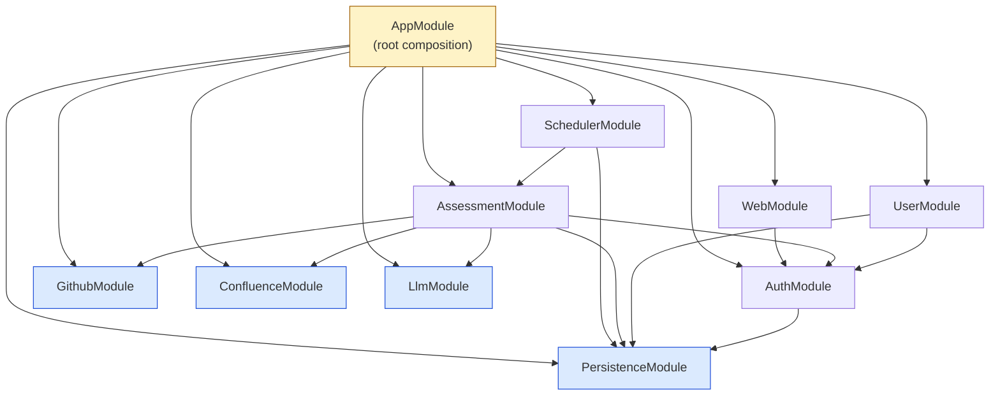

# Module view

> **본 문서는 P1 T-A4 의 산출물이다. [T-0017](../tasks/T-0017-t-a4-module-view.md) 가 NestJS 8 module 분해 + 의존성 acyclic 검증 + components ↔ modules N:N mapping 을 박제했다. 본 task 머지로 Phase P1 (Architecture / MVA) 가 전체 완료된다.**

## 개요

본 문서는 Assessment-Agent 의 **module view** — [components.md](components.md) (T-A3) 가 박제한 8 component 의 논리적 분해도를 **NestJS module class** 단위로 mapping 하고, module 간 **import 의존성 방향이 acyclic** 임을 박제한다. NestJS 는 [ADR-0001](../decisions/ADR-0001-stack.md) 의 결정대로 `@Module` decorator + DI container 를 통해 application 을 module 단위로 조립하므로, module 분할은 곧 디렉토리 구조 (`src/<domain>/<domain>.module.ts`) 와 service 책임 경계를 동시에 박제하는 결정이다.

본 문서는 [docs/architecture/INDEX.md](INDEX.md) 의 **MVA 원칙** 에 따라 작성됐다 — module 분해 + 각 module 의 **책임 1~2 줄 + 주요 의존성 + 관련 component + 관련 REQ** 까지만 박제하며, **구체 service class / 메서드 시그니처 / controller endpoint / @Cron handler 본문 등은 본 문서의 범위 밖** 이다. 그 구체화는 다음 task 들의 책임:

- **P2 Use case decomposition** — 각 use case 가 본 문서의 어느 module 을 거치는지 sequence diagram / 텍스트로 표현.
- **P2 [directory.md](INDEX.md)** — 본 문서의 module 분할을 그대로 NestJS 표준 디렉토리 구조 (`src/<module>/<module>.module.ts`) 로 mapping.
- **P3 Persistence / Auth / Domain core** — AssessmentModule / UserModule / AuthModule / PersistenceModule 의 구체 service / controller class.
- **P4 External integrations** — GithubModule / ConfluenceModule / LlmModule 의 구체 adapter class.
- **P7 Scheduling & ops** — SchedulerModule 의 구체 `@Cron` handler.
- **P6 Web UI** — WebModule (또는 별도 패키지로 분리된 frontend) 의 책임 구체화.

본 문서는 **living document** — 후속 phase 에서 module 의 크기가 비대해지거나 sub-module 분할이 필요해지면 ADR 신설과 함께 본 문서를 갱신한다.

## Deployment 컨텍스트

본 문서의 **모든 8 module 은 동일 NestJS process (단일 AppModule 의 imports) 에 등록된다** — [ADR-0003 §1 — Monolithic NestJS process](../decisions/ADR-0003-deployment.md) 가 박제한 결정이다. module 간 경계는 **DI container 내부의 provider visibility 경계** 이지 process 경계가 아니다. module 간 호출은 NestJS DI 가 주입한 service 의 in-process method call 이 default 이며, 외부 시스템 (GitHub / Confluence / LLM provider / DB) 만 HTTPS 또는 DB protocol 경계를 넘는다.

[ADR-0002 (PostgreSQL + Prisma)](../decisions/ADR-0002-db.md) 는 PersistenceModule 의 기술 선택을 박제했고, [ADR-0003 §3 (`@nestjs/schedule` in-process)](../decisions/ADR-0003-deployment.md) 는 SchedulerModule 의 메커니즘을 박제했다.

## Module 목록

본 시스템은 다음 8 NestJS module 로 분해된다. 각 module 의 책임은 1~2 줄로 한정하며, 구체 service class / endpoint URL / Prisma model name 등은 P3+ 의 범위.

| module | 책임 | 주요 dependency (imports) | 관련 component (T-A3) | 관련 REQ | 관련 ADR |
| --- | --- | --- | --- | --- | --- |
| **AuthModule** | 인증 / RBAC / 3 권한 등급 (SuperAdmin / Admin / User). JWT 또는 session cookie 발급·검증, role guard 제공. 다른 module 의 controller 는 본 module 의 guard 를 import 하여 RBAC 적용. | PersistenceModule (사용자·역할 read) | Backend API (auth 부분) | REQ-043 (ID/Password), REQ-044 (3 권한) | ADR-0001 (NestJS guard) |
| **PersistenceModule** | Prisma client + repository pattern 의 단일 진입 module. PrismaService 를 global provider 로 export — 모든 domain module 이 본 module 을 import 하여 DB 접근. raw 본문 컬럼 미정의 (schema 차원에서 REQ-032 강제). | (없음 — leaf module, 외부 PostgreSQL TCP 연결만) | DB Persistence | REQ-029 (non-volatile), REQ-031 (재수집 unique), REQ-032 (raw 저장 금지), REQ-033 (commit/문서 단위) | ADR-0002 (PostgreSQL + Prisma), ADR-0003 §1 (단일 DB) |
| **UserModule** | 시스템 로그인 user 계정 + 등급 (SuperAdmin / Admin / User) 의 service / controller. UserRepository (T-0080 박제) + UserService.changeRole (T-0086 박제 — REQ-044 5 invariant) + UserService.signup (T-0092 박제 — countAll === 0 → SuperAdmin 자동 / bcrypt 10 rounds / P2002 → 409 4 invariant) + UserController PATCH /api/users/:id/role (T-0087 박제 — RBAC 첫 production 사용 사례) + UserController POST /api/users (T-0092 박제 — Public tier signup endpoint + REQ-044 후반 첫 로긴 SuperAdmin backbone) + UserResponseDto (T-0095 박제 — 응답 shape whitelist DTO, private constructor + `fromEntity` static factory + 5 readonly 필드 `id` / `email` / `role` / `createdAt` / `updatedAt` — POST signup + PATCH changeRole 두 endpoint 응답 매핑 동일 박제, `hashedPassword` 응답 누출 차단 application-layer last-mile). AuthService inject via forwardRef (T-0092 박제 — AuthModule↔UserModule circular 해결). 평가 대상 인원 (Person / Group / Part) 은 별도 PersonModule / GroupModule / PartModule 책임 (모듈 분리 박제 — T-0035 + T-0039 chain). password reset / list / fromEntities 배열 helper (GET /api/users list endpoint 박제 시점) / ClassSerializerInterceptor 도입 ADR 등 후속 endpoint chain 은 follow-up task. | PersistenceModule, AuthModule | Backend API (user 부분) | REQ-043 (ID/Password), REQ-044 (3 등급 + SuperAdmin 만 Admin→User + self-demote 금지), REQ-045 (mutation Admin+), REQ-046 (read User+) | ADR-0001 (NestJS), ADR-0008 (Auth credential — JWT cookie) |
| **GithubModule** | 3 GitHub instance (github.com / github.sec.samsung.net / github.ecodesamsung.com) 의 통합 adapter — 단일 `GithubAdapter` service + instance key sub-config 로 라우팅 ([components.md](components.md) "GitHub Adapter — 3 instance 묶음 결정" 참조). 4xx catch → PermissionDeniedEvent emit. | (없음 — adapter leaf, 외부 GitHub HTTPS 만) | GitHub Adapter | REQ-005 (github.com), REQ-006 (github.sec), REQ-007 (github.ecode), REQ-008 (권한 통지), REQ-014 (Issue) | ADR-0003 §4 (direct egress) |
| **ConfluenceModule** | Confluence 사내 인스턴스의 SPACE list / page list / page version 조회 adapter. crawling vs hierarchy 정책은 P4 ADR. 4xx catch → PermissionDeniedEvent emit. | (없음 — adapter leaf, 외부 Confluence HTTPS 만) | Confluence Adapter | REQ-015 (Confluence 지정 SPACE), REQ-016 (권한 통지), REQ-017 (crawling vs hierarchy) | ADR-0003 §4 |
| **LlmModule** | 5 provider (custom / Azure OpenAI / Anthropic / Google Gemini / OpenAI) 의 단일 추상화 gateway. Admin 이 지정한 model 식별자를 provider 별 HTTP client 로 라우팅. 평가 파이프라인은 본 module 만 호출 — provider API 차이 은닉. **milestone-1 구현 박제**: `LlmGateway` interface + `LlmProvider` enum 5 값 (azure_openai / custom / openai / anthropic / google_gemini, T-0135) + `LlmHttpGateway` orchestration service (`implements LlmGateway`, T-0156 — config lookup → `LlmApiKeyCipher` decrypt → provider 별 adapter build/parse dispatch → 주입 fetch → `LlmGenerateResult`; config id 는 난이도 기반 routing 으로 결정 — `options.difficulty` 제공 시 `DifficultyMappingService.resolveModel(difficulty)` 로 난이도 슬롯의 `configId` 를 해석해 그 config 를 조회하고, 미제공 시 종전대로 `options.modelId` 직접 사용, T-0165 / PR-153) + 5 provider adapter 순수 함수 (`src/llm/providers/{azure-openai,openai-compatible,anthropic,google-gemini}.adapter.ts`, T-0155 / T-0157 / T-0159 / T-0161) + routing dispatch (T-0158 azure·custom·openai / T-0160 anthropic / T-0162 google_gemini) + `LlmApiKeyCipher` (AES-256-GCM envelope encrypt-at-rest, T-0147) + write CRUD controller (`LlmProviderConfigController` POST / PATCH / DELETE `/api/llm/providers`, Admin+ RBAC, T-0149 / T-0151 / T-0150). 현 상태는 실 `globalThis.fetch` transport 배선 + 로컬 stub HTTP round-trip smoke (`test/smoke/llm-gateway-roundtrip.smoke-spec.ts`, T-0168 / PR-155 — 헤더 직렬화·URL 조립·non-2xx 실수신을 end-to-end closeout) 까지 완료 — **잔여 = live endpoint + 실 credential (`LLM_APIKEY_ENC_KEY` + provider API key env 주입) 통합 만 §5 HITL 게이트로 deferred** (Q-0016 option A). | (없음 — gateway leaf, 외부 LLM HTTPS 만) | LLM Gateway | REQ-049 (Admin 모델 지정), REQ-051~055 (5 provider), REQ-097 (난이도별 모델 라우팅) | ADR-0003 §4 |
| **AssessmentModule** | 평가 orchestration — commit / 문서 / Confluence page 평가 파이프라인 service + 결과 조회·sort·filter·시계열 controller. Worker 책임을 본 module 의 service layer 로 흡수 (monolithic 결정). manual trigger endpoint 도 본 module 이 제공. | PersistenceModule, AuthModule, GithubModule, ConfluenceModule, LlmModule | Backend API (assessment 부분), Worker | REQ-038 (조회/sort/filter/시계열), REQ-040 (manual trigger), REQ-049 (LLM 사용) | ADR-0003 §1 (monolithic) |
| **SchedulerModule** | `@nestjs/schedule` 기반 in-process cron + dynamic registry. Admin 이 설정한 cron 표현식을 DB 에서 load 하여 SchedulerRegistry 에 등록, 시각 도달 시 AssessmentModule 의 평가 service 메서드를 호출. manual trigger 는 AssessmentModule 의 controller 가 동일 메서드 호출 — duplication 0. | PersistenceModule (cron 설정 load), AssessmentModule (trigger 대상) | Scheduler | REQ-039 (Admin cron 주기), REQ-040 (manual trigger) | ADR-0003 §3 (`@nestjs/schedule`) |
| **WebModule** | Frontend SPA 정적 자산 serve + (선택적) backend-side rendering 진입점. SPA 자체의 framework (React / Vue / Vite) 선택은 P6 ADR. 본 module 은 정적 파일 hosting 만 책임 — Web UI component 의 backend-side proxy. frontend 가 별도 패키지 (`web/`) 로 분리되면 본 module 은 제거되거나 reverse-proxy 역할만 유지. | AuthModule (정적 자산 접근 권한 — 필요 시) | Web UI | REQ-038 (UI), REQ-044 (3 등급 로그인 UI), REQ-049 (Admin LLM 설정 UI) | ADR-0001 |

위 8 module 은 `AppModule` (root) 의 `imports: [...]` 에 등록되며, AppModule 자체는 root composition 외에 책임을 갖지 않는다.

## 의존성 그래프 (mermaid)

NestJS `@Module({ imports: [...] })` 의 화살표 방향 — A → B 는 "A 가 B 를 import 한다 (즉 A 가 B 의 provider 를 사용)" 를 의미.



다이어그램 표기:

- **노란 박스 (`AppModule`)** — root composition. 직접적 책임은 없고 8 module 을 `imports` 로 묶기만 함.
- **파란 박스 (leaf modules)** — `PersistenceModule` / `GithubModule` / `ConfluenceModule` / `LlmModule`. 내부 module 을 import 하지 않는다. 외부 시스템 (PostgreSQL / GitHub / Confluence / LLM provider) 만 호출.
- **회색 박스 (domain modules)** — `AssessmentModule` / `UserModule` / `AuthModule` / `SchedulerModule` / `WebModule`. 다른 module 의 provider 를 사용.
- 화살표 방향 = `imports` 방향. cycle 0 (아래 acyclic 검증 참조).

## Acyclic 검증

### Topological order

다음 순서로 module 을 임포트 / 인스턴스화할 수 있다 (각 module 의 모든 의존성이 이미 인스턴스화된 상태에서 본인 인스턴스화 가능):

```
PersistenceModule
  → AuthModule
  → GithubModule, ConfluenceModule, LlmModule   (서로 독립, parallel)
  → UserModule, WebModule                       (Persistence + Auth 만 의존)
  → AssessmentModule                            (Persistence + Auth + 3 adapter)
  → SchedulerModule                             (Persistence + Assessment)
  → AppModule                                   (위 8 module 모두 imports)
```

위 순서가 존재한다는 사실 자체가 **dependency graph 가 DAG (cycle 0)** 임을 의미한다.

### "어떤 module 이 어떤 module 을 import 하지 않는가"

cycle 회피의 핵심 제약 — 다음 import 방향은 **금지**:

| 잘못된 방향 | 이유 |
| --- | --- |
| `PersistenceModule → *` | Persistence 는 leaf. domain logic 을 모름. |
| `GithubModule → *` (다른 internal module) | adapter leaf. domain logic 모름. |
| `ConfluenceModule → *` (다른 internal module) | adapter leaf. domain logic 모름. |
| `LlmModule → *` (다른 internal module) | adapter leaf. domain logic 모름. |
| `AuthModule → UserModule` | Auth 는 사용자 데이터 read 만 (PersistenceModule 경유). UserModule 의 CRUD service 를 호출하면 cycle (User → Auth → User). |
| `AuthModule → AssessmentModule` | Auth 는 평가 결과를 모름. AssessmentModule 이 guard 를 사용하는 단방향만. |
| `AssessmentModule → SchedulerModule` | Scheduler 는 trigger 측. Assessment 는 호출당하는 측. 반대 방향 (Scheduler → Assessment) 만 허용. |
| `UserModule → AssessmentModule` | User 는 메타데이터. 평가 결과를 모름. |
| `WebModule → AssessmentModule` 또는 `WebModule → UserModule` | WebModule 은 정적 자산 hosting 만. 평가·사용자 API 는 직접 노출되어 (각 module 의 controller) frontend SPA 가 HTTP 로 호출. WebModule 이 backend service 를 import 할 이유 없음. |

위 금지 조항이 코드 리뷰 시점에 자동으로 강제되는 방법은 **NestJS DI container 가 cycle 을 runtime 에 발견하면 에러를 던지는** 동작이다 (e.g. `forwardRef` 강제 또는 `Circular dependency between ...` 메시지). 추가로 P2+ 에서 `madge` 또는 `eslint-plugin-boundaries` 같은 정적 검사를 CI 에 도입할 가능성이 있으나, 본 task 의 범위 밖.

### Cycle 발견 시 대응 정책

본 task 시점에는 cycle 0 이지만, 후속 phase 에서 새 기능이 module 의존성을 추가할 때 cycle 이 생기면 다음 중 하나를 적용:

1. **Shared module 도입** — 두 module 이 공유하는 추상 (예: 공통 DTO / 이벤트 emitter) 을 별도 module 로 추출하고 양쪽이 그 module 만 import. NestJS 표준 패턴.
2. **Dependency direction 재배치** — 의존 방향을 한쪽으로만 통일 (예: A → B 와 B → A 가 동시에 필요하면, B → A 를 event emit 으로 전환하여 A 만 listen).
3. **forwardRef 사용 회피** — NestJS 의 `forwardRef` 는 가능하지만, 본 정책 상 **회피** (cycle 의 코드 냄새를 가리기 때문). cycle 발견 시 1 또는 2 로 해소.

이 정책은 본 문서의 living-document 갱신 대상 — 실제 cycle 이 발생하면 그 해소 결정을 ADR-0004+ 로 박제 가능.

## Components ↔ Modules mapping

[T-0016](../tasks/T-0016-t-a3-component-view.md) 의 8 component 와 본 task 의 8 module 의 N:N mapping. 1 component 가 여러 module 에 분산되거나 여러 component 가 1 module 에 집약되는 경우를 모두 명시.

| component (T-A3) | mapping module (T-A4) | 비고 |
| --- | --- | --- |
| **Web UI** | WebModule | 1:1. WebModule 이 정적 자산 hosting / 진입점. SPA framework 자체는 P6 ADR. frontend 가 별도 `web/` 패키지로 분리되면 WebModule 은 reverse-proxy 역할만 남거나 제거 가능. |
| **Backend API** | AssessmentModule + UserModule + AuthModule | 1:N. 단일 component 가 3 module 로 분할 — controller 책임이 domain (assessment / user / auth) 별로 분산되기 때문. 각 module 의 controller 가 자신의 endpoint 를 노출하며, AppModule 이 모두 묶어 단일 HTTP server 로 동작. |
| **Worker** (평가 파이프라인) | AssessmentModule (의 service layer) | N:1. ADR-0003 §1 monolithic 결정에 따라 Worker 는 별도 module 이 아니라 AssessmentModule 의 service layer 로 흡수. 향후 worker 가 별도 process 로 분리되면 (별도 ADR) 본 mapping 갱신. |
| **DB Persistence** | PersistenceModule | 1:1. PersistenceModule 이 PrismaService 를 global provider 로 export — 모든 domain module 이 본 module 만 import 하면 PrismaService 주입 가능. 별도 module 채택 근거 아래 sub-section 참조. |
| **LLM Gateway** | LlmModule | 1:1. 5 provider 추상화 service 1 개 — `LlmHttpGateway` (`implements LlmGateway`, T-0156, milestone-1 박제). |
| **GitHub Adapter** | GithubModule | 1:1. components.md 의 "GitHub Adapter — 3 instance 묶음 결정" 에 따라 단일 module + instance sub-config. |
| **Confluence Adapter** | ConfluenceModule | 1:1. |
| **Scheduler** | SchedulerModule | 1:1. `@nestjs/schedule` + dynamic registry. |

총 8 component → 8 module 의 N:N mapping. Backend API component 의 1:3 분할이 유일한 분기점이며, 나머지 7 component 는 1:1 mapping.

### DB Persistence 의 module 분리 결정 (인라인 박제)

본 task 의 architect 결정 — **별도 `PersistenceModule` 채택 (옵션 a)**.

**채택: (a) 별도 `PersistenceModule` + `@Global()` decorator + PrismaService export**.

- 구조: `PersistenceModule` 1 module 이 `PrismaService` 1 provider 를 보유. `@Global()` decorator 로 모든 module 에서 import 없이 주입 가능 — 또는 명시적 import (선호) 도 가능. 모든 domain module (Assessment / User / Auth / Scheduler) 이 본 module 의 PrismaService 를 통해 DB 접근.

**근거**:

1. **DI 경계 명확** — DB 접근이 단일 module 의 책임으로 응집. raw query / migration handle / connection pool 설정이 한 곳.
2. **테스트 격리 용이** — unit test 에서 PersistenceModule 만 mock 으로 교체하면 모든 domain module 의 DB 접근이 차단 가능.
3. **future-proof** — 향후 Prisma 외 ORM (또는 추가 raw query handle) 도입 시 본 module 내부 교체만으로 가능.
4. **NestJS 공식 권장 패턴** — `@nestjs/prisma` 또는 nestjs.com 가이드의 표준.

**Alternatives 검토 — (b) 각 domain module 이 PrismaService provider 직접 보유**:

- 장점: module 간 의존성 그래프에서 PersistenceModule 노드 1 개 제거 — 그래프 단순화.
- 단점: PrismaService 가 N 개 module 에 복제되어 connection pool 이 N 개 생성될 위험. 또는 manually singleton 관리 필요 — 복잡.
- **미채택**. (a) 의 응집도 이점이 더 큼.

ADR 신설 불필요 — module 분해 수준의 결정이고 외부 dependency / 운영 토폴로지 / 데이터 모델에 영향 없음. 본 문서 인라인 박제로 충분. 후속 phase 에서 의미 있는 ORM 교체 또는 multi-DB 도입 시 ADR-0004+ 신설.

## WebModule 의 향후 분리 가능성

본 task 시점에서는 frontend (Web UI component) 가 NestJS process 안의 `WebModule` 로 표현되어 있지만, P6 (Web UI) 진입 시 다음 중 하나로 진화할 가능성:

1. **별도 `web/` 패키지** — Vite / Next.js 빌드 산출물을 별도 정적 호스팅 (예: nginx, CDN, GitHub Pages) — NestJS 는 API only. `WebModule` 제거.
2. **NestJS 내부 정적 자산 serve** — `@nestjs/serve-static` 으로 빌드된 SPA 를 `WebModule` 에서 serve. 현재 default 가정.

선택 시점에 ADR-0004+ 신설하고 본 문서 갱신. 본 task 는 옵션 2 를 default 로 두되, 옵션 1 로 전환 가능성을 본 단락에 박제.

## References

- [ADR-0001 — Backend / language / package manager / test / CI 스택](../decisions/ADR-0001-stack.md) — NestJS `@Module` decorator + DI container 가 본 module 분할의 기반.
- [ADR-0002 — Persistence DB / ORM 선택](../decisions/ADR-0002-db.md) — PersistenceModule 의 기술 선택 (PostgreSQL + Prisma).
- [ADR-0003 — Deployment 토폴로지 4 결정](../decisions/ADR-0003-deployment.md) — 8 module 의 단일 process 결합 (§1) / SchedulerModule 의 `@nestjs/schedule` 메커니즘 (§3) / 외부 adapter module 의 direct egress (§4).
- [docs/architecture/components.md](components.md) — T-A3 산출물. 본 문서의 mapping 출처.
- [docs/architecture/deployment.md](deployment.md) — T-A2 산출물. 본 module 들이 동작하는 운영 토폴로지.
- [docs/architecture/INDEX.md](INDEX.md) — architecture document 인덱스 + MVA 원칙.
- [docs/requirements.md](../requirements.md) — REQ-NNN source of truth. 본 문서의 모든 REQ 인용 출처.
- [README.md](../../README.md) — L7–18 (REQ-005~007 GitHub) / L19–22 (REQ-044 3 권한) / L33–41 (REQ-015 Confluence) / L45–51 (REQ-026 인원) / L68–71 (REQ-038 UI) / L96–103 (REQ-049 / REQ-051~055 LLM) / L109–128 (REQ-039 cron, REQ-044 RBAC).

Refs: T-0017, T-0016, T-0015, T-0014, ADR-0001, ADR-0002, ADR-0003, REQ-005, REQ-006, REQ-007, REQ-015, REQ-026, REQ-038, REQ-039, REQ-044, REQ-049, REQ-051, REQ-052, REQ-053, REQ-054, REQ-055
