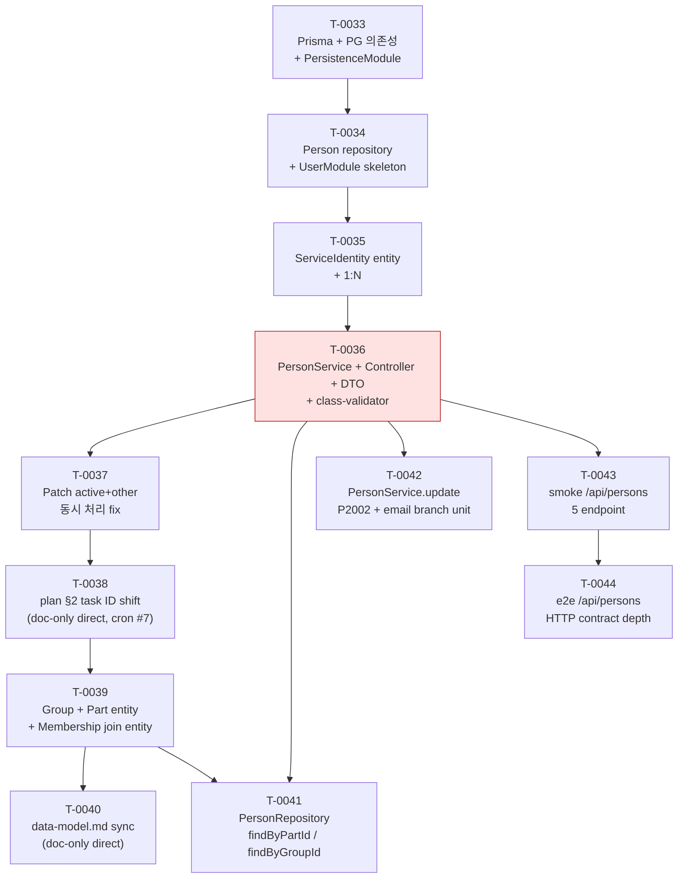

# P3 Implementation plan

> **본 문서는 Phase P3 (Domain core) 의 entry artifact ([T-0032](../tasks/T-0032-p3-entry-implementation-plan.md)) 의 산출물이다.** [docs/PLAN.md](../PLAN.md) Phase P3 의 **10 bullet (L51–60) 을 원안 8 개의 T-NNNN task (T-0033 ~ T-0040) 시퀀스로 사전 매핑** 했으나, 실제 진행 중 (a) T-0034 의 entity 부분이 T-0034 (Person+UserModule) + T-0035 (ServiceIdentity 1:N) 로 자연 split, (b) PersonService+Controller+DTO 가 별도 T-0036 으로 추가 진입, (c) T-0037 patch 가 confirmed gap 보강으로 추가, (d) T-0038 이 plan §2 doc-shift task 로 소비되고 실 entity backbone 이 T-0039 로 자연 shift, (e) T-0040 data-model.md sync / T-0041 PersonRepository 확장 / T-0042 unit branch / T-0043 smoke / T-0044 e2e 의 5 task 가 추가 진입하여 **실제 시퀀스는 12 task (T-0033 ~ T-0044) 로 expand, 본 §2 표 정합성 회복은 T-0045 책임**. P3 의 모든 후속 task 는 본 문서를 reference 하여 (a) 누적 의존성 (b) ADR 신설 필요 시점 (c) 인간 승인 게이트 발화 시점 (d) entity / module 책임 분배의 일관성을 확보한다. **본 문서는 doc-only planning artifact** — 실제 코드 변경 · `pnpm add` · Prisma schema 작성 · NestJS module 구현은 본 task 에서 하지 **않으며**, T-0033+ 의 책임이다. 본 task 머지로 **Phase P2 → P3 phase 전이 entry marker** 박제.

## 1. 개요

본 문서의 범위는 [docs/architecture/INDEX.md](INDEX.md) 의 **MVA (Minimum Viable Architecture)** 원칙에 따라 **task 시퀀스 매핑만** 박제한다 — task ID / 책임 / 대응 PLAN bullet / dependsOn / ADR 필요 여부 / 인간 승인 게이트 / estimated LOC / 책임 module 8 컬럼 표 + 의존성 graph (mermaid) + ADR 신설 후보 list + Out of scope + References 까지. **구체 Prisma schema 코드 · NestJS module class · `pnpm add` 실행 · migration SQL 은 본 문서의 범위 밖** ([§ 7](#7-out-of-scope) 참조). 그 구체화는 T-0033+ 의 코드 task 의 책임이다.

본 문서의 기반:

- [docs/PLAN.md](../PLAN.md) Phase P3 단락 (L47–60) — **본 문서의 1차 source**. 10 bullet 의 매핑 대상.
- [docs/architecture/data-model.md](data-model.md) — T-0031 산출물. 11 정식 entity + 1 conceptual mention (AuditLog — schema 박제 deferred) 의 책임 / 책임 module / 관계 inventory. 본 문서의 task row 의 entity scope 와 책임 module 컬럼의 source.
- [docs/architecture/modules.md](modules.md) — T-A4 산출물. 9 NestJS module (8 application + PersistenceModule) 의 이름 / 책임 / 의존성. 본 문서의 "책임 module" 컬럼 값의 source.
- [docs/architecture/directory.md](directory.md) — T-0021 산출물. `src/<module>/` layout. 본 문서가 박제할 후속 task 들이 어느 디렉토리에 코드를 추가할지의 source.
- [docs/decisions/ADR-0002-db.md](../decisions/ADR-0002-db.md) — **본 문서의 핵심 reference**. PostgreSQL + Prisma 결정 ACCEPTED. T-0033 의 `pnpm add prisma @prisma/client pg` 가 본 ADR 의 "범위 밖 (deferred)" 단락에서 명시한 인간 승인 게이트 대상.
- [docs/decisions/ADR-0003-deployment.md](../decisions/ADR-0003-deployment.md) — Monolith / 단일 DB 인스턴스. 본 task 시퀀스가 multi-DB 또는 microservice 로 빠지지 않도록.
- [CLAUDE.md](../../CLAUDE.md) §3.1 (commitMode 정책) / §3.2 (Test·CI R-110~R-114) / §5 (HITL — 새 외부 dependency 추가는 BLOCKED) — 본 task 시퀀스 표의 "인간 승인 게이트" 컬럼의 source.

## 2. P3 task 시퀀스 표

P3 진행 중 실제 머지된 **12 T-NNNN task (T-0033 ~ T-0044)** 박제. 원안 8 (T-0033 ~ T-0040) 위에 (a) T-0035 ServiceIdentity split, (b) T-0036 PersonService, (c) T-0037 patch, (d) T-0038 plan §2 doc-shift, (e) T-0040 data-model.md sync, (f) T-0041 PersonRepository 확장, (g) T-0042 unit branch / T-0043 smoke / T-0044 e2e 의 test-quality 3 bullet 진입 7 신규 row 박제. 각 row 의 estimated LOC ≤ 300 / 변경 파일 ≤ 5 ([CLAUDE.md §3](../../CLAUDE.md) cap discipline) 검산. 초과 예상 시 architect 가 후속 호출에서 split.

| task ID | 책임 | 대응 PLAN bullet ([PLAN.md](../PLAN.md)) | dependsOn | ADR 필요 여부 | 인간 승인 게이트 | est LOC | 책임 module | status (mergeCommit) |
| --- | --- | --- | --- | --- | --- | --- | --- | --- |
| **T-0033** | Prisma + `pg` driver 의존성 추가 (`pnpm add prisma @prisma/client pg`) + ADR-0002 status 재확인 / 보강 ADR 검토 + `prisma/schema.prisma` skeleton (Person 1 entity 최소) + PrismaService 작성 + PersistenceModule skeleton (`@Global()` provider export) + Docker compose PostgreSQL 16 skeleton | Persistence layer (L58) | T-0032 | ADR-0002 status 재확인 (필요 시 보강 ADR — Prisma version / `pg` driver version 박제) | **있음 — 새 외부 dependency 3 종 추가 ([CLAUDE.md §5](../../CLAUDE.md) BLOCKED 게이트 의도적 발화, HQ-0004)** | ~280 | PersistenceModule | DONE |
| **T-0034** | Person entity Prisma model + Person repository + UserModule skeleton + 첫 migration. ServiceIdentity 는 T-0035 로 split out, PersonService/Controller/DTO 는 T-0036. | 인원 관리 (L51) | T-0033 | 없음 (data-model.md §2/§3 의 entity / 관계 기반, 결정 추가 없음) | 없음 | ~290 | UserModule | DONE |
| **T-0035** | ServiceIdentity entity Prisma model + ServiceIdentityRepository + Person↔ServiceIdentity 1:N + 두 번째 migration | 서비스 ID 매핑 (L52) + Primary key 역할 ID (L53) | T-0034 | 없음 | 없음 | ~180 | UserModule | DONE |
| **T-0036** | PersonService + PersonController + Person DTO + class-validator + class-transformer 도입 + REQ-026/REQ-027 active soft delete invariant service layer 강제 | 인원 관리 (L51) + User read-only 권한 일부 (L60) | T-0034 | 없음 (HQ-0005 사용자 결정으로 class-validator stack 도입, 후속 ADR 박제 후보지만 본 task scope 외) | **있음 — HQ-0005 (class-validator + class-transformer 2 패키지 추가) 발화 후 사용자 (a) standard-class-validator-stack 결정 처리 완료** | ~280 | UserModule | DONE |
| **T-0037** | PATCH /api/persons/:id 의 active+other 동시 처리 semantics fix (T-0036 MAJOR-2 confirmed gap patch) | 인원 관리 (L51) — REQ-026/REQ-027 active semantic 보강 | T-0036 | 없음 | 없음 | ~140 | UserModule | DONE |
| **T-0038** | p3-implementation-plan.md §2 task ID shift 정정 (doc-only direct, cron #7 — T-0033 ~ T-0037 실 머지 결과를 §2 표에 박제하고 후속 row 의 한 자리 shift 정렬) | (cross-cutting doc 정합성 회복 — PLAN bullet level 영향 0) | T-0037 | 없음 (doc-only direct, 결정 추가 없음) | 없음 | ~95 (실 +54/-41) | (doc-only — module 영향 0) | DONE (e8e6e7e) |
| **T-0039** | Group + Part entity Prisma model + GroupRepository + PartRepository + PersonGroupMembership join entity + UserModule wiring (Service/Controller/DTO 는 후속 task) | Group 정책 (L54) | T-0038 | 없음 | 없음 | ~280 | UserModule | DONE (c25a5de, PR-37) |
| **T-0040** | data-model.md 갱신 — Group / Part / PersonGroupMembership entity 박제 (T-0039 reviewer MINOR follow-up, doc-only direct) | (cross-cutting doc 정합성 회복 — Group 정책 L54 의 data-model.md mirror) | T-0039 | 없음 (doc-only direct) | 없음 | ~120 | (doc-only — module 영향 0) | DONE (a41c036) |
| **T-0041** | PersonRepository 확장 — `findByPartId(partId)` + `findByGroupId(groupId)` (GroupService/PartService backbone 의 repository-layer prerequisite) | 인원 관리 (L51) — Group 소속 list / Part 소속 list 의 service-layer 진입 직전 repository extension | T-0039 | 없음 | 없음 | ~180 | UserModule | DONE (4cd302f, PR-38) |
| **T-0042** | [테스트 품질] PersonService.update P2002 + patch.email undefined branch unit test (R-112 negative case 충분 cover 의무 이행, 96.66% → 100% branch coverage) | [PLAN.md L63](../PLAN.md) unit branch coverage 100% 달성 | T-0036 | 없음 | 없음 | ~90 | UserModule (test-only) | DONE (20ef2c5, PR-39) |
| **T-0043** | [테스트 품질] smoke /api/persons CRUD 5 endpoint bootstrap smoke 확장 (R-113 smoke 의무 이행, mock-DB Test.overrideProvider 패턴) | [PLAN.md L64](../PLAN.md) smoke domain endpoint 확장 | T-0036 | 없음 | 없음 | ~180 | UserModule (test-only) | DONE (e7bb95a, PR-40) |
| **T-0044** | [테스트 품질] e2e /api/persons HTTP contract depth (status + DTO body shape + 4xx envelope) e2e-spec 확장 (R-113 e2e 의무 이행) | [PLAN.md L65](../PLAN.md) e2e domain endpoint 확장 | T-0043 | 없음 | 없음 | ~200 | UserModule (test-only) | DONE (2b9131d, PR-41) |

**합계**: **12 task (T-0033 ~ T-0044) / 1 module (UserModule, PersistenceModule wiring 포함) / 5 PLAN bullet cover** ([PLAN.md](../PLAN.md) L51 인원 관리 / L52 서비스 ID / L53 primary ID / L54 Group 정책 / L63-65 test-quality 3 bullet) **+ 5 PLAN bullet 미진행** (L55 평가 결과 저장 모델 / L56 raw 미저장 / L57 상대 비교 가능 데이터 구조 / L59 Auth/RBAC / L60 User read-only). P3 가 모듈 1 개 (UserModule) 안에 집중되어 있으며 AuthModule / AssessmentModule / LlmModule 은 미진행 — 후속 backbone task (T-0046+) 책임.

**Cap discipline 검산**: 모든 머지 row 의 실 LOC ≤ 300 / 변경 파일 ≤ 5 ([CLAUDE.md §3](../../CLAUDE.md)) 위반 0. **임계 task (T-0034 / T-0036 / T-0039, ~280–290 LOC)** — 실제 진입 시 architect 가 **첫 read 직후 split 의무 평가** 수행. 실제 P3 진행 중 원안 T-0034 가 entity 부분과 service layer 부분으로 자연 split 되어 T-0034 (Person+UserModule) / T-0035 (ServiceIdentity) / T-0036 (PersonService) / T-0037 (patch) 4 task 로 expand 한 전례가 본 cap discipline 의 작동 증거. T-0039 도 원안 backbone 의 "entity + service-layer" 단일 task 가 entity-only (T-0039) + repository ext (T-0041) + service-layer (후속 T-0046+) 로 자연 split.

**dependency cap 검산**: T-0033 root → T-0034 → T-0035 (ServiceIdentity split) → T-0036 (PersonService) → T-0037 (patch) → T-0038 (doc-shift) → T-0039 (entity backbone) → T-0040 (doc-sync). T-0036 fan-out 으로 T-0041 (repository ext) / T-0042 (unit branch) / T-0043 (smoke) 진입, T-0043 → T-0044 (e2e). cycle 0 (§3 graph 참조).

**Cap discipline 검산 (실제 머지 order)**: T-0033 → T-0034 → T-0035 → T-0036 → T-0037 → T-0038 (doc-shift) → T-0039 (entity backbone) → T-0040 (doc-sync) → T-0041 (repository ext) → T-0042 (unit branch) → T-0043 (smoke) → T-0044 (e2e). backbone 의 자연 split (entity / repository / service-layer 의 3 단 분리) 과 test-quality 3 bullet 의 P3 mid-진입 (PLAN.md L63-65 의 사용자 명시 추가 후 진입) 박제.

## 3. 의존성 graph (mermaid)

**graph 해석**:

- **노란/빨강 박스 (T-0033)** — root + 인간 승인 게이트 (HQ-0004). P3 의 모든 후속 task 의 transitive prerequisite. CLAUDE.md §5 BLOCKED 게이트 의도적 발화 — 사용자 승인 후 진행.
- **빨강 박스 (T-0036)** — 인간 승인 게이트 (HQ-0005 class-validator + class-transformer 2 패키지 추가). 사용자 (a) standard-class-validator-stack 결정 후 진행.
- **회색 박스 (그 외)** — 정상 진행 task. P3 진행 중 ADR 신설 동반 task 0 (ADR-0004 auth credential / ADR-0005 cross-cutting / ADR-0006 LLM key / ADR-0007 audit log 의 4 후보 ADR 모두 후속 P3 또는 P4 task 책임으로 이연).
- **fan-out hub 재구성**: 원안 "T-0034 / T-0040 fan-out hub" 표기는 outdated. 실 fan-out hub 는 **T-0036 (PersonService)** — service-layer 위에서 T-0041 (repository ext) / T-0042 (unit branch) / T-0043 (smoke) / T-0044 (e2e via T-0043) 4 task 가 PersonService 의 spec / repository 확장 / test 차원에서 모두 fan-out. 인원 관리 backbone 의 직선 chain 은 T-0034 → T-0035 → T-0036 → T-0037 → T-0038 (doc-shift) → T-0039 (entity backbone) → T-0040 (doc-sync). T-0041 은 T-0036 (service-layer) + T-0039 (entity backbone) 의 합류 — Group/Part entity 없이 findByPartId/findByGroupId 가 의미 없으므로 dual-dependency.
- **cycle 0 검산** — Topological order: T-0033 → T-0034 → T-0035 → T-0036 → {T-0037 → T-0038 → T-0039 → {T-0040, T-0041}, T-0041, T-0042, T-0043 → T-0044}. cycle 없음. T-0041 의 두 incoming edge (T-0036 + T-0039) 는 union — T-0039 가 T-0036 후행이므로 transitive chain 자체는 깔끔.

## 4. ADR 신설 후보 list

본 task 는 ADR 을 신설하지 **않는다** — 후속 P3 task 가 신설할 ADR 의 candidate list 만 박제. 각 후보는 (a) 어느 task 가 책임 (b) 신설 사유 (c) source 명시.

| 후보 ADR | 책임 task | 신설 사유 | source |
| --- | --- | --- | --- |
| **ADR-0002 의존성 도입 보강** (직접 status 변경 아님 — ADR-0002 는 이미 ACCEPTED) | T-0033 (이미 완료) — NEEDS_RETROACTIVE_REVIEW | ADR-0002 는 conceptual 결정만 박제 (Prisma + PostgreSQL 채택). 실제 `pnpm add prisma @prisma/client pg` 진입 시점에 ad-hoc 처리되어 보강 ADR / inline 박제 모두 미실행. retroactive 박제 follow-up 후보 — 별도 doc-only direct task 책임. | [ADR-0002 §"범위 밖 (deferred)"](../decisions/ADR-0002-db.md) ("실제 `prisma` / `@prisma/client` 패키지 도입 — CLAUDE.md §5 BLOCKED 룰. P3 진입 시 별도 task.") |
| **ADR-0004 — Auth credential type (JWT vs session cookie)** | 미진행 후속 task (T-0046+ 후보 — User+AuthModule backbone 진입 task) | api.md §2 "Auth credential" 행이 "P3 AuthModule 도입 task 의 ADR 에서 택일 — 본 문서는 둘 다 허용 conceptual 박제". 후속 User+AuthModule entity backbone task 진입 시 택일 + ADR 박제. | [api.md §2](api.md) Protocol/host 표 |
| **ADR-0005 — Cross-cutting field policy** | 미진행 후속 task (T-0046+ 또는 P3 종료 직전 별도 task) | timezone (UTC vs KST) / soft delete entity 별 적용 표 / `createdBy` audit-source 박제. data-model.md §5 의 conceptual 박제를 schema-level 정책으로 격상. P3 진행된 5 entity (Person / ServiceIdentity / Group / Part / PersonGroupMembership) 의 cross-cutting field 가 ad-hoc 적용 중 — 후속 task 가 일괄 정책 박제. | [data-model.md §5](data-model.md) Cross-cutting field 단락 |
| **ADR-0006 (hook) — LLM API key encryption-at-rest** | P4 (LlmProviderConfig entity 진입 task 이후 별도 task) | LlmProviderConfig.apiKey 컬럼의 encryption mechanism (PostgreSQL `pgcrypto` / KMS / application-layer envelope encryption 등) 결정. P3 진행 중 LlmProviderConfig entity 자체가 미박제 — 후속 task 가 entity 박제 + 본 ADR 동반. | [data-model.md §7](data-model.md) "LLM API key 의 encryption-at-rest 구체 mechanism — 별도 보안 ADR" |
| **ADR-0007 (hook) — Audit log entity schema** | P3 끝 또는 P4 (별도 task) | data-model.md §2 의 conceptual mention "AuditLog" 의 구체 schema 박제. User mutation event (등급 변경 / 평가 삭제 / Import-Export) 의 영속화 정책. PermissionDeniedRecord 와 분리 entity. | [data-model.md §2](data-model.md) entity 표의 conceptual mention row |

**합계**: 5 후보 ADR — **0 개 P3 진행 중 신설** (실 진행 12 task 중 ADR 신설 0 — ADR-0002 보강 / ADR-0004 auth / ADR-0005 cross-cutting 의 3 P3 후보 모두 후속 task 로 이연), **3 개 P3 후속 신설 후보** (ADR-0002 보강 retroactive + ADR-0004 auth credential + ADR-0005 cross-cutting), **2 개 P4+ hook** (ADR-0006 LLM key encryption / ADR-0007 audit log schema). ADR 박제 progress 가 0/3 (P3 안 ADR 신설 부재) 인 사실 명시 — 후속 task 책임 강조. 본 task 는 후보 list 만 박제, 실제 신설은 각 책임 task 의 권한.

## 5. 인간 승인 게이트 (CLAUDE.md §5)

본 task 시퀀스 중 **T-0033 단일 task** 가 [CLAUDE.md §5](../../CLAUDE.md) 의 "새 외부 dependency 추가 BLOCKED 게이트" 를 의도적으로 발화한다 — `pnpm add prisma @prisma/client pg` 실행이 새 외부 패키지 3 종 추가.

**게이트 발화 절차** (T-0033 의 책임, 본 task 는 절차만 박제):

1. T-0033 의 executor 가 architect → implementer 호출 직전, 본 dependency 추가의 정당성을 STATE.json.humanQuestions 에 1 entry 로 박제 (정당성: ADR-0002 ACCEPTED + P3 진입 = persistence layer 필수).
2. STATUS=BLOCKED 반환 → notifier 호출 → 사용자 승인 대기.
3. 사용자 승인 후 다음 turn 의 driver 가 T-0033 을 재진입 → architect 가 ADR-0002 status 재확인 또는 보강 ADR 신설 → implementer 가 `pnpm add` 실행 + schema.prisma skeleton + PersistenceModule.
4. tester 가 `pnpm install` 후 `pnpm lint && pnpm build && pnpm test` 정합성 확인.

다른 P3 task (T-0034 / T-0035 / T-0037 / T-0038 / T-0039 / T-0040 / T-0041 / T-0042 / T-0043) 는 새 외부 dependency 추가 0 — 모두 T-0033 의 dependency 인프라 위에서 진행. 따라서 인간 승인 게이트 추가 발화 없음.

**T-0036 의 class-validator stack 도입** (HQ-0005) — 실제 P3 진행 중 발화한 게이트. PersonService + Controller + DTO 도입 시 `class-validator` + `class-transformer` 2 패키지 추가 필요 → STATE.json.humanQuestions 에 HQ-0005 박제 → 사용자 (a) standard-class-validator-stack 결정 → 정상 머지. plan §2 원안에는 미박제 (T-0036 자체가 원안에 없는 task 였으므로) — 본 갱신으로 박제.

**T-0039 의 auth credential 결정** 도 ADR 신설은 동반하나 (ADR-0004), 외부 dependency 추가는 아니므로 인간 승인 게이트 발화 안 함 — ADR-0004 자체가 reviewer 점검 대상이므로 PR review 단계에서 충분.

**T-0038 ~ T-0044 7 task 모두 새 외부 dependency 0 — HQ 발화 0**: T-0038 (doc-shift) / T-0039 (Group+Part entity) / T-0040 (data-model.md sync) / T-0041 (PersonRepository ext) / T-0042 (unit branch) / T-0043 (smoke) / T-0044 (e2e) 의 실 머지 7 task 모두 T-0033 의 dependency 인프라 (Prisma + pg) 와 T-0036 의 class-validator stack 위에서 진행되어 추가 외부 패키지 0. 게이트 inventory 의 completeness 박제 — P3 진행 중 HQ 발화는 HQ-0004 (T-0033) / HQ-0005 (T-0036) / HQ-0006 (T-0039 gh CLI 부재 stale BLOCKED) 3 건으로 종결.

## 6. P3 → P4 전이 조건

본 P3 task 시퀀스가 모두 머지되면 다음 조건이 충족되어 **Phase P3 complete** + Phase P4 entry 준비 완료. 현재 진행 상황 (12 task 머지 완료, 본 task 머지 시 13 task) 의 progress 박제:

- **entity Prisma model 박제 — progress 5/11** (T-0044 시점 기준):
  - **박제 완료 5 entity (45%)**: Person (T-0034) / ServiceIdentity (T-0035) / Group (T-0039) / Part (T-0039) / PersonGroupMembership (T-0039, join entity).
  - **미박제 6 entity**: User / Assessment / Contribution / Summary / LlmProviderConfig / DifficultyMapping / PermissionDeniedRecord (conceptual AuditLog 별도). 모두 후속 backbone task (T-0046+) 책임.
  - 11 entity 의 완성 시 data-model.md §2 의 inventory 와 일치. AuditLog 는 conceptual mention 으로 deferred (data-model.md 와 동일 입장 — actual schema 는 P3 외).
- **module skeleton 박제 — progress 2/5** (T-0044 시점 기준):
  - **박제 완료 2 module (40%)**: PersistenceModule (T-0033) / UserModule (T-0034 / T-0036).
  - **미박제 3 module**: AuthModule / AssessmentModule / LlmModule. 후속 task 책임.
  - 5 module 의 완성 시 modules.md 9 module 중 P3 scope 5 module 박제 완료. 나머지 4 module 은 P4+ 책임:
    - **외부 adapter 2**: GithubModule (`@octokit/rest` HTTP client), ConfluenceModule (Confluence REST API)
    - **In-process scheduler 1**: SchedulerModule (`@nestjs/schedule` cron — ADR-0003 §3)
    - **Web hosting 1**: WebModule (정적 자산 serve)
    - **LlmModule HTTP client 구현**: P3 의 LlmModule scaffold (후속 task) 는 provider abstraction interface 만, 실제 5 provider HTTP client 는 P4 책임
- **ADR 신설 — progress 0/3** (P3 안 ADR 신설 0): ADR-0002 의존성 도입 보강 / ADR-0004 auth credential / ADR-0005 cross-cutting field 의 3 후보 모두 후속 task 로 이연.
- **PLAN.md L63-65 P3 test-quality 3 bullet — progress 3/3 (100% closure)**:
  - **L63 unit branch coverage 100% closure (T-0042)** — PersonService.update P2002 + patch.email undefined branch unit (R-112 negative case 충분 cover 의무 이행, 96.66% → 100% branch coverage).
  - **L64 smoke domain endpoint 확장 closure (T-0043)** — smoke /api/persons CRUD 5 endpoint bootstrap smoke 확장 (R-113 smoke 의무 이행, mock-DB Test.overrideProvider 패턴).
  - **L65 e2e domain endpoint 확장 closure (T-0044)** — e2e /api/persons HTTP contract depth (status + DTO body shape + 4xx envelope) e2e-spec 확장 (R-113 e2e 의무 이행).
  - R-112 negative case 충분 cover + R-113 smoke/e2e 의무 모두 이행 — P3 의 test-quality 차원 완성 박제.
- **raw 미저장 invariant schema-level 강제 — pending**: Assessment / Contribution / Summary entity 자체가 P3 안에서 미박제 — 후속 task 진입 시 schema.prisma 에 raw body column 0 박제 + reviewer agent 의 PR diff `String` column 추가 자동 검출 강화.
- **P3 진행 중 task 시퀀스 expansion 박제** — 원안 8 task (T-0033 ~ T-0040) 가 실제 진행 중 다음 사유로 **12 task (T-0033 ~ T-0044)** 로 expand, 본 T-0045 머지 시 **13 task**:
  - **backbone task 의 자연 split**: T-0034 → entity split (Person + ServiceIdentity 2 task), T-0036 → service-layer 추가, T-0037 → active+other patch 추가, T-0040 → data-model.md doc-sync 추가, T-0041 → repository-layer 추가 (service-layer 진입 전 prerequisite).
  - **test-quality bullet 의 P3 mid-진입**: T-0042 ~ T-0044 (PLAN.md L63-65 bullet 의 사용자 명시 추가 후 진입).
  - 실제 P3 closure 시점에서 추가 한 자리 이상 shift 가능 — architect 의 cap 재평가 + planner split 결정 시 본 §2 표 재갱신.

P4 (External integrations) entry 의 첫 task 는 별도 planner task 가 결정 — 본 문서 scope 외. 후보: GithubAdapter / ConfluenceAdapter / LlmGateway 의 실제 HTTP client 구현 + 외부 인증 dependency 추가 (예: `@octokit/rest`) + ADR-0006 (LLM API key encryption-at-rest) 신설.

## 7. Out of scope

본 task 는 **하지 않는다** — 다음 항목은 후속 task 의 책임 ([CLAUDE.md §3](../../CLAUDE.md) cap discipline + over-design 회피):

- **본 task 머지 후 다음 backbone task entry 책임** — P3 의 잔여 backbone (User + AuthModule entity + ADR-0004 동반 / Assessment + Contribution + Summary entity / LlmProviderConfig + DifficultyMapping entity / PermissionDeniedRecord entity / Cross-cutting field policy ADR-0005) 은 본 task 머지 후 별도 task (T-0046+) 책임. 본 task 는 plan §2 정합성 회복 doc-only direct, backbone 진입 자체 0.
- **실제 Prisma schema 코드 작성** (`prisma/schema.prisma`) — T-0033 책임.
- **`pnpm add prisma @prisma/client pg` 실행** — 새 외부 dependency 추가는 [CLAUDE.md §5](../../CLAUDE.md) BLOCKED 게이트 발화 대상. T-0033 의 책임 + 인간 승인 동반.
- **새 ADR 신설** — 본 task 는 ADR 후보 list 만 박제. 후속 P3 task (T-0046+) 또는 P4 task 가 각 ADR 신설 책임 (§4 ADR 표 참조).
- **NestJS module class 구현** (`src/persistence/persistence.module.ts` 등) — T-0033+ 책임.
- **Docker compose / PostgreSQL container** 설정 — T-0033 또는 별도 ops task 책임.
- **Migration SQL 작성** (`prisma/migrations/*.sql`) — T-0033+ 책임 (`prisma migrate dev` 자동 생성).
- **API endpoint controller 시그니처** — T-0034+ (각 module 의 controller 가 자체 시그니처 박제).
- **P4 / P5 / P6 / P7 phase 의 task 매핑** — 본 task 는 P3 scope 만. P4+ 의 entry document 는 각 phase 진입 시 별도 planner task.
- **data-model.md / api.md / components.md / modules.md / directory.md 갱신** — 본 task 는 P3 task 시퀀스 매핑만, P2 artifact 재편집 안 함.
- **data-model.md 합계 단락 정정** ("10 entity" → "11 entity") — 별도 follow-up task. data-model.md 합계 단락은 현재 "10 entity (+ 1 conceptual mention)" 으로 표기되어 본 PR 의 "11 정식 entity + 1 conceptual mention" 와 mismatch 하나, 본 task scope (P3 task 시퀀스 매핑) 외 P2 artifact 재편집 회피 원칙에 따라 별도 task 로 분리.
- **gap REQ-004** (사용자 지정 기간 임의 평가문) 의 P3 영향 박제 — REQ-COVERAGE-AUDIT.md gap 은 P5 책임, 본 task 는 reference 만.
- **task 시퀀스의 의존성 cycle 검증 자동화** — mermaid graph 의 시각적 검증만, automated dependency linter 신설 안 함 (별도 ops task 또는 향후 ADR).
- **PLAN.md 본문 P3 단락 (L47–63) 의 bullet level 갱신** — 본 갱신은 p3-implementation-plan.md §2 표 + §3 graph + §4/§5/§6/§7/§8 footnote 만. PLAN.md 본문의 P3 bullet 은 phase-level 추상화 (예: "평가 대상 인원 관리 (CRUD, group, deactivate/activate)") 로 task ID shift 의 영향 없음 — bullet 자체는 변경 없이 유지.

## 8. References

- [docs/PLAN.md](../PLAN.md) Phase P3 단락 (L47–60) — 본 문서의 1차 source. 10 bullet 의 매핑 대상.
- [docs/architecture/INDEX.md](INDEX.md) — architecture document 목록 + MVA 원칙. 본 문서가 row 신규 추가 대상.
- [docs/architecture/data-model.md](data-model.md) — T-0031 산출물. 11 entity (+1 conceptual = AuditLog) inventory. 본 task 시퀀스의 entity scope source.
- [docs/architecture/api.md](api.md) — T-0030 산출물. 9 resource prefix × 35 endpoint. T-0034+ controller 의 contract source.
- [docs/architecture/components.md](components.md) — T-A3 산출물. 8 component 의 boundary. 본 task 시퀀스의 module 매핑이 본 문서 component scope 와 일관.
- [docs/architecture/modules.md](modules.md) — T-A4 산출물. 9 NestJS module. 본 표 "책임 module" 컬럼 source.
- [docs/architecture/directory.md](directory.md) — T-0021 산출물. `src/<module>/` layout. T-0033+ 의 implementer 가 새 디렉토리 생성 시 참조.
- [docs/use-cases/INDEX.md](../use-cases/INDEX.md) — 8 UC backbone. P3 task 가 UC 의 어느 단락을 cover 하는지 cross-reference.
- [docs/use-cases/REQ-COVERAGE-AUDIT.md](../use-cases/REQ-COVERAGE-AUDIT.md) — T-0029 산출물. uc-covered 48 REQ × entity 매핑.
- [docs/requirements.md](../requirements.md) — REQ-NNN source of truth. 본 task frontmatter coversReq 22 REQ source.
- [docs/decisions/ADR-0001-stack.md](../decisions/ADR-0001-stack.md) — NestJS / TypeScript / Jest / pnpm stack.
- [docs/decisions/ADR-0002-db.md](../decisions/ADR-0002-db.md) — **본 문서의 핵심 reference**. PostgreSQL + Prisma ACCEPTED. T-0033 의 인간 승인 게이트 source.
- [docs/decisions/ADR-0003-deployment.md](../decisions/ADR-0003-deployment.md) — Monolith / 단일 DB 인스턴스. P3 task 가 multi-DB / microservice 로 빠지지 않도록.
- [CLAUDE.md](../../CLAUDE.md) §3.1 (commitMode) / §3.2 (R-110~R-114) / §5 (HITL 새 dependency BLOCKED) — 본 task "인간 승인 게이트" 컬럼 source.
- [docs/tasks/T-0040-data-model-group-part-membership-sync.md](../tasks/T-0040-data-model-group-part-membership-sync.md) — data-model.md sync (T-0039 reviewer MINOR follow-up, doc-only direct, a41c036).
- [docs/tasks/T-0041-person-repository-find-by-part-and-group.md](../tasks/T-0041-person-repository-find-by-part-and-group.md) — PersonRepository.findByPartId/findByGroupId 확장 (PR-38, 4cd302f).
- [docs/tasks/T-0042-person-service-update-p2002-undefined-email-branch.md](../tasks/T-0042-person-service-update-p2002-undefined-email-branch.md) — PersonService.update P2002 + patch.email undefined branch unit (PR-39, 20ef2c5).
- [docs/tasks/T-0043-smoke-test-persons-domain-endpoint-expansion.md](../tasks/T-0043-smoke-test-persons-domain-endpoint-expansion.md) — smoke /api/persons 5 endpoint 확장 (PR-40, e7bb95a).
- [docs/tasks/T-0044-e2e-test-persons-domain-endpoint-expansion.md](../tasks/T-0044-e2e-test-persons-domain-endpoint-expansion.md) — e2e /api/persons HTTP contract depth (PR-41, 2b9131d).

Refs: T-0045, T-0044, T-0043, T-0042, T-0041, T-0040, T-0039, T-0038, T-0037, T-0036, T-0035, T-0034, T-0033, T-0032, T-0031, T-0030, T-0029, T-0021, T-0017, T-0016, ADR-0001, ADR-0002, ADR-0003, REQ-023, REQ-024, REQ-025, REQ-026, REQ-027, REQ-028, REQ-032, REQ-037, REQ-038, REQ-041, REQ-043, REQ-044, REQ-045, REQ-046, REQ-049, REQ-050, REQ-051, REQ-052, REQ-053, REQ-054, REQ-055, REQ-058, REQ-063
