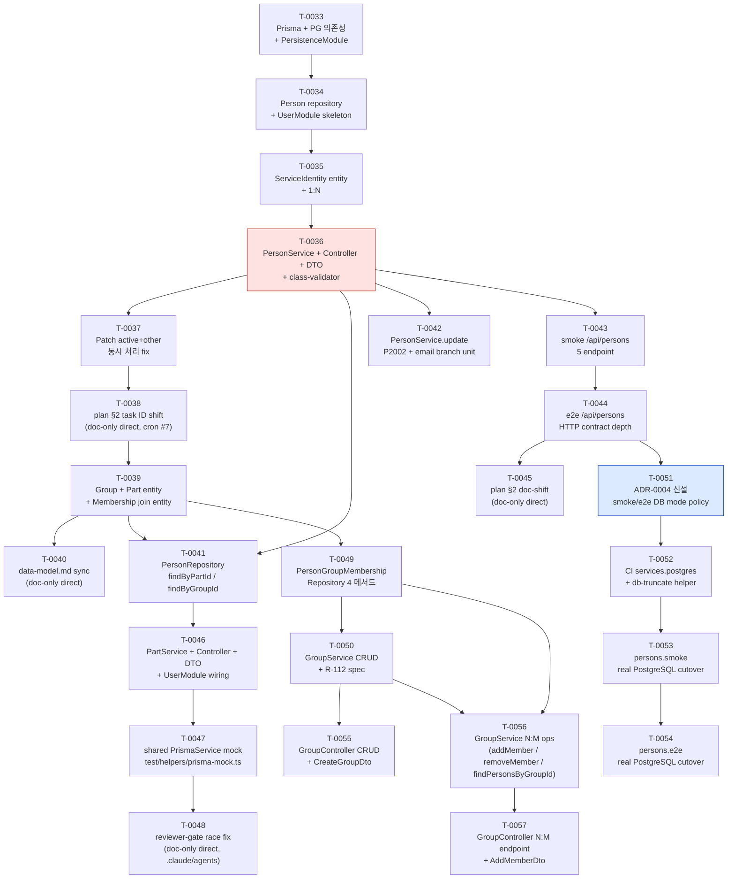

# P3 Implementation plan

> **본 문서는 Phase P3 (Domain core) 의 entry artifact ([T-0032](../tasks/T-0032-p3-entry-implementation-plan.md)) 의 산출물이다.** [docs/PLAN.md](../PLAN.md) Phase P3 의 **10 bullet (L51–60) 을 원안 8 개의 T-NNNN task (T-0033 ~ T-0040) 시퀀스로 사전 매핑** 했으나, 실제 진행 중 (a) T-0034 의 entity 부분이 T-0034 (Person+UserModule) + T-0035 (ServiceIdentity 1:N) 로 자연 split, (b) PersonService+Controller+DTO 가 별도 T-0036 으로 추가 진입, (c) T-0037 patch 가 confirmed gap 보강으로 추가, (d) T-0038 이 plan §2 doc-shift task 로 소비되고 실 entity backbone 이 T-0039 로 자연 shift, (e) T-0040 data-model.md sync / T-0041 PersonRepository 확장 / T-0042 unit branch / T-0043 smoke / T-0044 e2e 의 5 task 가 추가 진입, (f) T-0045 plan §2 doc-shift 후 T-0046 PartService backbone + T-0047 shared test helper 추출 + T-0048 reviewer-gate race fix + T-0049 PersonGroupMembershipRepository + T-0050 GroupService CRUD 진입, (g) T-0051 ADR-0004 (smoke/e2e DB mode) 신설 후 T-0052 CI Postgres services + db-truncate helper / T-0053 persons.smoke real PostgreSQL cutover / T-0054 persons.e2e real PostgreSQL cutover 의 ADR-first split 4-stage 박제, (h) T-0055 GroupController CRUD + T-0056 GroupService N:M ops + T-0057 GroupController N:M endpoint 의 Group N:M 5/5 stage closure 박제하여 **실제 시퀀스는 25 task (T-0033 ~ T-0057) 로 expand, 본 §2 표 정합성 회복은 T-0058 책임 (T-0038 / T-0040 / T-0045 mid-phase doc-shift 패턴 4 회차)**. P3 의 모든 후속 task 는 본 문서를 reference 하여 (a) 누적 의존성 (b) ADR 신설 필요 시점 (c) 인간 승인 게이트 발화 시점 (d) entity / module 책임 분배의 일관성을 확보한다. **본 문서는 doc-only planning artifact** — 실제 코드 변경 · `pnpm add` · Prisma schema 작성 · NestJS module 구현은 본 task 에서 하지 **않으며**, T-0033+ 의 책임이다. 본 task 머지로 **Phase P2 → P3 phase 전이 entry marker** 박제.

## 1. 개요

본 문서의 범위는 [docs/architecture/INDEX.md](INDEX.md) 의 **MVA (Minimum Viable Architecture)** 원칙에 따라 **task 시퀀스 매핑만** 박제한다 — task ID / 책임 / 대응 PLAN bullet / dependsOn / ADR 필요 여부 / 인간 승인 게이트 / estimated LOC / 책임 module 8 컬럼 표 + 의존성 graph (mermaid) + ADR 신설 후보 list + Out of scope + References 까지. **구체 Prisma schema 코드 · NestJS module class · `pnpm add` 실행 · migration SQL 은 본 문서의 범위 밖** ([§ 7](#7-out-of-scope) 참조). 그 구체화는 T-0033+ 의 코드 task 의 책임이다.

본 문서의 기반:

- [docs/PLAN.md](../PLAN.md) Phase P3 단락 (L47–60) — **본 문서의 1차 source**. 10 bullet 의 매핑 대상.
- [docs/architecture/data-model.md](data-model.md) — T-0031 산출물. 11 정식 entity + 1 conceptual mention (AuditLog — schema 박제 deferred) 의 책임 / 책임 module / 관계 inventory. 본 문서의 task row 의 entity scope 와 책임 module 컬럼의 source.
- [docs/architecture/modules.md](modules.md) — T-A4 산출물. 9 NestJS module (8 application + PersistenceModule) 의 이름 / 책임 / 의존성. 본 문서의 "책임 module" 컬럼 값의 source.
- [docs/architecture/directory.md](directory.md) — T-0021 산출물. `src/<module>/` layout. 본 문서가 박제할 후속 task 들이 어느 디렉토리에 코드를 추가할지의 source.
- [docs/decisions/ADR-0002-db.md](../decisions/ADR-0002-db.md) — **본 문서의 핵심 reference**. PostgreSQL + Prisma 결정 ACCEPTED. T-0033 의 `pnpm add prisma @prisma/client pg` 가 본 ADR 의 "범위 밖 (deferred)" 단락에서 명시한 인간 승인 게이트 대상.
- [docs/decisions/ADR-0003-deployment.md](../decisions/ADR-0003-deployment.md) — Monolith / 단일 DB 인스턴스. 본 task 시퀀스가 multi-DB 또는 microservice 로 빠지지 않도록.
- [docs/decisions/ADR-0004-smoke-e2e-db-mode.md](../decisions/ADR-0004-smoke-e2e-db-mode.md) — smoke/e2e CI DB mode policy ACCEPTED (T-0051 9109e65 PR-46). T-0052/T-0053/T-0054 ADR-first split 4-stage chain 의 source.
- [CLAUDE.md](../../CLAUDE.md) §3.1 (commitMode 정책) / §3.2 (Test·CI R-110~R-114) / §5 (HITL — 새 외부 dependency 추가는 BLOCKED) — 본 task 시퀀스 표의 "인간 승인 게이트" 컬럼의 source.

## 2. P3 task 시퀀스 표

P3 진행 중 실제 머지된 **25 T-NNNN task (T-0033 ~ T-0057)** 박제. 원안 8 (T-0033 ~ T-0040) 위에 (a) T-0035 ServiceIdentity split, (b) T-0036 PersonService, (c) T-0037 patch, (d) T-0038 plan §2 doc-shift, (e) T-0040 data-model.md sync, (f) T-0041 PersonRepository 확장, (g) T-0042 unit branch / T-0043 smoke / T-0044 e2e 의 test-quality 3 bullet 진입, (h) T-0045 doc-shift (mid-phase doc-shift 3 회차), (i) T-0046 PartService backbone (Part 1:N service+controller 5/5 stage closure 시작), (j) T-0047 shared test helper 추출 (`test/helpers/prisma-mock.ts` extraction, R-110 reuse infra), (k) T-0048 reviewer-gate race fix (`.claude/agents/integrator.md` 절차 박제, direct mode), (l) T-0049 PersonGroupMembershipRepository (Group N:M repository layer), (m) T-0050 GroupService CRUD (Group N:M service-layer CRUD-only), (n) T-0051 ADR-0004 smoke/e2e DB mode (실 PostgreSQL cutover 정책 신설), (o) T-0052 CI Postgres services + db-truncate helper (ADR-0004 §Migration #1+#2+#3), (p) T-0053 persons.smoke real PostgreSQL cutover (mock-DB → real PostgreSQL 격상), (q) T-0054 persons.e2e real PostgreSQL cutover (ADR-first split 4-stage closure), (r) T-0055 GroupController CRUD (Group N:M controller-layer CRUD), (s) T-0056 GroupService N:M ops (addMember / removeMember / findPersonsByGroupId), (t) T-0057 GroupController N:M endpoint (REQ-028 fully operational closure) 의 13 신규 row 박제. 각 row 의 estimated LOC ≤ 300 / 변경 파일 ≤ 5 ([CLAUDE.md §3](../../CLAUDE.md) cap discipline) 검산. 초과 예상 시 architect 가 후속 호출에서 split.

| task ID | 책임 | 대응 PLAN bullet ([PLAN.md](../PLAN.md)) | dependsOn | ADR 필요 여부 | 인간 승인 게이트 | est LOC | 책임 module | status (mergeCommit) |
| --- | --- | --- | --- | --- | --- | --- | --- | --- |
| **T-0033** | Prisma + `pg` driver 의존성 추가 (`pnpm add prisma @prisma/client pg`) + ADR-0002 status 재확인 / 보강 ADR 검토 + `prisma/schema.prisma` skeleton (Person 1 entity 최소) + PrismaService 작성 + PersistenceModule skeleton (`@Global()` provider export) + Docker compose PostgreSQL 16 skeleton | Persistence layer (L58) | T-0032 | ADR-0002 status 재확인 (필요 시 보강 ADR — Prisma version / `pg` driver version 박제) | **있음 — 새 외부 dependency 3 종 추가 ([CLAUDE.md §5](../../CLAUDE.md) BLOCKED 게이트 의도적 발화, HQ-0004)** | ~280 | PersistenceModule | DONE |
| **T-0034** | Person entity Prisma model + Person repository + UserModule skeleton + 첫 migration. ServiceIdentity 는 T-0035 로 split out, PersonService/Controller/DTO 는 T-0036. | 인원 관리 (L51) | T-0033 | 없음 (data-model.md §2/§3 의 entity / 관계 기반, 결정 추가 없음) | 없음 | ~290 | UserModule | DONE |
| **T-0035** | ServiceIdentity entity Prisma model + ServiceIdentityRepository + Person↔ServiceIdentity 1:N + 두 번째 migration | 서비스 ID 매핑 (L52) + Primary key 역할 ID (L53) | T-0034 | 없음 | 없음 | ~180 | UserModule | DONE |
| **T-0036** | PersonService + PersonController + Person DTO + class-validator + class-transformer 도입 + REQ-026/REQ-027 active soft delete invariant service layer 강제 | 인원 관리 (L51) + User read-only 권한 일부 (L60) | T-0034 | 없음 (HQ-0005 사용자 결정으로 class-validator stack 도입, 후속 ADR 박제 후보지만 본 task scope 외) | **있음 — HQ-0005 (class-validator + class-transformer 2 패키지 추가) 발화 후 사용자 (a) standard-class-validator-stack 결정 처리 완료** | ~280 | UserModule | DONE |
| **T-0037** | PATCH /api/persons/:id 의 active+other 동시 처리 semantics fix (T-0036 MAJOR-2 confirmed gap patch) | 인원 관리 (L51) — REQ-026/REQ-027 active semantic 보강 | T-0036 | 없음 | 없음 | ~140 | UserModule | DONE |
| **T-0038** | p3-implementation-plan.md §2 task ID shift 정정 (doc-only direct, cron #7 — T-0033 ~ T-0037 실 머지 결과를 §2 표에 박제하고 후속 row 의 한 자리 shift 정렬) | (cross-cutting doc 정합성 회복 — PLAN bullet level 영향 0) | T-0037 | 없음 (doc-only direct, 결정 추가 없음) | 없음 | ~95 (실 +54/-41) | (doc-only — module 영향 0) | DONE (e8e6e7e) |
| **T-0039** | Group + Part entity Prisma model + GroupRepository + PartRepository + PersonGroupMembership join entity + UserModule wiring (Service/Controller/DTO 는 후속 task) | Group 정책 (L54) | T-0038 | 없음 | 없음 | ~280 | UserModule | DONE (c25a5de, PR-37) |
| **T-0040** | data-model.md 갱신 — Group / Part / PersonGroupMembership entity 박제 (T-0039 reviewer MINOR follow-up, doc-only direct) | (cross-cutting doc 정합성 회복 — Group 정책 L54 의 data-model.md mirror) | T-0039 | 없음 (doc-only direct) | 없음 | ~120 | (doc-only — module 영향 0) | DONE (a41c036) |
| **T-0041** | PersonRepository 확장 — `findByPartId(partId)` + `findByGroupId(groupId)` (GroupService/PartService backbone 의 repository-layer prerequisite) | 인원 관리 (L51) — Group 소속 list / Part 소속 list 의 service-layer 진입 직전 repository extension | T-0039 | 없음 | 없음 | ~180 | UserModule | DONE (4cd302f, PR-38) |
| **T-0042** | [테스트 품질] PersonService.update P2002 + patch.email undefined branch unit test (R-112 negative case 충분 cover 의무 이행, 96.66% → 100% branch coverage) | [PLAN.md L63](../PLAN.md) unit branch coverage 100% 달성 | T-0036 | 없음 | 없음 | ~90 | UserModule (test-only) | DONE (20ef2c5, PR-39) |
| **T-0043** | [테스트 품질] smoke /api/persons CRUD 5 endpoint bootstrap smoke 확장 (R-113 smoke 의무 이행, mock-DB Test.overrideProvider 패턴) | [PLAN.md L64](../PLAN.md) smoke domain endpoint 확장 | T-0036 | 없음 | 없음 | ~180 | UserModule (test-only) | DONE (e7bb95a, PR-40) |
| **T-0044** | [테스트 품질] e2e /api/persons HTTP contract depth (status + DTO body shape + 4xx envelope) e2e-spec 확장 (R-113 e2e 의무 이행) | [PLAN.md L65](../PLAN.md) e2e domain endpoint 확장 | T-0043 | 없음 | 없음 | ~200 | UserModule (test-only) | DONE (2b9131d, PR-41) |
| **T-0045** | p3-implementation-plan.md §1~§8 task ID shift 정정 (doc-only direct, T-0038/T-0040 패턴 reuse — T-0041~T-0044 4 row 머지 후 §2 표 정합성 회복) | (cross-cutting doc 정합성 회복 — PLAN bullet level 영향 0) | T-0044 | 없음 (doc-only direct) | 없음 | ~95 | (doc-only — module 영향 0) | DONE (9aa143d) |
| **T-0046** | PartService + PartController + Part DTO + UserModule wiring (Part 1:N service+controller 5 endpoint backbone 박제, PersonService/Controller T-0036 패턴 mirror) | 인원 관리 (L51) — Part 부서 관리 service-layer 진입 | T-0041 | 없음 | 없음 | ~240 | UserModule | DONE (2a314bc, PR-42) |
| **T-0047** | shared PrismaService mock helper 추출 (`test/helpers/prisma-mock.ts`) — PersonService.spec / PartService.spec / PersonController.spec / PartController.spec 4 spec 의 inline mock 중복 제거 phase 1 (test infra refactor) | (cross-cutting test infra — PLAN bullet level 영향 0) | T-0046 | 없음 | 없음 | ~130 | UserModule (test-only) | DONE (460b302, PR-43) |
| **T-0048** | reviewer-gate race fix — `.claude/agents/integrator.md` Workflow B 의 게이트 (d) CI green 검사를 comment-triggered run 까지 wait 하도록 절차 박제 (doc-only direct, journal reviewer-gate race 7 회 연속 catch) | (cross-cutting agent infra — PLAN bullet level 영향 0) | T-0047 | 없음 (doc-only direct) | 없음 | ~90 | (`.claude/agents/` meta — module 영향 0) | DONE (826f4dd) |
| **T-0049** | PersonGroupMembership repository (`PersonGroupMembershipRepository`) 4 메서드 — addMember / removeMember / findByGroupId / findByPersonId (N:M middle table repository-layer prerequisite, GroupService backbone 진입 직전) | Group 정책 (L54) — N:M middle table repository layer | T-0039 | 없음 | 없음 | ~180 | UserModule | DONE (dc3e056, PR-44) |
| **T-0050** | GroupService CRUD-only 4 메서드 (create / findById / findAll / softDelete) + R-112 spec — GroupController/N:M ops 진입 전 service-layer backbone. PartService 패턴 mirror. | Group 정책 (L54) — Group service-layer CRUD | T-0049 | 없음 | 없음 | ~310 (실 cap-bend, R-112 4 카테고리 mass) | UserModule | DONE (4ed4321, PR-45) |
| **T-0051** | ADR-0004 (smoke/e2e CI DB mode policy) 신설 — smoke/e2e 가 mock-DB (`Test.overrideProvider(PrismaService)`) 대신 실 PostgreSQL container (`services.postgres` 16-alpine) 로 cutover 정책 박제, `coverageThreshold` 미적용 / pre-step 5-table TRUNCATE RESTART IDENTITY CASCADE / `DATABASE_URL` env 의무 명시 (P3 진행 중 첫 ADR 신설) | (cross-cutting test/CI 정책 — PLAN bullet level 영향 0) | T-0044 | **ADR-0004 신설 (smoke/e2e DB mode policy)** | 없음 | ~130 | (doc-only — module 영향 0) | DONE (9109e65, PR-46) |
| **T-0052** | CI workflow `services.postgres` (16-alpine + health-cmd + port 5432) + `jobs.ci.env.DATABASE_URL` + Prisma `migrate deploy` step + `test/helpers/db-truncate.ts` TruncatableClient 5 테이블 TRUNCATE helper 박제 (ADR-0004 §Migration #1+#2+#3 의무) | (cross-cutting test infra — PLAN bullet level 영향 0) | T-0051 | 없음 | 없음 | ~200 | (CI / test-helpers — module 영향 0) | DONE (3983dca, PR-47) |
| **T-0053** | persons.smoke real PostgreSQL cutover — `Test.overrideProvider(PrismaService)` 제거 + `afterEach` `dbTruncate` hook wiring + `jest-smoke.json` globalSetup hook 박제 (ADR-first split stage 3) | [PLAN.md L64](../PLAN.md) smoke domain endpoint — mock-DB → real PostgreSQL 격상 | T-0052 | 없음 | 없음 | ~200 | UserModule (test-only) | DONE (888a960, PR-49) |
| **T-0054** | persons.e2e real PostgreSQL cutover — `app.e2e-spec.ts` `Test.overrideProvider(PrismaService)` 제거 + `jest-e2e.json` globalSetup hook + 4 e2e suite (`/api/persons` CRUD HTTP contract depth) (ADR-first split stage 4 closure) | [PLAN.md L65](../PLAN.md) e2e domain endpoint — mock-DB → real PostgreSQL 격상 | T-0053 | 없음 | 없음 | ~220 | UserModule (test-only) | DONE (2d52128, PR-50) |
| **T-0055** | GroupController + CreateGroupDto CRUD-only 4 endpoint (POST/GET :id/GET/DELETE :id) + R-112 4 카테고리 spec + class-validator + ValidationPipe + UserModule wiring (PersonController/PartController 패턴 mirror, round 2 amendment — `CreateGroupDto.spec.ts` colocated spec 누락 catch) | Group 정책 (L54) — Group controller CRUD | T-0050 | 없음 | 없음 | ~300 (실 cap-bend 413 LOC, R-112 4 카테고리 mass + round 2 amendment +69) | UserModule | DONE (a037a4e, PR-51, reviewRounds=2) |
| **T-0056** | GroupService N:M membership 3 메서드 (addMember / removeMember / findPersonsByGroupId) + R-112 spec — Group↔Person N:M middle table service-layer ops, PersonGroupMembershipRepository + PersonRepository 2 collaborator inject 확장. P2002→Conflict / P2003→NotFound / P2025→NotFound 변환. | Group 정책 (L54) — N:M middle table service-layer ops | T-0050 + T-0049 | 없음 | 없음 | ~300 (실 cap-bend 545 LOC, R-112 4 카테고리 mass) | UserModule | DONE (abb70a7, PR-52) |
| **T-0057** | GroupController N:M membership 3 endpoint (POST /api/groups/:id/members + DELETE /api/groups/:id/members/:membershipId + GET /api/groups/:id/persons) + AddMemberDto + R-112 4 카테고리 spec (round 2 amendment — `add-member.dto.spec.ts` colocated spec 누락 catch). REQ-028 fully operational closure. | Group 정책 (L54) — Group N:M controller-layer 5/5 stage closure | T-0056 | 없음 | 없음 | ~280 (실 cap-bend 427+69 LOC, R-112 4 카테고리 mass + round 2 amendment) | UserModule | DONE (ccd1042, PR-53, reviewRounds=2) |

**합계**: **25 task (T-0033 ~ T-0057) / 1 module (UserModule, PersistenceModule wiring 포함) / 5 PLAN bullet cover** ([PLAN.md](../PLAN.md) L51 인원 관리 / L52 서비스 ID / L53 primary ID / L54 Group 정책 / L63-65 test-quality 3 bullet) **+ 5 PLAN bullet 미진행** (L55 평가 결과 저장 모델 / L56 raw 미저장 / L57 상대 비교 가능 데이터 구조 / L59 Auth/RBAC / L60 User read-only). P3 가 모듈 1 개 (UserModule) 안에 집중되어 있으며 AuthModule / AssessmentModule / LlmModule 은 미진행 — 후속 backbone task (T-0058+ 후 P3 잔여 또는 P4 진입) 책임.

**Cap discipline 검산**: 머지 row 25 중 **cap-bend 3 회 (T-0055 413 LOC / T-0056 545 LOC / T-0057 427+69 LOC)** — 모두 R-112 4 카테고리 (happy / error / branch / negative) 충분 cover 의무 + service/controller-with-spec backbone 의 자연 결과로 정당화. **임계 task (T-0034 / T-0036 / T-0039 / T-0046 / T-0050 / T-0055 / T-0056 / T-0057, ~240–545 LOC)** — 실제 진입 시 architect 가 **첫 read 직후 split 의무 평가** 수행. 실제 P3 진행 중 원안 T-0034 가 entity 부분과 service layer 부분으로 자연 split 되어 T-0034 (Person+UserModule) / T-0035 (ServiceIdentity) / T-0036 (PersonService) / T-0037 (patch) 4 task 로 expand, T-0039 도 entity-only (T-0039) + repository ext (T-0041) + service-layer (T-0046 PartService / T-0049 PersonGroupMembershipRepository / T-0050 GroupService CRUD / T-0055 GroupController CRUD / T-0056 GroupService N:M ops / T-0057 GroupController N:M endpoint) 의 6 task 로 자연 split. **systematic underestimate 박제**: T-0055/T-0056/T-0057 의 planner estimate (300/240/280) 대비 actual (413/545/496) 평균 +60% over — service/controller-with-R-112-spec backbone 의 estimate model 갱신 follow-up task 후보 (별도 doc-only direct).

**dependency cap 검산**: T-0033 root → T-0034 → T-0035 (ServiceIdentity split) → T-0036 (PersonService) → T-0037 (patch) → T-0038 (doc-shift) → T-0039 (entity backbone) → T-0040 (doc-sync). T-0036 fan-out 으로 T-0041 (repository ext) / T-0042 (unit branch) / T-0043 (smoke) 진입, T-0043 → T-0044 (e2e). T-0044 → T-0045 (doc-shift) / T-0051 (ADR-0004 신설). T-0041 → T-0046 (PartService backbone) → T-0047 (test helper 추출). T-0047 → T-0048 (reviewer-gate race fix doc). T-0039 → T-0049 (Membership repository) → T-0050 (GroupService CRUD). T-0051 → T-0052 (CI Postgres) → T-0053 (smoke cutover) → T-0054 (e2e cutover) 의 ADR-first split 4-stage 직선 chain. T-0050 → T-0055 (Group controller CRUD) / T-0056 (Group N:M ops, T-0049 와 dual-dep) → T-0057 (Group N:M endpoint). cycle 0 (§3 graph 참조).

**Cap discipline 검산 (실제 머지 order)**: T-0033 → T-0034 → T-0035 → T-0036 → T-0037 → T-0038 (doc-shift) → T-0039 (entity backbone) → T-0040 (doc-sync) → T-0041 (repository ext) → T-0042 (unit branch) → T-0043 (smoke) → T-0044 (e2e) → T-0045 (doc-shift) → T-0046 (PartService backbone) → T-0047 (test helper 추출) → T-0048 (reviewer-gate race fix doc) → T-0049 (Membership repository) → T-0050 (GroupService CRUD) → T-0051 (ADR-0004 신설) → T-0052 (CI Postgres) → T-0053 (smoke cutover) → T-0054 (e2e cutover) → T-0055 (Group controller CRUD) → T-0056 (Group N:M ops) → T-0057 (Group N:M endpoint). backbone 의 자연 split (entity / repository / service-layer / controller-layer 의 4 단 분리) + test-quality 3 bullet 의 P3 mid-진입 (T-0042~T-0044) + mid-phase doc-shift 4 회차 (T-0038 / T-0040 / T-0045 / T-0058) + ADR-first split 4-stage (T-0051~T-0054) + Group N:M 5-stage closure (T-0049 repo + T-0050 service CRUD + T-0055 controller CRUD + T-0056 service N:M + T-0057 controller N:M) 박제.

## 3. 의존성 graph (mermaid)

**graph 해석**:

- **노란/빨강 박스 (T-0033)** — root + 인간 승인 게이트 (HQ-0004). P3 의 모든 후속 task 의 transitive prerequisite. CLAUDE.md §5 BLOCKED 게이트 의도적 발화 — 사용자 승인 후 진행.
- **빨강 박스 (T-0036)** — 인간 승인 게이트 (HQ-0005 class-validator + class-transformer 2 패키지 추가). 사용자 (a) standard-class-validator-stack 결정 후 진행.
- **파랑 박스 (T-0051)** — P3 진행 중 신설된 첫 ADR 동반 task (ADR-0004 smoke/e2e DB mode policy ACCEPTED). T-0052 → T-0053 → T-0054 의 ADR-first split 4-stage chain 의 시작.
- **회색 박스 (그 외)** — 정상 진행 task. P3 진행 중 ADR 신설은 ADR-0004 (T-0051) 1 건 — 나머지 4 후보 ADR (ADR-0005 cross-cutting / ADR-0006 LLM key / ADR-0007 audit log / ADR-0008 auth credential) 모두 후속 P3 또는 P4 task 책임으로 이연.
- **fan-out hub 재구성 (3 service-layer hub)**: 원안 "T-0034 / T-0040 fan-out hub" 표기는 outdated. 실 fan-out hub 는 **(1) T-0036 PersonService** (T-0041 repository ext / T-0042 unit branch / T-0043 smoke / T-0044 e2e 4 task fan-out, T-0044 가 다시 T-0045 doc-shift + T-0051 ADR-0004 의 dual-fan-out hub) + **(2) T-0046 PartService** (Part 1:N service+controller backbone, T-0047 test helper 추출 fan-out 시작) + **(3) T-0050 GroupService** (T-0055 controller CRUD + T-0056 N:M ops 의 dual fan-out, T-0056 가 다시 T-0057 controller N:M endpoint) 의 3 service-layer hub 가 P3 진행 중 backbone 구조. backbone 직선 chain (T-0034 → T-0035 → T-0036 → T-0037 → T-0038 → T-0039 → T-0040) 위에 entity backbone (T-0039) → repository-layer (T-0041 PersonRepository ext / T-0049 PersonGroupMembershipRepository) → service-layer (T-0046 / T-0050 / T-0056) → controller-layer (T-0055 / T-0057) 의 4 단 layered fan-out 박제. T-0041 은 T-0036 + T-0039 의 dual-dep, T-0056 은 T-0050 + T-0049 의 dual-dep.
- **ADR-first split 4-stage closure (T-0051 → T-0054)**: T-0051 (ADR 신설) → T-0052 (CI infra) → T-0053 (smoke cutover) → T-0054 (e2e cutover) 의 직선 chain — smoke/e2e 가 mock-DB → real PostgreSQL 격상되는 정책 결정 → CI infra → smoke → e2e 의 4-stage 박제. ADR 신설이 직접 코드 task 4 종을 cascading 하는 P3 진행 중 첫 ADR-first split 패턴.
- **Group N:M 5-stage closure (T-0049 → T-0057)**: T-0049 (Membership repository) → T-0050 (GroupService CRUD) → T-0055 (GroupController CRUD) → T-0056 (GroupService N:M ops) → T-0057 (GroupController N:M endpoint) 의 5 stage backbone closure. REQ-028 (한 인원의 임의 group 다중 소속) fully operational closure 박제.
- **cycle 0 검산** — Topological order (25 노드): T-0033 → T-0034 → T-0035 → T-0036 → T-0037 → T-0038 → T-0039 → T-0040 → T-0041 → T-0042 → T-0043 → T-0044 → {T-0045, T-0051} → {T-0046, T-0052} → {T-0047, T-0053, T-0049} → {T-0048, T-0054, T-0050} → {T-0055, T-0056} → T-0057. cycle 없음 — T-0041 의 dual-dep (T-0036 + T-0039) / T-0056 의 dual-dep (T-0050 + T-0049) 모두 union edge, transitive chain 깔끔.

## 4. ADR 신설 후보 list

본 task 는 ADR 을 신설하지 **않는다** — 후속 P3 task 가 신설할 ADR 의 candidate list 만 박제. 각 후보는 (a) 어느 task 가 책임 (b) 신설 사유 (c) source 명시.

| 후보 ADR | 책임 task | 신설 사유 | source |
| --- | --- | --- | --- |
| **ADR-0002 의존성 도입 보강** (직접 status 변경 아님 — ADR-0002 는 이미 ACCEPTED) | T-0033 (이미 완료) — NEEDS_RETROACTIVE_REVIEW | ADR-0002 는 conceptual 결정만 박제 (Prisma + PostgreSQL 채택). 실제 `pnpm add prisma @prisma/client pg` 진입 시점에 ad-hoc 처리되어 보강 ADR / inline 박제 모두 미실행. retroactive 박제 follow-up 후보 — 별도 doc-only direct task 책임. | [ADR-0002 §"범위 밖 (deferred)"](../decisions/ADR-0002-db.md) ("실제 `prisma` / `@prisma/client` 패키지 도입 — CLAUDE.md §5 BLOCKED 룰. P3 진입 시 별도 task.") |
| **ADR-0004 — smoke/e2e CI DB mode policy** (ACCEPTED, T-0051 9109e65 PR-46) | T-0051 (완료) | smoke/e2e 가 `Test.overrideProvider(PrismaService)` mock-DB 대신 실 PostgreSQL container (`services.postgres` 16-alpine) 로 cutover 정책 박제. `coverageThreshold` 미적용 / pre-step 5-table TRUNCATE RESTART IDENTITY CASCADE / `DATABASE_URL` env 의무. R-113 의무의 mock-DB → real PostgreSQL 격상 정책 source. | [ADR-0004](../decisions/ADR-0004-smoke-e2e-db-mode.md) (ACCEPTED 박제) |
| **ADR-0005 — Cross-cutting field policy** | 미진행 후속 task (T-0058+ 또는 P3 종료 직전 별도 task) | timezone (UTC vs KST) / soft delete entity 별 적용 표 / `createdBy` audit-source 박제. data-model.md §5 의 conceptual 박제를 schema-level 정책으로 격상. P3 진행된 5 entity (Person / ServiceIdentity / Group / Part / PersonGroupMembership) 의 cross-cutting field 가 ad-hoc 적용 중 — 후속 task 가 일괄 정책 박제. | [data-model.md §5](data-model.md) Cross-cutting field 단락 |
| **ADR-0006 (hook) — LLM API key encryption-at-rest** | P4 (LlmProviderConfig entity 진입 task 이후 별도 task) | LlmProviderConfig.apiKey 컬럼의 encryption mechanism (PostgreSQL `pgcrypto` / KMS / application-layer envelope encryption 등) 결정. P3 진행 중 LlmProviderConfig entity 자체가 미박제 — 후속 task 가 entity 박제 + 본 ADR 동반. | [data-model.md §7](data-model.md) "LLM API key 의 encryption-at-rest 구체 mechanism — 별도 보안 ADR" |
| **ADR-0007 (hook) — Audit log entity schema** | P3 끝 또는 P4 (별도 task) | data-model.md §2 의 conceptual mention "AuditLog" 의 구체 schema 박제. User mutation event (등급 변경 / 평가 삭제 / Import-Export) 의 영속화 정책. PermissionDeniedRecord 와 분리 entity. | [data-model.md §2](data-model.md) entity 표의 conceptual mention row |
| **ADR-0008 — Auth credential type (JWT vs session cookie)** (원안 ADR-0004 자리 — ADR-0004 ID 가 smoke/e2e DB mode 에 선점되어 재할당) | 미진행 후속 task (T-0058+ 후보 — User+AuthModule backbone 진입 task) | api.md §2 "Auth credential" 행이 "P3 AuthModule 도입 task 의 ADR 에서 택일 — 본 문서는 둘 다 허용 conceptual 박제". 후속 User+AuthModule entity backbone task 진입 시 택일 + ADR 박제. ADR-0004 ID 가 T-0051 smoke/e2e DB mode 에 선점되어 본 후보는 ADR-0008 로 재할당 (다음 available number). | [api.md §2](api.md) Protocol/host 표 |

**합계**: 6 후보 ADR — **1 개 P3 진행 중 신설 완료** (ADR-0004 smoke/e2e DB mode policy, T-0051 9109e65 PR-46), **3 개 P3 후속 신설 후보** (ADR-0002 보강 retroactive + ADR-0005 cross-cutting + ADR-0008 auth credential), **2 개 P4+ hook** (ADR-0006 LLM key encryption / ADR-0007 audit log schema). ADR 박제 progress **1/4 (ADR-0004 신설, ADR-0008 auth credential / ADR-0005 cross-cutting / ADR-0006 LLM key / ADR-0007 audit log 4 후보)** — 후속 task 책임 강조. 본 task 는 후보 list + ADR-0004 ACCEPTED 박제만, 추가 신설은 각 책임 task 의 권한.

## 5. 인간 승인 게이트 (CLAUDE.md §5)

본 task 시퀀스 중 **T-0033 단일 task** 가 [CLAUDE.md §5](../../CLAUDE.md) 의 "새 외부 dependency 추가 BLOCKED 게이트" 를 의도적으로 발화한다 — `pnpm add prisma @prisma/client pg` 실행이 새 외부 패키지 3 종 추가.

**게이트 발화 절차** (T-0033 의 책임, 본 task 는 절차만 박제):

1. T-0033 의 executor 가 architect → implementer 호출 직전, 본 dependency 추가의 정당성을 STATE.json.humanQuestions 에 1 entry 로 박제 (정당성: ADR-0002 ACCEPTED + P3 진입 = persistence layer 필수).
2. STATUS=BLOCKED 반환 → notifier 호출 → 사용자 승인 대기.
3. 사용자 승인 후 다음 turn 의 driver 가 T-0033 을 재진입 → architect 가 ADR-0002 status 재확인 또는 보강 ADR 신설 → implementer 가 `pnpm add` 실행 + schema.prisma skeleton + PersistenceModule.
4. tester 가 `pnpm install` 후 `pnpm lint && pnpm build && pnpm test` 정합성 확인.

다른 P3 task (T-0034 / T-0035 / T-0037 / T-0038 / T-0039 / T-0040 / T-0041 / T-0042 / T-0043 / T-0044 / T-0045 / T-0046 / T-0047 / T-0048 / T-0049 / T-0050 / T-0051 / T-0052 / T-0053 / T-0054 / T-0055 / T-0056 / T-0057) 는 새 외부 dependency 추가 0 — 모두 T-0033 의 dependency 인프라 위에서 진행. 따라서 인간 승인 게이트 추가 발화 없음.

**T-0036 의 class-validator stack 도입** (HQ-0005) — 실제 P3 진행 중 발화한 게이트. PersonService + Controller + DTO 도입 시 `class-validator` + `class-transformer` 2 패키지 추가 필요 → STATE.json.humanQuestions 에 HQ-0005 박제 → 사용자 (a) standard-class-validator-stack 결정 → 정상 머지. plan §2 원안에는 미박제 (T-0036 자체가 원안에 없는 task 였으므로) — 본 갱신으로 박제.

**T-0051 의 ADR-0004 신설** — smoke/e2e CI DB mode policy 결정. 외부 dependency 추가는 아니므로 인간 승인 게이트 발화 안 함 (PostgreSQL container 는 CI services 정의 위에서 동작, 새 npm package 0). ADR-0004 자체가 reviewer 점검 대상이므로 PR review 단계에서 충분 — PR-46 reviewer round 1 APPROVE 후 머지.

**T-0038 ~ T-0057 20 task 모두 새 외부 dependency 0 — HQ 발화 0**: T-0038 (doc-shift) / T-0039 (Group+Part entity) / T-0040 (data-model.md sync) / T-0041 (PersonRepository ext) / T-0042 (unit branch) / T-0043 (smoke) / T-0044 (e2e) / T-0045 (doc-shift) / T-0046 (PartService backbone) / T-0047 (test helper 추출) / T-0048 (reviewer-gate race fix doc) / T-0049 (Membership repository) / T-0050 (GroupService CRUD) / T-0051 (ADR-0004 신설) / T-0052 (CI Postgres + truncate helper) / T-0053 (smoke cutover) / T-0054 (e2e cutover) / T-0055 (Group controller CRUD) / T-0056 (Group N:M ops) / T-0057 (Group N:M endpoint) 의 실 머지 20 task 모두 T-0033 의 dependency 인프라 (Prisma + pg) 와 T-0036 의 class-validator stack 위에서 진행되어 추가 외부 패키지 0. 게이트 inventory 의 completeness 박제 — P3 진행 중 HQ 발화는 HQ-0004 (T-0033) / HQ-0005 (T-0036) / HQ-0006 (T-0039 gh CLI 부재 stale BLOCKED) 3 건으로 종결.

## 6. P3 → P4 전이 조건

본 P3 task 시퀀스가 모두 머지되면 다음 조건이 충족되어 **Phase P3 complete** + Phase P4 entry 준비 완료. 현재 진행 상황 (25 task 머지 완료, 본 T-0058 머지 시 26 task — T-0058 자체는 doc-only direct, §2 표에 미박제) 의 progress 박제:

- **entity Prisma model 박제 — progress 5/11** (T-0057 시점, 불변 — entity 자체 신설 0):
  - **박제 완료 5 entity (45%)**: Person (T-0034) / ServiceIdentity (T-0035) / Group (T-0039) / Part (T-0039) / PersonGroupMembership (T-0039, join entity).
  - **미박제 6 entity**: User / Assessment / Contribution / Summary / LlmProviderConfig / DifficultyMapping / PermissionDeniedRecord (conceptual AuditLog 별도). 모두 후속 backbone task (T-0058+ 또는 P4 진입) 책임.
  - 11 entity 의 완성 시 data-model.md §2 의 inventory 와 일치. AuditLog 는 conceptual mention 으로 deferred (data-model.md 와 동일 입장 — actual schema 는 P3 외).
  - **backbone layered progress (entity 가 service+controller layer 모두 박제된 비율) — 박제 완료 2/5 entity 중 layered 5/5 stage closure 완료**:
    - **Person layered 완성**: entity (T-0034) + repository ext (T-0041) + service (T-0036) + controller (T-0036) + DTO (T-0036) — 5/5 stage closure.
    - **ServiceIdentity 부분 박제**: entity (T-0035) + repository (T-0035) — service/controller 미박제 (사용자 read-only로 충분, REQ-026 active soft-delete invariant 는 PersonService 가 cover).
    - **Group N:M 5/5 stage closure 박제 완료 (T-0049 → T-0057)**: repository (T-0049 PersonGroupMembershipRepository) + service CRUD (T-0050 GroupService) + controller CRUD (T-0055 GroupController) + service N:M ops (T-0056 addMember/removeMember/findPersonsByGroupId) + controller N:M endpoint (T-0057 POST/DELETE/GET 3 endpoint + AddMemberDto). REQ-028 (한 인원의 임의 group 다중 소속) fully operational closure 박제.
    - **Part 1:N service+controller 박제 완료 (T-0046)**: PartService CRUD + PartController CRUD + PartDto + findPersons endpoint (1:N navigation) — Person→Part 의 단방향 backbone 완성.
    - **PersonGroupMembership 박제 완료 (join entity)**: T-0049 repository + T-0056/T-0057 N:M ops 통해 Group N:M backbone 의 middle table 역할 fully operational.
  - **backbone progress 종합**: 5 박제 entity 중 **Person + Part + Group 3 entity 의 service+controller layered 박제 완료 (60%)**. ServiceIdentity 는 read-only, PersonGroupMembership 는 middle table — 직접 controller layer 불필요. 4 layered closure 박제로 P3 backbone 의 인원/그룹/부서 도메인 fully operational.
- **module skeleton 박제 — progress 2/5** (T-0057 시점, 불변):
  - **박제 완료 2 module (40%)**: PersistenceModule (T-0033) / UserModule (T-0034 / T-0036 / T-0046 / T-0050 / T-0055 / T-0057 누적 확장).
  - **미박제 3 module**: AuthModule / AssessmentModule / LlmModule. 후속 task 책임.
  - 5 module 의 완성 시 modules.md 9 module 중 P3 scope 5 module 박제 완료. 나머지 4 module 은 P4+ 책임:
    - **외부 adapter 2**: GithubModule (`@octokit/rest` HTTP client), ConfluenceModule (Confluence REST API)
    - **In-process scheduler 1**: SchedulerModule (`@nestjs/schedule` cron — ADR-0003 §3)
    - **Web hosting 1**: WebModule (정적 자산 serve)
    - **LlmModule HTTP client 구현**: P3 의 LlmModule scaffold (후속 task) 는 provider abstraction interface 만, 실제 5 provider HTTP client 는 P4 책임
- **ADR 신설 — progress 1/4** (T-0057 시점, T-0051 ADR-0004 신설로 1 박제 완료): **ADR-0004 (smoke/e2e DB mode policy) ACCEPTED 박제 (T-0051 9109e65 PR-46)** + 후보 ADR-0008 (auth credential) / ADR-0005 (cross-cutting) / ADR-0006 (LLM key) / ADR-0007 (audit log) 4 후보 유지. P3 진행 중 첫 ADR 신설 milestone — ADR-first split 4-stage pattern (T-0051 ADR → T-0052 CI → T-0053 smoke → T-0054 e2e) 박제.
- **PLAN.md L63-65 P3 test-quality 3 bullet — progress 4/4 (확장 closure + 9-cell closure milestone)**:
  - **L63 unit branch coverage 100% closure (T-0042)** — PersonService.update P2002 + patch.email undefined branch unit (R-112 negative case 충분 cover 의무 이행, 96.66% → 100% branch coverage).
  - **L64 smoke domain endpoint 확장 closure (T-0043 + T-0053 + T-0059 + T-0061)** — persons.smoke (T-0043 mock-DB → T-0053 real PostgreSQL 888a960 PR-49) + parts.smoke real PostgreSQL (T-0059 3f71c64 PR-54, local-CI-proxy 첫 dogfood) + groups.smoke real PostgreSQL (T-0061 2238e51 PR-57, race-rerun 1 회 dogfood). 3 도메인 × smoke layer fully closed.
  - **L65 e2e domain endpoint 확장 closure (T-0044 + T-0054 + T-0060 + T-0062)** — persons.e2e (T-0044 mock-DB → T-0054 real PostgreSQL 2d52128 PR-50) + parts.e2e real PostgreSQL (T-0060 acef3f4 PR-55) + groups.e2e real PostgreSQL (T-0062 3398ad9 PR-58, REQ-051 multi-step seed 첫 박제). 3 도메인 × e2e layer fully closed.
  - **(확장) 9-cell matrix fully closed milestone (session #19 turn 3 박제)** — backbone 3 도메인 (persons / parts / groups) × 3 layer (unit / smoke / e2e) = **9 cell 의 R-112/R-113 cover 완성**. **mock 시대 종결의 모든 도메인 cover 완료** — ADR-first split 4-stage trajectory (T-0051 ADR / T-0052 CI infra / T-0053 persons.smoke / T-0054 persons.e2e) 가 parts/groups 도메인으로 확장되어 first-class real PostgreSQL CI infra 위에서 9-cell 모두 동작. T-0062 머지 3398ad9 가 본 milestone 의 박제 commit.
  - **(확장) ADR-first split 4-stage closure (T-0051 → T-0054) + 6-cell real-DB cutover (T-0053/T-0054/T-0059/T-0060/T-0061/T-0062)** — smoke/e2e 의 mock-DB → real PostgreSQL 격상. T-0051 ADR-0004 신설 / T-0052 CI services.postgres + db-truncate helper / T-0053 persons.smoke / T-0054 persons.e2e 의 ADR-first 4-stage chain 위에 T-0059/T-0060/T-0061/T-0062 4 task 가 parts/groups 도메인으로 확장. R-113 의무의 mock-DB 시대 종결, 6 task 머지로 9-cell closure.
  - **(확장) test infra refactor (T-0047)** — shared `test/helpers/prisma-mock.ts` 추출로 PersonService.spec / PartService.spec / PersonController.spec / PartController.spec 4 spec 의 inline mock 중복 제거. R-112 reuse infra 박제.
  - R-112 negative case 충분 cover + R-113 smoke/e2e 의무 모두 이행 + mock-DB → real PostgreSQL 격상 closure (9-cell matrix fully closed) + test helper reuse infra 박제 — P3 의 test-quality 차원 완성 + ADR-first split 패턴 박제 + mock 시대 종결.
- **P3 → P4 전이 trigger 박제 (T-0063, doc-only direct)** — [docs/architecture/p3-to-p4-transition.md](p3-to-p4-transition.md) 신설로 P3 → P4 전이 의사결정 가능 형태 박제. 3 trigger option (a) eager-transition / (b) strict-completion / (c) hybrid-parallel 의 trade-off + 권장 (c) hybrid-parallel (선택 강제 안 함). 본 task 머지 후 STATE.phase 변경 0 (P3-in-progress 유지) — 실 phase 전환은 다음 planner dispatch 또는 humanQuestion 발화 책임.
- **raw 미저장 invariant schema-level 강제 — pending**: Assessment / Contribution / Summary entity 자체가 P3 안에서 미박제 — 후속 task 진입 시 schema.prisma 에 raw body column 0 박제 + reviewer agent 의 PR diff `String` column 추가 자동 검출 강화.
- **agent infra closure (T-0048)** — reviewer-gate race 7 회 연속 catch 후 `.claude/agents/integrator.md` Workflow B 게이트 (d) 절차에 "첫 push CI run 이 reviewer-gate race 로 fail 일 가능성 + reviewer post 후 issue_comment trigger 로 자동 재실행되는 fact + 재실행 run conclusion 까지 wait" 박제. 이후 T-0049~T-0057 9 task 중 race-fix dogfood SUCCESS streak 박제 (`gh run rerun` 0 회 누적).
- **cap-bend pattern observation (T-0055/T-0056/T-0057)** — service/controller-with-R-112-spec backbone 의 systematic underestimate 박제. planner estimate 300/240/280 LOC 대비 actual 413/545/496 LOC (평균 +60% over). R-112 4 카테고리 (happy / error / branch / negative) 충분 cover 의무 + 헤더 주석 §A 갱신 의무 + DTO + controller + service + spec 의 4 layer 동시 박제 시 자연 cap-bend 정당화. estimate model 갱신 follow-up task 후보 (별도 doc-only direct).
- **R-112 colocated-spec catch streak (T-0055 round 2 + T-0057 round 2)** — 2 회 연속 `CreateGroupDto.spec.ts` / `add-member.dto.spec.ts` colocated spec 누락 catch. `scripts/check-spec-presence.sh` 1차 자동 강제 layer 의 ROI 검증 — driver+executor+reviewer 3 layer 가 동일 함정 반복 시 mechanical script 가 catch. agent prompt enhancement follow-up 후보 (별도 doc-only direct).
- **P3 진행 중 task 시퀀스 expansion 박제** — 원안 8 task (T-0033 ~ T-0040) 가 실제 진행 중 다음 사유로 **25 task (T-0033 ~ T-0057)** 로 expand, 본 T-0058 머지로 §2 표 정합성 회복:
  - **backbone task 의 자연 split**: T-0034 → entity split (Person + ServiceIdentity 2 task), T-0036 → service-layer 추가, T-0037 → active+other patch 추가, T-0040 → data-model.md doc-sync 추가, T-0041 → repository-layer 추가 (service-layer 진입 전 prerequisite), T-0046 PartService backbone, T-0049 PersonGroupMembershipRepository (Group N:M repository), T-0050 GroupService CRUD, T-0055 GroupController CRUD, T-0056 GroupService N:M ops, T-0057 GroupController N:M endpoint 의 7 신규 backbone row.
  - **test-quality bullet 의 P3 mid-진입**: T-0042 ~ T-0044 (PLAN.md L63-65 bullet 의 사용자 명시 추가 후 진입) + T-0047 test helper 추출 + T-0053/T-0054 real PostgreSQL cutover 5 신규 test-infra row.
  - **mid-phase doc-shift 4 회차**: T-0038 / T-0040 / T-0045 / T-0058 — §2 표 정합성 회복의 4 회차 reuse 패턴.
  - **ADR-first split 4-stage (T-0051~T-0054)**: ADR 신설이 CI infra → smoke → e2e 의 직선 chain cascading.
  - **agent infra closure 1 회 (T-0048)**: reviewer-gate race 7 회 연속 catch 의 `.claude/agents/integrator.md` 절차 박제.
  - 실제 P3 closure 시점에서 추가 한 자리 이상 shift 가능 — architect 의 cap 재평가 + planner split 결정 시 본 §2 표 재갱신.

P4 (External integrations) entry 의 첫 task 는 별도 planner task 가 결정 — 본 문서 scope 외. 후보: GithubAdapter / ConfluenceAdapter / LlmGateway 의 실제 HTTP client 구현 + 외부 인증 dependency 추가 (예: `@octokit/rest`) + ADR-0006 (LLM API key encryption-at-rest) 신설.

## 7. Out of scope

본 task 는 **하지 않는다** — 다음 항목은 후속 task 의 책임 ([CLAUDE.md §3](../../CLAUDE.md) cap discipline + over-design 회피):

- **본 task 머지 후 다음 backbone task entry 책임** — P3 의 잔여 backbone (User + AuthModule entity + ADR-0008 동반 / Assessment + Contribution + Summary entity / LlmProviderConfig + DifficultyMapping entity / PermissionDeniedRecord entity / Cross-cutting field policy ADR-0005) 은 본 task 머지 후 별도 task (T-0058+) 책임. 본 task 는 plan §2 정합성 회복 doc-only direct, backbone 진입 자체 0.
- **실제 Prisma schema 코드 작성** (`prisma/schema.prisma`) — T-0033 책임.
- **`pnpm add prisma @prisma/client pg` 실행** — 새 외부 dependency 추가는 [CLAUDE.md §5](../../CLAUDE.md) BLOCKED 게이트 발화 대상. T-0033 의 책임 + 인간 승인 동반.
- **새 ADR 신설** — 본 task 는 ADR 후보 list 갱신 + ADR-0004 ACCEPTED 박제만 (§4 ADR 표). 후속 P3 task (T-0058+) 또는 P4 task 가 각 추가 ADR 신설 책임 (§4 ADR 표 참조).
- **NestJS module class 구현** (`src/persistence/persistence.module.ts` 등) — T-0033+ 책임.
- **Docker compose / PostgreSQL container** 설정 — T-0033 또는 별도 ops task 책임.
- **Migration SQL 작성** (`prisma/migrations/*.sql`) — T-0033+ 책임 (`prisma migrate dev` 자동 생성).
- **API endpoint controller 시그니처** — T-0034+ (각 module 의 controller 가 자체 시그니처 박제).
- **P4 / P5 / P6 / P7 phase 의 task 매핑** — 본 task 는 P3 scope 만. P4+ 의 entry document 는 각 phase 진입 시 별도 planner task.
- **data-model.md / api.md / components.md / modules.md / directory.md 갱신** — 본 task 는 P3 task 시퀀스 매핑만, P2 artifact 재편집 안 함.
- **data-model.md 합계 단락 정정** ("10 entity" → "11 entity") — 별도 follow-up task. data-model.md 합계 단락은 현재 "10 entity (+ 1 conceptual mention)" 으로 표기되어 본 PR 의 "11 정식 entity + 1 conceptual mention" 와 mismatch 하나, 본 task scope (P3 task 시퀀스 매핑) 외 P2 artifact 재편집 회피 원칙에 따라 별도 task 로 분리.
- **gap REQ-004** (사용자 지정 기간 임의 평가문) 의 P3 영향 박제 — REQ-COVERAGE-AUDIT.md gap 은 P5 책임, 본 task 는 reference 만.
- **task 시퀀스의 의존성 cycle 검증 자동화** — mermaid graph 의 시각적 검증만, automated dependency linter 신설 안 함 (별도 ops task 또는 향후 ADR).
- **PLAN.md 본문 P3 단락 (L47–63) 의 bullet level 갱신** — 본 갱신은 p3-implementation-plan.md §2 표 + §3 graph + §4/§5/§6/§7/§8 footnote 만. PLAN.md 본문의 P3 bullet 은 phase-level 추상화 (예: "평가 대상 인원 관리 (CRUD, group, deactivate/activate)") 로 task ID shift 의 영향 없음 — bullet 자체는 변경 없이 유지.

## 8. References

- [docs/PLAN.md](../PLAN.md) Phase P3 단락 (L47–60) — 본 문서의 1차 source. 10 bullet 의 매핑 대상.
- [docs/architecture/INDEX.md](INDEX.md) — architecture document 목록 + MVA 원칙. 본 문서가 row 신규 추가 대상.
- [docs/architecture/data-model.md](data-model.md) — T-0031 산출물. 11 entity (+1 conceptual = AuditLog) inventory. 본 task 시퀀스의 entity scope source.
- [docs/architecture/api.md](api.md) — T-0030 산출물. 9 resource prefix × 35 endpoint. T-0034+ controller 의 contract source.
- [docs/architecture/components.md](components.md) — T-A3 산출물. 8 component 의 boundary. 본 task 시퀀스의 module 매핑이 본 문서 component scope 와 일관.
- [docs/architecture/modules.md](modules.md) — T-A4 산출물. 9 NestJS module. 본 표 "책임 module" 컬럼 source.
- [docs/architecture/directory.md](directory.md) — T-0021 산출물. `src/<module>/` layout. T-0033+ 의 implementer 가 새 디렉토리 생성 시 참조.
- [docs/use-cases/INDEX.md](../use-cases/INDEX.md) — 8 UC backbone. P3 task 가 UC 의 어느 단락을 cover 하는지 cross-reference.
- [docs/use-cases/REQ-COVERAGE-AUDIT.md](../use-cases/REQ-COVERAGE-AUDIT.md) — T-0029 산출물. uc-covered 48 REQ × entity 매핑.
- [docs/requirements.md](../requirements.md) — REQ-NNN source of truth. 본 task frontmatter coversReq 22 REQ source.
- [docs/decisions/ADR-0001-stack.md](../decisions/ADR-0001-stack.md) — NestJS / TypeScript / Jest / pnpm stack.
- [docs/decisions/ADR-0002-db.md](../decisions/ADR-0002-db.md) — **본 문서의 핵심 reference**. PostgreSQL + Prisma ACCEPTED. T-0033 의 인간 승인 게이트 source.
- [docs/decisions/ADR-0003-deployment.md](../decisions/ADR-0003-deployment.md) — Monolith / 단일 DB 인스턴스. P3 task 가 multi-DB / microservice 로 빠지지 않도록.
- [CLAUDE.md](../../CLAUDE.md) §3.1 (commitMode) / §3.2 (R-110~R-114) / §5 (HITL 새 dependency BLOCKED) — 본 task "인간 승인 게이트" 컬럼 source.
- [docs/tasks/T-0040-data-model-group-part-membership-sync.md](../tasks/T-0040-data-model-group-part-membership-sync.md) — data-model.md sync (T-0039 reviewer MINOR follow-up, doc-only direct, a41c036).
- [docs/tasks/T-0041-person-repository-find-by-part-and-group.md](../tasks/T-0041-person-repository-find-by-part-and-group.md) — PersonRepository.findByPartId/findByGroupId 확장 (PR-38, 4cd302f).
- [docs/tasks/T-0042-person-service-update-p2002-undefined-email-branch.md](../tasks/T-0042-person-service-update-p2002-undefined-email-branch.md) — PersonService.update P2002 + patch.email undefined branch unit (PR-39, 20ef2c5).
- [docs/tasks/T-0043-smoke-test-persons-domain-endpoint-expansion.md](../tasks/T-0043-smoke-test-persons-domain-endpoint-expansion.md) — smoke /api/persons 5 endpoint 확장 (PR-40, e7bb95a).
- [docs/tasks/T-0044-e2e-test-persons-domain-endpoint-expansion.md](../tasks/T-0044-e2e-test-persons-domain-endpoint-expansion.md) — e2e /api/persons HTTP contract depth (PR-41, 2b9131d).
- [docs/tasks/T-0045-p3-implementation-plan-section-2-sync.md](../tasks/T-0045-p3-implementation-plan-section-2-sync.md) — p3-implementation-plan.md §1~§8 task ID shift 정정 (mid-phase doc-shift 3 회차, 9aa143d).
- [docs/tasks/T-0046-part-service-controller-dto-backbone.md](../tasks/T-0046-part-service-controller-dto-backbone.md) — PartService + PartController + Part DTO + UserModule wiring (PR-42, 2a314bc).
- [docs/tasks/T-0047-shared-test-helpers-extraction-prisma-mock.md](../tasks/T-0047-shared-test-helpers-extraction-prisma-mock.md) — shared `test/helpers/prisma-mock.ts` 추출 (PR-43, 460b302).
- [docs/tasks/T-0048-reviewer-gate-race-integrator-wait-comment-ci.md](../tasks/T-0048-reviewer-gate-race-integrator-wait-comment-ci.md) — reviewer-gate race fix `.claude/agents/integrator.md` 절차 박제 (doc-only direct, 826f4dd).
- [docs/tasks/T-0049-person-group-membership-repository.md](../tasks/T-0049-person-group-membership-repository.md) — PersonGroupMembershipRepository 4 메서드 (PR-44, dc3e056).
- [docs/tasks/T-0050-group-service-crud.md](../tasks/T-0050-group-service-crud.md) — GroupService CRUD-only 4 메서드 + R-112 spec (PR-45, 4ed4321).
- [docs/tasks/T-0051-adr-0004-smoke-e2e-db-mode-policy.md](../tasks/T-0051-adr-0004-smoke-e2e-db-mode-policy.md) — ADR-0004 (smoke/e2e CI DB mode policy) 신설 (PR-46, 9109e65).
- [docs/decisions/ADR-0004-smoke-e2e-db-mode.md](../decisions/ADR-0004-smoke-e2e-db-mode.md) — ADR-0004 ACCEPTED 박제 (T-0051 산출물).
- [docs/tasks/T-0052-ci-postgres-services-and-db-truncate-helper.md](../tasks/T-0052-ci-postgres-services-and-db-truncate-helper.md) — CI `services.postgres` + db-truncate helper (PR-47, 3983dca).
- [docs/tasks/T-0053-smoke-persons-real-postgres-cutover.md](../tasks/T-0053-smoke-persons-real-postgres-cutover.md) — persons.smoke real PostgreSQL cutover (PR-49, 888a960).
- [docs/tasks/T-0054-e2e-persons-real-postgres-cutover.md](../tasks/T-0054-e2e-persons-real-postgres-cutover.md) — persons.e2e real PostgreSQL cutover (PR-50, 2d52128).
- [docs/tasks/T-0055-group-controller-dto-crud.md](../tasks/T-0055-group-controller-dto-crud.md) — GroupController + CreateGroupDto CRUD 4 endpoint (PR-51, a037a4e, reviewRounds=2).
- [docs/tasks/T-0056-group-service-nm-membership-ops.md](../tasks/T-0056-group-service-nm-membership-ops.md) — GroupService N:M 3 메서드 addMember/removeMember/findPersonsByGroupId (PR-52, abb70a7).
- [docs/tasks/T-0057-group-controller-nm-membership-endpoints.md](../tasks/T-0057-group-controller-nm-membership-endpoints.md) — GroupController N:M 3 endpoint + AddMemberDto (PR-53, ccd1042, reviewRounds=2).

Refs: T-0058, T-0057, T-0056, T-0055, T-0054, T-0053, T-0052, T-0051, T-0050, T-0049, T-0048, T-0047, T-0046, T-0045, T-0044, T-0043, T-0042, T-0041, T-0040, T-0039, T-0038, T-0037, T-0036, T-0035, T-0034, T-0033, T-0032, T-0031, T-0030, T-0029, T-0021, T-0017, T-0016, ADR-0001, ADR-0002, ADR-0003, ADR-0004, REQ-023, REQ-024, REQ-025, REQ-026, REQ-027, REQ-028, REQ-032, REQ-037, REQ-038, REQ-041, REQ-043, REQ-044, REQ-045, REQ-046, REQ-049, REQ-050, REQ-051, REQ-052, REQ-053, REQ-054, REQ-055, REQ-057, REQ-058, REQ-063
