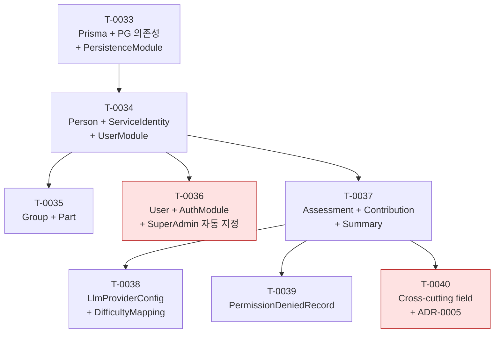

# P3 Implementation plan

> **본 문서는 Phase P3 (Domain core) 의 entry artifact ([T-0032](../tasks/T-0032-p3-entry-implementation-plan.md)) 의 산출물이다.** [docs/PLAN.md](../PLAN.md) Phase P3 의 **11 bullet (L51–60) 을 약 8 개의 T-NNNN task (T-0033 ~ T-0040) 시퀀스로 사전 매핑**한 single planning document. P3 의 모든 후속 task 는 본 문서를 reference 하여 (a) 누적 의존성 (b) ADR 신설 필요 시점 (c) 인간 승인 게이트 발화 시점 (d) entity / module 책임 분배의 일관성을 확보한다. **본 문서는 doc-only planning artifact** — 실제 코드 변경 · `pnpm add` · Prisma schema 작성 · NestJS module 구현은 본 task 에서 하지 **않으며**, T-0033+ 의 책임이다. 본 task 머지로 **Phase P2 → P3 phase 전이 entry marker** 박제.

## 1. 개요

본 문서의 범위는 [docs/architecture/INDEX.md](INDEX.md) 의 **MVA (Minimum Viable Architecture)** 원칙에 따라 **task 시퀀스 매핑만** 박제한다 — task ID / 책임 / 대응 PLAN bullet / dependsOn / ADR 필요 여부 / 인간 승인 게이트 / estimated LOC / 책임 module 8 컬럼 표 + 의존성 graph (mermaid) + ADR 신설 후보 list + Out of scope + References 까지. **구체 Prisma schema 코드 · NestJS module class · `pnpm add` 실행 · migration SQL 은 본 문서의 범위 밖** ([§ 7](#7-out-of-scope) 참조). 그 구체화는 T-0033+ 의 코드 task 의 책임이다.

본 문서의 기반:

- [docs/PLAN.md](../PLAN.md) Phase P3 단락 (L47–60) — **본 문서의 1차 source**. 11 bullet 의 매핑 대상.
- [docs/architecture/data-model.md](data-model.md) — T-0031 산출물. 10 entity (+1 conceptual mention) 의 책임 / 책임 module / 관계 inventory. 본 문서의 task row 의 entity scope 와 책임 module 컬럼의 source.
- [docs/architecture/modules.md](modules.md) — T-A4 산출물. 9 NestJS module (8 application + PersistenceModule) 의 이름 / 책임 / 의존성. 본 문서의 "책임 module" 컬럼 값의 source.
- [docs/architecture/directory.md](directory.md) — T-0021 산출물. `src/<module>/` layout. 본 문서가 박제할 후속 task 들이 어느 디렉토리에 코드를 추가할지의 source.
- [docs/decisions/ADR-0002-db.md](../decisions/ADR-0002-db.md) — **본 문서의 핵심 reference**. PostgreSQL + Prisma 결정 ACCEPTED. T-0033 의 `pnpm add prisma @prisma/client pg` 가 본 ADR 의 "범위 밖 (deferred)" 단락에서 명시한 인간 승인 게이트 대상.
- [docs/decisions/ADR-0003-deployment.md](../decisions/ADR-0003-deployment.md) — Monolith / 단일 DB 인스턴스. 본 task 시퀀스가 multi-DB 또는 microservice 로 빠지지 않도록.
- [CLAUDE.md](../../CLAUDE.md) §3.1 (commitMode 정책) / §3.2 (Test·CI R-110~R-114) / §5 (HITL — 새 외부 dependency 추가는 BLOCKED) — 본 task 시퀀스 표의 "인간 승인 게이트" 컬럼의 source.

## 2. P3 task 시퀀스 표

P3 11 bullet → 8 T-NNNN task 매핑. 각 row 의 estimated LOC ≤ 300 / 변경 파일 ≤ 5 ([CLAUDE.md §3](../../CLAUDE.md) cap discipline) 검산. 초과 예상 시 architect 가 후속 호출에서 split.

| task ID | 책임 | 대응 PLAN bullet ([PLAN.md](../PLAN.md)) | dependsOn | ADR 필요 여부 | 인간 승인 게이트 | est LOC | 책임 module |
| --- | --- | --- | --- | --- | --- | --- | --- |
| **T-0033** | Prisma + `pg` driver 의존성 추가 (`pnpm add prisma @prisma/client pg`) + ADR-0002 status 재확인 / 보강 ADR 검토 + `prisma/schema.prisma` skeleton (Person 1 entity 최소) + PrismaService 작성 + PersistenceModule skeleton (`@Global()` provider export) + Docker compose PostgreSQL 16 skeleton | Persistence layer (L58) | T-0032 | ADR-0002 status 재확인 (필요 시 보강 ADR — Prisma version / `pg` driver version 박제) | **있음 — 새 외부 dependency 3 종 추가 ([CLAUDE.md §5](../../CLAUDE.md) BLOCKED 게이트 의도적 발화)** | ~280 | PersistenceModule |
| **T-0034** | Person + ServiceIdentity entity Prisma model 추가 (T-0033 schema 확장) + UserModule skeleton (service / controller / repository) + Person CRUD + ServiceIdentity 1:N + Person.active soft delete invariant | 인원 관리 (L51) + 서비스 ID 매핑 (L52) + Primary key 역할 ID (L53) | T-0033 | 없음 (data-model.md §2/§3 의 entity / 관계 기반, 결정 추가 없음) | 없음 | ~290 | UserModule |
| **T-0035** | Group + Part entity Prisma model 추가 + Person↔Group N:M (join entity) + Person↔Part N:1 (mandatory) invariant 강제 + GroupService / PartService (UserModule 내부) | Group 정책 (L54) | T-0034 | 없음 | 없음 | ~250 | UserModule |
| **T-0036** | User (로그인 계정) entity Prisma model + AuthModule skeleton (login / session 또는 JWT — ADR 신설 동반) + 3 등급 role guard + 첫 로그인 SuperAdmin 자동 지정 + self-demote 금지 invariant + User↔Person 선택적 link (0..1:0..1) | Auth/RBAC 모델 (L59) + User read-only 권한 (L60) | T-0034 | **신설 — ADR-0004 (auth credential type: JWT vs session cookie)** ([api.md §2](api.md) 의 "P3 AuthModule 도입 task 의 ADR 에서 택일") | 없음 | ~300 | AuthModule |
| **T-0037** | Assessment + Contribution + Summary entity Prisma model + AssessmentModule skeleton (service / controller 골격) + raw 미저장 schema-level invariant 강제 (raw body column 0 LOC — 컬럼 자체 미정의) + Contribution↔Assessment 1:N + Person↔Assessment 1:N | 평가 결과 저장 모델 (L55) + raw data 저장 금지 (L56) + 상대 비교 가능 데이터 구조 (L57) | T-0034 | 없음 (REQ-032 invariant 는 schema 차원 enforce — ADR-0002 §3 으로 이미 박제됨) | 없음 | ~300 | AssessmentModule |
| **T-0038** | LlmProviderConfig + DifficultyMapping entity Prisma model + LlmModule skeleton (provider 추상화 gateway interface 만 — 5 provider 의 실제 HTTP client 는 P4) + API key column placeholder (encryption-at-rest 는 별도 ADR hook) | (P3 외 — P4 dependency. 본 task 위치는 P3 끝 — entity scaffold 는 Domain core 일부) | T-0037 | 없음 (LlmProviderConfig schema 만, encryption ADR 은 P4 hook) | 없음 (실제 API key 입력 / 외부 LLM 호출 0 — placeholder 만) | ~240 | LlmModule |
| **T-0039** | PermissionDeniedRecord entity Prisma model + ServiceIdentity↔Record 1:N + Person↔Record 1:N (reverse traversal) + audience field (user / admin) + AssessmentModule 의 event listener skeleton (실제 event emit 은 P4 의 GithubAdapter / ConfluenceAdapter 책임) | (P3 외 — P5 dependency. 본 task 위치는 P3 끝 — entity scaffold 만) | T-0037 | 없음 | 없음 | ~220 | AssessmentModule |
| **T-0040** | Cross-cutting field 적용 (createdAt / updatedAt / deletedAt / createdBy) 정책 박제 ADR + entity 별 soft/hard delete 결정 표 + Prisma `@default(now())` / `@updatedAt` 일괄 적용 + UTC vs KST timezone 결정 | (data-model.md §5 conceptual 의 schema-level 적용) | T-0037 | **신설 — ADR-0005 (cross-cutting field policy: timezone / soft delete entity inventory)** | 없음 | ~200 | (cross-cutting — 모든 entity 영향) |

**합계**: 8 task / 4 module (PersistenceModule / UserModule / AuthModule / AssessmentModule / LlmModule — modules.md 9 module 중 P3 scope 5 module, 외부 adapter 4 module 은 P4 책임) / 11 PLAN bullet cover (L51 L52 L53 L54 L55 L56 L57 L58 L59 L60 모두 매핑 + cross-cutting field 의 L0).

**Cap discipline 검산**: 모든 row 의 est LOC ≤ 300 / 변경 파일 ≤ 5 ([CLAUDE.md §3](../../CLAUDE.md)). T-0034 / T-0036 / T-0037 이 ~290–300 LOC 로 cap 임계 — 실제 작업 시 architect 가 split 권장 trigger (예: T-0034 split = PersonModule + ServiceIdentityModule 별도, T-0036 split = AuthModule scaffold 와 SuperAdmin 자동 지정 logic 별도).

**dependency cap 검산**: T-0033 root → T-0034 fan-out (T-0035, T-0036, T-0037 의 prerequisite 만) → T-0037 fan-out (T-0038, T-0039, T-0040) — cycle 0 (§3 graph 참조).

## 3. 의존성 graph (mermaid)

**graph 해석**:

- **노란/빨강 박스 (T-0033)** — root + 인간 승인 게이트. P3 의 모든 후속 task 의 transitive prerequisite. CLAUDE.md §5 BLOCKED 게이트 의도적 발화 — 사용자 승인 후 진행.
- **빨강 박스 (T-0036, T-0040)** — ADR 신설 동반 task (각각 ADR-0004 auth credential type, ADR-0005 cross-cutting field). 인간 승인 게이트는 없으나 reviewer 점검 강화 대상.
- **회색 박스 (그 외)** — 정상 진행 task. T-0034 가 fan-out hub (T-0035 / T-0036 / T-0037 모두 의존).
- **cycle 0 검산** — Topological order: T-0033 → T-0034 → {T-0035, T-0036, T-0037} → {T-0038, T-0039, T-0040}. cycle 없음.

## 4. ADR 신설 후보 list

본 task 는 ADR 을 신설하지 **않는다** — 후속 P3 task 가 신설할 ADR 의 candidate list 만 박제. 각 후보는 (a) 어느 task 가 책임 (b) 신설 사유 (c) source 명시.

| 후보 ADR | 책임 task | 신설 사유 | source |
| --- | --- | --- | --- |
| **ADR-0002 status 재확인** | T-0033 | ADR-0002 status 갱신 — 실제 `pnpm add prisma @prisma/client pg` 시점 + version (예: `prisma@5.x` / `pg@8.x`) 박제. 또는 보강 ADR 신설 (Prisma version pinning 정책 / `pg` driver 선택 근거). | [ADR-0002 §"범위 밖 (deferred)"](../decisions/ADR-0002-db.md) ("실제 `prisma` / `@prisma/client` 패키지 도입 — CLAUDE.md §5 BLOCKED 룰. P3 진입 시 별도 task.") |
| **ADR-0004 — Auth credential type (JWT vs session cookie)** | T-0036 | api.md §2 "Auth credential" 행이 "P3 AuthModule 도입 task 의 ADR 에서 택일 — 본 문서는 둘 다 허용 conceptual 박제". T-0036 진입 시 택일 + ADR 박제. | [api.md §2](api.md) Protocol/host 표 |
| **ADR-0005 — Cross-cutting field policy** | T-0040 | timezone (UTC vs KST) / soft delete entity 별 적용 표 / `createdBy` audit-source 박제. data-model.md §5 의 conceptual 박제를 schema-level 정책으로 격상. | [data-model.md §5](data-model.md) Cross-cutting field 단락 |
| **ADR-0006 (hook) — LLM API key encryption-at-rest** | P4 (T-0038 이후 별도 task) | LlmProviderConfig.apiKey 컬럼의 encryption mechanism (PostgreSQL `pgcrypto` / KMS / application-layer envelope encryption 등) 결정. T-0038 은 placeholder 만, 실제 encryption 은 P4 책임. | [data-model.md §7](data-model.md) "LLM API key 의 encryption-at-rest 구체 mechanism — 별도 보안 ADR" |
| **ADR-0007 (hook) — Audit log entity schema** | P3 끝 또는 P4 (별도 task) | data-model.md §2 의 conceptual mention "AuditLog" 의 구체 schema 박제. User mutation event (등급 변경 / 평가 삭제 / Import-Export) 의 영속화 정책. T-0039 의 PermissionDeniedRecord 와 분리 entity. | [data-model.md §2](data-model.md) entity 표의 conceptual mention row |

**합계**: 5 후보 ADR — 2 개는 P3 안에서 신설 (T-0033 + T-0036 + T-0040), 2 개는 P4 hook (ADR-0006 / ADR-0007). 본 task 는 후보 list 만 박제, 실제 신설은 각 책임 task 의 권한.

## 5. 인간 승인 게이트 (CLAUDE.md §5)

본 task 시퀀스 중 **T-0033 단일 task** 가 [CLAUDE.md §5](../../CLAUDE.md) 의 "새 외부 dependency 추가 BLOCKED 게이트" 를 의도적으로 발화한다 — `pnpm add prisma @prisma/client pg` 실행이 새 외부 패키지 3 종 추가.

**게이트 발화 절차** (T-0033 의 책임, 본 task 는 절차만 박제):

1. T-0033 의 executor 가 architect → implementer 호출 직전, 본 dependency 추가의 정당성을 STATE.json.humanQuestions 에 1 entry 로 박제 (정당성: ADR-0002 ACCEPTED + P3 진입 = persistence layer 필수).
2. STATUS=BLOCKED 반환 → notifier 호출 → 사용자 승인 대기.
3. 사용자 승인 후 다음 turn 의 driver 가 T-0033 을 재진입 → architect 가 ADR-0002 status 재확인 또는 보강 ADR 신설 → implementer 가 `pnpm add` 실행 + schema.prisma skeleton + PersistenceModule.
4. tester 가 `pnpm install` 후 `pnpm lint && pnpm build && pnpm test` 정합성 확인.

다른 P3 task (T-0034 ~ T-0040) 는 새 외부 dependency 추가 0 — 모두 T-0033 의 dependency 인프라 위에서 진행. 따라서 인간 승인 게이트 추가 발화 없음.

**T-0036 의 auth credential 결정** 도 ADR 신설은 동반하나 (ADR-0004), 외부 dependency 추가는 아니므로 인간 승인 게이트 발화 안 함 — ADR-0004 자체가 reviewer 점검 대상이므로 PR review 단계에서 충분.

## 6. P3 → P4 전이 조건

본 P3 task 시퀀스 (T-0033 ~ T-0040) 가 모두 머지되면 다음 조건이 충족되어 **Phase P3 complete** + Phase P4 entry 준비 완료:

- **10 entity Prisma model 박제** — data-model.md §2 의 10 entity (Person / ServiceIdentity / Group / Part / User / Assessment / Contribution / Summary / LlmProviderConfig / DifficultyMapping / PermissionDeniedRecord) 가 모두 `prisma/schema.prisma` 에 model 로 존재. AuditLog 는 conceptual mention 으로 deferred.
- **5 module skeleton 박제** — PersistenceModule / UserModule / AuthModule / AssessmentModule / LlmModule 의 `<module>.module.ts` + service / controller 골격 존재. modules.md 8 module 중 외부 adapter 4 module (GithubModule / ConfluenceModule + LlmModule 의 실제 HTTP client + SchedulerModule + WebModule) 은 P4+ 책임.
- **3 ADR 신설** — ADR-0002 status 재확인 + ADR-0004 (auth credential) + ADR-0005 (cross-cutting field).
- **raw 미저장 invariant schema-level 강제** — Assessment / Contribution / Summary 의 schema.prisma 에 raw body column 0 — reviewer agent 가 PR diff 의 `String` column 추가를 자동 검출 가능.

P4 (External integrations) entry 의 첫 task 는 별도 planner task 가 결정 — 본 문서 scope 외. 후보: GithubAdapter / ConfluenceAdapter / LlmGateway 의 실제 HTTP client 구현 + 외부 인증 dependency 추가 (예: `@octokit/rest`) + ADR-0006 (LLM API key encryption-at-rest) 신설.

## 7. Out of scope

본 task 는 **하지 않는다** — 다음 항목은 후속 task 의 책임 ([CLAUDE.md §3](../../CLAUDE.md) cap discipline + over-design 회피):

- **실제 Prisma schema 코드 작성** (`prisma/schema.prisma`) — T-0033 책임.
- **`pnpm add prisma @prisma/client pg` 실행** — 새 외부 dependency 추가는 [CLAUDE.md §5](../../CLAUDE.md) BLOCKED 게이트 발화 대상. T-0033 의 책임 + 인간 승인 동반.
- **새 ADR 신설** — 본 task 는 ADR 후보 list 만 박제. T-0033 / T-0036 / T-0040 이 각 ADR 신설.
- **NestJS module class 구현** (`src/persistence/persistence.module.ts` 등) — T-0033+ 책임.
- **Docker compose / PostgreSQL container** 설정 — T-0033 또는 별도 ops task 책임.
- **Migration SQL 작성** (`prisma/migrations/*.sql`) — T-0033+ 책임 (`prisma migrate dev` 자동 생성).
- **API endpoint controller 시그니처** — T-0034+ (각 module 의 controller 가 자체 시그니처 박제).
- **P4 / P5 / P6 / P7 phase 의 task 매핑** — 본 task 는 P3 scope 만. P4+ 의 entry document 는 각 phase 진입 시 별도 planner task.
- **data-model.md / api.md / components.md / modules.md / directory.md 갱신** — 본 task 는 P3 task 시퀀스 매핑만, P2 artifact 재편집 안 함.
- **gap REQ-004** (사용자 지정 기간 임의 평가문) 의 P3 영향 박제 — REQ-COVERAGE-AUDIT.md gap 은 P5 책임, 본 task 는 reference 만.
- **task 시퀀스의 의존성 cycle 검증 자동화** — mermaid graph 의 시각적 검증만, automated dependency linter 신설 안 함 (별도 ops task 또는 향후 ADR).

## 8. References

- [docs/PLAN.md](../PLAN.md) Phase P3 단락 (L47–60) — 본 문서의 1차 source. 11 bullet 의 매핑 대상.
- [docs/architecture/INDEX.md](INDEX.md) — architecture document 목록 + MVA 원칙. 본 문서가 row 신규 추가 대상.
- [docs/architecture/data-model.md](data-model.md) — T-0031 산출물. 10 entity (+1 conceptual) inventory. 본 task 시퀀스의 entity scope source.
- [docs/architecture/api.md](api.md) — T-0030 산출물. 9 resource prefix × 35 endpoint. T-0034+ controller 의 contract source.
- [docs/architecture/components.md](components.md) — T-A3 산출물. 8 component 의 boundary. 본 task 시퀀스의 module 매핑이 본 문서 component scope 와 일관.
- [docs/architecture/modules.md](modules.md) — T-A4 산출물. 9 NestJS module. 본 표 "책임 module" 컬럼 source.
- [docs/architecture/directory.md](directory.md) — T-0021 산출물. `src/<module>/` layout. T-0033+ 의 implementer 가 새 디렉토리 생성 시 참조.
- [docs/use-cases/INDEX.md](../use-cases/INDEX.md) — 8 UC backbone. P3 task 가 UC 의 어느 단락을 cover 하는지 cross-reference.
- [docs/use-cases/REQ-COVERAGE-AUDIT.md](../use-cases/REQ-COVERAGE-AUDIT.md) — T-0029 산출물. uc-covered 48 REQ × entity 매핑.
- [docs/requirements.md](../requirements.md) — REQ-NNN source of truth. 본 task frontmatter coversReq 22 REQ source.
- [docs/decisions/ADR-0001-stack.md](../decisions/ADR-0001-stack.md) — NestJS / TypeScript / Jest / pnpm stack.
- [docs/decisions/ADR-0002-db.md](../decisions/ADR-0002-db.md) — **본 문서의 핵심 reference**. PostgreSQL + Prisma ACCEPTED. T-0033 의 인간 승인 게이트 source.
- [docs/decisions/ADR-0003-deployment.md](../decisions/ADR-0003-deployment.md) — Monolith / 단일 DB 인스턴스. P3 task 가 multi-DB / microservice 로 빠지지 않도록.
- [CLAUDE.md](../../CLAUDE.md) §3.1 (commitMode) / §3.2 (R-110~R-114) / §5 (HITL 새 dependency BLOCKED) — 본 task "인간 승인 게이트" 컬럼 source.

Refs: T-0032, T-0031, T-0030, T-0029, T-0021, T-0017, T-0016, ADR-0001, ADR-0002, ADR-0003, REQ-023, REQ-024, REQ-025, REQ-026, REQ-027, REQ-028, REQ-032, REQ-037, REQ-038, REQ-041, REQ-043, REQ-044, REQ-045, REQ-046, REQ-049, REQ-050, REQ-051, REQ-052, REQ-053, REQ-054, REQ-055, REQ-063
