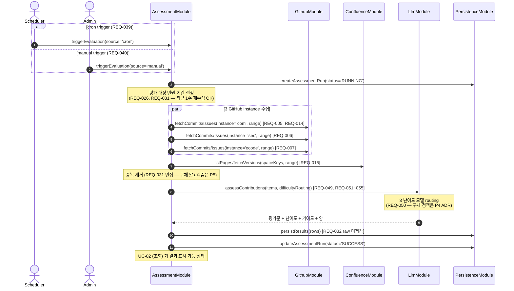

# UC-01 — 평가 실행 (자동 cron + manual trigger)

> **본 문서는 P2 의 첫 use case 본문 분해 task [T-0020](../tasks/T-0020-uc-01-evaluation-execution.md) 의 산출물이다.** [docs/use-cases/INDEX.md](INDEX.md) 의 UC-01 row 를 sequence diagram + 흐름 + 실패 경로 + component/module mapping 으로 풀어쓴다. 본 문서가 후속 UC-02~08 의 분해 template 이다.

## 1. 개요

본 use case 는 Assessment-Agent 의 **core flow** — 3 GitHub instance (github.com / github.sec.samsung.net / github.ecodesamsung.com) 의 commit/Issue/PR + 지정 Confluence SPACE 의 page 를 수집하여 LLM 으로 평가하고 DB 에 저장하는 평가 파이프라인의 1 회 실행을 박제한다 ([README.md](../../README.md) L11–50 Assessment Target 단락 + L72–73 평가 실행 제약). 본 시스템에서 식별된 13 primary REQ 가 본 UC 로 수렴하며, 8 component 중 6 / 8 module 중 6 을 거친다.

본 UC 는 [README.md](../../README.md) L72–73 의 두 트리거 (Admin cron 주기 지정 + Admin manual trigger) 를 단일 main flow 로 흡수한다 — trigger metadata 만 다를 뿐 평가 파이프라인 자체는 동일 ([components.md](../architecture/components.md) "Scheduler" 의 "manual trigger 는 Backend API endpoint 가 동일 service 메서드 호출 — duplication 0"). 본 UC 의 §5 sequence diagram 은 [ADR-0003 §1 — Monolithic NestJS process](../decisions/ADR-0003-deployment.md) + [§3 — `@nestjs/schedule` in-process](../decisions/ADR-0003-deployment.md) 의 결정 위에서 그려진다.

## 2. Actor

| actor | 책임 | 트리거 시점 |
| --- | --- | --- |
| **Scheduler** ([components.md](../architecture/components.md) Scheduler) | `@nestjs/schedule` 기반 in-process cron handler. Admin 이 DB 에 저장한 cron 표현식이 시각 도달 시 본인이 trigger 발화. SchedulerModule 안의 SchedulerRegistry 가 cron 표현식을 동적으로 등록·해제. | cron 시각 도달 (REQ-039 — 예: 매일 KST 02:00). |
| **Admin** (3 권한 등급 중 Admin / SuperAdmin, [README.md](../../README.md) L84) | Web UI 의 "평가 즉시 실행" 버튼을 클릭하여 manual trigger 발화. 또는 UC-06 (manual delete + 재수집) 의 후속으로 재실행 trigger 발화. | Admin 클릭 (REQ-040). |

User 등급은 본 UC 의 actor 가 아니다 — User 는 read-only ([README.md](../../README.md) L86, REQ-046) 이므로 평가 실행 trigger 권한 없음.

## 3. Trigger

본 UC 는 다음 3 가지 trigger 경로를 가지며, **모두 동일한 main flow (§5) 로 수렴**한다 — 차이는 trigger 의 출처 metadata 만 AssessmentRun row 에 기록된다.

1. **Cron 시각 도달** (Scheduler trigger) — `@Cron` decorator handler 가 시각 도달 시 AssessmentModule 의 평가 service 를 호출. cron 표현식은 DB 에 영속 저장되어 process restart 후에도 복원 (REQ-039). 본 conceptual 서술의 실 진입점은 P7 stream 에서 `GET/PUT/DELETE /api/schedules` REST endpoint ([T-0414](../tasks/T-0414-cron-schedule-controller-endpoints.md)/[T-0415](../tasks/T-0415-app-module-scheduling-import.md), PR #334, Admin+ RBAC) 로 shipped 됐으며 cron 주기를 런타임 등록/교체/조회/삭제한다. 단 shipped 구현은 정적 `@Cron` 데코레이터가 아니라 `CronScheduleService` 의 SchedulerRegistry 동적 등록 (재배포 없이 주기 변경, [ADR-0042 §Decision2](../decisions/ADR-0042-nestjs-schedule-adoption.md)) 이며, cron 표현식의 DB 영속화는 ADR-0042 §Consequences 대로 미shipped (in-memory registry, process restart 시 비복원) 다. 정확한 계약은 [api.md §5](../architecture/api.md) 표 (cron 주기 관리 행) 참조.
2. **Admin manual trigger** — Admin 이 Web UI 의 "평가 즉시 실행" 버튼 클릭 → Backend API endpoint → 동일 AssessmentModule service 메서드 호출 (REQ-040). 본 conceptual 서술의 실 진입점은 P7 stream 에서 `POST /api/schedules/trigger` REST endpoint ([T-0417](../tasks/T-0417-manual-trigger-endpoint.md), PR #336, Admin+ RBAC, REQ-040) 로 shipped 됐으며, cron tick callback 과 동일 실행 추상 (`CRON_TICK_HANDLER`) 을 공유해 manual / cron 두 경로가 같은 평가 실행 진입을 거친다.
3. **재수집 trigger** (UC-06 후속) — Admin 이 기존 평가 결과를 manual delete 한 직후 또는 Reset & Reeval 클릭 시 발화 (REQ-037 → UC-06 의 책임). 본 UC 의 main flow 와 동일하지만 평가 대상 시간 범위가 "비어있는 시간 구간" 으로 한정됨 ([README.md](../../README.md) L74 "다음 평가 진행 시 비어있는 시간만큼 다시 하게 된다"). 본 conceptual 서술의 실 진입점은 P7 stream 에서 `POST /api/schedules/recent-deletion/:personId` REST endpoint ([T-0428](../tasks/T-0428-uc-06-recent-deletion-manual-endpoint.md), PR #346, Admin+ RBAC) 로 shipped 됐으며, 내부적으로 `RecentDeletionRunnerService.runRecentDeletion` ([T-0427](../tasks/T-0427-uc-06-recent-deletion-runner.md), PR #344) 이 삭제 → 같은 기간 재수집 (`CollectionTriggerService` 위임) 을 orchestrate 한다 (REQ-041) — 단 실 deleter (`RECENT_DELETION_DELETER`) provider 바인딩은 schema/repository 게이트 동반 별도 sub-slice 로 아직 미shipped 라 현재 `deletedCount:0` 이 기본이다. 정확한 계약은 [api.md §5](../architecture/api.md) 표 (recent-deletion 행) 참조.

## 4. Preconditions

본 UC 의 main flow 진입 전 다음 조건이 모두 충족돼야 한다. 미충족 시 평가 파이프라인은 진입하지 않고 AssessmentRun 을 `SKIPPED` 또는 `BLOCKED` 로 마킹 (구체 상태 enum 은 P3 data-model.md 의 결정 — 본 UC 는 conceptual level).

1. **인증·권한** — trigger 의 출처가 Admin 권한 (manual trigger 의 경우) 또는 시스템 자체 (cron trigger) 임이 AuthModule 의 guard 로 검증됨 (REQ-043, REQ-044).
2. **GitHub instance 설정** — 3 instance 의 base URL + PAT + org 가 설정에 존재 ([components.md](../architecture/components.md) GitHub Adapter sub-config). 일부 instance 미설정 시 해당 instance 만 skip — 전체 평가는 진행 (partial flow).
3. **Confluence 설정** — 지정 SPACE list 가 1+ 설정됨 (REQ-015). 미설정 시 Confluence 단계 skip.
4. **LLM provider 설정** — 5 provider 중 1+ 가 endpoint + API key + model 식별자 매핑 완료 (REQ-049, REQ-051~055). 3 난이도 모델 슬롯 중 1+ 가 활성화 (REQ-050). 미설정 시 평가 진입 불가 — AssessmentRun 을 `BLOCKED` 로 마킹하고 UI 에 안내.
5. **평가 대상 인원 1+ 활성** — UserModule 의 평가 대상자 명단에 `active=true` 인 인원이 1+ 존재 (REQ-026, REQ-028). Deactivate 된 인원은 본 UC 의 대상에서 제외.
6. **이전 run idle** — `AssessmentRun.status IN ('RUNNING')` 인 row 가 0 — 동시 실행 회피 ([README.md](../../README.md) L78 "평가 진행 중일 때는 시각화를 기존 자료만 보여주며" 의 단일성 가정).

## 5. Main flow (sequence diagram)

step 수: 약 13 (autonumber 기준 — par/alt block 안의 호출 포함). 각 step 의 라벨은 한국어 + 관련 REQ ID 인라인 인용. 본 다이어그램은 [components.md](../architecture/components.md) 의 Component diagram + [modules.md](../architecture/modules.md) 의 의존성 그래프와 정합 — Scheduler → AssessmentModule, AssessmentModule → {Github, Confluence, Llm, Persistence} 의 방향이 모두 module 의존성 그래프에서 허용된 방향.

## 6. Alternative flows

### 6.1 Trigger 출처 차이만 다른 경우

§5 의 alt block 처럼 cron / manual trigger 의 차이는 AssessmentRun row 의 `source` metadata 컬럼 ('cron' / 'manual' / 'reevaluation') 으로만 표현. main flow 의 sequence 자체는 동일.

### 6.2 신규 인원의 1년치 평가 (REQ-027 분기)

평가 대상 인원이 새로 추가된 경우 ([README.md](../../README.md) L50, REQ-027), 본 UC 의 main flow 가 아니라 **별도 trigger path 로 분리** — 추가된 인원 1 명에 대해 최근 1년 범위의 1 회성 평가가 즉시 실행. 본 분기는 본 UC 의 alt 가 아니라 **P7 phase 의 별도 task (또는 본 UC 의 sub-flow 로 후속 분해)** 로 위임 — 본 task 의 scope 밖.

## 7. Error flows

본 UC 의 error path 는 다음 4 종. 각 path 의 구체 retry/backoff/cleanup 정책은 후속 phase 의 ADR 로 위임 — 본 UC 에서는 **경로 식별 + 이벤트 emit + 후속 UC 위임만** 명시 (MVA 원칙).

### 7.1 GitHub instance 4xx (권한 부족) → UC-08 위임

`GithubModule.fetchCommits()` 가 4xx (특히 401/403) 응답을 받으면 즉시 `PermissionDeniedEvent` 를 emit ([components.md](../architecture/components.md) GitHub Adapter 의 "4xx 응답 시 PermissionDeniedEvent emit" + REQ-008). AssessmentModule 이 본 event 를 catch 하여 해당 instance 의 평가를 skip 하고, partial flow 로 진행. event 의 후속 처리 (DB 기록 + Web UI 표시) 는 [UC-08](INDEX.md) 의 책임.

### 7.2 GitHub / Confluence 5xx (외부 시스템 일시 장애)

5xx 응답 시 재시도 (exponential backoff). 구체 retry 정책 (max attempts, base delay, jitter) 은 **P4 의 GitHub Adapter / Confluence Adapter task 의 ADR** 에서 결정. 최종 실패 시 AssessmentRun 을 `PARTIAL` 로 마킹하고 해당 instance/SPACE 만 skip — 나머지는 계속 진행.

### 7.3 LLM provider timeout / 5xx

`LlmModule.assessContributions()` 가 timeout 또는 5xx 시 fail-fast vs retry 정책 분기. 구체는 **P4 의 LLM Gateway task 의 ADR** 에서 결정. 최종 실패 시 해당 item 의 평가만 skip 하거나 `PARTIAL` 마킹. raw 본문은 DB 에 저장하지 않으므로 (REQ-032) 재실행 시 외부에서 다시 fetch 필요.

### 7.4 DB write fail → AssessmentRun FAILED

`PersistenceModule.persistResults()` 가 connection 끊김 / unique constraint violation / transaction 실패 시 AssessmentRun 을 `FAILED` 로 마킹. partial state cleanup 정책 (이미 저장된 일부 row 의 처리) 은 **P3 의 data-model.md 또는 별도 ADR** 에서 결정 — transaction boundary 의 선택에 따라 (per-item commit vs per-run transaction) 다름.

## 8. Postconditions

본 UC 의 main flow 가 종료된 후의 시스템 상태:

- **AssessmentRun row 1 개 생성** — `status IN ('SUCCESS', 'FAILED', 'PARTIAL', 'BLOCKED')`. `source`, `startedAt`, `endedAt`, trigger 출처 metadata 박제.
- **평가 결과 row N 개 생성** — 각 인원 × 각 commit/문서 단위 (REQ-033) 의 기여도·난이도·양·평가문. raw 본문 없음 (REQ-032 schema-level 강제).
- **일일 활동 요약 row (당일 자정 종료 이후만)** — REQ-034 — 구체 trigger 분기는 P5 의 책임 (본 UC 에서는 conceptual 만).
- **UI 가능 상태** — [UC-02](INDEX.md) 가 본 데이터를 sort / filter / 시계열로 조회 가능. 평가 진행 중에는 기존 자료만 표시 + 상단 경고 ([README.md](../../README.md) L78, REQ-042) — 이 상태 전이는 AssessmentRun.status 의 read 로 UC-02 가 판단.

## 9. Component / Module mapping

본 UC 가 거치는 6 component + 6 module ([INDEX.md](INDEX.md) UC-01 row 와 정확히 일치). 각 component 의 본 UC 에서의 책임은 1 줄로 한정 — 자세한 책임은 [components.md](../architecture/components.md) / [modules.md](../architecture/modules.md) 참조.

| component (T-A3) | module (T-A4) | 본 UC 에서의 책임 |
| --- | --- | --- |
| Scheduler | SchedulerModule | cron 시각 도달 시 trigger 발화 (REQ-039). |
| Worker (평가 파이프라인) | AssessmentModule (의 service layer) | 평가 orchestration — AssessmentRun 생성, 대상 인원·기간 결정, adapter 호출, LLM 호출, 결과 저장 (REQ-040, REQ-049). |
| GitHub Adapter | GithubModule | 3 instance 의 commit/Issue/PR 수집 + 4xx → PermissionDeniedEvent (REQ-005~007, REQ-008, REQ-014). |
| Confluence Adapter | ConfluenceModule | 지정 SPACE 의 page list/version 수집 (REQ-015). |
| LLM Gateway | LlmModule | 5 provider routing + 3 난이도 모델 routing (REQ-049, REQ-051~055). |
| DB Persistence | PersistenceModule | AssessmentRun + 평가 결과 row 저장 (REQ-032 raw 미저장). |

본 UC 에서 거치지 않는 2 component (Web UI / Backend API) + 3 module (WebModule / UserModule / AuthModule) 의 책임은 다음과 같이 위임:

- **Web UI / WebModule** — [UC-02](INDEX.md) (조회) 의 책임. 본 UC 의 §8 postcondition 이 UC-02 의 precondition.
- **Backend API (assessment controller)** — manual trigger endpoint 는 AssessmentModule 의 controller layer (Backend API component 의 일부) — 본 표의 AssessmentModule 책임에 포함.
- **AuthModule** — manual trigger endpoint 의 guard 책임. 본 UC 의 §4 precondition 1 에서만 등장.
- **UserModule** — 평가 대상 인원 명단의 read 만 — AssessmentModule 이 PersistenceModule 경유 read 하므로 본 UC 의 sequence 에 명시적으로 등장하지 않음.

## 10. 관련 REQ

본 UC 가 cover 하는 13 primary REQ + 4 인접 REQ. 각 REQ 가 본 UC 의 어느 section/step 에서 cover 되는지 명시.

| REQ | 요약 | 본 UC 의 cover 위치 |
| --- | --- | --- |
| REQ-005 | github.com 평가 | §5 step 5 / §9 GithubModule |
| REQ-006 | github.sec.samsung.net 평가 | §5 step 6 / §9 GithubModule |
| REQ-007 | github.ecodesamsung.com 평가 | §5 step 7 / §9 GithubModule |
| REQ-014 | Issue 평가 | §5 step 5–7 / §9 GithubModule |
| REQ-015 | Confluence 지정 SPACE 평가 | §5 step 8 / §9 ConfluenceModule |
| REQ-039 | Admin cron 주기 지정 | §3 trigger 1 / §5 alt cron / §9 Scheduler |
| REQ-040 | Admin manual trigger | §3 trigger 2 / §5 alt manual / §9 Worker |
| REQ-049 | Admin 이 LLM 모델 지정 | §4 precondition 4 / §5 step 10 / §9 LlmModule |
| REQ-051 | custom LLM provider | §5 step 10 / §9 LlmModule |
| REQ-052 | Azure OpenAI provider | §5 step 10 / §9 LlmModule |
| REQ-053 | Anthropic provider | §5 step 10 / §9 LlmModule |
| REQ-054 | Google Gemini provider | §5 step 10 / §9 LlmModule |
| REQ-055 | OpenAI provider | §5 step 10 / §9 LlmModule |
| REQ-008 (인접) | 권한 부족 통지 (GitHub) | §7.1 → UC-08 위임 |
| REQ-031 (인접) | 재수집 중복 방지 + 최근 1주 재수집 OK | §4 precondition / §5 step 9 (중복 제거) |
| REQ-032 (인접) | Raw 저장 금지 | §5 step 11 / §8 postcondition |
| REQ-034 (인접) | 일일 활동 요약 평가문 | §8 postcondition (P5 분리) |

분기 cover: §5 의 alt cron/manual + §6.1 trigger 차이 + §7 의 4 error path = main + alt + error 분기 모두 박제.

## 11. References

- [docs/use-cases/INDEX.md](INDEX.md) — UC-01 row 의 source. 본 UC 의 §9 mapping 이 INDEX.md 의 "주요 component / 주요 module" 컬럼과 정확히 일치.
- [docs/architecture/api.md §5](../architecture/api.md) — §3 trigger 3 (재수집 trigger) 의 shipped 진입점 `POST /api/schedules/recent-deletion/:personId` (recent-deletion 행, REQ-041) 의 계약 source. UC §5 conceptual 흐름 대비 실 endpoint 매핑 권위.
- [docs/architecture/api.md §5](../architecture/api.md) — §3 trigger 1·2 의 shipped 진입점 cron 주기 관리 (`/api/schedules`) 행 (`GET/PUT/DELETE /api/schedules` cron CRUD REQ-039 + `POST /api/schedules/trigger` manual trigger REQ-040) 의 계약 source.
- [docs/architecture/components.md](../architecture/components.md) — 본 UC 가 거치는 6 component 의 책임 + contract 정의.
- [docs/architecture/modules.md](../architecture/modules.md) — 본 UC 가 거치는 6 module 의 책임 + 의존성 그래프.
- [docs/requirements.md](../requirements.md) — 본 UC 의 13 primary REQ + 4 인접 REQ row 의 source.
- [docs/decisions/ADR-0003-deployment.md](../decisions/ADR-0003-deployment.md) — Scheduler 의 `@nestjs/schedule` 결정 (§3) + monolithic process 결정 (§1) — 본 UC 의 sequence 가 본 결정 위에서 그려짐.
- [docs/architecture/INDEX.md](../architecture/INDEX.md) — architecture document 인덱스 + MVA 원칙 (본 UC 의 작성 style).
- [README.md](../../README.md) L11–50 (Assessment Target — 3 GitHub + Confluence + 평가 목표) / L72–73 (cron + manual trigger) / L96–103 (5 LLM provider).
- [docs/tasks/T-0020-uc-01-evaluation-execution.md](../tasks/T-0020-uc-01-evaluation-execution.md) — 본 UC 의 분해 task.
- [docs/tasks/T-0019-p2-entry-use-case-index.md](../tasks/T-0019-p2-entry-use-case-index.md) — 직전 P2-Entry task 의 산출물 (INDEX.md 신설).

Refs: T-0020, T-0019, T-0016, T-0017, ADR-0003, REQ-005, REQ-006, REQ-007, REQ-008, REQ-014, REQ-015, REQ-031, REQ-032, REQ-034, REQ-039, REQ-040, REQ-049, REQ-051, REQ-052, REQ-053, REQ-054, REQ-055
