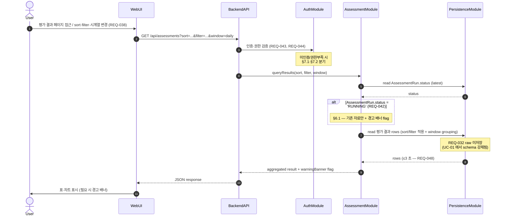

# UC-02 — 평가 결과 조회 / sort / filter / 시계열

> **본 문서는 P2 의 두 번째 use case 본문 분해 task [T-0022](../tasks/T-0022-uc-02-evaluation-query.md) 의 산출물이다.** [docs/use-cases/INDEX.md](INDEX.md) 의 UC-02 row 를 sequence diagram + 흐름 + 실패 경로 + component/module mapping 으로 풀어쓴다. [UC-01](UC-01-evaluation-execution.md) 의 11 section template 을 그대로 적용한다.

## 1. 개요

본 use case 는 Assessment-Agent 의 **second core flow** — [UC-01](UC-01-evaluation-execution.md) 평가 실행으로 DB 에 저장된 평가 결과를 Web UI 가 sort / filter / 시계열로 조회하는 read-only 흐름을 박제한다 ([README.md](../../README.md) L68–71 "평가 자료의 시각화와 UI" 단락 — 이름·ID·지표별 sort + filter + 일·주·월 시계열). UC-01 의 §8 postcondition (AssessmentRun + 평가 결과 row + 일일 요약) 이 본 UC 의 precondition 이며, 두 UC 가 **자연 페어** 로서 본 시스템의 1·2 most-used flow 를 구성한다.

본 UC 는 8 component 중 3 (Web UI / Backend API / DB Persistence) + 8 module 중 4 (WebModule / AssessmentModule / AuthModule / PersistenceModule) 만 거치며, 외부 시스템 (GitHub / Confluence / LLM provider) 은 호출하지 않는다 — 본 UC 는 순수 read-only 이므로 [ADR-0003 §1 monolithic NestJS process](../decisions/ADR-0003-deployment.md) 안에서 Web UI → Backend API → DB Persistence 의 단일 in-process hop 만으로 완결된다. NFR 제약은 [README.md](../../README.md) L92 의 "조회 3 초 이내" (REQ-048) 와 L78 의 "평가 진행 중 기존 자료만 + 경고 배너" (REQ-042).

## 2. Actor

| actor | 책임 | 본 UC 내 권한 |
| --- | --- | --- |
| **User** ([README.md](../../README.md) L86) | 평가 결과 조회 / sort / filter / 시계열 변경. read-only ([REQ-046](../requirements.md)). | 본 UC 의 모든 main flow 사용 가능 — 단 권한 별 노출 컬럼 매트릭스는 UC-04 의 책임. |
| **Admin / SuperAdmin** ([README.md](../../README.md) L84) | User 와 동일한 조회 권한 + 추가 권한 (재작성·Reset·Import/Export·인원 편집 등 — REQ-045) 보유. 본 UC scope 안에서는 read 만 cover, 추가 권한 흐름은 UC-06 / UC-07 의 책임. | User 와 동일 + Admin 전용 컬럼 (있다면) 조회 가능. |

본 UC 는 인증 완료된 3 등급 사용자 모두 actor — User read-only 가 REQ-046 의 핵심이며 본 UC 의 main flow 가 User 등급에서도 fully 동작해야 한다.

## 3. Trigger

본 UC 는 다음 4 가지 trigger 경로를 가지며, **모두 동일한 main flow (§5) 로 수렴** — 차이는 BackendAPI 가 받는 query 파라미터의 값만 다르다.

1. **평가 결과 페이지 최초 접근** — 사용자가 로그인 후 Web UI 의 "평가 결과" 메뉴 클릭. default sort 컬럼 (예: 이름) + filter 없음 + 시계열 단위 (예: 일) 로 진입.
2. **Sort 컬럼 변경** — 사용자가 결과 표의 컬럼 헤더 (이름 / ID / 지표) 를 클릭하여 sort 컬럼 또는 방향 (asc/desc) 변경 ([REQ-038](../requirements.md)). server-side sort 가 default — 본 UC §6.2 참조.
3. **Filter 조건 변경** — 사용자가 이름 / ID / 지표 수치 범위 입력 ([REQ-038](../requirements.md)). 결과 표가 filter 조건 기준으로 재조회.
4. **시계열 단위 변경** — 사용자가 일 / 주 / 월 의 grouping window 를 변경 ([REQ-038](../requirements.md)). 시계열 차트 영역의 데이터가 grouping 단위로 재집계되어 표시.

## 4. Preconditions

본 UC 의 main flow 진입 전 다음 조건이 모두 충족돼야 한다. 미충족 시 §7 의 error path 로 분기.

1. **인증 완료** — 사용자가 로그인하여 AuthModule 의 session / JWT 검증 통과 ([REQ-043](../requirements.md)). 미인증 시 §7.1.
2. **사용자 등급 식별** — User / Admin / SuperAdmin 중 1 등급으로 식별 ([REQ-044](../requirements.md)). 본 UC 의 read 권한은 3 등급 모두 보유 (REQ-046).
3. **평가 데이터 1+ row 존재** — UC-01 의 1+ successful run 후 PersistenceModule 의 평가 결과 테이블에 row 가 존재. 0 row 인 경우 §7.4.
4. **DB Persistence 가용** — PostgreSQL connection pool 정상. connection 끊김 / timeout 시 §7.3.

## 5. Main flow (sequence diagram)

step 수: 약 12 (autonumber 기준 — alt block 안의 분기 포함). 본 다이어그램은 [components.md](../architecture/components.md) 의 Component diagram + [modules.md](../architecture/modules.md) 의 의존성 그래프와 정합 — Web UI → Backend API, Backend API → {AuthModule, AssessmentModule}, AssessmentModule → PersistenceModule 의 방향이 모두 의존성 그래프에서 허용된 방향. 외부 시스템 호출 없음 — read-only flow 의 자연스러운 귀결.

## 6. Alternative flows

### 6.1 평가 진행 중 조회 (REQ-042)

`AssessmentRun.status = 'RUNNING'` 인 경우 — UC-01 의 평가 파이프라인이 실행 중. AssessmentModule 이 latest run 의 status 를 read 한 결과가 RUNNING 이면 결과 응답에 `warningBanner=true` flag 를 포함하고, 평가 결과 rows 는 **직전 successful run 의 데이터만** read ([README.md](../../README.md) L78). WebUI 가 응답을 받아 표시 시 상단에 "평가 진행 중 — 표시되는 데이터는 직전 평가 결과" 경고 배너를 노출. 배너의 정확한 위치 / 색상 / 문구는 P6 UX 책임 — 본 UC 는 conceptual level 만 박제.

### 6.2 Sort / filter 의 server-side vs client-side 분기

본 UC 는 **server-side sort/filter 를 default 로 명시** — sort 컬럼 변경 / filter 조건 변경 시 WebUI 가 새 query 파라미터로 BackendAPI 를 재호출. 이유: (a) 대용량 결과 row (수천 건 이상) 의 경우 client 메모리 부담, (b) 시계열 grouping 이 server-side aggregation 과 자연스럽게 묶임, (c) REQ-048 의 3 초 SLA 가 server-side index / query plan 으로 충족 용이. client-side sort/filter 의 도입 (예: 한 페이지 결과의 빠른 in-browser 재정렬) 여부와 boundary 는 **P6 Web UI ADR** 의 책임 — 본 UC 의 scope 밖.

### 6.3 시계열 단위 변경 (일 / 주 / 월)

main flow 와 동일하되 BackendAPI 의 `window` 파라미터 값만 `daily` / `weekly` / `monthly` 로 다름. PersistenceModule 의 query 가 grouping window 에 따라 SQL `DATE_TRUNC` 또는 동등 표현식을 사용 (구체 SQL 은 P3 의 data-model.md / 평가 결과 schema 의 책임). 시계열 차트 라이브러리 (Chart.js / Recharts / D3 등) 결정은 P6 Web UI 의 별도 ADR — 본 UC 는 일·주·월 단위로 표시 가능 까지만 박제.

## 7. Error flows

본 UC 의 error path 는 다음 4 종.

### 7.1 인증 실패 (REQ-043)

`AuthModule` guard 가 session / JWT 검증 실패 (만료 / 위조 / 미존재) → 401 return → WebUI 가 사용자를 login 페이지로 redirect. 본 UC 의 main flow 진입 자체가 차단되며, 평가 결과 데이터는 노출되지 않는다.

### 7.2 권한 부족 (REQ-046)

사용자 등급이 식별됐으나 일부 컬럼이 등급 별 노출 제한 대상인 경우 (예: User 가 Admin 전용 컬럼 접근 시도) → 403 return 또는 응답에서 해당 컬럼이 마스킹·제거. 본 UC 의 main flow 는 진행되지만 사용자가 보는 결과 표의 컬럼이 등급에 따라 다름. 권한 별 노출 컬럼 매트릭스 (User 가 보면 안 되는 컬럼이 있는지) 는 [UC-04](INDEX.md) 의 책임 — 본 UC 는 "권한 부족 → 접근 가능 컬럼만 표시" 의 conceptual level 만.

### 7.3 DB read fail

`PersistenceModule` 이 connection 끊김 / timeout / query 실패 시 5xx return → WebUI 가 사용자에게 "일시적 오류 — 재시도해주세요" 안내. 본 UC 의 retry / backoff 정책은 **HTTP client level 의 표준 retry 만** — sort/filter/시계열 query 자체는 idempotent 하므로 안전. 구체 retry max attempts / base delay 는 P6 Web UI 의 책임 — 본 UC 는 경로 식별만.

### 7.4 평가 데이터 0 row

UC-01 이 1 번도 successful run 안 한 상태 — PersistenceModule 의 평가 결과 테이블이 비어있음. AssessmentModule 이 empty result 를 BackendAPI 에 반환하면 WebUI 가 "평가 데이터 없음" 안내 + Admin 에게 manual trigger 안내 ([UC-01](UC-01-evaluation-execution.md) 의 manual trigger 경로 link). 본 분기는 error 라기보다 **빈 상태의 정상 표시** — UC-01 이 완료되면 자연 해소.

## 8. Postconditions

본 UC 는 **read-only operation** 이므로 평가 데이터의 상태 변경은 없다. main flow 가 종료된 후의 시스템 상태:

- **시스템 상태 변경 없음** — AssessmentRun / 평가 결과 row 의 read 만 발생. PersistenceModule 의 write 없음.
- **사용자 화면** — Web UI 에 평가 결과 표 + 시계열 차트 표시. 평가 진행 중인 경우 (§6.1) 상단에 경고 배너.
- **Audit log 1 row 생성** — 조회 ID + user + timestamp + filter 파라미터 박제 (감사 추적 목적). 구체 schema 는 [P3 data-model.md](../architecture/INDEX.md) 의 책임 — 본 UC 는 "Audit log 1 row 생성" 까지만.
- **NFR 충족** — 본 UC 의 main flow 가 ≤3 초 안에 사용자 화면 도착 (REQ-048). perf test 의 구체 시나리오는 P7 (Cross-cutting NFR) 의 책임.

## 9. Component / Module mapping

본 UC 가 거치는 3 component + 4 module ([INDEX.md](INDEX.md) UC-02 row 와 정확히 일치). 각 component 의 본 UC 에서의 책임은 1 줄로 한정.

| component (T-A3) | module (T-A4) | 본 UC 에서의 책임 |
| --- | --- | --- |
| Web UI | WebModule | 평가 결과 페이지 SPA — 표 / 시계열 차트 / sort·filter·window 컨트롤 + 경고 배너 (REQ-038, REQ-042). |
| Backend API | AssessmentModule (controller) + AuthModule (guard) | `GET /api/assessments?sort=...&filter=...&window=...` endpoint 노출 + 인증·권한 guard 적용 (REQ-038, REQ-043, REQ-044, REQ-046). |
| DB Persistence | PersistenceModule | 평가 결과 row read + sort/filter/grouping query + AssessmentRun.status read (REQ-032 raw 미저장 — schema-level 강제, REQ-048 ≤3 초 query plan). |

본 UC 에서 거치지 않는 5 component (Scheduler / Worker / GitHub Adapter / Confluence Adapter / LLM Gateway) + 4 module (SchedulerModule / GithubModule / ConfluenceModule / LlmModule) 의 책임 위임:

- **Scheduler / SchedulerModule** — [UC-01](UC-01-evaluation-execution.md) (cron trigger) 의 책임. 본 UC 는 read-only 이므로 cron 발화 없음.
- **Worker / AssessmentModule service layer (평가 파이프라인)** — UC-01 의 책임. AssessmentModule 의 controller layer (조회 endpoint) 만 본 UC 가 사용 — 같은 module 의 다른 layer 책임.
- **GitHub Adapter / Confluence Adapter / LLM Gateway** + 대응 module — UC-01 의 책임. 본 UC 는 저장된 결과만 read 하므로 외부 시스템 호출 없음.
- **UserModule** — 사용자 메타데이터 (인원 명단) 의 CRUD 는 [UC-03](INDEX.md) 의 책임. 본 UC 의 결과 표에서 인원 이름 / ID 표시는 PersistenceModule 경유 read 만으로 충족 — UserModule controller 직접 호출 없음.

## 10. 관련 REQ

본 UC 가 cover 하는 4 primary REQ + 3 인접 REQ. 각 REQ 가 본 UC 의 어느 section/step 에서 cover 되는지 명시.

| REQ | 요약 | 본 UC 의 cover 위치 |
| --- | --- | --- |
| REQ-038 | UI 조회 / sort / filter / 시계열 | §3 trigger 1–4 / §5 step 1–2, 8 / §6.2, §6.3 / §9 WebUI + Backend API |
| REQ-042 | 평가 진행 중 시각화 보호 (기존 자료 + 경고 배너) | §5 alt block / §6.1 / §8 postcondition |
| REQ-046 | User read-only (조회/sort/filter) | §2 actor / §7.2 / §9 AuthModule |
| REQ-048 | 조회·시각화 3 초 이내 | §5 step 9 / §8 postcondition |
| REQ-043 (인접) | 모든 기능 ID/Password 보호 | §4 precondition 1 / §5 step 3 / §7.1 / §9 AuthModule |
| REQ-044 (인접) | 3 권한 등급 / 승급 / SuperAdmin Admin→User | §4 precondition 2 / §5 step 3 / §9 AuthModule (등급 식별만 — 승급 흐름은 UC-04 의 책임) |
| REQ-045 (인접) | Admin 권한 (재작성/Reset/Import/Export/인원편집/Group편집) | §2 actor (Admin 등급 추가 권한 보유 표시 — 실제 흐름은 UC-06 / UC-07 의 책임) |

본 task 는 production code 0 LOC + 분기 0 + 새 public symbol 추가 0 — [CLAUDE.md](../../CLAUDE.md) §3.2 R-112 의 4 항목 (happy / error / branch / negative) 모두 N/A. mermaid sequence 의 alt block 이 §6.1 평가 진행 중 분기를 박제하며, error flow 4 종 (§7.1~§7.4) 이 인증 실패 / 권한 부족 / DB read fail / 0 row 의 negative path 를 cover.

## 11. References

- [docs/use-cases/INDEX.md](INDEX.md) — UC-02 row 의 source. 본 UC 의 §9 mapping 이 INDEX.md 의 "주요 component / 주요 module" 컬럼과 정확히 일치.
- [docs/use-cases/UC-01-evaluation-execution.md](UC-01-evaluation-execution.md) — 본 UC 의 자연 페어. UC-01 의 §8 postcondition 이 본 UC 의 §4 precondition.
- [docs/architecture/components.md](../architecture/components.md) — 본 UC 가 거치는 3 component (Web UI / Backend API / DB Persistence) 의 책임 + contract 정의.
- [docs/architecture/modules.md](../architecture/modules.md) — 본 UC 가 거치는 4 module (WebModule / AssessmentModule / AuthModule / PersistenceModule) 의 책임 + 의존성 그래프.
- [docs/requirements.md](../requirements.md) — 본 UC 의 4 primary REQ + 3 인접 REQ row 의 source.
- [docs/decisions/ADR-0003-deployment.md](../decisions/ADR-0003-deployment.md) — monolithic NestJS process (§1) — 본 UC 의 in-process hop 1 단계의 근거.
- [docs/architecture/INDEX.md](../architecture/INDEX.md) — architecture document 인덱스 + MVA 원칙 (본 UC 의 작성 style).
- [README.md](../../README.md) L68–71 (평가 자료의 시각화와 UI) / L78 (평가 진행 중 기존 자료 + 경고 배너) / L84–86 (3 권한 등급 + User read-only) / L92 (조회 3 초 이내).
- [docs/tasks/T-0022-uc-02-evaluation-query.md](../tasks/T-0022-uc-02-evaluation-query.md) — 본 UC 의 분해 task.
- [docs/tasks/T-0020-uc-01-evaluation-execution.md](../tasks/T-0020-uc-01-evaluation-execution.md) — 직전 UC-01 task (본 UC 의 template).

Refs: T-0022, T-0020, T-0019, T-0016, T-0017, ADR-0003, REQ-038, REQ-042, REQ-043, REQ-044, REQ-045, REQ-046, REQ-048
