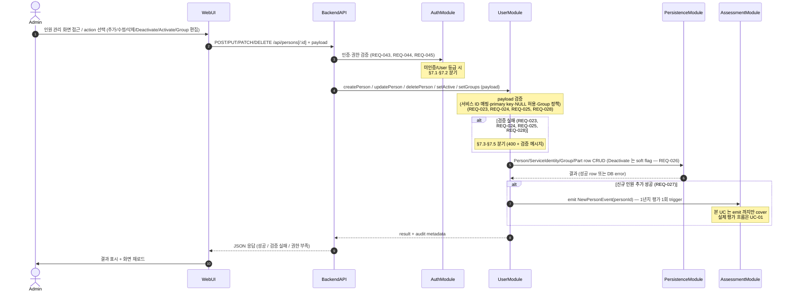

# UC-03 — 평가 대상 인원 CRUD + Group/파트 + Activate/Deactivate

> **본 문서는 P2 의 세 번째 use case 본문 분해 task [T-0023](../tasks/T-0023-uc-03-person-crud.md) 의 산출물이다.** [docs/use-cases/INDEX.md](INDEX.md) 의 UC-03 row 를 sequence diagram + 흐름 + 실패 경로 + component/module mapping 으로 풀어쓴다. [UC-01](UC-01-evaluation-execution.md) / [UC-02](UC-02-evaluation-query.md) 의 11 section template 을 그대로 적용한다.

## 1. 개요

본 use case 는 Assessment-Agent 의 **third core flow** — Admin 이 Web UI 의 인원 관리 화면에서 평가 대상 인원의 master data 를 CRUD 하고, 다중 임의 Group + 단일 조직도 파트를 편집하며, 휴직 등의 사유로 평가 대상에서 일시 제외 (Deactivate) 또는 재포함 (Activate) 시키는 흐름을 박제한다 ([README.md](../../README.md) L36–58 "평가 대상 인원" 단락). 인원 master data 는 한 인원이 N 서비스 ID (github.com / github.sec / github.ecode / confluence.sec) 를 가지며 일부 NULL 허용 ([REQ-023](../requirements.md), [REQ-025](../requirements.md)), 그 중 1 개를 primary key 역할 ID 로 지정 ([REQ-024](../requirements.md)) 하는 구조다. Group 정책은 임의 group N 개 + 조직도 파트 정확히 1 개 ([REQ-028](../requirements.md)).

본 UC 는 [UC-01](UC-01-evaluation-execution.md) (평가 실행) / [UC-02](UC-02-evaluation-query.md) (평가 결과 조회) 와 **P2 의 core triad** 를 구성한다 — UC-01 의 평가 파이프라인이 사용하는 "평가 대상자 명단" 과 UC-02 의 결과 표가 사용하는 "인원 이름·ID 라벨" 이 모두 본 UC 가 관리하는 인원 데이터 위에서 동작한다. 본 UC 는 8 component 중 3 (Web UI / Backend API / DB Persistence) + 8 module 중 4 (WebModule / UserModule / AuthModule / PersistenceModule) 만 거치며, 외부 시스템 (GitHub / Confluence / LLM provider) 은 호출하지 않는다 — 인원 master data 의 in-process CRUD 만으로 완결되는 [ADR-0003 §1 monolithic NestJS process](../decisions/ADR-0003-deployment.md) 안의 단일 hop 흐름이다. 단 §6.3 의 "신규 인원 추가 시 1년치 평가 1회 trigger" ([REQ-027](../requirements.md)) 만 UC-01 의 평가 파이프라인을 별도 event 로 깨운다 (본 UC 는 trigger 발화까지만 cover).

## 2. Actor

| actor | 책임 | 본 UC 내 권한 |
| --- | --- | --- |
| **Admin** ([README.md](../../README.md) L84, [REQ-045](../requirements.md)) | 평가 대상 인원의 CRUD + Group/파트 편집 + Activate/Deactivate. Admin 권한 등급의 핵심 책무. | 본 UC 의 모든 main flow + alt flow 사용 가능. |
| **SuperAdmin** ([README.md](../../README.md) L84, [REQ-044](../requirements.md)) | Admin 의 super set — 권한·계정 관리 ([UC-04](INDEX.md)) 외에 Admin 의 모든 권한 보유. | Admin 과 동일. |
| **User** ([README.md](../../README.md) L86, [REQ-046](../requirements.md)) | read-only 등급 — 본 UC 의 actor 아님. | 본 UC 호출 시 §7.2 (403) 로 차단. |

본 UC 는 Admin / SuperAdmin 만 actor — User 가 본 UC 의 main flow 진입 시 AuthModule guard 가 §7.2 로 분기한다. 사용자 (login 가능 계정) 자체의 CRUD / 등급 승급은 [UC-04](INDEX.md) 의 책임이며, 본 UC 는 평가 대상 **인원** (사람) 의 master data 만 다룬다 — 두 개념을 혼동하지 않는다.

## 3. Trigger

본 UC 는 다음 6 가지 sub-trigger 경로를 가지며, **모두 동일한 main flow (§5) 로 수렴** — 차이는 BackendAPI 가 받는 write payload 의 종류 (HTTP method + body) 만 다르다.

1. **인원 추가** — Web UI 인원 관리 화면에서 "신규 인원 추가" 버튼 → 서비스 ID 매핑 + primary key 지정 + Group/파트 입력 → 저장 ([REQ-023](../requirements.md), [REQ-024](../requirements.md), [REQ-025](../requirements.md), [REQ-027](../requirements.md), [REQ-028](../requirements.md)).
2. **인원 수정** — 기존 인원 row 의 서비스 ID·primary ID·이름·이메일 등 편집 ([REQ-023](../requirements.md), [REQ-024](../requirements.md), [REQ-025](../requirements.md)).
3. **인원 삭제 (hard delete)** — 인원 row 완전 제거 ([REQ-026](../requirements.md)). 참조 무결성 cascade 정책은 P3 의 책임 (§6.1 참조).
4. **Deactivate** — 휴직·이직 등의 사유로 평가 대상자 명단에서 숨김 (soft delete flag, [REQ-026](../requirements.md)). 기존 평가 데이터는 보존.
5. **Activate** — Deactivated 인원을 다시 평가 대상에 포함 ([REQ-026](../requirements.md)). UC-01 의 다음 cron 발화 시점부터 평가에 재포함.
6. **Group 편집** — 임의 group N 개 추가/삭제 + 조직도 파트 1 개 변경 ([REQ-028](../requirements.md)).

## 4. Preconditions

본 UC 의 main flow 진입 전 다음 조건이 모두 충족돼야 한다. 미충족 시 §7 의 error path 로 분기.

1. **인증 완료** — 사용자가 로그인하여 AuthModule 의 session / JWT 검증 통과 ([REQ-043](../requirements.md)). 미인증 시 §7.1.
2. **사용자 등급 = Admin or SuperAdmin** — User 등급은 본 UC 의 actor 아님 ([REQ-044](../requirements.md), [REQ-045](../requirements.md)). User 가 호출 시 §7.2.
3. **DB Persistence 가용** — PostgreSQL connection pool 정상. connection 끊김 / timeout 시 §7.4.

## 5. Main flow (sequence diagram)

step 수: 약 11 (autonumber 기준 — alt block 안의 분기 포함, 8 ≤ 11 ≤ 14 범위 안). 본 다이어그램은 [components.md](../architecture/components.md) 의 Component diagram + [modules.md](../architecture/modules.md) 의 의존성 그래프와 정합 — Web UI → Backend API, Backend API → {AuthModule, UserModule}, UserModule → PersistenceModule, UserModule -event-> AssessmentModule 의 방향이 모두 의존성 그래프에서 허용된 방향. AssessmentModule 은 본 UC 에서 직접 호출 아닌 event 기반 receiver — UC-01 의 책임으로 위임.

## 6. Alternative flows

### 6.1 Deactivate vs Delete 의 차이 (REQ-026)

본 UC 는 **두 가지 "제거" 흐름** 을 명확히 구분한다. **Deactivate (soft)** — Person row 의 `isActive` flag 만 false 로 toggle, 기존 평가 데이터는 보존, UC-01 다음 cron 발화 시 평가 대상자 명단 제외 (휴직·이직 시 default). **Delete (hard)** — Person row 자체 제거. 참조 무결성 cascade vs restrict 정책 (Person → AssessmentRun → 평가 결과 row) 은 P3 data-model.md 의 책임. 실제 운영에서는 Deactivate 가 권장 default 이며 Delete 는 잘못 추가된 인원 등 예외 케이스에 한정.

**Deactivate / Activate 의 trigger** 는 별도 endpoint 가 아닌 `PATCH /api/persons/:id` 의 partial update 로 cover — `{active:false}` 가 Deactivate, `{active:true}` 가 Activate. 다른 필드 (`fullName` / `email`) 와의 동시 patch 도 허용되어 한 번의 요청으로 reactivate + 이름 변경을 동시에 수행 가능 (RFC-7396 JSON Merge Patch semantic, REQ-026 + REQ-027 정합, T-0037 박제).

### 6.2 primary key 역할 ID 변경 (REQ-024)

Person 의 primary key 역할 ID 는 4 서비스 ID 중 1 개 ([REQ-024](../requirements.md)). 본 ID 가 변경되는 경우 — 예: 기존 confluence.sec ID 였다가 github.sec ID 로 변경 — 기존 평가 데이터의 personId 참조가 의미상 유지되어야 한다. 본 UC 는 "변경 허용 + 기존 평가 데이터 보존" 의 conceptual level 만 박제하며, 구체 마이그레이션 흐름 (기존 평가 row 의 ID 재매핑 / 별도 mapping table 도입 / unique constraint 재구성) 은 P3 data-model.md 의 별도 ADR 책임.

### 6.3 신규 인원 추가 시 1년치 평가 1회 (REQ-027)

신규 인원 추가가 성공한 경우 — UserModule 이 PersistenceModule 의 row insert 직후 **NewPersonEvent (personId, windowDays=365)** 를 AssessmentModule 에 emit. AssessmentModule 은 본 event 를 받아 1년치 평가 1회 job 을 SchedulerModule / Worker queue 에 enqueue. 본 흐름은 일반 인원의 매일 1주일 단위 평가 ([UC-01](UC-01-evaluation-execution.md)) 와 **별도 trigger** 다 — 신규 인원이 즉시 1년치 historical 평가를 받도록 보장하는 README L48 의 정책 박제. 본 UC 는 **event emit 까지만 cover** — emit 이후 실제 평가 파이프라인 실행은 UC-01 의 책임이다. event delivery 의 retry / DLQ 정책은 P7 (cross-cutting) 의 책임.

> **shipped 구현 참조 (P7 R-50)** — 본 문단은 위 P2 설계기 conceptual 서술 (`NewPersonEvent` 자동 emit 흐름 / §5 sequence diagram / §9 mapping) 을 **변경하지 않고**, P7 stream 에서 실제 shipped 된 R-50 / REQ-027 (신규 인원 1년치 평가 1회) 구현 사실만 박제하는 addendum 이다. 현재 실 진입점은 `POST /api/schedules/backfill/:personId` REST endpoint ([T-0421](../tasks/T-0421-manual-backfill-endpoint.md), PR #340, Admin+ RBAC) 로, manual 하게 1년치 (52주) backfill 을 1회 발화한다. 내부적으로 `BackfillRunnerService.runBackfill(personId)` ([T-0419](../tasks/T-0419-backfill-runner-service.md)) 가 1년치 window 를 순회하며 `triggerCollection` 에 위임 (재구현 0) 하고, `AssessmentBackfillChecker` ([T-0420](../tasks/T-0420-backfill-idempotency-checker.md)) 가 직전 Assessment 존재를 proxy 로 "이미 backfill 됨" 을 판정해 중복 backfill 을 차단 (REQ-027 "1회" 보장 — `skipped:true`). 단 전용 영속 표식 (예: `Person.backfilledAt`) 은 schema 게이트 동반 slice 3 책임으로 **미shipped**, P2 설계기 `NewPersonEvent` 자동 emit 흐름도 **미shipped** 라 현재는 위 manual endpoint 가 유일한 shipped 진입점이다. 정확한 계약은 [api.md §5](../architecture/api.md) 표 참조.

### 6.4 Group 정책 invariant (REQ-028)

Group 편집 시 invariant: **임의 group ≥ 0 개 + 조직도 파트 정확히 1 개**. UserModule 이 payload 검증 단계에서 본 invariant 를 enforce — 조직도 파트가 0 개 또는 2 개 이상이면 §7.5 (400 + "조직도 파트는 정확히 1 개" 안내) 로 분기. 임의 group 은 0 개도 허용 (group 미할당 인원). 본 invariant 의 schema-level enforcement (DB unique constraint + check constraint) 는 P3 data-model.md 의 책임 — 본 UC §7.5 는 application-level 검증의 conceptual 박제.

## 7. Error flows

본 UC 의 error path 는 다음 5 종.

### 7.1 인증 실패 (REQ-043)

`AuthModule` guard 가 session / JWT 검증 실패 (만료 / 위조 / 미존재) → 401 return → WebUI 가 사용자를 login 페이지로 redirect. 본 UC 의 main flow 진입 자체가 차단되며, 인원 master data 의 어떤 write 도 발생하지 않는다.

### 7.2 권한 부족 (REQ-045)

User 등급이 본 UC 호출 시 (예: User 가 직접 URL 입력으로 `POST /api/persons` 시도) → AuthModule guard 가 403 return → WebUI 가 "Admin 권한이 필요합니다" 안내. 본 UC 의 모든 sub-trigger 가 동일 차단 정책을 따른다 — User 의 인원 master data 변경 권한은 0.

### 7.3 서비스 ID 매핑 검증 실패 (REQ-023, REQ-024, REQ-025)

UserModule 의 payload 검증 단계에서 다음 중 하나에 해당하면 400 return + 검증 메시지:

- 4 서비스 ID 가 모두 NULL (적어도 1 개는 NOT NULL — REQ-023, REQ-025).
- primary key 역할 ID 컬럼이 NULL 또는 본인의 4 서비스 ID 중 1 개를 가리키지 않음 (REQ-024).
- primary ID 가 다른 Person row 와 중복 (system-wide unique — REQ-024 의 자연 귀결).

WebUI 는 응답 메시지를 form 의 field-level error 로 표시. 본 단계는 application-level 검증 — DB unique constraint level 의 정밀 검증은 §7.4 의 일부.

### 7.4 DB write fail

`PersistenceModule` 이 connection 끊김 / timeout / unique constraint 위반 / transaction rollback 시 5xx return → WebUI 가 사용자에게 "일시적 오류 — 재시도해주세요" 안내. 본 UC 의 retry / backoff 정책은 **사용자가 직접 재시도** 가 default — 자동 retry 는 idempotent 가 보장되는 PUT/PATCH/DELETE 에 한해 P6 Web UI 의 책임. POST (인원 추가) 의 retry 는 중복 생성 위험으로 사용자 명시적 재시도 권장.

### 7.5 Group 정책 위반 (REQ-028)

Group 편집 payload 에서 조직도 파트가 0 개 또는 2 개 이상 — UserModule 의 invariant 검증 단계 (§6.4) 에서 400 return + "조직도 파트는 정확히 1 개" 안내. WebUI 가 form 의 group/파트 영역 error 로 표시. 임의 group 0 개는 허용되므로 본 분기 대상 아님.

## 8. Postconditions

본 UC 는 **write operation** 이므로 시스템 상태 변경이 발생한다. main flow 가 종료된 후의 시스템 상태:

- **Person / ServiceIdentity / Group / Part row CRUD 완료** — PersistenceModule 의 해당 테이블에 row 가 insert / update / delete / soft-flag-toggle 됨.
- **Deactivate 시 평가 대상 명단에서 숨김** — UC-01 의 다음 cron 발화 시 본 인원이 평가 대상자 명단에서 제외되어 새 평가 row 생성 안 함. 기존 평가 데이터는 보존.
- **Activate 시 다시 평가 대상에 포함** — UC-01 의 다음 cron 발화 시 본 인원이 평가 대상자 명단에 재포함.
- **신규 인원 추가 시 1년치 평가 1회 trigger enqueue** — SchedulerModule / Worker queue 에 NewPersonEvent 처리 job 이 enqueue. 실제 평가는 UC-01 의 책임.
- **Audit log 1 row 생성** — 변경 종류 (CREATE/UPDATE/DELETE/ACTIVATE/DEACTIVATE/GROUP_EDIT) + admin user + timestamp + before/after snapshot 박제 (감사 추적 목적). 구체 schema 는 P3 data-model.md 의 책임 — 본 UC 는 "Audit log 1 row 생성" 까지만.
- **NFR** — 본 UC 의 write 흐름은 일반적 CRUD 의 reasonable 응답 시간. 구체 SLA 는 README 명시 없음 — REQ-048 의 3 초는 read (UC-02) 한정. perf test 의 구체 시나리오는 P7 (Cross-cutting NFR) 의 책임.

## 9. Component / Module mapping

본 UC 가 거치는 3 component + 4 module ([INDEX.md](INDEX.md) UC-03 row 와 정확히 일치). 각 component 의 본 UC 에서의 책임은 1 줄로 한정.

| component (T-A3) | module (T-A4) | 본 UC 에서의 책임 |
| --- | --- | --- |
| Web UI | WebModule | 인원 관리 화면 SPA — 인원 표 / 추가·수정·삭제 form / Activate-Deactivate toggle / Group·파트 편집 컨트롤 (REQ-023~REQ-028). |
| Backend API | UserModule (controller + service) + AuthModule (guard) | `POST/PUT/PATCH/DELETE /api/persons[/:id]` endpoint 노출 + 인증·권한 guard + payload 검증 + invariant enforcement (REQ-023, REQ-024, REQ-025, REQ-026, REQ-028, REQ-043, REQ-044, REQ-045). |
| DB Persistence | PersistenceModule | Person / ServiceIdentity / Group / Part row CRUD + soft delete flag + Audit log row insert (REQ-026, REQ-028). |

본 UC 에서 거치지 않는 5 component (Scheduler / Worker / GitHub Adapter / Confluence Adapter / LLM Gateway) + 5 module (SchedulerModule / GithubModule / ConfluenceModule / LlmModule / AssessmentModule) 의 책임 위임:

- **Scheduler / SchedulerModule** — [UC-01](UC-01-evaluation-execution.md) (cron trigger) 의 책임. 본 UC 는 Admin 의 동기 write 흐름이므로 cron 발화 없음. 단 §6.3 의 NewPersonEvent 후속 처리는 SchedulerModule queue 가 wrap (본 UC 외 책임).
- **Worker / AssessmentModule** — UC-01 의 책임. 본 UC §6.3 에서 AssessmentModule 은 NewPersonEvent 의 receiver 로만 인접 — 직접 호출 없는 event 기반 decouple.
- **GitHub Adapter / Confluence Adapter / LLM Gateway** + 대응 module — UC-01 의 책임. 본 UC 는 인원 master data 만 CRUD 하므로 외부 시스템 호출 없음.

## 10. 관련 REQ

본 UC 가 cover 하는 7 primary REQ + 2 인접 REQ. 각 REQ 가 본 UC 의 어느 section/step 에서 cover 되는지 명시.

| REQ | 요약 | 본 UC 의 cover 위치 |
| --- | --- | --- |
| REQ-023 | 서비스별 ID 매핑 (4 서비스, 일부 NULL 허용) | §1 / §3 trigger 1–2 / §5 step 5 / §7.3 / §9 UserModule |
| REQ-024 | primary key 역할 ID 1 개 지정 | §1 / §3 trigger 1–2 / §5 step 5 / §6.2 / §7.3 / §9 UserModule |
| REQ-025 | 일부 서비스 ID NULL 허용 | §1 / §5 step 5 / §7.3 / §9 UserModule |
| REQ-026 | 인원 CRUD + Deactivate/Activate (soft delete) | §3 trigger 3–5 / §5 step 6 / §6.1 / §8 postcondition / §9 PersistenceModule |
| REQ-027 | 신규 인원 추가 시 1년치 평가 1회 trigger | §3 trigger 1 / §5 alt block (신규 인원) / §6.3 / §8 postcondition |
| REQ-028 | Group 정책 (임의 group N + 조직도 파트 1) | §1 / §3 trigger 6 / §5 step 5 / §6.4 / §7.5 / §9 UserModule |
| REQ-045 | Admin 권한 (인원 편집 / Group 편집 포함) | §2 actor / §4 precondition 2 / §5 step 3 / §7.2 / §9 AuthModule |
| REQ-043 (인접) | 모든 기능 ID/Password 보호 | §4 precondition 1 / §5 step 3 / §7.1 / §9 AuthModule |
| REQ-044 (인접) | 3 권한 등급 / 승급 / SuperAdmin Admin→User | §2 actor / §4 precondition 2 / §5 step 3 / §9 AuthModule (등급 식별만 — 승급 흐름은 UC-04 의 책임) |

본 task 는 production code 0 LOC + 분기 0 + 새 public symbol 추가 0 — [CLAUDE.md](../../CLAUDE.md) §3.2 R-112 의 4 항목 (happy / error / branch / negative) 모두 N/A. mermaid sequence 의 alt block 2 개 가 §6.4 Group 정책 위반 분기 + §6.3 신규 인원 1년치 평가 trigger 분기를 박제하며, error flow 5 종 (§7.1~§7.5) 이 인증 실패 / 권한 부족 / 서비스 ID 검증 실패 / DB write fail / Group 정책 위반의 negative path 를 cover.

## 11. References

- [docs/use-cases/INDEX.md](INDEX.md) — UC-03 row 의 source. 본 UC 의 §9 mapping 이 INDEX.md 의 "주요 component / 주요 module" 컬럼과 정확히 일치.
- [docs/use-cases/UC-01-evaluation-execution.md](UC-01-evaluation-execution.md) — 본 UC 가 enqueue 하는 NewPersonEvent (§6.3) 의 receiver. 본 UC 의 신규 인원 1년치 평가는 UC-01 의 책임으로 위임.
- [docs/use-cases/UC-02-evaluation-query.md](UC-02-evaluation-query.md) — 본 UC 가 관리하는 인원 master data 가 UC-02 의 결과 표·시계열의 라벨 source. template 으로 사용.
- [docs/architecture/components.md](../architecture/components.md) — 본 UC 가 거치는 3 component (Web UI / Backend API / DB Persistence) 의 책임 + contract 정의.
- [docs/architecture/modules.md](../architecture/modules.md) — 본 UC 가 거치는 4 module (WebModule / UserModule / AuthModule / PersistenceModule) 의 책임 + 의존성 그래프.
- [docs/architecture/api.md §5](../architecture/api.md) — §6.3 addendum 의 source. R-50 / REQ-027 (신규 인원 1년치 평가 1회) 의 shipped 계약 (`POST /api/schedules/backfill/:personId` backfill 행) 권위. UC §6.3 conceptual `NewPersonEvent` 흐름 대비 실 manual endpoint 매핑.
- [docs/requirements.md](../requirements.md) — 본 UC 의 7 primary REQ + 2 인접 REQ row 의 source.
- [docs/decisions/ADR-0002-db.md](../decisions/ADR-0002-db.md) — PostgreSQL + Prisma — 본 UC 의 인원 master data persistence layer 기반.
- [docs/decisions/ADR-0003-deployment.md](../decisions/ADR-0003-deployment.md) — monolithic NestJS process (§1) — 본 UC 의 in-process hop 1 단계의 근거.
- [docs/architecture/INDEX.md](../architecture/INDEX.md) — architecture document 인덱스 + MVA 원칙 (본 UC 의 작성 style).
- [README.md](../../README.md) L36–58 (평가 대상 인원 — N 서비스 ID / primary key / NULL 허용 / CRUD / Deactivate / Group 정책 / 신규 인원 1년치 평가) / L83–86 (3 권한 등급 + Admin 권한).
- [docs/tasks/T-0023-uc-03-person-crud.md](../tasks/T-0023-uc-03-person-crud.md) — 본 UC 의 분해 task.
- [docs/tasks/T-0022-uc-02-evaluation-query.md](../tasks/T-0022-uc-02-evaluation-query.md) — 직전 UC-02 task (본 UC 의 template).
- [docs/tasks/T-0020-uc-01-evaluation-execution.md](../tasks/T-0020-uc-01-evaluation-execution.md) — UC-01 task (template + §6.3 의 NewPersonEvent receiver).

Refs: T-0023, T-0022, T-0020, T-0019, T-0016, T-0017, ADR-0002, ADR-0003, REQ-023, REQ-024, REQ-025, REQ-026, REQ-027, REQ-028, REQ-043, REQ-044, REQ-045
