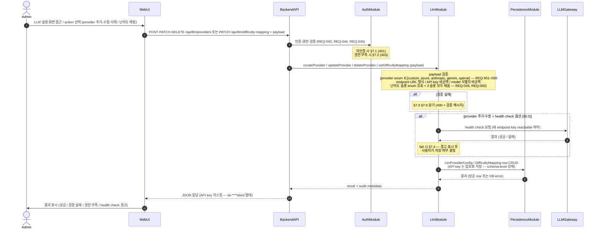

# UC-05 — LLM 설정 (provider / model / 난이도 매핑)

> **본 문서는 P2 의 다섯 번째 use case 본문 분해 task [T-0025](../tasks/T-0025-uc-05-llm-config.md) 의 산출물이다.** [docs/use-cases/INDEX.md](INDEX.md) 의 UC-05 row 를 sequence diagram + 흐름 + 실패 경로 + component/module mapping 으로 풀어쓴다. [UC-01](UC-01-evaluation-execution.md) / [UC-02](UC-02-evaluation-query.md) / [UC-03](UC-03-person-crud.md) / [UC-04](UC-04-account-auth.md) 의 11 section template 을 그대로 적용한다.

## 1. 개요

본 use case 는 Assessment-Agent 의 **LLM 운영 layer 의 source** — Admin 이 Web UI 의 LLM 설정 화면에서 5 provider (custom / Azure OpenAI / Anthropic / Google Gemini / OpenAI, [REQ-051](../requirements.md) ~ [REQ-055](../requirements.md)) 중 선택해 endpoint / API key / model 식별자를 입력하고, 3 난이도 모델 슬롯에 각각 provider+model 을 매핑 ([REQ-050](../requirements.md)) 하는 흐름을 박제한다 ([README.md](../../README.md) L93–103 "LLM Serving" 단락). cover REQ 는 7 ([REQ-049](../requirements.md) Admin LLM 모델 지정 / [REQ-050](../requirements.md) 3 난이도 슬롯 매핑 / [REQ-051](../requirements.md) ~ [REQ-055](../requirements.md) 5 provider) 로 [UC-03](UC-03-person-crud.md) (7 REQ) 와 동급의 broad coverage 를 가진다.

본 UC 의 산출물 (LlmProviderConfig + DifficultyMapping) 은 [UC-01](UC-01-evaluation-execution.md) §5 의 **LLM Gateway hop 의 routing source** — UC-01 의 평가 파이프라인이 어떤 항목을 어떤 provider+model 로 호출할지 결정할 때 본 UC 의 설정을 read 한다. 본 UC 는 8 component 중 4 (Web UI / Backend API / LLM Gateway / DB Persistence) + 8 module 중 4 (WebModule / LlmModule / AuthModule / PersistenceModule) 만 거치며, provider health check 옵션을 제외하면 외부 시스템 호출 없는 [ADR-0003 §1 monolithic NestJS process](../decisions/ADR-0003-deployment.md) 안의 in-process write 흐름이다. 다른 UC 가 LlmModule 을 "LLMGateway 호출 wrapper" 로만 사용한다면 UC-05 는 LlmModule 의 **service layer (provider·매핑 CRUD + 선택적 health check) 까지 활용**. 어떤 평가 항목이 어떤 난이도인지의 결정은 [README.md](../../README.md) L97 명시 ("구현하면서 결정") 대로 P4 의 별도 ADR 책임 (Out of Scope).

## 2. Actor

| actor | 책임 | 본 UC 내 권한 |
| --- | --- | --- |
| **Admin** ([README.md](../../README.md) L85, [REQ-045](../requirements.md), [REQ-049](../requirements.md)) | LLM provider 설정 + 3 난이도 슬롯 매핑. 본 UC 의 주된 actor. | 본 UC 의 모든 main flow + alt flow 사용 가능. |
| **SuperAdmin** ([README.md](../../README.md) L84, [REQ-044](../requirements.md)) | Admin 의 super set — 모든 권한 보유, 본 UC 도 수행 가능. | Admin 과 동일하게 모든 흐름 사용 가능. |
| **User** ([README.md](../../README.md) L86, [REQ-046](../requirements.md)) | read-only — 본 UC 의 actor 아님. | 본 UC 의 모든 write 호출 시 §7.2 차단. |

본 UC 는 Admin (및 SuperAdmin) 만 actor 이며, User 등급은 본 UC 의 어떤 trigger 도 발화시킬 수 없다. 사용자 (User entity — 로그인 계정) 의 CRUD / 등급 승급은 [UC-04](UC-04-account-auth.md) 의 책임이며, 본 UC 는 **이미 인증된 Admin 이 LLM 설정 데이터를 변경하는 흐름** 에 한정.

## 3. Trigger

본 UC 는 다음 4 가지 sub-trigger 경로를 가지며, **모두 동일한 main flow (§5) 로 수렴** — 차이는 BackendAPI 가 받는 write payload 의 종류 (HTTP method + endpoint + body) 만 다르다.

1. **provider 추가 / 활성화** — Admin 이 LLM 설정 화면에서 5 provider 중 하나 선택 + endpoint·API key·model 식별자 입력 → 저장 ([REQ-049](../requirements.md), [REQ-051](../requirements.md) ~ [REQ-055](../requirements.md)).
2. **provider 설정 수정** — 기존 provider 의 endpoint·API key·model 식별자 중 1+ 항목 변경 → 저장 ([REQ-049](../requirements.md)).
3. **provider 비활성화 / 삭제** — provider 사용 중단 (난이도 슬롯에서 참조되지 않을 때만 가능, §7.6) ([REQ-049](../requirements.md)).
4. **3 난이도 슬롯 매핑** — Easy / Medium / Hard (라벨은 P4 ADR — 구체 라벨링은 Out of Scope) 3 슬롯에 provider+model 매핑 ([REQ-050](../requirements.md)).

## 4. Preconditions

본 UC 의 main flow 진입 전 다음 조건이 충족돼야 한다. 미충족 시 §7 의 error path 로 분기.

1. **인증 완료** ([REQ-043](../requirements.md)) — actor 의 session / JWT 가 유효. 미인증 시 §7.1.
2. **권한 보유** ([REQ-044](../requirements.md), [REQ-045](../requirements.md)) — actor 의 등급 ≥ Admin. User 등급 시 §7.2.
3. **DB Persistence 가용** — PostgreSQL connection pool 정상. connection 끊김 / timeout 시 §7.5.
4. **LlmModule service 동작** — provider·매핑 CRUD service 가 정상 기동.

본 UC 의 핵심 invariant **"3 난이도 슬롯 모두 채움"** ([REQ-050](../requirements.md)) 과 **"API key 암호화 저장 + 반환 시 마스킹"** 은 §6.4 / §7.3 / §7.6 / §8 로 단단히 박제.

## 5. Main flow (sequence diagram)

step 수: 약 12 (autonumber 기준 — 2 alt block 분기 포함, 8 ≤ 12 ≤ 14 범위 안). 본 다이어그램은 [components.md](../architecture/components.md) 의 Component diagram + [modules.md](../architecture/modules.md) 의 의존성 그래프와 정합 — Web UI → Backend API, Backend API → {AuthModule, LlmModule}, LlmModule → {LLMGateway, PersistenceModule} 의 방향이 모두 의존성 그래프에서 허용된 방향. API key 의 암호화 방식 (envelope encryption / KMS / 환경변수) 은 P3 또는 P4 의 별도 ADR 책임 — 본 UC 는 "암호화 저장" + "마스킹 반환" 의 conceptual level 만.

## 6. Alternative flows

### 6.1 5 provider 별 설정 차이 (REQ-051~055)

본 UC 는 5 provider 의 존재 박제만 담당하며, 각 provider 의 SDK 선택 / wrapper 구현은 P4 의 별도 ADR 책임 (Out of Scope). 단 provider 별 설정의 conceptual 차이는 다음과 같다:

- **custom** ([REQ-051](../requirements.md)) — OpenAI 호환 endpoint + 자유로운 model 식별자 + proxy 가능 + 3 난이도 슬롯 모두 custom 으로 채울 수 있음 (예: 내부 자체 LLM 서버 1 개로 3 슬롯 모두 routing).
- **Azure OpenAI** ([REQ-052](../requirements.md)) — Azure 의 deployment endpoint + Azure key + deployment 이름 형식의 model 식별자.
- **Anthropic** ([REQ-053](../requirements.md)) — Anthropic API endpoint + Anthropic key + Claude 계열 model 식별자.
- **Google Gemini** ([REQ-054](../requirements.md)) — Google AI endpoint + Google key + Gemini 계열 model 식별자.
- **OpenAI** ([REQ-055](../requirements.md)) — OpenAI 공식 endpoint + OpenAI key + GPT 계열 model 식별자.

본 UC 의 payload 검증 (§5 step 5) 은 provider enum 5 값 정합만 확인. provider 별 endpoint·key 형식의 strict validation 은 P4 의 service layer 책임.

### 6.2 3 난이도 슬롯 매핑 (REQ-050)

3 난이도 슬롯 (Easy / Medium / Hard 또는 1·2·3 — 구체 라벨은 P4 ADR) 각각에 provider+model 을 매핑한다. 매핑 패턴은 자유:

- **모든 슬롯 동일 provider+model** — 예: 3 슬롯 모두 custom + 동일 model. 비용 절감 / 단순 운영 시나리오.
- **슬롯별 다른 provider+model** — 예: Easy=Gemini / Medium=Anthropic / Hard=OpenAI. 난이도별 최적 model 활용 시나리오.

본 UC 는 매핑 invariant 만 박제 — **3 슬롯 모두 채움 필수** ([REQ-050](../requirements.md)), 비활성화된 provider 참조 불가 (§7.6). 어떤 평가 항목이 어떤 난이도인지의 분류는 [README.md](../../README.md) L97 명시 대로 P4 의 별도 ADR 책임 (Out of Scope).

### 6.3 LLM Gateway health check (선택)

provider 추가 / 수정 시 Admin 이 health check 옵션을 활성화하면 LlmModule 이 LLMGateway 를 통해 새 endpoint·key 가 reachable 한지 사전 확인 (§5 step 7 alt block). 본 흐름은 **conceptual level 만** — 구체 protocol (ping endpoint / dummy completion 요청 / timeout 처리) 은 P4 의 service layer 책임. fail 시 §7.4 의 경고 표시 후 사용자가 저장 강행 여부를 결정.

### 6.4 API key 마스킹 / 재입력

기존 provider 설정 조회 시 API key 는 **마스킹 형태** (예: `sk-****abcd`) 로만 WebUI 에 반환 — DB 에서는 암호화 저장된 원본을 읽어 BackendAPI 가 마지막 4 자리만 노출하는 형태로 변환. 수정 (§3 trigger 2) 시 Admin 이 새 key 를 입력하지 않으면 **기존 key 보존** (마스킹 값이 그대로 form 에 표시되며, 그대로 저장 요청 시 LlmModule 이 "변경 없음" 으로 처리). 새 key 를 입력하면 교체. 이 패턴은 Admin 이 다른 항목 (endpoint / model 식별자) 만 수정하고자 할 때 기존 key 를 다시 입력하지 않아도 되도록 한다.

## 7. Error flows

본 UC 의 error path 는 다음 6 종.

### 7.1 인증 실패 (REQ-043)

`AuthModule` guard 가 session / JWT 검증 실패 (만료 / 위조 / 미존재) → 401 return → WebUI 가 사용자를 login 페이지로 redirect. 본 UC 의 main flow 진입 자체가 차단되며, LlmProviderConfig / DifficultyMapping 의 어떤 write 도 발생하지 않는다.

### 7.2 권한 부족 (REQ-044, REQ-045)

User 등급이 본 UC 의 어떤 trigger 든 호출 시 AuthModule guard 가 403 return + WebUI 가 "Admin 권한 필요" 안내. 본 UC 는 [REQ-045](../requirements.md) (Admin 권한) 의 LLM 설정 변경 권한을 직접 cover.

### 7.3 payload 검증 실패 (REQ-049, REQ-050, REQ-051~055)

LlmModule 의 payload 검증 단계에서 다음 중 하나에 해당하면 400 return + 검증 메시지:

- provider enum 이 5 값 ({custom, azure, anthropic, gemini, openai}) 외 ([REQ-051](../requirements.md) ~ [REQ-055](../requirements.md)).
- endpoint URL 형식 부적합 (예: scheme 누락 / 빈 값).
- API key 빈 값 (provider 추가 시 — 수정 시에는 §6.4 의 "변경 없음" 처리 별개).
- model 식별자 빈 값.
- 난이도 슬롯 enum 부적합 ([REQ-050](../requirements.md)).
- 3 난이도 슬롯 중 1+ 미채움 (§7.6 의 invariant 위반).

WebUI 는 응답 메시지를 form 의 field-level error 로 표시.

### 7.4 LLM Gateway health check fail (선택)

§6.3 의 health check 옵션 사용 시 새 endpoint·key 가 reachable 하지 않으면 LlmModule 이 경고 메시지를 WebUI 에 전달 + Admin 이 저장 강행 여부 결정. 저장 강행 시 추후 평가 ([UC-01](UC-01-evaluation-execution.md)) 호출에서 실제 fail 발생 — 본 UC §6.3 은 사전 경고만, 저장 자체는 차단하지 않는다.

### 7.5 DB write fail

`PersistenceModule` 이 connection 끊김 / timeout / unique constraint 위반 / 암호화 실패 / transaction rollback 시 5xx return → WebUI 가 사용자에게 "일시적 오류 — 재시도해주세요" 안내. POST (provider 추가) 의 retry 는 중복 생성 위험으로 사용자 명시적 재시도 권장.

### 7.6 난이도 매핑 invariant 위반 (REQ-050)

다음 중 하나에 해당하면 400 return + 검증 메시지:

- 3 난이도 슬롯 중 1+ 슬롯이 **비활성화 / 삭제된 provider** 를 참조 (예: provider 삭제 시도 시 해당 provider 가 슬롯에서 참조 중) — "비활성 provider 참조 불가" 안내.
- 3 난이도 슬롯 중 1+ 가 **빈 값** — "3 난이도 슬롯 모두 채워야 함" 안내 ([REQ-050](../requirements.md)).

본 invariant 는 [README.md](../../README.md) L97 의 "3가지 난이도 모델 할당" 명시의 박제로, LLM Gateway routing 시 슬롯이 비어있어 routing 실패하는 상황을 사전 차단.

## 8. Postconditions

본 UC 는 **write operation** 이므로 시스템 상태 변경이 발생한다. main flow 가 종료된 후의 시스템 상태:

- **LlmProviderConfig row CRUD 완료** — PersistenceModule 의 LlmProviderConfig 테이블에 row insert / update / delete. **API key 는 암호화 저장** (schema-level 강제, 암호화 방식은 P3 또는 P4 의 별도 ADR 책임).
- **DifficultyMapping row 갱신** — 3 난이도 슬롯의 provider+model 결정. 모든 슬롯이 활성 provider 를 참조하는 invariant 만족 (§7.6).
- **변경 즉시 발효** — [UC-01](UC-01-evaluation-execution.md) 의 다음 평가 파이프라인 호출부터 새 설정 적용. in-memory cache 가 있다면 invalidate (구체 mechanism 은 P4 의 책임).
- **Audit log 1 row 생성** — 변경 종류 (PROVIDER_CREATE / PROVIDER_UPDATE / PROVIDER_DELETE / DIFFICULTY_MAPPING_UPDATE) + actor + provider 식별자 + before/after 박제. **API key 자체는 audit 에 기록 X** — 마스킹 형태로만 기록. 구체 schema 는 P3 data-model.md 의 책임.
- **NFR** — 본 UC 의 write 흐름은 일반적 CRUD 의 reasonable 응답 시간. 구체 SLA 는 [README.md](../../README.md) 명시 없음 — [REQ-048](../requirements.md) 의 3 초는 read ([UC-02](UC-02-evaluation-query.md)) 한정. health check 옵션 사용 시 외부 API 호출 latency 추가됨.

## 9. Component / Module mapping

본 UC 가 거치는 4 component + 4 module ([INDEX.md](INDEX.md) UC-05 row 와 정확히 일치). 각 component 의 본 UC 에서의 책임은 1 줄로 한정.

| component (T-A3) | module (T-A4) | 본 UC 에서의 책임 |
| --- | --- | --- |
| Web UI | WebModule | LLM 설정 화면 SPA — provider 목록 표 / 추가·수정·삭제 form / 난이도 슬롯 매핑 form (REQ-049, REQ-050). API key 는 마스킹 표시 (§6.4). |
| Backend API | AuthModule (guard) + LlmModule (controller + service) | `POST·PATCH·DELETE /api/llm/providers` / `PATCH /api/llm/difficulty-mapping` endpoint 노출 + 인증·권한 guard + payload 검증 + invariant enforcement (REQ-043, REQ-044, REQ-045, REQ-049, REQ-050, REQ-051~055). **LlmModule 의 service layer (provider·매핑 CRUD + 선택적 health check) 가 본 UC 의 중심** — 다른 UC 는 LlmModule 의 LLMGateway 호출 wrapper 만 사용. |
| LLM Gateway | LlmModule (gateway sub-service) | §6.3 health check 옵션 사용 시 새 endpoint·key reachable 여부 확인. 실제 평가 routing 의 consumer 는 [UC-01](UC-01-evaluation-execution.md). |
| DB Persistence | PersistenceModule | LlmProviderConfig / DifficultyMapping row CRUD + API key 암호화 저장 + Audit log row insert (REQ-049, REQ-050). |

본 UC 에서 거치지 않는 4 component (Scheduler / Worker / GitHub Adapter / Confluence Adapter) + 5 module (SchedulerModule / GithubModule / ConfluenceModule / AssessmentModule / UserModule) 의 책임 위임:

- **Scheduler / SchedulerModule** — [UC-01](UC-01-evaluation-execution.md) (cron trigger) 의 책임. 본 UC 는 Admin 의 동기 write 흐름이므로 cron 발화 없음.
- **Worker / AssessmentModule** — UC-01 의 책임. 본 UC 는 LLM 설정 CRUD 만이므로 평가 파이프라인과 무관.
- **GitHub Adapter / Confluence Adapter** + 대응 module — UC-01 의 책임. 본 UC 의 외부 호출은 LLMGateway health check (§6.3) 한정.
- **UserModule** — [UC-04](UC-04-account-auth.md) (사용자 계정 CRUD) 의 책임. 본 UC 는 LLM 설정 entity 만 다루므로 user account 와 무관.

## 10. 관련 REQ

본 UC 가 cover 하는 7 primary REQ + 3 인접 REQ. 각 REQ 가 본 UC 의 어느 section/step 에서 cover 되는지 명시.

| REQ | 요약 | 본 UC 의 cover 위치 |
| --- | --- | --- |
| REQ-049 | Admin 이 LLM 모델 지정 | §1 / §3 trigger 1–3 / §5 step 5 / §6.1 / §7.3 / §9 LlmModule |
| REQ-050 | 3 난이도 모델 + 항목별 난이도 매핑 | §1 / §3 trigger 4 / §5 step 5 / §6.2 / §7.3 / §7.6 / §8 / §9 LlmModule |
| REQ-051 | custom provider (OpenAI 호환 / proxy / 3 슬롯 모두 가능) | §1 / §3 trigger 1 / §5 step 5 / §6.1 / §7.3 / §9 LlmModule |
| REQ-052 | Azure OpenAI provider | §1 / §3 trigger 1 / §5 step 5 / §6.1 / §7.3 / §9 LlmModule |
| REQ-053 | Anthropic provider | §1 / §3 trigger 1 / §5 step 5 / §6.1 / §7.3 / §9 LlmModule |
| REQ-054 | Google Gemini provider | §1 / §3 trigger 1 / §5 step 5 / §6.1 / §7.3 / §9 LlmModule |
| REQ-055 | OpenAI provider | §1 / §3 trigger 1 / §5 step 5 / §6.1 / §7.3 / §9 LlmModule |
| REQ-043 (인접) | 모든 기능 ID/Password 보호 | §4 precondition 1 / §5 step 3 / §7.1 / §9 AuthModule |
| REQ-044 (인접) | SuperAdmin 첫 로긴 + 3 등급 + 승급·강등 규칙 | §2 actor (SuperAdmin / Admin / User 등급의 source — [UC-04](UC-04-account-auth.md) 책임) / §4 precondition 2 |
| REQ-045 (인접) | Admin 권한 (재작성/Reset/Import/Export/인원편집/Group편집) | §2 actor / §4 precondition 2 / §5 step 3 / §7.2 — 본 UC 는 Admin 의 LLM 설정 변경 권한 박제 |

본 task 는 production code 0 LOC + 분기 0 + 새 public symbol 추가 0 — [CLAUDE.md](../../CLAUDE.md) §3.2 R-112 의 4 항목 (happy / error / branch / negative) 모두 N/A. mermaid sequence 의 alt block 2 개 가 §6.3 health check 분기 + §7.3 검증 실패 분기를 박제하며, error flow 6 종 (§7.1~§7.6) 이 인증 실패 / 권한 부족 / payload 검증 실패 / health check fail / DB write fail / 난이도 매핑 invariant 위반의 negative path 를 cover.

## 11. References

- [docs/use-cases/INDEX.md](INDEX.md) — UC-05 row 의 source. 본 UC 의 §9 mapping 이 INDEX.md 의 "주요 component / 주요 module" 컬럼과 정확히 일치.
- [docs/use-cases/UC-01-evaluation-execution.md](UC-01-evaluation-execution.md) — 첫 UC 본문 template + 본 UC 의 산출물 (LlmProviderConfig + DifficultyMapping) 을 read 하는 consumer (UC-01 §5 의 LLM Gateway hop).
- [docs/use-cases/UC-02-evaluation-query.md](UC-02-evaluation-query.md) / [UC-03-person-crud.md](UC-03-person-crud.md) / [UC-04-account-auth.md](UC-04-account-auth.md) — 앞선 3 UC 본문 template. UC-04 는 본 UC 가 의존하는 인증·권한 layer 의 source.
- [docs/architecture/components.md](../architecture/components.md) / [modules.md](../architecture/modules.md) / [INDEX.md](../architecture/INDEX.md) — 본 UC §9 가 거치는 4 component + 4 module 의 source + MVA style.
- [docs/requirements.md](../requirements.md) — 본 UC 의 7 primary REQ + 3 인접 REQ row 의 source.
- [docs/decisions/ADR-0001-stack.md](../decisions/ADR-0001-stack.md) / [ADR-0002-db.md](../decisions/ADR-0002-db.md) / [ADR-0003-deployment.md](../decisions/ADR-0003-deployment.md) — NestJS / TypeScript / PostgreSQL + Prisma / monolithic NestJS + secret 처리 정책 — 본 UC 의 구현·persistence·암호화 기반.
- [README.md](../../README.md) L83–86 (3 권한 등급 — Admin 이 본 UC actor) / L93–103 ("LLM Serving" 단락 — 5 provider + 3 난이도 모델 슬롯 매핑 의 핵심 source).
- [docs/tasks/T-0025-uc-05-llm-config.md](../tasks/T-0025-uc-05-llm-config.md) — 본 UC 의 분해 task. [T-0024](../tasks/T-0024-uc-04-account-auth.md) — 직전 UC-04 task (본 UC 의 template).

Refs: T-0025, T-0024, T-0023, T-0022, T-0020, T-0019, ADR-0001, ADR-0002, ADR-0003, REQ-043, REQ-044, REQ-045, REQ-049, REQ-050, REQ-051, REQ-052, REQ-053, REQ-054, REQ-055
