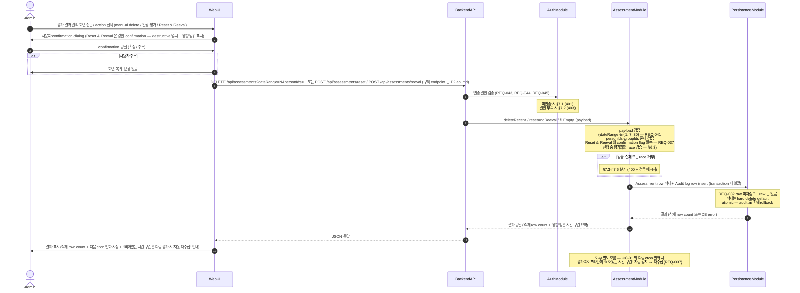

# UC-06 — 평가 결과 manual delete + 재수집

> **본 문서는 P2 의 여섯 번째 use case 본문 분해 task [T-0026](../tasks/T-0026-uc-06-evaluation-delete-reeval.md) 의 산출물이다.** [docs/use-cases/INDEX.md](INDEX.md) 의 UC-06 row 를 sequence diagram + 흐름 + 실패 경로 + component/module mapping 으로 풀어쓴다. [UC-01](UC-01-evaluation-execution.md) / [UC-02](UC-02-evaluation-query.md) / [UC-03](UC-03-person-crud.md) / [UC-04](UC-04-account-auth.md) / [UC-05](UC-05-llm-config.md) 의 11 section template 을 그대로 적용한다.

## 1. 개요

본 use case 는 Assessment-Agent 의 **destructive write 흐름의 박제** — Admin 이 Web UI 의 평가 결과 관리 화면에서 (a) 최근 N 일치 평가 결과 manual delete (1 / 7 / 30 일, [REQ-041](../requirements.md)) 또는 (b) 평가 없는 부분 일괄 평가 / Reset & Reeval ([REQ-037](../requirements.md)) 을 수행하는 흐름을 박제한다 ([README.md](../../README.md) "평가 자료의 저장" 단락). cover REQ 는 3 ([REQ-037](../requirements.md) / [REQ-041](../requirements.md) / [REQ-045](../requirements.md) — Admin 권한 중 재작성/Reset 부분) 으로 [UC-04](UC-04-account-auth.md) (2 REQ) 와 동급의 작은 표면이지만, **시스템의 destructive operation 박제** 이므로 invariant 가 단단해야 한다.

본 UC 의 핵심 invariant: **raw 미저장 정책 ([REQ-032](../requirements.md))** 으로 인해 한번 삭제된 평가 결과는 **외부 source 재수집 + LLM 재평가 외에는 복구 불가**. 본 UC 의 산출물 (비어있는 시간 구간) 은 [UC-01](UC-01-evaluation-execution.md) §5 의 **자동 재수집 trigger source** — UC-01 의 다음 cron 발화가 비어있는 시간 구간을 감지 → 그 구간에 대해 외부 source 재수집 + LLM 재평가 수행. 본 UC 는 8 component 중 3 (Web UI / Backend API / DB Persistence) + 8 module 중 4 (WebModule / AssessmentModule / AuthModule / PersistenceModule) 만 거치며, 외부 시스템 호출 없는 [ADR-0003 §1 monolithic NestJS process](../decisions/ADR-0003-deployment.md) 안의 in-process write 흐름이다. 다른 UC 가 AssessmentModule 의 read service ([UC-02](UC-02-evaluation-query.md)) 또는 write service ([UC-01](UC-01-evaluation-execution.md) 평가 파이프라인) 를 사용한다면 본 UC 는 AssessmentModule 의 **destructive write service (delete + reset endpoint) 까지 활용**.

## 2. Actor

| actor | 책임 | 본 UC 내 권한 |
| --- | --- | --- |
| **Admin** ([README.md](../../README.md) L85, [REQ-045](../requirements.md)) | 평가 결과의 재작성 / Reset / manual delete. 본 UC 의 주된 actor. | 본 UC 의 모든 main flow + alt flow 사용 가능. |
| **SuperAdmin** ([README.md](../../README.md) L84, [REQ-044](../requirements.md)) | Admin 의 super set — 모든 권한 보유, 본 UC 도 수행 가능. | Admin 과 동일하게 모든 흐름 사용 가능. |
| **User** ([README.md](../../README.md) L86, [REQ-046](../requirements.md)) | read-only — 본 UC 의 actor 아님. | 본 UC 의 모든 write 호출 시 §7.2 차단. |

본 UC 는 Admin (및 SuperAdmin) 만 actor 이며, User 등급은 본 UC 의 어떤 trigger 도 발화시킬 수 없다. **fine-grained 권한 모델** (Admin 이 다른 Admin 의 평가 결과를 삭제 가능한지 등) 은 본 UC 의 scope 가 아니며, "Admin 이상" 까지만 박제 (Out of Scope).

## 3. Trigger

본 UC 는 다음 3 가지 sub-trigger 경로를 가지며, **모두 동일한 main flow (§5) 로 수렴** — 차이는 BackendAPI 가 받는 write payload 의 종류 (HTTP method + endpoint + body) 와 PersistenceModule 의 row 변경 패턴 만 다르다.

1. **최근 N 일 manual delete** ([REQ-041](../requirements.md)) — Admin 이 1 일 / 7 일 / 30 일 옵션 중 선택. 전체 인원 또는 특정 인원/Group 한정 가능. row 삭제만 — 즉시 재수집은 다음 cron 발화 또는 §6.4 의 즉시 재수집 옵션.
2. **평가 없는 부분 일괄 평가** ([REQ-037](../requirements.md) 전반부) — 기존 평가가 있는 시간 구간은 보존하고 비어있는 구간만 재수집. 신규 인원 추가 직후 또는 일부 삭제 직후 사용. row 추가만 — 삭제 없음.
3. **Reset & Reeval** ([REQ-037](../requirements.md) 후반부) — 전체 또는 특정 인원/기간의 평가 결과를 모두 삭제하고 처음부터 재평가. 가장 destructive 한 흐름 — 사용자 강한 confirmation step 필수. row 삭제 + 즉시 재평가 trigger 의 결합.

## 4. Preconditions

본 UC 의 main flow 진입 전 다음 조건이 충족돼야 한다. 미충족 시 §7 의 error path 로 분기.

1. **인증 완료** ([REQ-043](../requirements.md)) — actor 의 session / JWT 가 유효. 미인증 시 §7.1.
2. **권한 보유** ([REQ-044](../requirements.md), [REQ-045](../requirements.md)) — actor 의 등급 ≥ Admin. User 등급 시 §7.2.
3. **DB Persistence 가용** — PostgreSQL connection pool 정상. connection 끊김 / timeout 시 §7.5.
4. **삭제 대상 row 존재** — 지정된 조건 (dateRange / personIds / groupIds) 에 해당하는 Assessment row 1+ (없으면 §7.4 — idempotent 200 권장).
5. **UC-01 평가 실행 race 없음 또는 사용자 결정** — 진행 중인 평가가 있으면 §6.3 의 두 선택지 (대기 / 중단) 중 사용자 결정 필요.

본 UC 의 핵심 invariant **"한번 삭제된 평가 결과는 raw 미저장 ([REQ-032](../requirements.md)) 으로 복구 불가"** 와 **"비어있는 시간 구간은 UC-01 의 다음 발화가 자동 재수집"** 은 §5 step 11 conceptual reference / §7.5 / §8 (a)(b) 로 단단히 박제.

## 5. Main flow (sequence diagram)

step 수: 약 13 (autonumber 기준 — 2 alt block 분기 + 1 conceptual Note 포함, 8 ≤ 13 ≤ 14 범위 안). 본 다이어그램은 [components.md](../architecture/components.md) 의 Component diagram + [modules.md](../architecture/modules.md) 의 의존성 그래프와 정합 — Web UI → Backend API, Backend API → {AuthModule, AssessmentModule}, AssessmentModule → PersistenceModule 의 방향이 모두 의존성 그래프에서 허용된 방향. UC-01 의 다음 발화에 의한 자동 재수집은 **본 UC 의 sequence 단계가 아니라 UC-01 의 영역** — 마지막 Note 로만 conceptual reference.

## 6. Alternative flows

### 6.1 3 sub-trigger 의 분기 (REQ-037, REQ-041)

3 sub-trigger 는 payload + PersistenceModule row 변경 패턴만 다르다: **manual delete** (row 삭제만, 즉시 재수집 없음), **일괄 평가** (row 추가만, 기존 row 보존, §5 의 delete 단계 skip 후 즉시 평가 파이프라인 호출 — UC-01 trigger 모드 변형), **Reset & Reeval** (row 삭제 + 즉시 재평가 trigger 결합, 가장 destructive — confirmation flag strict 검증 §7.3). 세부 트랜잭션 로직 (예: Reset & Reeval 의 삭제와 재평가 trigger 의 atomic 여부) 은 P5 의 service layer 책임 (Out of Scope).

### 6.2 삭제 범위 옵션

payload 는 3 차원 Cartesian product 옵션 허용 (옵션 enum 만 박제, 구체 query schema 는 P2 api.md / P3 data-model.md): **dateRange** (1 / 7 / 30 일 — [REQ-041](../requirements.md), 또는 임의 start / end), **personIds / groupIds** ([UC-03](UC-03-person-crud.md) 의 Group / Part entity 와 연동, null = 전체), **action type** (DELETE_ONLY / FILL_EMPTY / RESET_AND_REEVAL). 조합 예: dateRange=null + personIds=null + action=RESET_AND_REEVAL → 전체 시스템 리셋 (confirmation 가장 강함).

### 6.3 UC-01 평가 실행 중 race

[UC-01](UC-01-evaluation-execution.md) 평가 파이프라인이 진행 중일 때 본 UC 호출 시 두 선택지 (사용자 결정 위임): **(i) default — 진행 중 평가 완료 후 본 UC 실행** (polling 또는 event 대기, 비정상 timeout 시 §7.6 전파), **(ii) 진행 중 평가 중단 후 본 UC 실행** — conceptual level 만, 구체 cancellation protocol 은 P5 (Out of Scope). 본 UC 는 (i) default 박제.

### 6.4 즉시 재수집 옵션

§5 마지막 Note 의 conceptual reference 는 **다음 cron 발화** 시 UC-01 의 자동 재수집 가정. Admin 이 다음 cron 을 기다리지 않고 즉시 재수집 시키려면 본 UC 후 [UC-01](UC-01-evaluation-execution.md) 의 manual trigger ([REQ-040](../requirements.md)) 호출. 본 UC §5 는 삭제 + 결과 응답까지만, 즉시 manual trigger 흐름은 UC-01 흡수.

## 7. Error flows

본 UC 의 error path 는 다음 6 종.

- **7.1 인증 실패 ([REQ-043](../requirements.md))** — AuthModule guard 가 session / JWT 검증 실패 (만료 / 위조 / 미존재) → 401 → WebUI 가 login 페이지로 redirect. 본 UC main flow 진입 차단, 어떤 Assessment row 도 변경되지 않음.
- **7.2 권한 부족 ([REQ-044](../requirements.md), [REQ-045](../requirements.md))** — User 등급이 본 UC trigger 호출 시 AuthModule guard 가 403 + WebUI 가 "Admin 권한 필요" 안내.
- **7.3 payload 검증 실패 ([REQ-037](../requirements.md), [REQ-041](../requirements.md))** — AssessmentModule 의 payload 검증에서 다음 중 하나 → 400 + 검증 메시지: dateRange enum 부적합 (1 / 7 / 30 외 값), personIds·groupIds 가 존재하지 않는 ID 또는 Deactivate 상태 ([UC-03](UC-03-person-crud.md) 와 연동), Reset & Reeval 의 confirmation flag 누락 (가장 destructive 의 사전 차단), action type enum 부적합. WebUI 는 form field-level error.
- **7.4 삭제 대상 0 row** — 지정 조건에 해당하는 Assessment row 가 0 → **200 + "삭제 대상 없음"** 안내 (idempotent 동작 권장). WebUI 는 "변경 없음" 표시.
- **7.5 DB write fail** — PersistenceModule 의 connection 끊김 / timeout / transaction rollback / cascade constraint 위반 시 5xx + WebUI 의 재시도 안내. 본 UC 의 transaction 은 **atomic** — Assessment row 삭제와 Audit log row insert 가 함께 rollback (부분 삭제 후 audit 누락 방지). 구체 transaction 로직은 P5 service layer 책임.
- **7.6 UC-01 race timeout ([REQ-037](../requirements.md), §6.3)** — §6.3 (i) default 흐름에서 진행 중 평가가 비정상 timeout / hang → 본 UC 도 timeout 전파 → 5xx + WebUI 의 재시도 안내. 구체 timeout 임계값 + cancellation protocol 은 P5.

## 8. Postconditions

본 UC 는 **destructive write operation** 이므로 시스템 상태 변경이 발생한다. main flow 종료 후의 시스템 상태:

- **Assessment row N 개 영구 삭제** — PersistenceModule 의 Assessment 테이블에서 hard delete. **raw 미저장 ([REQ-032](../requirements.md)) 으로 복구 불가** — 외부 source 재수집 + LLM 재평가만 가능. soft delete 도입은 별도 ADR (Out of Scope).
- **비어있는 시간 구간 형성** — UC-01 의 다음 cron 발화가 이 구간을 "평가 없는 부분" 으로 감지 ([REQ-037](../requirements.md)) → 외부 source 재수집 + LLM 재평가 → DB 에 새 row 저장. 본 흐름은 **UC-01 의 영역** (§5 마지막 Note conceptual reference).
- **Audit log 1 row 생성** — 변경 종류 (DELETE_RECENT / FILL_EMPTY / RESET_AND_REEVAL) + actor + 대상 person/date range + 삭제 row count 박제. 구체 schema 는 P3 data-model.md 책임 (Out of Scope).
- **UC-02 다음 조회 영향** — [UC-02](UC-02-evaluation-query.md) 의 다음 조회는 삭제 반영된 결과 + 비어있는 구간이 시계열 gap 으로 표시. 진행 중 평가 배너 ([REQ-042](../requirements.md)) 는 별도 영역.
- **NFR** — 일반적 destructive CRUD 의 reasonable 응답 시간. 구체 SLA 는 [README.md](../../README.md) 명시 없음 — [REQ-048](../requirements.md) 의 3 초는 read ([UC-02](UC-02-evaluation-query.md)) 한정. 대량 삭제 (예: 30 일 + 전체 인원) 의 async job + progress polling + cancellation 은 P5 (Out of Scope).

## 9. Component / Module mapping

본 UC 가 거치는 3 component + 4 module ([INDEX.md](INDEX.md) UC-06 row 와 정확 일치). 각 component 의 본 UC 책임은 1 줄로 한정.

| component (T-A3) | module (T-A4) | 본 UC 에서의 책임 |
| --- | --- | --- |
| Web UI | WebModule | 평가 결과 관리 화면 SPA — 3 sub-trigger 의 action form + confirmation dialog (REQ-037, REQ-041). Reset & Reeval 은 강한 confirmation. |
| Backend API | AuthModule (guard) + AssessmentModule (controller + service) | `DELETE /api/assessments`·`POST /api/assessments/reset`·`POST /api/assessments/reeval` endpoint + 인증·권한 guard + payload 검증 + race 검증 (REQ-037, REQ-041, REQ-043, REQ-044, REQ-045). **AssessmentModule 의 destructive write service 가 본 UC 의 중심** — 다른 UC 는 read service (UC-02) 또는 평가 파이프라인 write service (UC-01) 만 사용. |
| DB Persistence | PersistenceModule | Assessment row hard delete + Audit log row insert (atomic transaction). REQ-032 raw 미저장으로 raw 컬럼 없음. |

본 UC 에서 거치지 않는 5 component (Scheduler / Worker / LLM Gateway / GitHub Adapter / Confluence Adapter) + 4 module (SchedulerModule / LlmModule / UserModule / GithubModule / ConfluenceModule) 의 책임 위임: **Scheduler / Worker / LLM Gateway / GitHub Adapter / Confluence Adapter** 및 대응 module 은 [UC-01](UC-01-evaluation-execution.md) (cron trigger + 평가 파이프라인) 의 책임 — 본 UC 가 만든 비어있는 시간 구간을 UC-01 의 다음 cron 발화가 자동 재수집 (본 UC trigger downstream consumer = UC-01). **UserModule** 은 [UC-03](UC-03-person-crud.md) (인원 CRUD) 책임 — 본 UC 의 personIds·groupIds 검증은 PersistenceModule 직접 조회 또는 UserModule read service 호출 (P5 service layer 책임).

**UC-01 과의 trigger 관계** 가 본 UC 의 핵심 architectural 박제 — §5 마지막 Note (conceptual reference) 가 UC-01 의 자동 재수집 흐름 source.

## 10. 관련 REQ

본 UC 가 cover 하는 3 primary REQ + 4 인접 REQ. 각 REQ 가 본 UC 의 어느 section/step 에서 cover 되는지 명시.

| REQ | 요약 | 본 UC 의 cover 위치 |
| --- | --- | --- |
| REQ-037 | 평가 없는 부분 일괄 평가 + Reset & Reeval | §1 / §3 trigger 2·3 / §5 step 7·8 / §6.1 / §7.3 / §7.6 / §8 / §9 AssessmentModule |
| REQ-041 | Admin 최근 N일 결과 manual delete → 재수집 | §1 / §3 trigger 1 / §5 step 7·8 / §6.1 / §6.2 / §7.3 / §8 / §9 AssessmentModule |
| REQ-045 | Admin 권한 (재작성/Reset/Import/Export/인원편집/Group편집) | §2 actor / §4 precondition 2 / §5 step 5 / §7.2 — 본 UC 는 재작성·Reset 권한 박제 |
| REQ-032 (인접) | Raw data 저장 금지 — 평가 결과만 보유 | §1 invariant / §5 PersistenceModule Note / §8 (a) — 본 UC 가 raw 미저장 의 복구 불가 invariant 의 박제 |
| REQ-038 (인접) | 평가 결과 schema (조회·sort·filter·시계열) | §8 (d) — UC-02 의 다음 조회 영향 |
| REQ-043 (인접) | 모든 기능 ID/Password 보호 | §4 precondition 1 / §5 step 5 / §7.1 / §9 AuthModule |
| REQ-044 (인접) | SuperAdmin 첫 로긴 + 3 등급 + 승급·강등 규칙 | §2 actor / §4 precondition 2 — 본 UC 의 등급 source ([UC-04](UC-04-account-auth.md) 책임) |

본 task 는 production code 0 LOC + 분기 0 + 새 public symbol 추가 0 — [CLAUDE.md](../../CLAUDE.md) §3.2 R-112 의 4 항목 (happy / error / branch / negative) 모두 N/A. mermaid sequence 의 alt block 2 개 가 §6.1 의 사용자 취소 분기 + §7.3 검증 실패 분기를 박제하며, error flow 6 종 (§7.1~§7.6) 이 인증 실패 / 권한 부족 / payload 검증 실패 / 삭제 대상 0 row / DB write fail / UC-01 race timeout 의 negative path 를 cover.

## 11. References

- [docs/use-cases/INDEX.md](INDEX.md) — UC-06 row 의 source. 본 UC 의 §9 mapping 이 INDEX.md 의 "주요 component / 주요 module" 컬럼과 정확히 일치.
- [docs/use-cases/UC-01-evaluation-execution.md](UC-01-evaluation-execution.md) — 본 UC 의 trigger downstream consumer (다음 cron 발화가 본 UC 가 만든 비어있는 구간 자동 재수집).
- [docs/use-cases/UC-02-evaluation-query.md](UC-02-evaluation-query.md) / [UC-03-person-crud.md](UC-03-person-crud.md) / [UC-04-account-auth.md](UC-04-account-auth.md) / [UC-05-llm-config.md](UC-05-llm-config.md) — 앞선 UC 본문 template. UC-04 는 본 UC 가 의존하는 인증·권한 layer 의 source.
- [docs/architecture/components.md](../architecture/components.md) / [modules.md](../architecture/modules.md) / [INDEX.md](../architecture/INDEX.md) — 본 UC §9 가 거치는 3 component + 4 module 의 source + MVA style.
- [docs/requirements.md](../requirements.md) — 본 UC 의 3 primary REQ + 4 인접 REQ row 의 source.
- [docs/decisions/ADR-0001-stack.md](../decisions/ADR-0001-stack.md) / [ADR-0002-db.md](../decisions/ADR-0002-db.md) / [ADR-0003-deployment.md](../decisions/ADR-0003-deployment.md) — NestJS / TypeScript / PostgreSQL + Prisma / monolithic NestJS — 본 UC 의 구현·persistence 기반.
- [README.md](../../README.md) L83–86 (3 권한 등급 — Admin 이 본 UC actor) / "평가 자료의 저장" 단락 ("Admin이 직접 삭제 가능", "Reset & Reeval", "비어있는 부분 자동 재수집" 의 source).
- [docs/tasks/T-0026-uc-06-evaluation-delete-reeval.md](../tasks/T-0026-uc-06-evaluation-delete-reeval.md) — 본 UC 의 분해 task. [T-0025](../tasks/T-0025-uc-05-llm-config.md) — 직전 UC-05 task (본 UC 의 template).

Refs: T-0026, T-0025, T-0024, T-0023, T-0022, T-0020, T-0019, ADR-0001, ADR-0002, ADR-0003, REQ-032, REQ-037, REQ-038, REQ-041, REQ-043, REQ-044, REQ-045
