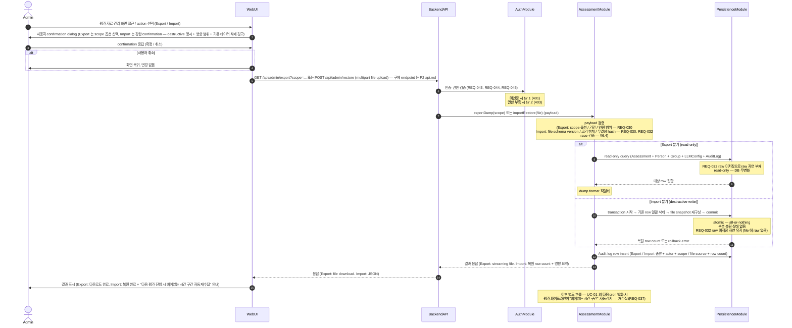

# UC-07 — Export / Import / Backup / Restore

> **본 문서는 P2 의 일곱 번째 use case 본문 분해 task [T-0027](../tasks/T-0027-uc-07-export-import.md) 의 산출물이다.** [docs/use-cases/INDEX.md](INDEX.md) 의 UC-07 row 를 sequence diagram + 흐름 + 실패 경로 + component/module mapping 으로 풀어쓴다. [UC-01](UC-01-evaluation-execution.md) / [UC-02](UC-02-evaluation-query.md) / [UC-03](UC-03-person-crud.md) / [UC-04](UC-04-account-auth.md) / [UC-05](UC-05-llm-config.md) / [UC-06](UC-06-evaluation-delete-reeval.md) 의 11 section template 을 그대로 적용한다.

## 1. 개요

본 use case 는 Assessment-Agent 의 **dump / load 대칭 흐름의 박제** — Admin 이 Web UI 의 평가 자료 관리 화면에서 (a) 저장된 평가 자료의 **Export** (read-only operation, DB → file artifact 다운로드) 또는 (b) **Import / Restore** (destructive write operation, file artifact 업로드 → DB 복원) 를 수행한다 ([README.md](../../README.md) "평가 자료의 저장" 단락, [REQ-030](../requirements.md)). cover REQ 는 3 ([REQ-030](../requirements.md) / [REQ-032](../requirements.md) / [REQ-045](../requirements.md) — Admin 권한 중 Export / Import 부분) 으로 [UC-06](UC-06-evaluation-delete-reeval.md) 와 동등하게 작은 표면이지만, **disaster recovery / migration / staging 환경 seed 의 시스템 박제** 이므로 invariant 가 단단해야 한다.

본 UC 의 핵심 invariant 3 종: (a) **raw 미저장 정책 ([REQ-032](../requirements.md)) 이 Export payload 에 자연 전파** — Export 가 dump 하는 row 는 평가 결과 + 인원 master + Group + LLM 설정 + Audit log 이며 raw GitHub commit · Confluence 문서는 처음부터 DB 에 없으므로 자동 제외. (b) **Import atomic transaction** — 기존 row 삭제 + file snapshot 재구성이 all-or-nothing 으로 묶여 부분 복원 상태 없음. (c) **UC-01 의 다음 발화가 비어있는 시간 구간 자동 재수집** ([REQ-037](../requirements.md) cross-reference, [UC-06](UC-06-evaluation-delete-reeval.md) 와 동일 패턴). [UC-06](UC-06-evaluation-delete-reeval.md) Reset & Reeval 과의 차이: UC-06 은 평가 결과만 삭제 + 재수집 trigger, 본 UC Restore 는 평가 결과 + master + config snapshot 전체 복원. 본 UC 는 8 component 중 3 (Web UI / Backend API / DB Persistence) + 8 module 중 4 (WebModule / AssessmentModule / AuthModule / PersistenceModule) 만 거치며, [ADR-0003 §1 monolithic NestJS process](../decisions/ADR-0003-deployment.md) 안의 in-process dump / load 흐름이다.

## 2. Actor

| actor | 책임 | 본 UC 내 권한 |
| --- | --- | --- |
| **Admin** ([README.md](../../README.md) L85, [REQ-045](../requirements.md)) | 평가 자료의 Export / Import / Restore. 본 UC 의 주된 actor. | 본 UC 의 모든 main flow + alt flow 사용 가능. |
| **SuperAdmin** ([README.md](../../README.md) L84, [REQ-044](../requirements.md)) | Admin 의 super set — 모든 권한 보유, 본 UC 도 수행 가능. | Admin 과 동일하게 모든 흐름 사용 가능. |
| **User** ([README.md](../../README.md) L86, [REQ-046](../requirements.md)) | read-only — 본 UC 의 actor 아님. | 본 UC 의 모든 호출 시 §7.2 차단. |

User 등급은 Export · Import 의 어떤 sub-trigger 도 발화 불가. **fine-grained 권한 모델** (entity 별 분할 권한 등) 은 본 UC scope 가 아니며 "Admin 이상" 까지만 박제 (Out of Scope).

## 3. Trigger

본 UC 는 다음 2 가지 sub-trigger 경로를 가지며, **동일한 main flow (§5) 안의 `alt` 분기로 통합** — 차이는 BackendAPI 가 받는 HTTP method + endpoint + payload 종류 + PersistenceModule 의 row 변경 패턴이다.

1. **Export (REQ-030 전반부)** — read-only operation. DB 의 평가 결과 + 인원 master + Group + LLM 설정 + Audit log snapshot 을 file artifact (예: JSON dump / SQL dump / 압축 archive — 구체 포맷은 P3 [data-model.md](../architecture/data-model.md)) 로 다운로드. 옵션: 전체 dump 또는 특정 기간 / 특정 인원 / 특정 entity 한정 dump (§6.1 alt flow). DB 상태 무변화.
2. **Import / Restore (REQ-030 후반부)** — destructive write operation. file artifact 업로드 → 기존 DB row 모두 삭제 (replace mode default, §6.2 alt 의 merge mode 도 가능) → file 의 snapshot 으로 재구성. 가장 destructive 한 흐름 — 강한 confirmation dialog 필수 (영향 범위 표시 + 사용자 명시 확인, [UC-06](UC-06-evaluation-delete-reeval.md) Reset & Reeval 과 동일 패턴).

## 4. Preconditions

본 UC 의 main flow 진입 전 다음 조건이 충족돼야 한다. 미충족 시 §7 의 error path 로 분기.

1. **인증 완료** ([REQ-043](../requirements.md)) — actor 의 session / JWT 가 유효. 미인증 시 §7.1.
2. **권한 보유** ([REQ-044](../requirements.md), [REQ-045](../requirements.md)) — actor 의 등급 ≥ Admin. User 등급 시 §7.2.
3. **DB Persistence 가용** — PostgreSQL connection pool 정상. connection 끊김 / timeout 시 §7.5.
4. **Import / Restore 전용** — (a) 업로드된 file artifact 가 본 시스템의 dump 포맷 (schema version 일치 또는 §6.3 의 version mismatch alt 적용), (b) [UC-01](UC-01-evaluation-execution.md) 평가 실행 또는 [UC-06](UC-06-evaluation-delete-reeval.md) destructive operation 진행 중 아님 또는 사용자 결정 (§6.4 — race 정책 [UC-06](UC-06-evaluation-delete-reeval.md) §6.3 와 동일).

본 UC 의 핵심 invariant **"raw 미저장 ([REQ-032](../requirements.md)) 이 Export payload 에 자연 전파"** 와 **"Import atomic transaction — 부분 복원 상태 없음"** 과 **"UC-01 의 다음 발화가 복원된 master + 비어있는 시간 구간 자동 재수집"** 은 §5 step 7·11 / §7.5 / §8 (b)(c) 로 단단히 박제.

## 5. Main flow (sequence diagram)

step 수: 약 13 (autonumber 기준 — alt 사용자 취소 + alt Export/Import 2 분기 + 1 conceptual Note 포함, 8 ≤ 13 ≤ 14 범위 안). 본 다이어그램의 의존성 방향 (Web UI → Backend API → {AuthModule, AssessmentModule} → PersistenceModule) 은 [components.md](../architecture/components.md) + [modules.md](../architecture/modules.md) 의 의존성 그래프와 정합. UC-01 의 다음 발화에 의한 자동 재수집은 **본 UC sequence 단계가 아니라 UC-01 영역** — 마지막 Note 로만 conceptual reference ([UC-06](UC-06-evaluation-delete-reeval.md) 와 동일 패턴).

## 6. Alternative flows

### 6.1 Export 의 scope 옵션 (REQ-030 전반부)

Export payload 는 3 차원 Cartesian product 옵션 허용 (옵션 enum 만 박제, 구체 query schema 는 P2 [api.md](../architecture/api.md) / P3 [data-model.md](../architecture/data-model.md)): **scope** (full / range / partial), **dateRange** (전체 또는 임의 start / end), **entitySelector** (Assessment / Person / Group / LLMConfig / AuditLog 중 다중 선택, null = 전체). 조합 예: scope=full → 전체 entity 전 기간 dump (disaster recovery). scope=range + dateRange={2026-01-01, 2026-03-31} + entitySelector={Assessment, AuditLog} → 분기 backup. 구체 query 로직은 P5 service layer 책임 (Out of Scope).

### 6.2 Import 의 merge 옵션 + cross-instance migration (REQ-030 후반부)

Import 는 두 mode 지원 (옵션 enum 만 박제): **replace mode (default)** — 기존 row 모두 삭제 후 file snapshot 으로 복원, **merge mode** — 기존 row 보존 + file artifact 의 row 추가, conflict 시 file 우선 또는 reject. 부분 dump (§6.1) + merge mode 의 조합으로 staging seed / cross-instance migration 시나리오 가능 — tooling 자동화는 별도 ops 영역. conflict resolution 알고리즘 (PK 충돌 처리 / timestamp 비교 / dedupe 규칙 등) 은 P5 service layer 책임 (Out of Scope).

### 6.3 schema version 차이

업로드된 file 의 schema version 이 현재 시스템 version 과 다를 때 두 선택 (사용자 결정 위임): **(i) 자동 migration 시도** — version A 의 dump 를 version B schema 로 자동 변환, P5 의 migration table 책임. **(ii) reject + 사용자에게 version mismatch 안내** — default 동작, file 무결성 우선. 본 UC 는 (ii) default 박제, (i) 는 conceptual reference 만 (Out of Scope).

### 6.4 UC-01 / UC-06 race

[UC-01](UC-01-evaluation-execution.md) 평가 파이프라인 또는 [UC-06](UC-06-evaluation-delete-reeval.md) destructive operation 진행 중 본 UC Import 호출 시 두 선택 (사용자 결정 위임, [UC-06](UC-06-evaluation-delete-reeval.md) §6.3 와 동일 정책): **(i) default — 진행 중 작업 완료 후 본 UC 실행**, **(ii) 진행 중 작업 중단 후 본 UC 실행** — conceptual level 만, 구체 cancellation protocol 은 P5 (Out of Scope). 본 UC 는 (i) default 박제.

## 7. Error flows

본 UC 의 error path 는 다음 6 종.

- **7.1 인증 실패 ([REQ-043](../requirements.md))** — AuthModule guard 가 session / JWT 검증 실패 (만료 / 위조 / 미존재) → 401 → WebUI 가 login 페이지로 redirect. 본 UC main flow 진입 차단, DB 변경 0.
- **7.2 권한 부족 ([REQ-044](../requirements.md), [REQ-045](../requirements.md))** — User 등급이 본 UC trigger 호출 시 AuthModule guard 가 403 + WebUI 가 "Admin 권한 필요" 안내.
- **7.3 payload 검증 실패 ([REQ-030](../requirements.md), [REQ-032](../requirements.md))** — AssessmentModule 의 payload 검증에서 다음 중 하나 → 400 + 검증 메시지: Export 의 scope 옵션 / dateRange / entitySelector 부적합, Import 의 file schema version 부적합 (§6.3 default reject), file 크기 한계 초과, payload 무결성 hash 검증 실패. WebUI 는 form field-level error.
- **7.4 Import file 손상** — 업로드된 file 이 본 시스템의 dump 포맷 아님 또는 partial corruption → 400 + 사용자에게 file 재확인 안내, **transaction 시작 전 reject** (DB 변경 0). schema header parse 실패 / payload 무결성 hash 불일치 / 압축 archive 해제 실패 등.
- **7.5 DB write fail (Import)** — PersistenceModule 의 connection 끊김 / timeout / transaction rollback / cascade constraint 위반 시 5xx + WebUI 의 재시도 안내. 본 UC Import 의 transaction 은 **atomic — all-or-nothing** — 기존 row 삭제와 file snapshot 재구성이 함께 rollback (부분 복원 상태 없음). 구체 transaction 로직은 P5 service layer 책임.
- **7.6 UC-01 / UC-06 race timeout ([REQ-037](../requirements.md), §6.4)** — §6.4 (i) default 흐름에서 진행 중 작업이 비정상 timeout / hang → 본 UC 도 timeout 전파 → 5xx + WebUI 의 재시도 안내. 구체 timeout 임계값은 P5.

## 8. Postconditions

본 UC 의 Export 와 Import 분기 별 시스템 상태:

- **Export 경로** — (a) **DB 상태 무변화** (read-only operation), (b) **Audit log 1 row 생성** (Export 종류 + actor + scope + row count, [UC-06](UC-06-evaluation-delete-reeval.md) 와 동일 패턴), (c) Admin 에게 file artifact 전달 완료 — 외부 backup storage 연계 (S3 / NAS / OneDrive 자동 업로드 등) 는 Admin 의 운영 영역 (Out of Scope, README 명시 없음).
- **Import / Restore 경로** — (a) **기존 DB row 모두 삭제 + file snapshot 으로 재구성** (replace mode default, §6.2 의 merge mode 적용 시 보존), (b) **raw 미저장 정책 ([REQ-032](../requirements.md)) 자연 유지** — file 의 row 가 raw 를 포함하지 않으므로, (c) **UC-01 의 다음 발화가 복원된 master + 비어있는 시간 구간 자동 감지 → 재수집** ([REQ-037](../requirements.md) cross-reference, [UC-06](UC-06-evaluation-delete-reeval.md) §5 step 11 동일 패턴), (d) **UC-02 의 다음 조회는 복원된 평가 결과 표시**, (e) **Audit log 1 row 생성** (Import 종류 + actor + file source + 복원된 row count).
- **NFR** — 본 UC 의 응답 시간은 dump size 에 비례. read 한정 SLA [REQ-048](../requirements.md) 의 3 초는 본 UC 의 일반적 dump 에 적용, 대량 dump 는 long-running operation 가능 — async job + status polling + chunked streaming + resumable upload 는 P5 의 별도 설계 (Out of Scope).

## 9. Component / Module mapping

본 UC 가 거치는 3 component + 4 module ([INDEX.md](INDEX.md) UC-07 row 와 정확 일치). 각 component 의 본 UC 책임은 1 줄로 한정.

| component (T-A3) | module (T-A4) | 본 UC 에서의 책임 |
| --- | --- | --- |
| Web UI | WebModule | 평가 자료 관리 화면 SPA — 2 sub-trigger 의 action form + Export scope 옵션 dialog + Import 강한 confirmation dialog (REQ-030). |
| Backend API | AuthModule (guard) + AssessmentModule (controller + dump/load service) | `GET /api/admin/export?scope=...` + `POST /api/admin/restore` (multipart) endpoint + 인증·권한 guard + payload 검증 + race 검증 + dump 직렬화 / load 역직렬화 (REQ-030, REQ-032, REQ-043, REQ-044, REQ-045). **AssessmentModule 의 dump / load service 가 본 UC 의 중심** — [UC-01](UC-01-evaluation-execution.md) evaluate-write, [UC-02](UC-02-evaluation-query.md) read service, [UC-06](UC-06-evaluation-delete-reeval.md) destructive write service 에 더해 본 UC 에서 dump / load service 까지 활용. |
| DB Persistence | PersistenceModule | Export: read-only query (Assessment + Person + Group + LLMConfig + AuditLog). Import: 기존 row 일괄 삭제 + file snapshot 재구성 + Audit log insert (atomic transaction). REQ-032 raw 미저장으로 raw 컬럼 없음. |

본 UC 에서 거치지 않는 5 component (Scheduler / Worker / LLM Gateway / GitHub Adapter / Confluence Adapter) + 4 module (SchedulerModule / LlmModule / UserModule / GithubModule / ConfluenceModule) 의 책임 위임: **Scheduler / Worker / LLM Gateway / GitHub Adapter / Confluence Adapter** 는 [UC-01](UC-01-evaluation-execution.md) (cron trigger + 평가 파이프라인) 의 책임 — 본 UC Restore 가 만든 비어있는 시간 구간을 UC-01 의 다음 발화가 자동 재수집 (본 UC trigger downstream consumer = UC-01). **UserModule** 은 [UC-03](UC-03-person-crud.md) 책임 — Person row dump / load 는 PersistenceModule 직접 조회 또는 UserModule read service 호출 (P5).

**UC-06 / UC-01 과의 trigger 관계** 가 본 UC 의 핵심 architectural 박제: Restore 가 복원한 평가 결과는 [UC-06](UC-06-evaluation-delete-reeval.md) 의 manual delete / Reset & Reeval 대상 (operation chain). Import 후 비어있는 구간은 [UC-01](UC-01-evaluation-execution.md) 의 다음 발화가 자동 재수집 (§5 마지막 Note).

## 10. 관련 REQ

본 UC 가 cover 하는 3 primary REQ + 4 인접 REQ. 각 REQ 가 본 UC 의 어느 section/step 에서 cover 되는지 명시.

| REQ | 요약 | 본 UC 의 cover 위치 |
| --- | --- | --- |
| REQ-030 | Export / Import / Restore | §1 / §3 trigger 1·2 / §5 step 5·7 / §6.1 / §6.2 / §7.3 / §7.4 / §8 / §9 AssessmentModule |
| REQ-032 | Raw data 저장 금지 — 평가 결과만 보유 | §1 invariant / §5 PersistenceModule Note (Export·Import 분기 모두) / §8 (a) Export·(b) Import — 본 UC 가 raw 미저장 의 Export payload 자연 전파 + Import 자연 유지 invariant 의 박제 |
| REQ-045 | Admin 권한 (재작성/Reset/Import/Export/인원편집/Group편집) | §2 actor / §4 precondition 2 / §5 step 5 / §7.2 — 본 UC 는 Import / Export 권한 박제 |
| REQ-037 (인접) | 평가 없는 부분 일괄 평가 + Reset & Reeval | §5 step 11 Note conceptual reference / §8 (c) — UC-01 자동 재수집 |
| REQ-038 (인접) | 평가 결과 schema (조회·sort·filter·시계열) | §8 (d) — UC-02 의 다음 조회 영향 |
| REQ-043 (인접) | 모든 기능 ID/Password 보호 | §4 precondition 1 / §5 step 5 / §7.1 / §9 AuthModule |
| REQ-044 (인접) | SuperAdmin 첫 로긴 + 3 등급 + 승급·강등 규칙 | §2 actor / §4 precondition 2 — 본 UC 의 등급 source ([UC-04](UC-04-account-auth.md) 책임) |

본 task 는 production code 0 LOC + 분기 0 + 새 public symbol 추가 0 — [CLAUDE.md](../../CLAUDE.md) §3.2 R-112 의 4 항목 (happy / error / branch / negative) 모두 N/A. mermaid sequence 의 alt block 3 개 가 §6 의 사용자 취소 + Export 분기 + Import 분기를 박제하며, error flow 6 종 (§7.1~§7.6) 이 인증 실패 / 권한 부족 / payload 검증 실패 / Import file 손상 / DB write fail / race timeout 의 negative path 를 cover.

## 11. References

- [docs/use-cases/INDEX.md](INDEX.md) — UC-07 row 의 source. 본 UC 의 §9 mapping 이 INDEX.md 의 "주요 component / 주요 module" 컬럼과 정확히 일치.
- [docs/use-cases/UC-06-evaluation-delete-reeval.md](UC-06-evaluation-delete-reeval.md) — 본 UC 의 trigger upstream / downstream sibling (본 UC Restore 가 복원한 평가 결과는 UC-06 의 manual delete / Reset & Reeval 의 대상). 11 section template + destructive write 흐름 + 강한 confirmation pattern + UC-01 자동 재수집 Note pattern 의 source.
- [docs/use-cases/UC-01-evaluation-execution.md](UC-01-evaluation-execution.md) — 본 UC trigger downstream consumer (Import 후 다음 cron 발화가 비어있는 시간 구간 자동 재수집).
- [docs/use-cases/UC-02-evaluation-query.md](UC-02-evaluation-query.md) / [UC-03-person-crud.md](UC-03-person-crud.md) / [UC-04-account-auth.md](UC-04-account-auth.md) / [UC-05-llm-config.md](UC-05-llm-config.md) — 앞선 UC 본문 template. UC-04 는 본 UC 의 인증·권한 layer source.
- [docs/architecture/components.md](../architecture/components.md) / [modules.md](../architecture/modules.md) / [INDEX.md](../architecture/INDEX.md) — §9 의 3 component + 4 module + MVA style.
- [docs/requirements.md](../requirements.md) — 본 UC 의 3 primary REQ + 4 인접 REQ row 의 source.
- [docs/decisions/ADR-0001-stack.md](../decisions/ADR-0001-stack.md) / [ADR-0002-db.md](../decisions/ADR-0002-db.md) / [ADR-0003-deployment.md](../decisions/ADR-0003-deployment.md) — NestJS / TypeScript / PostgreSQL + Prisma / monolithic NestJS — 본 UC 의 구현·persistence 기반.
- [README.md](../../README.md) L83–86 (3 권한 등급 — Admin 이 본 UC actor) / "평가 자료의 저장" 단락 ("Admin이 Export / Import 가능", "raw 데이터 미저장" 의 source).
- [docs/tasks/T-0027-uc-07-export-import.md](../tasks/T-0027-uc-07-export-import.md) — 본 UC 의 분해 task.

Refs: T-0027, T-0026, T-0025, T-0024, T-0023, T-0022, T-0020, T-0019, ADR-0001, ADR-0002, ADR-0003, REQ-030, REQ-032, REQ-037, REQ-038, REQ-043, REQ-044, REQ-045
