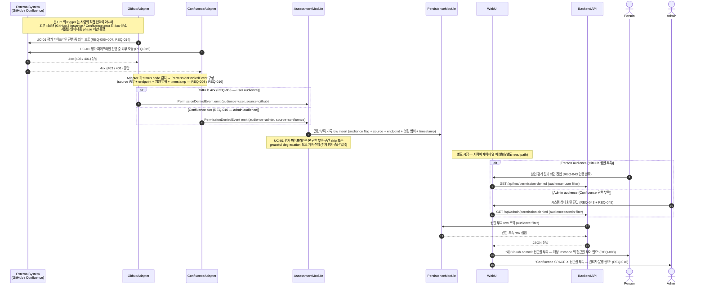

# UC-08 — 권한 부족 인식·통지 (GitHub / Confluence)

> **본 문서는 P2 의 마지막 (8/8) use case 본문 분해 task [T-0028](../tasks/T-0028-uc-08-permission-denied.md) 의 산출물이다.** [docs/use-cases/INDEX.md](INDEX.md) 의 UC-08 row 를 sequence diagram + 흐름 + 실패 경로 + component/module mapping 으로 풀어쓴다. [UC-01](UC-01-evaluation-execution.md) / [UC-02](UC-02-evaluation-query.md) / [UC-03](UC-03-person-crud.md) / [UC-04](UC-04-account-auth.md) / [UC-05](UC-05-llm-config.md) / [UC-06](UC-06-evaluation-delete-reeval.md) / [UC-07](UC-07-export-import.md) 의 11 section template 을 그대로 적용한다. **본 UC 본문 머지 시점에 P2 UC 본문 8/8 closure 가 달성된다.**

## 1. 개요

본 use case 는 Assessment-Agent 의 **System-actor 첫 사례 박제** — 다른 7 UC ([UC-01](UC-01-evaluation-execution.md) ~ [UC-07](UC-07-export-import.md)) 가 모두 사람 (SuperAdmin / Admin / User) 또는 Scheduler 가 actor 인 반면, 본 UC 는 **외부 시스템의 4xx 응답이 trigger origin** 이다. GitHub Adapter / Confluence Adapter 가 외부 시스템 (3 GitHub instance + Confluence.sec) 의 4xx 응답을 감지하면 PermissionDeniedEvent 를 emit, AssessmentModule 이 event 를 받아 DB 에 권한 부족 기록을 남기고, Web UI 가 사용자 ([REQ-008](../requirements.md) — GitHub) 및 관리자 ([REQ-016](../requirements.md) — Confluence) 모두 인식할 수 있도록 표시한다 ([README.md](../../README.md) "Assessment Target" + "보안 특성" 단락). **사람이 직접 trigger 하지 않으나 사람이 인식·대응할 수 있어야 한다** — 이 invariant 가 §5 sequence 의 trigger origin Note + §2 actor 표 + §8 postcondition 에 박제된다.

본 UC 의 핵심 invariant 3 종: (a) **System-actor — trigger origin = 외부 시스템 4xx 응답, 사람은 인식·대응 phase 에만 등장**. (b) **trigger / propagation / display 의 3 phase 흐름** — trigger ([UC-01](UC-01-evaluation-execution.md) 평가 파이프라인 진행 중 Adapter 가 4xx 감지) / propagation (PermissionDeniedEvent emit → AssessmentModule event handler → DB write) / display (사람이 Web UI 페이지 열 때 권한 부족 row 조회 — 별도 read path). (c) **이중 audience ([REQ-008](../requirements.md) vs [REQ-016](../requirements.md))** — GitHub 권한 부족은 사용자 audience (개발자가 본인 commit 접근권 누락을 발견·해소), Confluence 권한 부족은 관리자 audience (SPACE 접근권은 관리자 운영 영역). cover REQ 는 2 ([UC-04](UC-04-account-auth.md) 와 동급) 로 작지만 **시스템 자동 emit 흐름 + display 영역 통합** 의 architectural 박제. 본 UC 는 8 component 중 4 (GitHub Adapter / Confluence Adapter / Backend API / Web UI) + 8 module 중 4 (GithubModule / ConfluenceModule / AssessmentModule / WebModule) 를 거치며, [ADR-0003 §1 monolithic NestJS process](../decisions/ADR-0003-deployment.md) 안의 in-process event-driven 흐름 + 별도 read path 의 결합이다.

## 2. Actor

본 UC 는 **시스템 자체가 actor** 인 첫 사례. 사람은 인식·대응 phase 에만 등장 — trigger 발화 없음.

| actor | 책임 | 본 UC 내 역할 |
| --- | --- | --- |
| **GitHub Adapter** (component) | UC-01 평가 파이프라인 진행 중 3 GitHub instance 호출 시 4xx (403/401) 감지 → PermissionDeniedEvent emit ([REQ-008](../requirements.md)). | trigger origin. |
| **Confluence Adapter** (component) | UC-01 진행 중 Confluence.sec 의 지정 SPACE 호출 시 4xx 감지 → PermissionDeniedEvent emit ([REQ-016](../requirements.md)). | trigger origin. |
| **Person** ([README.md](../../README.md) L86, [REQ-046](../requirements.md)) | GitHub 권한 부족 ([REQ-008](../requirements.md)) audience — 본인 commit 접근권 부여로 해소. | display phase 본인 평가 화면 진입 시 인식. |
| **Admin** ([README.md](../../README.md) L85, [REQ-045](../requirements.md)) | Confluence 권한 부족 ([REQ-016](../requirements.md)) audience — SPACE 접근권 운영. SuperAdmin ([REQ-044](../requirements.md)) 은 Admin super set. | display phase 시스템 상태 화면 진입 시 인식. |

**사람은 본 UC trigger 를 직접 발화시키지 않는다** — trigger 는 외부 시스템 4xx 에 100% 의존. Person 과 Admin 은 display phase 의 인식·대응 영역에만 등장하며, 두 audience 의 표시 channel · 권한 등급이 다르다.

## 3. Trigger

본 UC 는 2 sub-trigger 를 가지며 **§5 main flow 안의 `alt` 분기로 통합** — 차이는 source (GitHub vs Confluence) + audience (user vs admin) + Adapter 종류만. 두 경우 모두 trigger origin 은 외부 시스템 4xx 응답이며 사람의 직접 입력이 아니다.

1. **GitHub 4xx (REQ-008)** — [UC-01](UC-01-evaluation-execution.md) 평가 파이프라인이 3 GitHub instance ([REQ-005](../requirements.md) / [REQ-006](../requirements.md) / [REQ-007](../requirements.md), [REQ-014](../requirements.md) Issue 포함) 호출 시 **403 / 401** 응답. GitHub Adapter 가 status code + endpoint + 영향 repo·user 식별. **사용자 audience** — 해당 GitHub ID 가 매핑된 평가 대상 인원 본인 ([UC-03](UC-03-person-crud.md) service ID 매핑과 연동).
2. **Confluence 4xx (REQ-016)** — [UC-01](UC-01-evaluation-execution.md) 평가 파이프라인이 Confluence.sec ([REQ-015](../requirements.md)) 호출 시 **403 / 401**. Confluence Adapter 가 status code + SPACE 식별. **관리자 audience** — SPACE 접근권은 관리자 운영 영역.

## 4. Preconditions

emit phase 진입 전 조건. **사람의 사전 행동 없음** — trigger 는 외부 시스템 응답에 100% 의존.

1. [UC-01](UC-01-evaluation-execution.md) 평가 파이프라인 진행 중 (Scheduler cron 또는 Admin manual trigger 이후, [REQ-039](../requirements.md) / [REQ-040](../requirements.md)).
2. GitHub Adapter / Confluence Adapter 가 외부 시스템 호출 시도 중 ([REQ-005](../requirements.md)~[REQ-007](../requirements.md) / [REQ-015](../requirements.md) outbound 직후).
3. DB Persistence 가용 — connection 끊김 / timeout 시 §7.2.

display phase 사전조건 (별도 read path): (a) 사람이 Web UI 에 로그인 ([REQ-043](../requirements.md)), (b) 자기 audience 영역 진입 (Person 은 본인 평가 화면 / Admin 은 시스템 상태 화면). 미충족 시 §7.5.

본 UC 의 핵심 invariant **"사람이 직접 trigger 안 함 (System-actor)"** + **"REQ-008 / REQ-016 의 audience 분리"** + **"display phase = read path 별도 발화"** 는 §5 의 trigger origin Note + audience 분기 alt block + display 분기 Note 로 박제.

## 5. Main flow (sequence diagram)

step 수: 약 14 (autonumber 기준 — trigger origin Note + audience 분기 alt block (emit) + display 분기 alt block + 1 conceptual Note 포함, 8 ≤ 14 ≤ 14 범위 안). 본 다이어그램의 의존성 방향은 [components.md](../architecture/components.md) + [modules.md](../architecture/modules.md) 의 의존성 그래프와 정합 — Adapter → AssessmentModule (event emit) → PersistenceModule (write) / WebUI → BackendAPI → PersistenceModule (read) 의 두 경로가 emit phase 와 display phase 의 분리를 박제. UC-01 평가 파이프라인의 외부 호출 자체는 **본 UC sequence 단계가 아니라 UC-01 영역** — 본 UC 는 그 4xx 응답을 trigger 로 받아 emit 부터 시작.

## 6. Alternative flows

- **6.1 자가-해소 감지** — 권한 부여 후 다음 [UC-01](UC-01-evaluation-execution.md) 발화 시 4xx → 200 전환 감지 → 권한 부족 row 의 `resolvedAt` 갱신, WebUI 표시 자동 사라짐. 구체 메커니즘은 P5 (Out of Scope).
- **6.2 반복 4xx 디바운스** — 같은 endpoint 의 4xx 가 N 회 연속 발생 시 중복 emit 억제 — 기존 row 의 timestamp append 만, 새 row 신설 없음. 구체 알고리즘은 P5 (Out of Scope).
- **6.3 다중 audience 동시 발생** — 한 발화에서 GitHub 와 Confluence 4xx 가 동시 발생하면 두 row 가 별도 insert (audience flag 별 분리), WebUI 도 각각 표시.
- **6.4 인원 미매핑 GitHub 4xx** — 4xx 발생 GitHub user 가 평가 대상 인원으로 매핑돼있지 않으면 ([UC-03](UC-03-person-crud.md) 매핑 누락) user audience 대상 없음 → admin audience fallback. 구체 정책은 P5 (Out of Scope).
- **6.5 token 만료 (401) vs 권한 부족 (403)** — conceptual level 만 박제 (둘 다 인식 대상). 구체 분류·복구 protocol 은 P4 GitHub / Confluence integration (Out of Scope).

## 7. Error flows

본 UC 의 error path 는 다음 5 종.

- **7.1 event emit 실패** — Adapter → AssessmentModule event bus 호출 자체 실패 (in-process event bus 라 dropping 위험 낮음) → log 만 남기고 UC-01 진행 계속, 다음 발화에서 재시도. DB 변경 0.
- **7.2 PersistenceModule write fail** — 권한 부족 row insert 시 connection 끊김 / timeout → log + UC-01 graceful degradation 계속, 다음 발화에서 재시도. **본 UC 의 emit 실패는 UC-01 평가 자체를 중단시키지 않음** ([REQ-008](../requirements.md) / [REQ-016](../requirements.md) 가 평가 중단 권한 없음).
- **7.3 display read fail** — WebUI 의 권한 부족 row 조회 실패 → 사람 audience 가 인식 못함 → log 만, UC-01 자체에는 영향 없음 (display 는 best-effort).
- **7.4 stale row 누적** — §6.1 자가-해소가 동작하지 않아 권한 부족 row 가 무한 누적될 위험. 보존 기간 정책 / 자동 cleanup 은 P3 [data-model.md](../architecture/data-model.md) 의 별도 row (Out of Scope).
- **7.5 인증 실패 ([REQ-043](../requirements.md))** — display phase 에서 사람이 미인증 상태로 화면 진입 → AuthModule guard 가 401 → login redirect ([UC-04](UC-04-account-auth.md) 의 §7.1 동일 흐름). emit phase 자체는 영향 없음.

## 8. Postconditions

emit phase 종료 후: **(a) DB 권한 부족 기록 row 생성** — audience flag (user/admin) + source (github/confluence) + endpoint + 영향 범위 + timestamp. 구체 schema (PermissionDeniedRecord) 는 P3 [data-model.md](../architecture/data-model.md) 책임 (Out of Scope). **(b) UC-01 평가 파이프라인 graceful degradation 으로 계속 진행** — 본 구간 skip, 한 instance / SPACE 의 권한 부족이 전체 평가를 멈추지 않음 ([REQ-008](../requirements.md) / [REQ-016](../requirements.md) invariant). 구체 retry / circuit breaker 는 P4 / P5 (Out of Scope).

display phase 종료 후: **(c) Person 이 본인 GitHub 권한 부족 인식** ([REQ-008](../requirements.md)) — 본인 평가 화면 안내 → 접근권 부여 → §6.1 자가-해소. **(d) Admin 이 Confluence SPACE 권한 부족 인식** ([REQ-016](../requirements.md)) — 시스템 상태 화면 안내 → 운영 → §6.1 자가-해소. **(e) 자가-해소 시 `resolvedAt` 갱신 + WebUI 표시 자동 사라짐** ([REQ-008](../requirements.md) / [REQ-016](../requirements.md) 의 인식·통지 invariant).

**NFR** — emit latency 는 외부 응답 시간 + 1 event hop + 1 DB write. display 는 read 한정 SLA ([REQ-048](../requirements.md)) 3 초 안. 대량 row 의 read pagination 은 P5 (Out of Scope).

## 9. Component / Module mapping

본 UC 가 거치는 4 component + 4 module ([INDEX.md](INDEX.md) UC-08 row 와 정확 일치). 각 component 의 본 UC 책임은 1 줄로 한정.

| component (T-A3) | module (T-A4) | 본 UC 에서의 책임 |
| --- | --- | --- |
| GitHub Adapter | GithubModule | 3 GitHub instance 호출 시 4xx 응답 감지 → PermissionDeniedEvent emit (audience=user, source=github). [REQ-005](../requirements.md) ~ [REQ-007](../requirements.md), [REQ-008](../requirements.md), [REQ-014](../requirements.md). |
| Confluence Adapter | ConfluenceModule | Confluence.sec 호출 시 4xx 응답 감지 → PermissionDeniedEvent emit (audience=admin, source=confluence). [REQ-015](../requirements.md), [REQ-016](../requirements.md). |
| Backend API | AssessmentModule (event handler + read controller) | PermissionDeniedEvent 수신 → 권한 부족 row insert. display phase 의 audience-filtered read endpoint 제공. [REQ-008](../requirements.md), [REQ-016](../requirements.md). |
| Web UI | WebModule | 권한 부족 row 의 audience 별 표시 영역 — Person 영역 (본인 평가 화면) / Admin 영역 (시스템 상태 화면). [REQ-038](../requirements.md) UI 와 통합. |

본 UC 에서 거치지 않는 4 component (Scheduler / Worker / LLM Gateway / DB Persistence) + 5 module (SchedulerModule / LlmModule / UserModule / AuthModule / PersistenceModule — INDEX.md UC-08 row 의 "주요" 컬럼 기준) 의 책임 위임: **Scheduler / Worker / LLM Gateway** 는 [UC-01](UC-01-evaluation-execution.md) (cron trigger + 평가 파이프라인) 책임 — 본 UC trigger 는 UC-01 진행 중 발생. **UserModule** 은 [UC-03](UC-03-person-crud.md) (인원 CRUD) 책임 — §6.4 인원 미매핑 fallback 시 service ID 매핑 검증. **AuthModule** 은 [UC-04](UC-04-account-auth.md) (인증·권한) 책임 — display phase 의 §7.5 인증 guard.

**§9 footnote — DB Persistence (PersistenceModule)**: INDEX.md UC-08 row 의 "주요" 컬럼에는 명시되지 않았으나, §5 의 권한 부족 row write (emit phase) + read (display phase) 의 보조 persistence 영역이다. AssessmentModule event handler 가 PersistenceModule 의 Prisma typed query 로 write·read. INDEX.md UC-08 row 갱신 없음 — 본문 footnote 만으로 박제 ([UC-06](UC-06-evaluation-delete-reeval.md) / [UC-07](UC-07-export-import.md) 의 §9 mapping 과 동일 style).

**[UC-01](UC-01-evaluation-execution.md) trigger 관계**: 본 UC trigger 는 UC-01 평가 파이프라인 진행 중 — UC-01 §5 의 GithubAdapter / ConfluenceAdapter 호출 단계가 본 UC trigger origin. **[UC-02](UC-02-evaluation-query.md) display 관계**: 본 UC display phase 는 UC-02 의 read path 와 동일 구조 (Web UI → Backend API → PersistenceModule). UC-02 는 평가 결과 row, 본 UC display 는 권한 부족 row.

## 10. 관련 REQ

본 UC 가 cover 하는 2 primary REQ + 9 인접 REQ. 각 REQ 가 본 UC 의 어느 section/step 에서 cover 되는지 명시.

| REQ | 요약 | 본 UC 의 cover 위치 |
| --- | --- | --- |
| REQ-008 | GitHub 접근 권한(read) 부족 시 인식·통지 | §1 / §2 Person / §3 trigger 1 / §5 alt GitHub 4xx + Person display / §6.1·6.4 / §8 (a)(c)(e) / §9 GithubModule + AssessmentModule + WebModule |
| REQ-016 | Confluence 접근 권한 부족 인식·통지 | §1 / §2 Admin / §3 trigger 2 / §5 alt Confluence 4xx + Admin display / §6.1 / §8 (a)(d)(e) / §9 ConfluenceModule + AssessmentModule + WebModule |
| REQ-005·006·007 (인접) | 3 GitHub instance 평가 | §3 trigger 1 / §5 external 호출 — GitHub 4xx 발생 source instance |
| REQ-014 (인접) | Issue 평가 | §3 trigger 1 — Issue endpoint 호출 시에도 4xx 가능 |
| REQ-015 (인접) | Confluence 지정 SPACE 평가 | §3 trigger 2 / §5 external 호출 — Confluence 4xx 발생 source |
| REQ-043 (인접) | 모든 기능 ID/Password 보호 | §4 display precondition / §5 display step / §7.5 / §9 AuthModule |
| REQ-044·045·046 (인접) | 3 권한 등급 (SuperAdmin / Admin / User) | §2 actor — Person (REQ-046) / Admin (REQ-045) audience source ([UC-04](UC-04-account-auth.md) 책임) |

본 task 는 production code 0 LOC + 분기 0 + 새 public symbol 추가 0 — [CLAUDE.md](../../CLAUDE.md) §3.2 R-112 의 4 항목 (happy / error / branch / negative) 모두 N/A. mermaid sequence 의 trigger origin Note + display phase Note + 2 alt block (audience 분기 emit + audience 분기 display) 가 §3 의 2 sub-trigger + §5 의 display 분기 + §6.3 의 다중 audience 동시 발생을 박제하며, error flow 5 종 (§7.1~§7.5) 이 event emit 실패 / PersistenceModule write fail / display read fail / stale row 누적 / 인증 실패의 negative path 를 cover.

## 11. References

- [docs/use-cases/INDEX.md](INDEX.md) — UC-08 row 의 source. 본 UC §9 mapping 이 INDEX.md "주요 component / 주요 module" 컬럼과 정확히 일치 (PersistenceModule 은 본문 footnote 만).
- [docs/use-cases/UC-01-evaluation-execution.md](UC-01-evaluation-execution.md) — 본 UC trigger upstream (UC-01 평가 파이프라인 진행 중 GithubAdapter / ConfluenceAdapter 호출 단계가 본 UC trigger origin).
- [docs/use-cases/UC-02-evaluation-query.md](UC-02-evaluation-query.md) — 본 UC display phase 의 read path pattern source.
- [docs/use-cases/UC-03-person-crud.md](UC-03-person-crud.md) — §6.4 인원 미매핑 fallback 의 service ID 매핑 source. [docs/use-cases/UC-04-account-auth.md](UC-04-account-auth.md) — display phase 인증·권한 layer source.
- [docs/use-cases/UC-05-llm-config.md](UC-05-llm-config.md) / [UC-06-evaluation-delete-reeval.md](UC-06-evaluation-delete-reeval.md) / [UC-07-export-import.md](UC-07-export-import.md) — 앞선 UC 본문 template (11 section + alt block + Note 패턴).
- [docs/architecture/components.md](../architecture/components.md) / [modules.md](../architecture/modules.md) / [INDEX.md](../architecture/INDEX.md) — 본 UC §9 의 4 component + 4 module + MVA style. Adapter 의 "4xx catch → PermissionDeniedEvent emit" 책임 명시.
- [docs/requirements.md](../requirements.md) — 본 UC 의 2 primary REQ + 9 인접 REQ source.
- [docs/decisions/ADR-0001-stack.md](../decisions/ADR-0001-stack.md) / [ADR-0002-db.md](../decisions/ADR-0002-db.md) / [ADR-0003-deployment.md](../decisions/ADR-0003-deployment.md) — 본 UC 의 구현·persistence·운영 토폴로지 기반. 외부 시스템 호출 기반은 ADR-0003 §4 direct egress.
- [README.md](../../README.md) "Assessment Target" + "보안 특성" 단락 + L83–86 (3 권한 등급 — 두 audience source).
- [docs/tasks/T-0028-uc-08-permission-denied.md](../tasks/T-0028-uc-08-permission-denied.md) — 본 UC 분해 task. **본 task 머지 시 P2 UC 본문 8/8 closure (UC-01 ~ UC-08, T-0020 ~ T-0028) 달성**.

Refs: T-0028, T-0027, T-0026, T-0025, T-0024, T-0023, T-0022, T-0020, T-0019, ADR-0001, ADR-0002, ADR-0003, REQ-005, REQ-006, REQ-007, REQ-008, REQ-014, REQ-015, REQ-016, REQ-043, REQ-044, REQ-045, REQ-046
