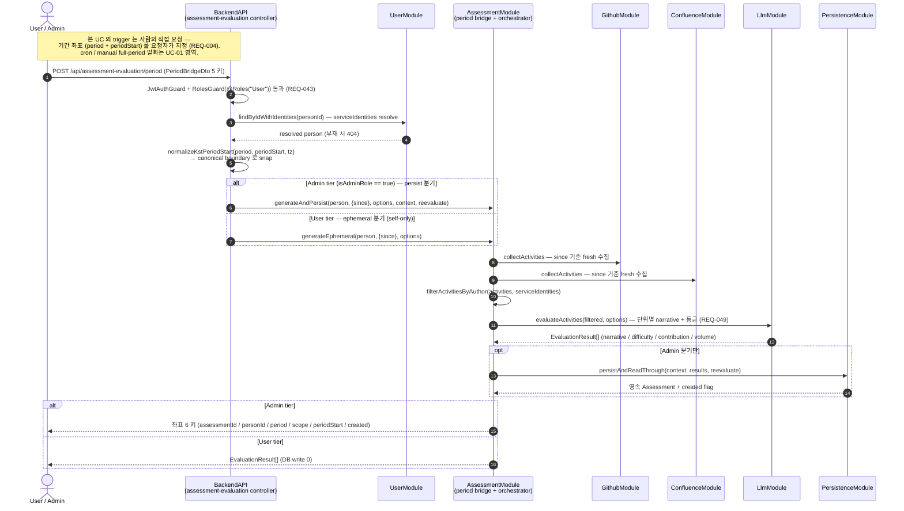

# UC-09 — 사용자 지정 기간 임의 평가문 요청

> **본 문서는 [REQ-COVERAGE-AUDIT.md](REQ-COVERAGE-AUDIT.md) §6 이 검출한 유일한 gap ([REQ-004](../requirements.md)) 을 UC 축에서 닫는 task [T-1411](../tasks/T-1411-uc-09-user-defined-period-evaluation.md) 의 산출물이다.** [UC-01](UC-01-evaluation-execution.md) ~ [UC-08](UC-08-permission-denied.md) 이 확립한 11 section template ([UC-08](UC-08-permission-denied.md) 기준) 을 그대로 승계한다. **[INDEX.md](INDEX.md) §2 표의 UC-09 row 등록과 audit §3 매트릭스의 `gap` → `uc-covered` 재분류는 본 slice 의 Out of Scope — 후속 slice 소관** 이다 (audit §12.4 cascade 원자성 규약).

## 1. 개요

본 use case 는 **사람이 임의로 고른 기간 좌표에 대해 그 자리에서 LLM 평가문을 요청하는 흐름** 을 박제한다 ([README.md](../../README.md) L9 "사용자가 임의 기간을 지정해 LLM 평가문 요청" → [REQ-004](../requirements.md)). [UC-01](UC-01-evaluation-execution.md) 이 Scheduler cron ([REQ-039](../requirements.md)) 과 Admin manual trigger ([REQ-040](../requirements.md)) 로 발화하는 **full-period 평가 파이프라인** 인 것과 달리, 본 UC 는 **요청자가 좌표를 들고 온다** 는 점에서 trigger 축이 다르고, [UC-02](UC-02-evaluation-query.md) 가 *이미 저장된* 결과를 조회·sort·filter 하는 read path 인 것과 달리 **새 LLM 호출을 동반한다** 는 점에서 결과 생성 축이 다르다. 이 두 경계가 audit §6 이 권장 (a) 로 "UC-01 확장이 아니라 UC-09 신설" 을 고른 근거다.

본 UC 는 **설계 창작이 아니라 이미 main 에 실재하는 흐름의 use case 분해** 다. 진입점은 `src/assessment-evaluation/assessment-evaluation.controller.ts` 133 행 `@Controller("api/assessment-evaluation")` 아래 339 ~ 342 행의 `@Post("period")` + `@HttpCode(200)` + `@UseGuards(JwtAuthGuard, RolesGuard)` + `@Roles("User")` 이며, 같은 route 안에서 352 ~ 355 행 `isAdminRole(actor?.role)` 이 **Admin 분기 (영속) 와 User 분기 (ephemeral)** 를 dispatch 한다. 핵심 invariant 3 종: (a) **요청자가 기간 좌표를 지정** — 단 시작 (`periodStart`) 만 입력받고 종료 경계 입력 필드는 계약에 없다, (b) **한 route · 두 실행 경로** — role 이 유일한 분기 축이며 두 경로의 차이는 DB write 유무뿐, (c) **입력 instant 는 canonical 경계로 snap** — 같은 일/주/월 안의 서로 다른 입력이 같은 좌표로 수렴한다.

## 2. Actor

본 UC 는 **사람이 직접 발화** 하는 use case 이며, 권한 등급이 곧 실행 경로를 가른다. 등급 판정은 `isAdminRole` (controller 126 행) 이 `ROLE_HIERARCHY.Admin` 을 재사용해 수행하므로 SuperAdmin 은 Admin 상위 집합으로 흡수된다.

| actor | 책임 | 본 UC 내 역할 |
| --- | --- | --- |
| **User** ([REQ-046](../requirements.md)) | 자기 좌표의 평가문을 즉석 요청. `@Roles("User")` 가 최소 등급이므로 로그인만 되면 진입 가능 ([REQ-043](../requirements.md)). | **ephemeral 분기** — 결과를 응답으로만 받고 DB write 0. self-only 제약 대상. |
| **Admin / SuperAdmin** ([REQ-045](../requirements.md)) | 임의 `personId` 를 target 해 평가문을 생성하고 **영속화** 까지 수행. | **persist 분기** — `generateAndPersist` 로 Assessment 좌표 row 를 만들고 식별자·좌표를 응답받는다. |

**Scheduler 는 본 UC 의 actor 가 아니다** — cron 발화는 [UC-01](UC-01-evaluation-execution.md) 영역이며, 본 UC 의 trigger 는 100 % 사람의 HTTP 요청이다. 미인증 요청은 §7.1 에서 차단된다.

## 3. Trigger

로그인한 사람이 `POST /api/assessment-evaluation/period` 를 **기간 좌표 body 와 함께** 호출하면 발화한다. 입력 계약은 `src/assessment-evaluation/dto/period-bridge.dto.ts` 36 행 `PeriodBridgeDto` 의 **5 키** 이며 (`personId` 43 행 · `period` 49 행 · `scope` 55 행 · `periodStart` 64 행 · `reevaluate?` 84 행), DTO 는 **형식만** 강제한다 — `period` 의 허용 literal (day / week / month) 검증은 service 책임이고, `periodStart` 는 63 행 `@IsISO8601()` 로 비-ISO 문자열을 400 에서 끊는다.

**기간 계약의 사실 — 시작 단독 + granularity snap, 종료 경계 입력 없음**:

1. 요청자는 **임의의 ISO instant** 를 `periodStart` 로 낼 수 있다.
2. controller 277 ~ 287 행 `normalizeKstPeriodStart` 가 `parseKstPeriodInput` (offset 미명시 입력의 해석 zone — 요청 principal 의 timezone, 기본 KST) 와 `getKstPeriodRangeByPeriod` 를 합성해 그 instant 를 **요청 `period` granularity 의 canonical 경계로 snap** 한다. 따라서 같은 주 안의 서로 다른 두 입력은 같은 좌표로 수렴한다.
3. downstream 으로 흘러가는 값은 `{ since: <snap 된 boundary>.toISOString() }` **하나뿐** 이다 (User 분기 430 ~ 443 행 · Admin 분기 474 ~ 501 행). 수집 spec 조립부 `src/assessment-collection/collection-spec.service.ts` 39 ~ 42 행 `buildCollectionSpec(person, since?)` 도 **시작만** 받는다 — **종료 경계 입력 필드는 계약 어디에도 없다** (§7.5 한계 (a)).

[UC-01](UC-01-evaluation-execution.md) §3 의 3 trigger (cron / Admin manual / 재수집) 는 모두 시스템이 기간을 도출하지만, 본 UC 는 **사람이 좌표를 지정** 한다 — 이것이 두 UC 의 분리 근거다.

## 4. Preconditions

1. **인증** — `JwtAuthGuard` 통과 (유효 JWT). 미충족 시 401 (§7.1, [REQ-043](../requirements.md)).
2. **최소 등급** — `RolesGuard` 가 `@Roles("User")` 를 검사. User 이상이면 통과하며 Admin / SuperAdmin 은 escalation 으로 흡수 ([REQ-045](../requirements.md) / [REQ-046](../requirements.md)).
3. **대상 person 실재** — `personId` 가 실 row 여야 한다. controller 는 `PersonService.findByIdWithIdentities` (UserModule export) 를 재사용하며 row 부재 시 404 전파 (§7.3).
4. **User 분기 추가 제약** — 요청 principal 과 `personId` 가 동일해야 한다 (self-only). 또한 User 가 `reevaluate: true` 를 명시하면 **fail-closed reject** — "요청했으나 무시됨" 의 silent 혼란을 차단한다 (§7.2).
5. **LLM 설정 가용** — 단위 평가문은 LLM gateway 의 `generate` 1 회 결과이므로 provider 설정이 없으면 평가 단계에서 reject 가 전파된다 ([REQ-049](../requirements.md), §7.4).

## 5. Main flow (sequence diagram)

step 수 16 (autonumber 기준 — [UC-07](UC-07-export-import.md) §5 103 행 규약과 같은 기준으로 **arrow 만 계수하고 `Note over ...` 는 계수 대상에서 제외** 한다; role dispatch `alt` 2 개와 `opt` block 안의 arrow 도 모두 포함). 두 실행 경로의 유일한 차이는 **마지막 영속 단계** 다 — `src/assessment-evaluation/period-bridge-ephemeral.service.ts` 100 ~ 123 행 `generateEphemeral` 은 spec 조립 → 수집 → author 필터 → 평가 4 단계로 끝나 **DB write 0** 이고, `src/assessment-evaluation/period-bridge-admin-persist.service.ts` 130 ~ 158 행 `generateAndPersist` 는 같은 4 단계 뒤 157 행 `persistAndReadThrough(context, results, reevaluate)` 를 덧붙인다.

## 6. Alternative flows

- **6.1 같은 좌표 재요청 (Admin)** — `reevaluate` 미지정 / `false` 면 **first-write-wins** 로 기존 row 를 보존하고 read-through 한다 (`created: false`). row 수 증가 0.
- **6.2 명시적 재평가 (Admin)** — `reevaluate: true` (strict boolean) 일 때만 reset-and-recreate 로 좌표를 덮어쓴다. `"true"` 문자열 · `1` 같은 비-boolean 은 DTO 84 행 `@IsBoolean` 이 400 으로 거부한다.
- **6.3 같은 기간 안의 다른 입력 instant** — §3 의 snap 덕분에 같은 일/주/월 안의 서로 다른 `periodStart` 두 건이 **동일 좌표** 로 수렴한다 (e2e 가 실측하는 성질).
- **6.4 수집 결과가 비어있는 기간** — 지정 기간에 활동이 0 이면 평가 결과가 빈 배열이고, Admin 분기는 좌표 row 만 남는다. 오류가 아니다.
- **6.5 주간 / 월간 요약의 사용자 임의 호출** ([REQ-035](../requirements.md)) — audit §6 이 "UC-09 의 sub-feature 로 가능하나 별도 task 결정" 으로 남긴 항목. 본 UC 의 `coversReq` 에는 넣지 않는다 (Out of Scope).

## 7. Error flows

- **7.1 미인증 / 권한 미달** — `JwtAuthGuard` 미통과 401, `RolesGuard` 미통과 403 ([REQ-043](../requirements.md)). 평가·수집·LLM 호출 0.
- **7.2 User 의 self-only 위반 · 재평가 요청** — 요청 principal 과 `personId` 불일치 시 403, User 가 `reevaluate: true` 를 명시해도 **fail-closed 403**. 두 검사 모두 timezone 조회·snap 보다 **먼저** 도달해 불필요한 DB read 0.
- **7.3 입력 형식 오류 / 대상 부재** — 5 키 형식 위반 · 정의 외 필드 (ValidationPipe `whitelist` + `forbidNonWhitelisted`) · 비-ISO `periodStart` 는 400, `personId` row 부재는 404.
- **7.4 수집 / LLM / 영속 실패** — 수집 orchestrator 는 부분 가용성을 자체 흡수해 throw 0 이지만, LLM gateway reject 는 **swallow 없이 전파** 되고, Admin 분기의 영속 충돌 (재평가 경합 등) 은 Conflict 로 좁혀 변환된다. 빈 / malformed narrative 는 `classifyNarrative` 가 안전 default 로 환원해 throw 0.
- **7.5 본 UC 의 한계 3 종 (정직성 박제)** — 아래 3 항목은 error 라기보다 **현 계약의 미충족 축** 이며, [requirements.md](../requirements.md) 23 행 REQ-004 row 가 이미 실측으로 박제한 사실이다.
  1. **(a) 종료 경계 입력 부재** — 계약이 시작 (`since`) 만 받으므로 수집이 **open-ended** 다. "지정 기간" 의 끝을 요청자가 좁힐 수 없다.
  2. **(b) 프런트 기간 지정 UI 부재** — `web/src` 전수에서 `assessment-evaluation` 참조가 **0** 이라 `POST /period` 를 호출하는 화면 경로 자체가 없다 ([REQ-038](../requirements.md) UI 축 미도달).
  3. **(c) 좌표 종합 코멘트의 HTTP 진입점 0** — 구간 전체를 종합하는 `generateBatchNarrative` chain 은 실재하지만 controller 측 caller 가 **0** 이라, API 로 도달하는 것은 단위별 평가문뿐이다.

## 8. Postconditions

- **(a) User 분기** — 응답으로 `EvaluationResult[]` (단위별 `narrative` / `difficulty` / `contribution` / `volume`) 를 받고 **DB 상태 변화 0**. 같은 요청을 반복해도 부작용이 없다.
- **(b) Admin 분기** — Assessment 좌표 row 1 개가 생성 (또는 first-write-wins 로 read-through) 되고, 응답은 **좌표 6 키** (`assessmentId` / `personId` / `period` / `scope` / `periodStart` / `created`) 다. **응답 자체에는 수치·코멘트가 실리지 않으며**, 그 값은 [UC-02](UC-02-evaluation-query.md) 의 조회 경로 (`GET /api/assessments`) 로 읽는다.
- **(c) 후속 조회 가능 상태** — (b) 의 row 는 [UC-02](UC-02-evaluation-query.md) 의 sort / filter / 시계열 view 대상이 된다 ([REQ-038](../requirements.md)).

**NFR** — 본 UC 는 조회가 아니라 **생성** 이므로 [REQ-048](../requirements.md) 의 조회 3 초 SLA 대상이 아니다. 외부 수집 + LLM 호출이 직렬로 들어가 응답 시간이 조회 경로보다 크게 길며, 그 상한 정책은 본 UC 밖 (Out of Scope).

## 9. Component / Module mapping

본 UC 가 거치는 5 component + 6 module. 표기 어휘는 [INDEX.md](INDEX.md) 19 ~ 25 행이 허용한 목록만 사용하고, 그 어휘와 **실 shipped layer** 가 갈리는 행은 [modules.md](../architecture/modules.md) 197 · 198 행 정본을 괄호로 **병기** 한다 (병기는 부기라 위 `6 module` 산정 대상이 아니다 — 산정 기준은 표 module 열의 INDEX 허용 어휘 distinct 수). 어휘 교체가 아니라 병기를 택한 근거는 [REQ-COVERAGE-AUDIT.md](REQ-COVERAGE-AUDIT.md) § 12.19 참조.

| component | module | 본 UC 에서의 책임 |
| --- | --- | --- |
| Web UI | WebModule | 기간 지정 + 요청 발화의 **의도된** 진입점. 단 §7.5 (b) 대로 현재 화면 경로 0 ([REQ-038](../requirements.md)). |
| Backend API | AssessmentModule (controller layer — 실 shipped controller 는 `AssessmentEvaluationController` = AssessmentEvaluationModule, [modules.md](../architecture/modules.md) 197 행 정본) + AuthModule | `POST /api/assessment-evaluation/period` route · guard 2 종 · role dispatch · `periodStart` snap ([REQ-043](../requirements.md)). |
| Worker (평가 파이프라인) | AssessmentModule (period bridge + orchestrator — 실 shipped layer 는 `AssessmentCollectionModule` (수집) + `AssessmentEvaluationModule` (평가 scoring/orchestration), [modules.md](../architecture/modules.md) 198 행 정본이 종전 `AssessmentModule` 귀속을 stale 로 정정) | 수집 spec 조립 → 수집 → author 필터 → 평가 orchestration. 두 bridge service 가 ephemeral / persist 로 갈린다. |
| — | UserModule | `personId` → resolved person (`serviceIdentities`) 변환 ([REQ-045](../requirements.md) / [REQ-046](../requirements.md) 의 대상 판정 입력). |
| LLM Gateway | LlmModule | 단위 기여마다 평가문 1 회 생성 + 난이도 · 기여도 등급 산출 ([REQ-049](../requirements.md)). |
| DB Persistence | PersistenceModule | **Admin 분기에서만** — 좌표 row 영속 + read-through. User 분기는 write 0. |

수집 축의 GitHub Adapter / Confluence Adapter (GithubModule / ConfluenceModule) 는 §5 sequence 에는 등장하지만 본 UC 의 **고유 책임이 아니라 [UC-01](UC-01-evaluation-execution.md) 이 정의한 수집 계약의 재사용** 이라 위 표에서 별도 행으로 세우지 않는다 — 본 UC 는 그 계약에 `since` 좌표만 넘긴다. Scheduler / SchedulerModule 은 본 UC 와 무관 ([REQ-039](../requirements.md) / [REQ-040](../requirements.md) 는 [UC-01](UC-01-evaluation-execution.md) 책임).

## 10. 관련 REQ

| REQ | 요약 | 본 UC 의 cover 위치 |
| --- | --- | --- |
| REQ-004 | 수치 지표 + LLM 평가 코멘트 (사용자 지정 기간) | §1 / §3 기간 계약 / §5 전 구간 / §8 (a)(b) / §9 전 행 |
| REQ-035 (인접) | 주간 / 월간 요약 평가문 | §6.5 — sub-feature 가능성만 언급, `coversReq` 제외 |
| REQ-038 (인접) | UI 조회 / sort / filter / 시계열 | §7.5 (b) 프런트 부재 / §8 (c) / §9 Web UI 행 |
| REQ-039·040 (인접) | Admin cron 주기 지정 · manual trigger | §1 / §3 말미 / §9 말미 — [UC-01](UC-01-evaluation-execution.md) 과의 경계 |
| REQ-043 (인접) | 모든 기능 ID/Password 보호 | §4 precondition 1 / §5 guard step / §7.1 / §9 AuthModule |
| REQ-045 (인접) | Admin 권한 | §2 actor / §4 precondition 2 / §9 UserModule 행 |
| REQ-046 (인접) | User read-only | §2 actor / §4 precondition 2·4 / §7.2 |
| REQ-048 (인접) | 조회·시각화 3 초 이내 | §8 NFR — 본 UC 는 생성 경로라 대상 아님을 명시 |
| REQ-049 (인접) | Admin 이 LLM 모델 지정 | §4 precondition 5 / §5 evaluateActivities step / §9 LlmModule |

**본 UC 문서의 신설이 [REQ-004](../requirements.md) 의 구현 완료를 뜻하지 않는다** — §7.5 의 한계 3 종 (종료 경계 입력 부재 · 프런트 UI 부재 · 좌표 종합 코멘트 진입점 0) 이 그대로 남아 있으므로 [requirements.md](../requirements.md) 23 행의 REQ-004 status 는 `IN_PROGRESS` 로 유지된다 (본 slice 는 그 파일을 편집하지 않는다). 본 문서가 닫는 것은 **UC 문서 축** 하나뿐이다.

본 task 는 production code 0 LOC + 새 public symbol 0 이라 [CLAUDE.md](../../CLAUDE.md) §3.2 R-112 의 4 항목 (happy / error / branch / negative) 은 모두 N/A 다. 본 UC 가 서술하는 분기는 §5 의 role dispatch `alt` 2 개 + `opt` 영속 block, §6 의 5 alternative, §7 의 5 error flow 로 문서 축에서 cover 된다.

## 11. References

- [docs/use-cases/REQ-COVERAGE-AUDIT.md](REQ-COVERAGE-AUDIT.md) §6 (권장 (a) UC-09 신설 — actor / trigger / component / module 목록의 source) · §12.10 (T-1410 4 축 판정 — 축 A·B 미착수 · 축 C 지목 stale · 축 D 권장 유효).
- [docs/requirements.md](../requirements.md) 23 행 — 본 UC 의 **실코드 근거 원장**. 수치 축 · 기간 축 · LLM 코멘트 축 · wiring 축 · 노출 축 (a)(b)(c) · 한계 문단을 그대로 승계.
- [docs/use-cases/UC-01-evaluation-execution.md](UC-01-evaluation-execution.md) — full-period 파이프라인 경계 (본 UC 와 trigger 축이 다름) + 수집 계약 source.
- [docs/use-cases/UC-02-evaluation-query.md](UC-02-evaluation-query.md) — 본 UC Admin 분기 산출물의 조회 경로 (본 UC 와 결과 생성 축이 다름).
- [docs/use-cases/UC-08-permission-denied.md](UC-08-permission-denied.md) — 본 UC 가 승계한 11 section template 의 직전 사례.
- [docs/use-cases/INDEX.md](INDEX.md) 19 ~ 25 행 — §9 mapping 이 따른 명칭 규약. **UC-09 row 등록은 후속 slice 소관** (본 slice 는 읽기만).
- `src/assessment-evaluation/assessment-evaluation.controller.ts` (133 · 339 ~ 342 · 352 ~ 355 · 277 ~ 287 · 430 ~ 443 · 474 ~ 512 행) · `dto/period-bridge.dto.ts` (36 ~ 84 행) · `period-bridge-ephemeral.service.ts` (100 ~ 123 행) · `period-bridge-admin-persist.service.ts` (130 ~ 158 행) · `src/assessment-collection/collection-spec.service.ts` (39 ~ 42 행) — 본문 인용 지점.
- `test/e2e/period-bridge-ephemeral.e2e-spec.ts` (9 it) · `test/e2e/period-bridge-admin-persist.e2e-spec.ts` (9 it) — §6.1 ~ §6.3 · §7.1 ~ §7.3 의 실측 근거.
- [docs/tasks/T-1411-uc-09-user-defined-period-evaluation.md](../tasks/T-1411-uc-09-user-defined-period-evaluation.md) — 본 UC 분해 task.

Refs: T-1411, T-1410, T-0029, REQ-004
